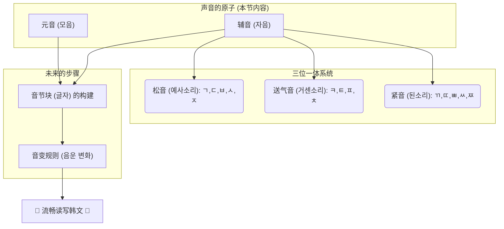

好的，身为您的教育家与作家伙伴，我将承接上一节课奠定的宏大叙事与深刻理解，带领我们的学习者从理论的殿堂步入实践的工坊。我们将开始亲手触摸、打磨构成韩语声音世界的每一个基础模块。

***

## **1.2 核心机制（一）：元音与辅音 - 构建发音的基础模块**

在上一节中，我们共同揭示了韩文（Hangeul）设计的核心奥秘：它并非一套需要死记硬背的符号，而是一部精密的**“发音蓝图”**。我们理解了其辅音模拟口腔构造的科学性，以及元音蕴含“天、地、人”的哲学观。

现在，是时候打开这份蓝图的工具箱，逐一检视那些最基础、最核心的“声音积木”了。这个过程，就像一位初学的音乐家第一次认识五线谱上的Do, Re, Mi，或是一位建筑师学习辨认砖块、钢筋与玻璃。这些基础模块本身看似简单，但它们组合起来，却能构建出语言这座宏伟的圣殿。

我们的探索将分为两步：首先，我们将学习构成音节“灵魂”的**元音（Vowels）**，它们是声音得以响亮、通透的核心；然后，我们将掌握塑造声音“形态”的**辅音（Consonants）**，它们如同发音器官中的各种“模具”，为气流赋予了清晰可辨的特征。

准备好了吗？让我们开始构建你的第一个韩语声音。

---

### **模块一：元音 (모음) - 声音的灵魂与画布**

想象一下声音的产生过程：气流从肺部不受阻碍地冲出，通过喉咙时振动声带，这就是元音的本质。元音是开放的、持续的、响亮的。它们是音节中最核心的承载者，犹如绘画中的画布，为后续的辅音提供了附着与展示的基底。

正如我们在创制哲学中提到的，韩文的元音系统始于三个最基本的哲学符号：

*   `ㅣ` [i] (人)：代表直立的人。
*   `ㅡ` [eu] (地)：代表平坦的地。
*   `ㆍ` (天)：代表圆融的天。（这个古老的字母“arae-a”现在已不独立使用，但它的“点”作为核心构件，融入了我们即将学习的元音中。）

所有的基础元音，都是由这三个“创世”符号通过简单的组合衍生而来，其内在逻辑清晰可见。我们将它们分为两大类：基础元音和由基础元音进一步组合而成的双元音。

#### **基础元音 (10个)：宇宙元素的初次合奏**

我们将从最简单的10个基础元音（也称单元音）开始。请在学习时，不仅用眼睛看，更要调动你的听觉和口腔的触觉，去感受每一个音是如何在你的身体内部被塑造出来的。

**第一组：垂直与水平的基石 - `ㅣ` 和 `ㅡ`**

1.  **`ㅣ`** [i]
    *   **发音要领：** 这可能是最容易掌握的音。想象你在微笑，嘴角向两侧咧开，舌头前部抬高靠近硬腭，但不要接触。气流从中通过。它非常接近英语单词 "tr**ee**" 或 "s**ee**" 中的元音。
    *   **书写笔顺：** 从上到下，一笔写成。`ㅣ`

2.  **`ㅡ`** [eu]
    *   **发音要领：** 这是许多初学者遇到的第一个挑战，因为它在英语中没有完全对应的音。请这样做：
        1.  先发出 `ㅣ` [i] 的音，感受你咧开的嘴角。
        2.  保持舌头位置基本不变（不要卷舌，舌头平放），将你咧开的嘴角**收回**至自然状态，上下牙齿轻轻分开，嘴唇放松。
        3.  此时发出的声音就是 `ㅡ`。它是一个听起来有些“扁平”、“紧绷”的音。有点像你思考问题时无意识发出的“呃...”声，但嘴型更平。
    *   **书写笔顺：** 从左到右，一笔写成。`ㅡ`

**第二组：“天地”相交的四个方向 - `ㅏ, ㅓ, ㅗ, ㅜ`**

这四个元音是“人”(`ㅣ`)和“地”(`ㅡ`)这两个基本形态，与代表“天”的点(`ㆍ`)相结合的产物。点的方位，蕴含着阴阳哲学的思想，也直观地影响着发音时口型的开合。

*   **“阳性”元音 (点在右/上):** 发音时口腔更开阔、声音更明亮。
*   **“阴性”元音 (点在左/下):** 发音时口腔相对收敛、声音更低沉。

3.  **`ㅏ`** [a]
    *   **构成：** `ㅣ` (人) + `ㆍ` (天，在右)
    *   **发音要领：** 这是最开放的元音。张大你的嘴巴，就像牙医让你说“啊...”一样。舌头自然放平，不要拱起或后缩。它非常接近英语 "f**a**ther" 或 "h**o**t" 中的元音。
    *   **书写笔顺：** 先写竖 `ㅣ` (从上到下)，再写短横 `ㆍ` (在竖的中间靠右侧，从左到右)。

4.  **`ㅓ`** [eo]
    *   **构成：** `ㆍ` (天，在左) + `ㅣ` (人)
    *   **发音要领：** 这个音是另一个难点。
        1.  先准备发 `ㅏ` [a] 的音，张开嘴。
        2.  现在，保持下巴张开的状态，有意识地将嘴角向回收拢，让嘴唇呈一个不圆的、放松的椭圆形。感觉口腔的后部空间被打开了。
        3.  它类似于英语单词 "c**u**p" 中的元音 `[ʌ]`，但口腔开度更大、声音更靠后。这是一个口腔后部的、非圆唇的 "o" 音。
    *   **书写笔顺：** 先写短横 `ㆍ` (从左到右)，再写竖 `ㅣ` (从上到下)。

5.  **`ㅗ`** [o]
    *   **构成：** `ㆍ` (天，在上) + `ㅡ` (地)
    *   **发音要领：** 将你的嘴唇收拢，向前突出，形成一个**小而圆**的形状，就像准备吹蜡烛一样。舌头后部略微抬起。它非常接近英语 "g**o**" 或 "b**oa**t" 中的元音，但口型要更小、更圆、更稳定。
    *   **书写笔顺：** 先写短竖 `ㆍ` (从上到下)，再写长横 `ㅡ` (从左到右)。

6.  **`ㅜ`** [u]
    *   **构成：** `ㅡ` (地) + `ㆍ` (天，在下)
    *   **发音要领：** 和 `ㅗ` [o] 一样，嘴唇需要收拢向前突出，但要比发 `ㅗ` 时**更小、更圆、更前突**。想象你要用吸管喝东西的口型。它非常接近英语 "m**oo**n" 或 "bl**ue**" 中的元音。
    *   **书写笔顺：** 先写长横 `ㅡ` (从左到右)，再写短竖 `ㆍ` (在横的中间靠下方，从上到下)。

**第三组：复合的变体 - `ㅐ, ㅔ, ㅚ, ㅟ`**

这些元音在形态上是基础元音的组合，发音也因此变得更加微妙。

7.  **`ㅐ`** [ae]
    *   **构成：** `ㅏ` + `ㅣ`
    *   **发音要领：** 理论上，它的发音口型介于 `ㅏ` [a] 和 `ㅔ` [e] 之间。你可以从 `ㅏ` [a] 的口型开始，然后稍微收窄下巴，嘴角向两边拉得更开一些。它接近英语单词 "c**a**t" 或 "**a**pple" 中的元音。
    *   **书写笔顺：** 按照 `ㅏ` 和 `ㅣ` 的组合，先写 `ㅏ` 的竖，再写 `ㅣ`，最后写中间的短横。

8.  **`ㅔ`** [e]
    *   **构成：** `ㅓ` + `ㅣ`
    *   **发音要领：** 它的口型比 `ㅐ` [ae] 要小。从 `ㅓ` [eo] 的口型开始，嘴角向两侧微微拉开，感觉像是放松版的微笑。它接近英语 "b**e**d" 或 "s**e**t" 中的元音。
    *   **书写笔顺：** 先写 `ㅓ` 的短横，再写竖，最后写 `ㅣ`。

> **⚠️ Common Mistake Warning: `ㅐ` vs. `ㅔ` 的迷思**
>
> **历史与理论：** 在 Hangeul 创制之初以及很长一段时间里，`ㅐ` (嘴巴张得更大) 和 `ㅔ` (嘴巴张得较小) 的发音是有着明确区别的。你在学习时，可以尝试体会这种口型大小的细微差别，这有助于你理解字母的构成逻辑。
>
> **现代现实：** 在当代首尔方言以及标准韩语中，**绝大多数韩国人已经不再区分 `ㅐ` 和 `ㅔ` 的发音了**。在日常对话中，它们听起来几乎完全一样，都趋向于 `ㅔ` [e] 的发音。
>
> **给学习者的建议：**
> 1.  **听力上：** 不要过分纠结于听出二者的区别，因为说话者很可能根本没有做出区别。
> 2.  **口语上：** 初期你可以将它们都发成 `ㅔ` [e] 的音，这完全不会影响沟通。
> 3.  **关键在于拼写：** 你需要做的，是像记住英语中 "meet" 和 "meat" 的拼写一样，通过词汇学习来记住一个单词到底是用 `ㅐ` 还是 `ㅔ`。**这是一个拼写问题，而非发音问题。**

9.  **`ㅚ`** [oe]
    *   **构成：** `ㅗ` + `ㅣ`
    *   **发音要领：** 这是另一个棘手的音。它在标准发音中被规定为一个**单元音**。
        1.  先摆出 `ㅔ` [e] 的口型。
        2.  保持舌头位置不变，将嘴唇向前**收圆**，就像发 `ㅗ` [o] 一样。
        3.  发出的声音就是 `ㅚ`。它听起来像德语的 "ö" 或法语的 "eu"。
    *   **现代趋势：** 实际上，很多韩国人会将其发成一个双元音，听起来像 `[we]`。为了入门，如果标准发音 `[ø]` 难以掌握，你可以先将其作为双元音 `[we]` 来练习，这在现代口语中非常普遍且可以接受。

10. **`ㅟ`** [wi]
    *   **构成：** `ㅜ` + `ㅣ`
    *   **发音要领：** 和 `ㅚ` 类似，标准发音也是一个**单元音**。
        1.  先准备发 `ㅣ` [i] 的音，舌头前部抬高。
        2.  保持舌头位置，将嘴唇向前**收圆并前突**，就像发 `ㅜ` [u] 一样。
        3.  这个音听起来像德语的 "ü" 或中文的“ü”（例如“鱼”）。
    *   **简化发音：** 你也可以先将其作为一个双元音，快速地连读 `ㅜ` 和 `ㅣ`，发出类似英语 "we" 的音 (`[wi]`)，这在口语中非常普遍且可以接受。

**元音总结**

| 元音 | 构成 | 国际音标 (IPA) | 发音要领 (类比) |
| :-- | :--- | :--- | :--- |
| `ㅏ` | `ㅣ` + `ㆍ` | [a] | "f**a**ther" |
| `ㅓ` | `ㆍ` + `ㅣ` | [ʌ] | "c**u**p" (口腔更开、更靠后) |
| `ㅗ` | `ㆍ` + `ㅡ` | [o] | "g**o**" (嘴唇更圆更小) |
| `ㅜ` | `ㅡ` + `ㆍ` | [u] | "m**oo**n" (嘴唇更圆更前突) |
| `ㅡ` | `ㅡ` | [ɯ] | 咧嘴说 "ee"，然后嘴角收回 |
| `ㅣ` | `ㅣ` | [i] | "tr**ee**" |
| `ㅐ` | `ㅏ` + `ㅣ` | [ɛ] | "c**a**t" |
| `ㅔ` | `ㅓ` + `ㅣ` | [e] | "b**e**d" (现代韩语中与`ㅐ`发音趋同) |
| `ㅚ` | `ㅗ` + `ㅣ` | [ø] 或 [we] | 保持`ㅔ`的舌位，嘴唇变圆 (常发成 [we]) |
| `ㅟ` | `ㅜ` + `ㅣ` | [y] 或 [wi] | 保持`ㅣ`的舌位，嘴唇变圆 (常发成 "we" `[wi]`) |

至此，你已经掌握了韩语音节的“灵魂”。无论辅音如何变化，这些元音将始终是你发声的基石。接下来，让我们看看那些塑造声音的“工匠”——辅音。

---

### **模块二：基础辅音 (자음) - 口腔中的精巧机关**

如果说元音是通畅无阻的气流，那么辅音就是我们口腔、嘴唇、舌头、牙齿这些“机关”对气流进行**阻碍**后产生的声音。每一个辅音，都代表了一种特定的阻碍方式。

正如我们在1.1中惊叹的那样，韩文辅音的形态，就是这些“机关”工作时的快照。让我们以发音部位为线索，来系统地认识这14个基础辅音。这就像参观一个声音制造工厂，我们将依次探访不同的“车间”。

**车间一：双唇音 (입술소리) - 大门的开合**
这个车间的工具就是你的上下嘴唇。

1.  **`ㅁ`** [m]
    *   **发音器官模拟：** `ㅁ` 的方形，象征着你**闭合的嘴巴**轮廓。
    *   **发音要领：** 双唇紧闭，气流从鼻腔通过。这是一个鼻音。完全等同于英语中的 "**m**an" 的 "m"。
    *   **书写笔顺：** 共三笔。`ㄱ` -> `ㄱ`+`ㅡ` -> `ㅁ`

2.  **`ㅂ`** [b/p]
    *   **发音器官模拟：** 可以看作是 `ㅁ` 的变体，表示在闭唇的基础上增加了爆发的动作。
    *   **发音要领：** 双唇紧闭，在口腔中憋住气，然后突然张开嘴唇，让气流爆发出。当它位于词首时，听起来更像 p；在元音之间时，听起来更像 b。
    *   **书写笔顺：** 共四笔。先写两短竖，再写两横。

**车间二：齿龈音 (잇몸소리) - 舌尖的舞蹈**
这个车间的核心工具是你的舌尖，它与你的上齿龈（门牙后面的硬肉）互动。

3.  **`ㄴ`** [n]
    *   **发音器官模拟：** `ㄴ` 的形状，描摹了**舌尖抵住上颚**的侧面轮廓。
    *   **发音要领：** 舌尖抵住上齿龈，气流从鼻腔通过。又一个鼻音。完全等同于英语中的 "**n**ose" 的 "n"。
    *   **书写笔顺：** 一笔呵成。

4.  **`ㄷ`** [d/t]
    *   **发音器官模拟：** 可以看作是 `ㄴ` 的顶部加了一横，表示在舌尖抵住上颚的基础上，增加了阻碍和爆发。
    *   **发音要领：** 舌尖抵住上齿龈，憋住气，然后突然放下舌尖，让气流爆发出。与 `ㅂ` 类似，词首时像 t，元音之间像 d。
    *   **书写笔顺：** 两笔。先写 `ㄴ`，再在上面加一横。

5.  **`ㄹ`** [r/l]
    *   **发音器官模拟：** `ㄹ` 弯曲的形状，象征着舌头**卷曲或轻弹**的复杂动作。
    *   **发音要领：** 这是韩语中的“变色龙”。
        *   **在两个元音之间：** 舌尖快速轻弹上齿龈一次，发出类似西班牙语的 "r" 或英语 "wa**t**er" 中 "t" 的闪音。
        *   **作为收音（在音节末尾）或在另一个 `ㄹ` 之后：** 舌尖抵住上齿龈，气流从舌头两侧流过，发作英语 "**l**amp" 中的 "l" 音。
    *   **书写笔顺：** 共三笔。第一笔是左上角的 `ㄱ` 形，第二笔是中间的长横，第三笔是右下角的 `ㄴ` 形。

**车间三：齿龈与硬腭音 (잇몸소리/입천장소리) - 舌面与气流的摩擦**

6.  **`ㅅ`** [s]
    *   **发音器官模拟：** `ㅅ` 的形状，象征着气流通过**牙齿缝隙**的样子，形似汉字“人”或两颗门牙。
    *   **发音要领：** 舌尖接近上齿龈，但不要接触，留出一条缝隙，让气流从中摩擦而出。基本等同于英语 "**s**ea" 中的 "s"。
    *   **注意：** 当 `ㅅ` 后面跟着元音 `ㅣ` 或某些双元音时，它的发音会变为类似英语 "sh" 的音。例如 `시` (si) 发音像 "shi"。
    *   **书写笔顺：** 两笔。先写左撇，再写右捺。

7.  **`ㅈ`** [j/ch]
    *   **发音器官模拟：** 在 `ㅅ` 的基础上加一横，表示在摩擦的基础上增加了**瞬间的闭塞**。
    *   **发音要领：** 舌面贴住硬腭，先完全阻碍气流，然后缓缓放开，让气流摩擦而出。词首时像 "ch"（但不送气），元音之间像 "j"。
    *   **书写笔顺：** 两笔或三笔。先写上面一横，再写 `ㅅ`。

**车间四：软腭音 (여린입천장소리) - 舌根的阻断**
这个车间的工具是你的舌根，它与口腔后部的软腭互动。

8.  **`ㄱ`** [g/k]
    *   **发音器官模拟：** `ㄱ` 的形状，就是**舌根抬起，堵住喉咙入口**的形态。
    *   **发音要领：** 舌根抬起抵住软腭，憋住气，然后突然放开，让气流爆破而出。词首时像 k，元音之间像 g。
    *   **书写笔顺：** 一笔写成。

**车间五：喉音 (목청소리) - 咽喉的振动**

9.  **`ㅇ`** [ng / 묵음(silent)]
    *   **发音器官模拟：** `ㅇ` 的圆形，象征着**打开的、通畅的喉咙**。
    *   **发音要领：** 这个字母有两个截然不同的角色，取决于它在音节中的位置。
        *   **作为音节首字母：** 它**不发音**，只是一个占位符。韩语音节必须由辅音开始，当一个音节实际上是元音开头时（如 "a"），就用 `ㅇ` 来占据辅音的位置。例如 `아`，我们只发元音 `ㅏ` 的音。
        *   **作为音节收音（在末尾）：** 它发作鼻音 "ng"，就像英语 "si**ng**" 或 "thi**ng**" 的结尾音。例如 `강` (gang, 河流)。
    *   **书写笔顺：** 一笔画一个圆。

10. **`ㅎ`** [h]
    *   **发音器官模拟：** 在 `ㅇ` 的基础上加一横，表示从喉咙中送出的**强烈气流**。
    *   **发音要领：** 从喉咙深处发出气流摩擦音，就像冬天对手哈气一样。等同于英语 "**h**at" 中的 "h"。
    *   **书写笔顺：** 三笔。先写短横，再写长横，最后写 `ㅇ`。

**第三梯队：送气音 (거센소리) - 气流的爆发**

我们已经认识了10个基础辅音。剩下的4个，是基于已学辅音的“升级版”。它们的设计逻辑极其优雅：**在基础辅音上增加一笔，代表发音时送出更强烈的气流。**

*   **类比与具象化：风扇的档位**
    *   想象基础辅音 `ㄱ, ㄷ, ㅂ, ㅈ` 是风扇的“1档风”：有风，但很轻柔。
    *   现在我们要学习的送气音 `ㅋ, ㅌ, ㅍ, ㅊ` 就是“3档强风”：风力强劲，能吹动纸片。

你可以拿一张纸巾放在嘴前做实验。发基础辅音时，纸巾应该几乎不动；发送气音时，纸巾会被明显吹动。

11. **`ㅋ`** [k']
    *   **构成：** `ㄱ` + 一横
    *   **发音要领：** 发音部位与 `ㄱ` 完全相同，但在爆破时，送出**极其强烈**的气流。就像英语 "**k**ing" 或 "**k**ite" 的 "k"。
    *   **书写笔顺：** 两笔。先写 `ㄱ`，再加一横。

12. **`ㅌ`** [t']
    *   **构成：** `ㄷ` + 一横
    *   **发音要领：** 发音部位与 `ㄷ` 完全相同，但在爆破时送出**强烈**气流。就像英语 "**t**op" 或 "**t**ake" 的 "t"。
    *   **书写笔顺：** 三笔。

13. **`ㅍ`** [p']
    *   **构成：** `ㅂ` 的变形
    *   **发音要领：** 发音部位与 `ㅂ` 完全相同，但在爆破时送出**强烈**气流。就像英语 "**p**in" 或 "**p**ark" 的 "p"。
    *   **书写笔顺：** 四笔。

14. **`ㅊ`** [ch']
    *   **构成：** `ㅈ` + 一点
    *   **发音要领：** 发音部位与 `ㅈ` 完全相同，但在摩擦爆破时送出**强烈**气流。就像英语 "**ch**air" 或 "**ch**eck" 的 "ch"。
    *   **书写笔顺：** 三笔或四笔。

至此，14个基础辅音已经全部亮相。但你可能已经注意到，我们似乎遗漏了一些声音，比如韩剧中常听到的那种听起来很“硬”、“很重”的音。那些就是接下来我们要攻克的、也是韩语发音中最关键的区别点——紧音。

---

### **模块三：关键辨析 - 韩语发音的“三位一体”系统 (松音、紧音、送气音)**

这是韩语语音学习中最重要的，也常常是学习者最感困惑的一环。英语中，p/b 和 t/d 的区别主要在于声带是否振动（清浊音）。但在韩语中，辨别辅音的核心维度是**气流强度**和**喉部肌肉的紧张程度**。

我们已经学了“1档风”（松音/普通音）和“3档强风”（送气音）。现在，我们要加入“0档风”（紧音）。

**紧音 (된소리): ㄲ, ㄸ, ㅃ, ㅆ, ㅉ**

*   **类比与具象化：压缩的弹簧**
    *   想象你在发音前，喉咙和口腔的肌肉瞬间绷紧，就像一个被压缩到极致的弹簧。
    *   然后，在不送出任何气流（没有那股风）的情况下，瞬间释放这个声音。
    *   声音听起来短促、有力、清晰，音调也略高。

让我们用一个完整的表格来对比这三组声音，这是你必须内化于心的发音地图。

| 类别 | 双唇塞音 | 齿龈塞音 | 软腭塞音 | 硬腭塞擦音 | 齿龈擦音 |
| :--- | :--- | :--- | :--- | :--- | :--- |
| **松音/普通音 (1档风)** | **ㅂ** [p] | **ㄷ** [t] | **ㄱ** [k] | **ㅈ** [tɕ] | **ㅅ** [s] |
| (Relaxed) | 바보 (傻瓜) | 다리 (腿) | 고기 (肉) | 자다 (睡觉) | 사람 (人) |
| **送气音 (3档强风)** | **ㅍ** [pʰ] | **ㅌ** [tʰ] | **ㅋ** [kʰ] | **ㅊ** [tɕʰ] | - |
| (Aspirated) | 파도 (波浪) | 타다 (乘坐) | 코 (鼻子) | 차다 (踢) | - |
| **紧音 (0档风)** | **ㅃ** [p͈] | **ㄸ** [t͈] | **ㄲ** [k͈] | **ㅉ** [tɕ͈] | **ㅆ** [s͈] |
| (Tensed) | 빵 (面包) | 따다 (摘) | 꼬리 (尾巴) | 짜다 (咸) | 싸다 (便宜) |

#### **发音练习：最小发音对 (Minimal Pairs)**

要真正掌握这三者的区别，唯一的办法就是通过对比练习。请大声、夸张地读出以下单词，并用手感受嘴前的气流。

1.  **ㅂ / ㅍ / ㅃ**
    *   `불` [bul] (火) - 1档风，放松
    *   `풀` [pul] (草) - 3档强风，纸巾飞舞
    *   `뿔` [ppul] (角) - 0档风，喉咙绷紧，纸巾不动

2.  **ㄷ / ㅌ / ㄸ**
    *   `달` [dal] (月亮) - 1档风
    *   `탈` [tal] (面具) - 3档强风
    *   `딸` [ttal] (女儿) - 0档风

3.  **ㄱ / ㅋ / ㄲ**
    *   `가다` [gada] (去) - 1档风
    *   `카드` [kadeu] (卡片) - 3档强风
    *   `까다` [kkada] (剥) - 0档风

4.  **ㅈ / ㅊ / ㅉ**
    *   `자다` [jada] (睡觉) - 1档风
    *   `차다` [chada] (踢) - 3档强风
    *   `짜다` [jjada] (咸) - 0档风

5.  **ㅅ / ㅆ**
    *   `살` [sal] (肉) - 1档风，气流柔和
    *   `쌀` [ssal] (米) - 0档风，气流更强更集中，音调更高

这个“三位一体”系统是韩语发音的精髓所在。掌握它，你的韩语听起来就会立刻地道许多。这需要持续的、有意识的练习，请务必投入足够的时间。

---

### **总结与展望**

在今天的学习中，我们完成了从理论到实践的第一次伟大飞跃。我们不再只是欣赏韩文设计的蓝图，而是亲手拿起了工具箱里的每一件工具：

*   **要点回顾:**
    1.  **元音系统：** 我们学习了10个基础元音，理解了它们是如何从“天、地、人”三大哲学符号演变而来，并特别厘清了现代韩语中 `ㅐ/ㅔ` 等音的实际发音状况。
    2.  **辅音系统：** 我们按照发音部位——如同参观工厂车间一般——系统学习了14个基础辅音，并不断回顾其“模拟发音器官”的科学设计原理。
    3.  **发音精髓：** 我们深入剖析了韩语独有的“松音-送气音-紧音”三位一体辨析系统，这是通往地道发音的必经之路，并通过最小发音对进行了初步训练。

我们已经将韩语声音世界最基础的原子——音素（元音和辅音）——全部收入囊中。下面是我们将这些原子组合成更大结构的可视化路径：

你现在手中握有的，已经不再是零散的符号，而是一套完整的、具有内在逻辑的声音构建系统。你已经拥有了拼读出任何一个韩语音节所需的所有“乐高积木”。

**一个启发性的问题留给你：**
我们看到，韩文辅音通过“加画”的方式（如`ㄱ` -> `ㅋ`）来表示声音特征的增强（送气）。这种“形态变化反映功能变化”的高度系统化设计思想，是否仅仅停留在字母层面？在接下来的学习中，当我们把字母组合成单词，把单词连接成句子时，我们是否会再次看到类似的设计哲学——即，通过给单词附加一些小“零件”（助词、词尾），来系统地、模块化地改变其在句子中的语法功能？

这正是韩语语法迷人而高效的秘密之一。现在，让我们带着这些“声音积木”，在下一节课中学习如何遵循韩文的“拼搭图纸”，将它们组装成一个个方正而优美的音节块。
