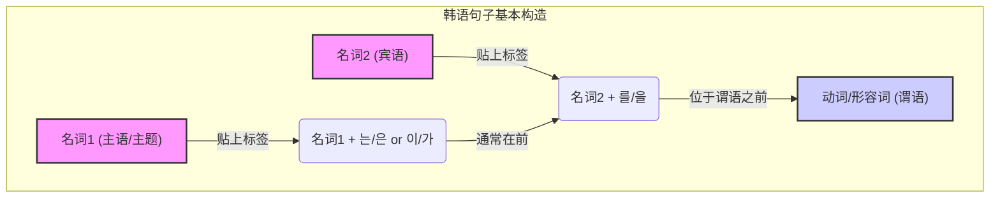

# 第二章：语法骨架 · 构建韩语句子的核心要素

## 2.1 根本问题：韩语句子是如何组织的？—— SOV语序与助词系统

在我们正式开始用韩语构建思想、表达情感之前，必须先回答一个如同地基般根本的问题：一个韩语句子，究竟是如何从一个个单词组织起来，进而承载意义的？

许多初学者在接触韩语时，会感到一种奇特的“错位感”。他们发现，即使认识了句子中的所有单词，也常常无法像理解英语或汉语那样，直观地把握其含义。这种感觉，源于我们试图用自己熟悉的语言规则去“套用”一门拥有完全不同组织哲学的语言。这就像一位经验丰富的木匠，第一次面对一堆乐高积木。他习惯了榫卯、钉子和胶水，而眼前的这些塑料块，却需要一种全新的拼接逻辑。

我们这一章的目标，就是为你揭示韩语这套独特的“拼接逻辑”。我们将拆解韩语句子的基本构造，为你呈现其内部的“语法骨架”。一旦你理解了这套骨架，你会发现，韩语的句子构建方式不仅不混乱，反而充满了惊人的逻辑性和灵活性。

今天，我们将聚焦于这套骨架中最核心的两大支柱：**语序（Word Order）**与**助词（Particles）**。它们共同解答了那个根本问题——韩语句子是如何组织的。

### 核心思想：语序的差异 —— 一场“结局导向”的叙事革命

让我们从一个你无比熟悉的场景开始。假设你要表达“我吃饭”这个简单的意思。

在**汉语**中，你会说：

```
我 吃 饭。
(wǒ chī fàn)
主语 (Subject) - 谓语 (Verb) - 宾语 (Object)
S - V - O
```

在**英语**中，结构完全相同：

```
I eat rice.
主语 (Subject) - 谓语 (Verb) - 宾语 (Object)
S - V - O
```

这种 **SVO (主-谓-宾)** 结构是我们思维的“默认设置”。主语（动作的发出者）首先登场，紧接着是谓语（动作本身），最后是宾语（动作的承受者）。这是一种非常直观、线性的叙事方式：谁，做了什么，作用于谁。动作在句子的中间就发生了，我们很快就能知道核心事件是什么。

现在，让我们看看韩语是如何表达同一个意思的：

```korean
저는 밥을 먹어요.
(jeo-neun bab-eul meog-eo-yo)
```

如果我们逐字翻译，并按照韩语的顺序排列，会得到一个看起来非常奇怪的组合：

```
我 饭 吃。
저(는)      밥(을)      먹어요.
主语 (Subject) - 宾语 (Object) - 谓语 (Verb)
S - O - V
```

这就是韩语语法的第一个，也是最颠覆性的特点：**SOV (主-宾-谓) 语序**。

#### **“问题-解决方案-影响”的逻辑链条**

*   **问题 (Problem):** 任何语言都需要一套清晰的规则来组织句子成分，以明确“谁对谁做了什么”。如果句子成分可以随意排列，意义就会变得模糊不清。例如，“狗咬人”和“人咬狗”，仅仅是主语和宾语位置的对调，就造成了天壤之别。

*   **主流解决方案 (The SVO Approach):** 像汉语、英语、法语、西班牙语等世界上许多主流语言，都采用了“位置决定功能”的策略。它们通过相对固定的SVO语序，将主语放在动词前，宾语放在动词后，以此来界定各自的语法角色。这套方案的优点是直观、易于快速掌握核心动作。

*   **韩语的解决方案 (The SOV Approach):** 韩语（以及日语、土耳其语、印地语等）选择了另一条截然不同的道路。它将最重要的信息——**动作（谓语）**——置于句子的**末尾**。

*   **影响 (Impact):** 这种“谓语置后”的结构，对语言的表达和听者的接收习惯产生了深远的影响。

    1.  **“结局导向”的思维模式**：想象一下看一部悬疑电影。在SVO语言中，你可能在电影中段就知道“谁是凶手”（核心动作）。而在SOV语言中，所有的线索、人物、场景（主语、宾语、状语等）都先一一铺陈，直到最后一刻，“凶手”（谓语）才被揭晓。这种结构要求听者必须保持耐心，听完整个句子才能获得最关键的信息。它培养了一种“延迟判断”和“全局把握”的听力习惯。这也使得韩语对话在某些情境下充满了微妙的悬念和张力。

    2.  **表达的灵活性**：你可能会想，把动词放在最后，会不会让句子变得死板？恰恰相反。正因为动词这个“最终裁决者”被固定在了句末，前面的成分（如主语、宾语、时间、地点等）反而获得了极大的排列自由。我们稍后会看到，这套系统是如何借助“助词”来实现这种灵活性的。

#### **具象化类比：SVO vs. SOV**

*   **SVO (主-谓-宾) 就像是“西式正餐”**：你先上前菜（主语），然后是主菜（谓语），最后是甜点（宾语或其他成分）。主菜在中间，是整场宴席的核心，早早地就决定了这顿饭的风味。

*   **SOV (主-宾-谓) 则更像是“泡制一壶功夫茶”**：你先把茶叶（主语）和器具（宾语）精心准备好，然后是水、温度、时间的铺垫。所有的准备工作都就绪了，最后才将滚烫的水冲入壶中，完成“冲泡”这个核心动作（谓语）。这个最后的动作，赋予了前面所有准备工作最终的意义。

理解了SOV语序，你就掌握了韩语句法蓝图的第一张图纸。你现在知道，无论一个韩语句子多么复杂，它的终点，必然是一个动词或形容词。

### 核心概念：助词(Particles) —— 句子的“语法标签”系统

现在，第二个问题随之而来。如果说SVO语言像是在剧院里给演员们（主语、宾语）安排了固定的站位（动词前/后）来区分角色，那么在SOV的舞台上，演员们的站位相对自由，我们又该如何分辨谁是主角（主语），谁是配角（宾语）呢？

答案就是韩语语法的第二个支柱，也是其精髓所在：**助词 (조사, Particles)**。

#### **“问题-解决方案-影响”的逻辑链条**

*   **问题 (Problem):** 当语序的束缚被部分解开后，语言需要一种新的、更强大的机制来精确标记每个名词的语法功能。否则，"我 饭 吃" (SOV) 和 "饭 我 吃" (OSV) 就会产生歧义。我们如何确保听者能准确无误地理解是“我”在吃“饭”，而不是反过来？

*   **韩语的解决方案 (The Particle System):** 韩语的解决方案极其巧妙。它不依赖“位置”，而是给每个名词“贴标签”。这个“标签”，就是**助词**。助词像一块小小的“语法胶水”，紧紧地粘贴在名词、代词或数词的后面，明确地宣告这个词在句子中扮演的角色。

*   **影响 (Impact):**
    1.  **精确性与无歧义性**: 助词系统使得句子的语法关系变得异常清晰。无论名词出现在句子的哪个位置（只要谓语在最后），只要它后面跟着相应的助词，其功能就不会被误解。
    2.  **高度的语序灵活性**: 正是由于助词锁定了名词的功能，韩语的语序才变得异常灵活，可以根据强调的需要自由调整。这为语言表达提供了丰富的修辞和情感色彩。
    3.  **黏着语的典型特征**: 这种将语法功能通过后缀（如助词）“黏”在词根上的特性，是韩语（以及日语、土耳其语等）被称为“黏着语(Agglutinative Language)”的根本原因。与之相对，汉语是“分析语(Analytic Language)”，主要依靠语序和虚词；而英语则混合了分析语和屈折语(Inflectional Language)的特点。

#### **具象化类比：助词的魔力**

想象一下，你在一个大型仓库里管理货物。

*   **SVO语言系统**：就像一个规定严格的仓库。所有“发货方”（主语）的箱子必须放在A区，所有“收货方”（宾语）的箱子必须放在B区。你通过箱子所在的**位置**来判断它的角色。

*   **韩语的助词系统**：则像一个配备了高科技**标签系统**的智能仓库。每个箱子（名词）上都贴着一个清晰的电子标签。
    *   有的标签写着 **“发货方” (FROM)** —— 这就是**主格助词 (이/가)**。
    *   有的标签写着 **“收货方” (TO)** —— 这就是**宾格助词 (을/를)**。
    *   还有的标签写着 **“关于此话题” (TOPIC)** —— 这就是**主题助词 (은/는)**。
    *   未来我们还会学到写着“目的地”、“时间”、“工具”等等的标签。

    在这个智能仓库里，箱子可以临时摆放在任何地方。你可以为了方便，把“收货方”的箱子放在最前面。但只要扫描一下标签，它的角色就一目了然，绝不会和“发货方”的箱子混淆。

    **助词，就是韩语中定义名词角色的、绝不含糊的“语法标签”。**

#### **认识最核心的几个“标签”**

让我们来认识一下韩语入门阶段最重要的几类助词：

1.  **主格助词 (Subject Particle): 이/가**
    *   **功能**：贴在名词后，明确指出该名词是执行谓语动作的**主语**。
    *   **用法**：
        *   如果名词以**辅音**结尾，用 **이**。 (例如: 학생 (student) -> 학생**이**)
        *   如果名词以**元音**结尾，用 **가**。 (例如: 의사 (doctor) -> 의사**가**)
    *   **例子**:
        ```korean
        학생이 와요. (hak-saeng-i wa-yo)
        学生 + [主格助词] + 来。
        The student comes.
        ```
        这里的 **이** 明确告诉我们，“学生”是“来”这个动作的发出者。

2.  **宾格助词 (Object Particle): 을/를**
    *   **功能**：贴在名词后，明确指出该名词是谓语动作的**承受者（宾语）**。
    *   **用法**：
        *   如果名词以**辅音**结尾，用 **을**。 (例如: 밥 (rice) -> 밥**을**)
        *   如果名词以**元音**结尾，用 **를**。 (例如: 커피 (coffee) -> 커피**를**)
    *   **例子**:
        ```korean
        커피를 마셔요. (keo-pi-reul ma-syeo-yo)
        咖啡 + [宾格助词] + 喝。
        (Someone) drinks coffee.
        ```
        这里的 **를** 明确告诉我们，“咖啡”是“喝”这个动作的对象。

3.  **主题助词 (Topic Particle): 은/는**
    *   **功能**：这是一个稍微进阶但极其重要的概念。它贴在名词后，表示这个名词是整个句子**谈论的“主题”或“话题”**。它常常与主格助词混淆，但其核心功能是“引入话题”或“进行对比”。
    *   **用法**：
        *   如果名词以**辅音**结尾，用 **은**。 (例如: 책 (book) -> 책**은**)
        *   如果名词以**元音**结尾，用 **는**。 (例如: 저 (I/me) -> 저**는**)
    *   **初步理解**: 在简单的“我是学生”这类介绍性句子中，`저는 학생입니다` (我是学生)，`저` (我) 是这句话要谈论的主题，所以用 `는`。
    *   **对比功能**: `사과는 맛있어요. 바나나는 맛없어요.` (苹果好吃。香蕉不好吃。) 这里用 `는` 突出了“苹果”和“香蕉”之间的对比。

    *注：主格助词(이/가)和主题助词(은/는)的区别，是韩语学习中的一个经典难点，我们将在后续章节中进行深入辨析。现阶段，你只需记住，它们都可以用来标记句子的“主角”，但侧重点不同。*

### 终极整合：当SOV语序遇上助词系统

现在，让我们把两大支柱结合起来，看看韩语句子的基本结构图是如何诞生的。

回到最初的例子：

```korean
저는 밥을 먹어요. (jeo-neun bab-eul meog-eo-yo)
```

我们来解剖它：

1.  **저 (我)** + **는 (主题助词)**: 这部分标记了句子的**主题/主语**。`는` 这个标签告诉我们，“我”是这句话谈论的中心。
2.  **밥 (饭)** + **을 (宾格助词)**: 这部分标记了句子的**宾语**。`을` 这个标签告诉我们，“饭”是即将发生的动作的承受者。
3.  **먹어요 (吃)**: 这是句子的**谓语**，位于句末，揭示了最终的动作。

于是，我们得到了韩语句子最经典、最稳固的结构：

**[名词1 + 主题/主格助词] + [名词2 + 宾格助词] + [动词/形容词]**

这个结构就是我们构建韩语句子的“通用蓝图”。

为了让这个结构更直观，我们可以用一个流程图来表示：



这个图清晰地展示了韩语句子构建的过程：名词首先被助词“赋能”，明确其语法角色，然后按照 SOV 的大致顺序排列，最后由谓语收尾。

#### **灵活性展示：助词的力量**

现在，你可以真正理解为什么韩语的语序是灵活的了。看下面几个句子：

1.  **저는 밥을 먹어요.** (S+O+V) - 我吃饭。（最常规的说法）
2.  **밥을 저는 먹어요.** (O+S+V) - 饭呢，我吃。（强调“饭”，可能是在回答“你吃什么？”）

请注意，尽管主语和宾语的位置互换了，但句子的核心意思——“我吃法”——**完全没有改变**！为什么？因为 `저는` 的 `는` 标签和 `밥을` 的 `을` 标签，像铁链一样锁定了“我”和“饭”的角色。无论它们出现在哪里，`저` 永远是动作发出方，`밥` 永远是动作承受方。

这就是助词系统的威力：**它将语法功能从“位置”中解放出来，赋予了其独立的身份。**

### 总结与展望

今天，我们深入探讨了韩语句子组织方式的两个基石，为你构建起了宏观的语法框架：

1.  **SOV语序 (主-宾-谓)**：这是韩语的默认蓝图。与我们熟悉的SVO不同，韩语将最重要的谓语（动词/形容词）放在句子的末尾，形成一种“结局导向”的叙事风格。
2.  **助词系统 (Particles)**：这是韩语的灵魂。助词如同精准的“语法标签”，附着在名词之后，明确其在句子中的角色（主语、宾语、主题等）。它使得韩语在保持语法精确性的同时，获得了高度的语序灵活性。
3.  **基本结构**: **[主语+助词] + [宾语+助词] + [谓语]**。这是你未来构建无数韩语句子的出发点。

我们刚刚推开了韩语语法世界的大门。门内的景象或许与你之前见过的任何语言都不同，但它背后蕴含着严谨的逻辑和独特的表达美学。

现在，请带着以下问题，继续你的探索之旅：

*   既然助词是定义名词角色的“标签”，那么除了主语和宾语，生活中我们还需要定义哪些角色？比如，**地点（在哪里？）、时间（在何时？）、方向（去哪里？）、工具（用什么？）**…… 韩语是否也为这些角色准备了专属的“标签”呢？
*   我们看到，句子的终点永远是谓语。这个位于“压轴”位置的谓语，是否仅仅是表达一个动作或状态那么简单？它会不会像一位戏剧大师，在最后登场时，身上还携带着关于**时态（过去/现在/未来）、尊敬程度（对谁说？）、语气（陈述/疑问/命令）**等更丰富的信息？

这些问题的答案，将是我们接下来要逐一揭晓的秘密。你已经掌握了骨架，接下来，我们将一起为它添上血肉，让它真正地“活”起来。