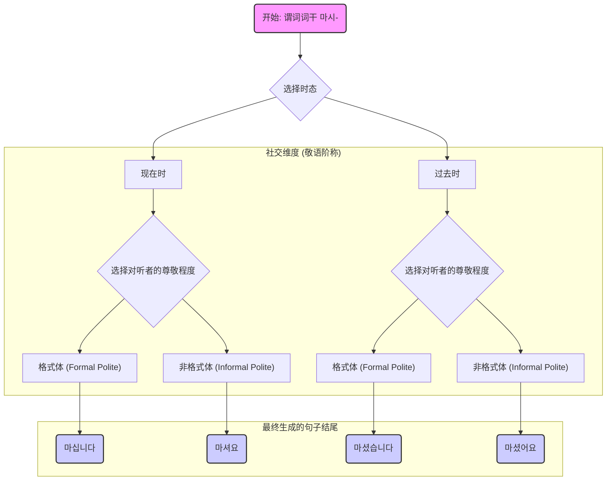

好的，我将以一位世界级教育家与作家的身份，遵从您的所有指示，开始撰写这篇深入、启发性的课程内容。

---

# 第三章：构建完整语句 · 掌握时态与敬语体系

## 3.1 根本问题：如何将词汇组合成表达完整意义且符合社交礼仪的句子？

### 序章：从“素材”到“建筑”的飞跃

在第二章的旅程中，我们如同建筑师绘制蓝图、备齐砖瓦，系统地收集了构建韩语句子的核心“素材”。我们认识了句子的主角——体词与代词（名词）；我们掌握了将这些主角粘合在一起的语法万能胶——助词（Particles）；我们更触及了句子的灵魂——赋予其动作与状态的谓词（动词与形容词）。我们甚至明确了韩语建筑的基本结构——主语-宾语-谓语（SOV）这一独特的语序。

现在，想象一下，所有的建筑材料——`나`（我）、`커피`（咖啡）、`마시다`（喝），以及助词 `-는` 和 `-를` 都已整齐地堆放在你的面前。按照 SOV 的蓝图，你可以将它们排列成 `나는 커피를 마시다`。

这是一个合乎逻辑的序列，但它是一个完整的“句子”吗？你能直接对一位韩国朋友说出这句话吗？答案是，还不能。这串词汇组合，更像是一份冰冷的、未经处理的原始数据，一个存储在字典里的“概念原型”。它拥有句子的骨架，却没有注入生命。它告诉了我们“谁、做什么、对什么”，却遗漏了两个至关重要的维度：

1.  **时间维度**：这个动作是发生在**何时**？是正在发生，已经发生，还是将要发生？
2.  **社交维度**：我正在对**谁**说话？我们之间的关系是亲密还是疏远，是平等还是有别？

这正是本章要解决的根本问题。我们将学习如何为冰冷的语法骨架注入生命与温度，如何将一串词汇的“逻辑组合”升华为一句能够传递完整意义、并且**得体**的“话语”。我们将要掌握的，是韩语语法中最精妙、也最具挑战性的部分——**终结词尾 (Sentence Endings)** 的艺术。这不仅是语法的最后一步，更是从“造句”迈向“交流”的关键一跃。

### 问题溯源：谓词的“未完成”状态

让我们回到那个“句子原型”：`나는 커피를 마시다` (我 喝 咖啡)。

问题出在末尾的 `마시다` (喝) 上。在韩语中，所有我们从词典里查到的动词和形容词，都以 `-다` 结尾。例如：`가다` (去)、`보다` (看)、`예쁘다` (漂亮)、`좋다` (好)。这个 `-다` 结尾的形式，我们称之为**词典形 (Dictionary Form)** 或**基本形 (Basic Form)**。

为什么说它是“未完成”的？因为它是一种高度抽象、不包含任何现实世界信息的“概念”形式。它就像是商店货架上用塑料膜密封的半成品食材，你需要拆开包装，根据你的菜谱（情境）进行烹饪（加工），才能端上餐桌（说出口）。直接使用词典形 `마시다` 来结束一个句子，就如同直接把生肉端给客人，这在语法上是错误的，在交流上是行不通的。

这个“-다”所代表的，是一个悬而未决的问题。它仿佛在对我们说：“我知道这个动作是‘喝’，但……然后呢？你想用它来表达什么时态？你想用它来面对什么人？”

因此，韩语句子构建的最后一步，也是最关键的一步，就是对谓词进行“加工”或“活用”（Conjugation）。我们需要拿掉那个抽象的 `-다`，换上一个能够承载具体信息的“新结尾”。这个新的结尾，就是我们所说的**终结词尾 (Sentence Endings)**。

### 核心思想：终结词尾——承载双重使命的“智能密钥”

现在，我们迎来了本章的核心思想，这也是理解韩语动态之美的关键所在。韩语的终结词尾，其设计之精妙，在于它**同时完成了两项截然不同的任务**。

想象一下你入住一家高级酒店时拿到的房卡。这张看似普通的卡片，被前台服务员在机器上“刷”一下之后，就神奇地被赋予了双重属性：

1.  **时间权限 (Tense)**：这张卡只在你预订的住宿期间（例如，从周五下午3点到周日下午1点）有效。时间一过，它就无法再打开房门。
2.  **空间权限 (Politeness Level)**：这张卡只能打开你自己的房间（例如，808号标准间），而无法打开隔壁的房间，更无法打开顶层的总统套房。

韩语的终结词尾，就是这样一张“智能密钥”。当我们选择一个终结词尾并将其附加到谓词词干（去掉`-다`的部分，如 `마시-`）上时，我们就在一瞬间，同时为这个句子设定了它的“时间坐标”和“社交坐标”。

> **一个终结词尾 = ① 时态信息 + ② 对听者的尊敬程度 (敬语等级)**

这个“二合一”的设计，是韩语区别于许多其他语言（如英语）的根本特征。在英语中，时态（如 -ed, -ing）和礼貌用语（如 "Could you please..."）是两个独立的系统，你可以分别处理它们。但在韩语中，这两者被高度整合，捆绑在同一个语法部件——终结词尾上。你无法只选择时态而不选择尊敬程度，反之亦然。每一次开口说话，你都必须做出一个关于**时间**和**关系**的综合决策。

这听起来可能很复杂，但正是这种机制，赋予了韩语无与伦比的细腻度和情境表现力。现在，让我们分别解开这张“智能密钥”的两个功能维度。

### 维度一：敬语体系 (Honorifics/Speech Levels) - 为关系定位

在深入技术细节之前，我们必须先理解一个文化与语言学上的宏大背景：**为什么韩语如此执着于在每一句话的结尾都标明“对听者的尊敬程度”？**

这个问题的答案深植于历史上受儒家思想影响的东亚社会结构。传统社会强调和谐、秩序与等级，人与人之间的关系（长幼、尊卑、亲疏）是社会运作的基石。语言作为社会关系的镜像，自然而然地发展出了一套精密的系统，用来在每一次对话中不断确认和巩固这些关系。这套系统，就是**敬语体系**。

它试图解决的核心问题是：**如何通过语言，安全、得体地在复杂的社会网络中航行？**

在韩语的世界里，你对一个陌生长者说话的方式，和你对一个亲密朋友说话的方式，在语法层面就是完全不同的。选择错误的敬语阶称，轻则显得尴尬无礼，重则可能被视为一种冒犯。因此，学习敬语，不仅仅是学习语法规则，更是学习一种深刻的文化洞察力和社交智慧。

韩语的敬语阶称（Speech Levels）历史上曾多达七八种，每一种都对应着特定的社交场景。这听起来足以让任何初学者望而却步。但幸运的是，在现代首尔标准语中，这个复杂的系统已经大大简化了。对于日常生活和绝大多数工作场景，我们只需要掌握两种最核心、最常用的“礼貌”阶称即可。

我们将它们想象成两种不同的“社交模式”或“着装规范”：

1.  **格式体 (Formal Polite / 하십시오체)**
    *   **核心结尾**：`-ㅂ니다` / `-습니다`
    *   **感觉与氛围**：庄重、正式、客观、带有些许距离感。
    *   **着装类比**：**西装革履或正装**。你在发表演讲、进行商务汇报、接受新闻采访，或者在军队、政府等高度组织化的环境里时，会选择这种“着装”。它传达的是对场合和听众的最高级别的、公式化的尊重。
    *   **使用场景**：新闻播报、公开演讲、公司会议、对长官/客户的正式报告、初次见面时的自我介绍等。

2.  **非格式体 (Informal Polite / 해요체)**
    *   **核心结尾**：`-아요` / `-어요`
    *   **感觉与氛围**：柔和、亲切、自然、礼貌但不过于疏远。
    *   **着装类比**：**商务休闲装或得体的日常穿着 (Smart Casual)**。这是现代韩国社会中使用频率最高、适用范围最广的语体。它在保持礼貌的同时，拉近了对话者之间的距离。
    *   **使用场景**：与同事、上司（在非正式场合）、商店店员、不太熟的朋友、长辈家人等绝大多数日常情境下的对话。它是你在韩国生活时，打开任何一扇门的“万能钥匙”。

**一个重要的澄清**：这里的“非格式体 (Informal Polite)”中的“Informal”并非指“不礼貌”，而是指“非公式化”。它依然是**非常礼貌**的。与它相对的，是真正非正式、不带敬意的“平语 (반말)”，那是对密友或晚辈使用的，我们将在后续课程中探讨。

现在，你已经理解了敬语体系的“问题-解决方案-影响”逻辑链：

*   **问题**：如何在语言中精确反映和导航复杂的社会关系？
*   **解决方案**：发展出一套基于谓词终结词尾的敬语阶称系统。
*   **影响**：说话者在每个句子中都能（也必须）主动选择一个“社交模式”，从而使沟通变得极为情境化和关系导向。

### 维度二：时态 (Tense) - 为时间锚定

相比于敬语体系深厚的文化背景，时态则是一个更为普适的语言学概念。任何语言都需要有效的方式来表达动作发生的时间。韩语的时态系统，同样也主要通过改变谓词的形态来实现。

在我们的“智能密钥”模型中，时态信息通常通过在**谓词词干**和**终结词尾**之间插入特定的“时态标记”（Tense Markers）来完成，其结构大致如下：

**`谓词词干` + `(时态标记)` + `终结词尾`**

让我们以动词 `가다` (去) 为例，从概念上理解这个机制：

*   **现在时 (Present Tense)**：通常不添加额外的时态标记，时态信息直接由终结词尾本身承载。
    *   `가-` (词干) + `(现在时终结词尾)`
*   **过去时 (Past Tense)**：主要通过在词干和终结词尾之间插入“过去时标记”来实现。
    *   `가-` (词干) + `[过去时标记]` + `(终结词尾)`
*   **将来时 (Future Tense)**：同样，通过插入“将来时标记”或使用特定结构来表达。
    *   `가-` (词干) + `[将来时标记]` + `(终结词尾)`

请注意，目前你完全不需要知道这些标记和词尾的具体形式。这里的关键是理解其**原理**：时态并非一个孤立的元素，而是与敬语结尾紧密结合的。它们共同作用于谓词，像精密的齿轮一样啮合在一起，最终输出一个完整的、信息丰富的句子结尾。

### 融会贯通：时态与敬语的二维矩阵

现在，让我们将这两个维度结合起来，构建一个“句子结尾生成矩阵”。这个矩阵将清晰地展示，对于同一个动作，仅仅因为**时间**和**对话对象**的不同，其表达方式会发生怎样的变化。

我们将继续使用动词 `마시다` (喝)，其词干为 `마시-`。

这张图直观地展示了我们每一次造句时，大脑中需要进行的决策流程。从一个原始的谓词概念 `마시다` 出发，我们经过“时态”和“敬语”两个维度的决策，最终得到了四个完全不同、但都语法正确的句子结尾：

| | **格式体 (Formal Polite)** *(对社长汇报)* | **非格式体 (Informal Polite)** *(与同事聊天)* |
| :--- | :--- | :--- |
| **现在时** | `커피를 마십니다.` (喝咖啡。) | `커피를 마셔요.` (喝咖啡。) |
| **过去时** | `커피를 마셨습니다.` (喝过咖啡了。) | `커피를 마셨어요.` (喝过咖啡了。) |

观察上表，我们可以得出几个震撼性的结论：

1.  **没有“中立”的陈述**：在韩语中，不存在一个脱离了社交关系的、纯粹客观的陈述句。只要你开口，你就必须表明立场。
2.  **效率与复杂性的权衡**：这种“二合一”的终结词尾系统，虽然在学习初期增加了认知负担，但一旦掌握，它将变得极其高效。一个词尾，解决了两个核心问题。
3.  **语言即行动**：每一次选择终结词尾，都是一次积极的“社交行为”。你是在通过语法，主动构建、确认或调整你与听者之间的关系。

### 结语：从“说什么”到“对谁说”的思维转变

在本章的开篇，我们提出了一个根本问题：如何将词汇组合成既完整又有礼的句子？我们发现，答案就隐藏在句子的终点——谓词的终结词尾之中。这个看似微小的语法部件，实际上是一个功能强大的“控制中心”，它同时调控着时态和敬语两个关键维度。

我们用酒店的“智能密钥”来类比终结词尾的双重功能：它既规定了“有效时间”（时态），也设定了“准入级别”（敬语）。我们还了解到，敬语体系的背后，是深刻的文化逻辑，它要求我们在每一次沟通中，都首先为自己与对方的关系进行定位。

这为我们接下来的学习指明了方向，也带来了一个根本性的思维转变。对于许多语言的学习者来说，造句的出发点是“我想要表达什么内容？”。但在韩语的世界里，一个更优先、更基础的问题是：

**“我正在对谁说话？”**

这个问题的答案，将直接决定你选择哪一套语法工具箱，哪一个终结词尾。它是一切得体表达的起点。

在接下来的小节中，我们将不再停留于理论层面。我们会像工匠一样，亲手打磨这些终结词尾。我们将系统学习如何将 `-ㅂ니다/-습니다` 和 `-아요/-어요` 这两套核心工具，精确地应用于不同的时态（过去、现在、将来）和不同类型的谓词（动词、形容词）之上。

准备好了吗？让我们开始真正地“激活”韩语，学习如何说出第一句有温度、有礼貌、有生命的话。

---
**本节核心要点回顾**

*   **根本问题**：仅有词汇和语序不足以构成完整句子，必须包含**时态**和**社交礼仪（敬语）**信息。
*   **解决方案**：通过改变谓词的**终结词尾 (Sentence Endings)** 来实现。
*   **核心思想**：终结词尾具有**双重功能**，如同一个“智能密钥”，同时承载①**时态信息**和②**对听者的尊敬程度**。
*   **敬语体系概览**：现代韩语中，初学者需重点掌握两种礼貌语体：
    *   **格式体 (Formal Polite)**: `-ㅂ니다/-습니다`，用于正式、公开场合。
    *   **非格式体 (Informal Polite)**: `-아요/-어요`，用于绝大多数日常礼貌交流。
*   **思维转变**：学习韩语需要从“我想说什么？”转变为首先思考“**我正在对谁说？**”。