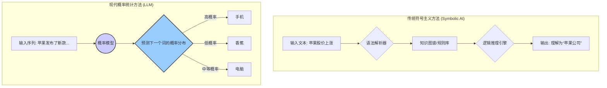

好的，作为一位资深的教育作者，我将紧接您的课程定位，续写 **1.1 根本问题：如何让机器“理解”语言？** 的后续内容。

***

### 1.1.1 “理解”的困境：从人类的直觉到机器的规则

对于人类而言，“理解”是一个近乎本能的过程。当我们听到“苹果”这个词，大脑会根据对话的语境（是在谈论水果、科技公司，还是形容脸色？）迅速、无缝地切换其含义。这种依赖海量生活经验、常识和上下文的直觉能力，恰恰是计算机所不具备的。

早期的自然语言处理（NLP）尝试，即符号主义（Symbolism），试图将人类语言的规则进行硬编码。语言学家和程序员们联手，试图构建庞大的语法规则库和知识图谱，期望机器能像查字典、套公式一样，通过解析句子结构和逻辑关系来“理解”语言。

这种方法在处理特定、结构化的任务时（例如，“查询首都”）表现尚可，但很快就暴露了其根本缺陷：

1.  **规则的无限性**：语言充满了例外、俚语、比喻和不断演化的新用法。试图为所有语言现象编写规则，是一项几乎不可能完成的任务。
2.  **歧义的普遍性**：语言的歧义性无处不在。

---
#### **案例研究：歧义的挑战**

让我们看一个简单的句子：“**服务员，给我打一碗米饭。**”

*   对于人类，这句话的意思清晰明了：盛一碗米饭。
*   对于遵循字面规则的机器，“打”这个动词可能会让它陷入困惑。在它的知识库里，“打”可能意味着击打、殴打、打电话、打游戏…… 它需要极其复杂的上下文规则才能排除这些不相关的含义。

而更复杂的句子，如“**中国队大胜美国队**”和“**中国队大败美国队**”，意思居然是完全一样的，这更是对基于规则的系统造成了毁灭性打击。

事实证明，试图让机器通过逻辑规则来模仿人类的“理解”，是一条崎岖且难以走通的道路。

### 1.1.2 范式转移：从“理解”到“预测”

既然正面攻克“理解”这座大山如此困难，科学家们转换了思路：我们能否绕过对“理解”本身的哲学定义，去解决一个更具体、更可度量的数学问题？

这个革命性的想法，就是将语言的“理解”问题，重新定义为**“预测下一个词”的概率问题**。

这听起来似乎过于简化，但其背后蕴含着深刻的洞见：**如果一个模型能够根据给定的上文，持续、准确地预测出下一个最可能出现的词，那么它在某种意义上，必须已经“学会”了语言的内在规律，包括语法、词义、事实知识，甚至是某种程度的推理能力。**

让我们回到之前的例子：
*   当模型看到序列 “史蒂夫·乔布斯创立了…” 时，它会给“苹果”一个极高的出现概率，而给“香蕉”一个极低的概率。这说明它学到了关于公司和创始人的事实知识。
*   当模型看到序列 “今天天气很好，我们去公园…” 时，它会给“散步”或“野餐”较高的概率，而给“开会”较低的概率。这说明它学到了关于日常活动和上下文的常识。

这种思想的转变，是现代语言大模型发展的基石。它将一个模糊、不可捉摸的“理解”问题，转化为一个清晰、可优化的数学目标。

我们可以用下面的图示来直观地对比这两种思路的差异：

### 1.1.3 语言的数学抽象：下一个词的概率

至此，我们完成了最重要的一步：将语言问题数学化。我们的核心任务变成了计算一个条件概率（Conditional Probability）。

给定一个词序列（上文） $w_1, w_2, \dots, w_{t-1}$，模型需要计算出词典中每一个词 $w$ 作为下一个词 $w_t$ 出现的概率：

$$
P(w_t = w | w_1, w_2, \dots, w_{t-1})
$$

这个公式就是语言模型的核心。

*   **P** 代表概率（Probability）。
*   **|** 符号读作“给定”（given），表示其后是已知条件或上下文。
*   整个表达式的含义是：**在已知前面出现了 $w_1, w_2, \dots, w_{t-1}$ 这些词的条件下，下一个词恰好是 $w$ 的概率是多少。**

模型的目标，就是在海量的文本数据中学习，从而能够精准地估计这个概率。哪个词的概率最高，它就是模型最有可能的“预测”。

---

### **要点回顾**

*   **核心挑战**：机器难以处理自然语言的歧义性、上下文依赖和规则无限性，传统的符号主义方法举步维艰。
*   **范式转移**：现代语言模型的核心思想，是将模糊的“理解”问题，转化为一个可度量的数学问题——**预测下一个词**。
*   **数学抽象**：这个预测问题被形式化为计算一个条件概率 $P(w_t | w_1, \dots, w_{t-1})$，即根据上文预测下一个词出现的可能性。

通过这种方式，我们为机器“理解”语言找到了一个可行的、可计算的路径，也为接下来将要学习的语言模型、神经网络等技术奠定了根本的理论基础。