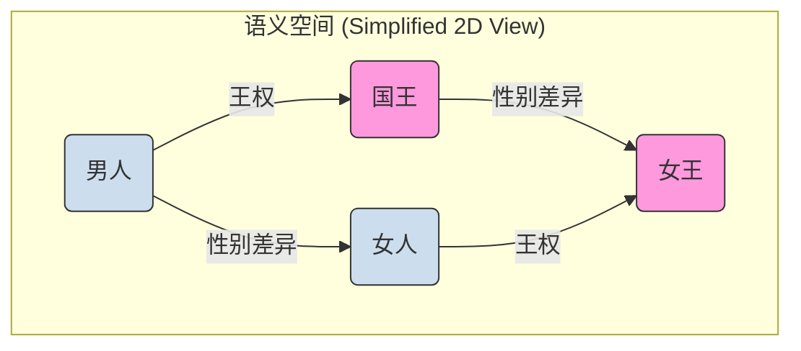

好的，作为一位资深的教育作者，我将紧接 N-Gram 模型局限性的讨论，自然地过渡并续写 **1.3 核心基石：词向量（Word Embedding）** 的内容。

***

### 1.3 核心基石：词向量（Word Embedding）

在上一节中，我们看到了 N-Gram 模型的辉煌与落寞。它的“短视”和对词语的“一视同仁”成为了其无法逾越的障碍。N-Gram 模型将每个词（如 "国王"、"女王"、"男人"、"女人"）都视为一个独立的、没有内在联系的符号。在它眼中，“国王”与“女王”之间的关系，和“国王”与“香蕉”之间的关系，没有任何区别。

这显然与我们人类对语言的认知相悖。我们知道词语之间存在着复杂而微妙的语义关系。那么，我们能否创造出一种方式，让机器也能理解这种关系呢？我们能否将词语的“含义”本身，编码成一种数学形式？

这就是 **词向量（Word Embedding）** 要解决的核心问题。它标志着自然语言处理从基于符号的“计数”时代，迈向了基于表示的“理解”时代。

#### 1.3.1 告别孤立的符号：One-Hot 编码的困境

在介绍词向量之前，我们先来看看传统上机器是如何表示一个词的：**One-Hot 编码**。

假设我们的词典里只有 5 个词：["国王", "女王", "男人", "女人", "苹果"]。One-Hot 编码会创建一个长度为 5 的向量来表示每个词。在这个向量中，只有代表当前词的位置是 1，其余都为 0。

*   "国王": `[1, 0, 0, 0, 0]`
*   "女王": `[0, 1, 0, 0, 0]`
*   "男人": `[0, 0, 1, 0, 0]`
*   "女人": `[0, 0, 0, 1, 0]`
*   "苹果": `[0, 0, 0, 0, 1]`

这种表示方法简单直观，但它有三个致命的缺陷，这与 N-Gram 模型的问题根源如出一辙：

1.  **维度灾难**：真实世界的词典非常庞大（动辄数十万），这意味着每个词的向量会变得极其巨大且稀疏（绝大部分元素都是 0），这在计算上是低效的。
2.  **语义鸿沟**：任意两个不同词的 One-Hot 向量都是**正交**的。在数学上，这意味着它们之间毫无关系。通过向量计算，我们无法得出“国王”和“女王”比“国王”和“苹果”更相似。
3.  **无法泛化**：由于词与词之间是完全隔离的，模型无法利用已学到的知识进行泛化。例如，如果模型从 "男人爱吃苹果" 中学到了知识，它无法将这个知识泛化到 "女人爱吃苹果" 这个句子上，因为 "男人" 和 "女人" 的向量表示是完全独立的。

#### 1.3.2 思想的飞跃：将词语映射到连续的语义空间

词向量提出了一种革命性的思想：**不要用孤立的、高维的 0/1 向量来表示词，而是用一个低维的、稠密的、包含浮点数的向量来表示。**

这个向量所在的数学空间，被称为**语义空间（Semantic Space）**。在这个空间里，每一个词语都不再是一个孤立的点，而是一个具有方向和长度的向量。最关键的是：

> **向量之间的空间关系（如距离、方向）应该对应词语之间的语义关系。**

这意味着：
*   **语义相似的词，其向量在空间中的位置也应该相近。** 例如，`vector("国王")` 和 `vector("女王")` 的距离，会比 `vector("国王")` 和 `vector("苹果")` 的距离近得多。
*   **词语之间的某种语义关系，可以表现为向量之间的某种特定变换。** 这正是词向量最神奇、最强大的地方。

#### 1.3.3 案例研究：向量运算的魔力 - "国王 - 男人 + 女人 ≈ 女王"

这个经典案例完美地展示了词向量如何捕捉词汇的深层语义关系。让我们想象在一个理想的词向量空间中：

1.  我们有两个基本概念向量：“性别”方向的向量（从“男人”指向“女人”）和“王权”方向的向量（从“平民”指向“王室”）。
2.  “国王”这个词的向量，可以看作是“男人”向量加上一个代表“王权”的向量分量。
3.  “女王”这个词的向量，可以看作是“女人”向量加上同一个代表“王权”的向量分量。

现在，让我们进行向量运算：
`vector("国王") - vector("男人")`

这个操作在几何上相当于从 "男人" 的位置出发，画一个指向 "国王" 的箭头。这个箭头向量所代表的，正是从“男性”到“男性王权”的抽象概念，即**“王权”**这个语义本身。

接下来，我们将这个抽象的“王权”向量，应用到“女人”身上：
`("国王" - "男人") + "女人"`

这在几何上相当于，我们站在“女人”这个点上，然后沿着刚刚计算出的“王权”向量方向走相同的距离。我们最终到达的位置，会非常非常接近“女王”这个词所在的位置。

因此，我们得到了这个著名的类比关系：

$$
\vec{v}_{\text{国王}} - \vec{v}_{\text{男人}} + \vec{v}_{\text{女人}} \approx \vec{v}_{\text{女王}}
$$

我们可以用一个简化的二维图来直观地理解这个过程：

在这个图中，水平方向的箭头代表“性别差异”关系，垂直方向的箭头代表“王权”关系。你可以清晰地看到，从“男人”到“国王”的向量，与从“女人”到“女王”的向量，是平行且等长的。

这种美妙的平行四边形结构，证明了词向量不仅仅是简单地将相似的词聚在一起，更是以一种**结构化**的方式，将语言的内在逻辑和类比关系编码进了数学空间。

同样地，我们还能发现其他有趣的类比关系：
*   `vector("法国") - vector("巴黎") + vector("北京") ≈ vector("中国")` (首都关系)
*   `vector("走路") - vector("走") + vector("游泳") ≈ vector("游")` (动词时态关系)

**那么，这些神奇的向量是如何得到的呢？**
我们暂时不需要深究其具体算法（如 Word2Vec, GloVe 等），但其核心思想与我们在 1.1 节中提到的范式转移一脉相承，即**分布式假设（Distributional Hypothesis）**：**一个词的意义，由它周围的词来定义**。

模型通过在海量文本上进行“预测下一个词”或“根据中间词预测上下文”之类的任务，作为副产品，就“学习”到了每个词的向量表示。那些经常出现在相似上下文中的词（如“猫”和“小猫”），其词向量就会被模型调整得越来越接近。

---

### 要点回顾

*   **问题根源**：传统的 One-Hot 编码将词语表示为孤立的、正交的符号，无法表达词语间的语义关系，导致模型缺乏泛化能力。
*   **核心思想**：词向量（Word Embedding）将每个词映射到一个**低维、稠密的连续向量空间**中。
*   **关键特性**：在这个语义空间里，**向量的几何关系（距离、方向）对应着词语的语义关系**。
*   **标志性成果**：`国王 - 男人 + 女人 ≈ 女王` 的类比关系，证明了词向量不仅能捕捉相似性，更能捕捉**抽象的、结构化的语义逻辑**。
*   **基石作用**：词向量解决了语言的数学表示问题，使得神经网络能够处理和理解词语的含义，是所有现代语言模型（包括 Transformer 和 LLMs）不可或缺的**核心基石**。

有了词向量这个强大的工具，我们就等于为机器装上了理解词语含义的“眼睛”。接下来，我们将探讨如何将这些代表单个词语的向量，组合起来去理解整个句子的含义，从而引出神经网络语言模型。