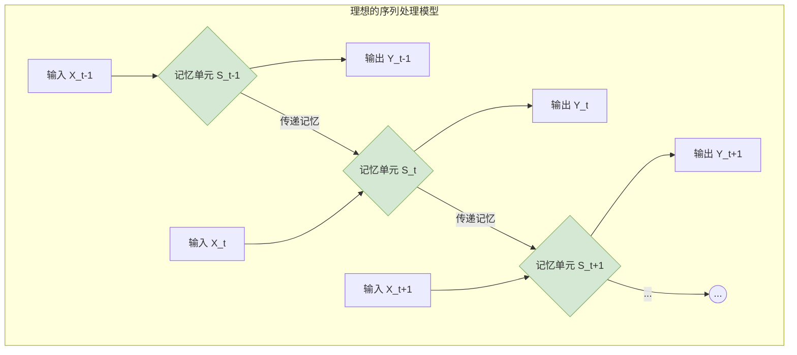

好的，这是围绕“2.1 新问题：如何处理任意长度的上下文？”的续写内容。

---

### 2.1 新问题：如何处理任意长度的上下文？

我们在第一章中看到，无论是基于规则、统计还是经典的 N-Gram 模型，它们在理解和生成语言时都面临一个共同的枷锁：**固定的上下文窗口**。N-Gram 模型通过一个大小为 `n` 的滑动窗口来预测下一个词，这在局部文本建模上取得了不错的成效，但它也带来了一个根本性的问题：模型的“视野”是有限的。当理解一句话所需要的关键信息超出了这个窗口时，模型就会束手无策。

这引出了我们在构建更强大的语言模型时必须面对的第一个核心挑战：我们如何才能让模型像人类一样，能够理解和记忆任意长度的上下文信息？

#### 2.1.1 固定窗口的“遗忘症”

想象一下这个场景，模型需要补全下面这句话：

> “我在法国南部的普罗旺斯地区长大，那里阳光明媚，薰衣草遍地。我从小就沉浸在那种独特的文化氛围里，学习当地的语言和习俗。所以，虽然我的母语是中文，但我也能说一口流利的 ______。”

对于人类来说，答案显而易见是“法语”。因为我们记住了句子开头的关键信息——“法国”。

但对于一个 `n=3` 的 Trigram 模型来说，它在预测横线处的单词时，只能看到 “一口流利的” 这两个词。根据它在训练语料库中学到的统计知识，后面最可能跟的是“中文”或“英语”，因为它无法“看到”几十个词之前出现的“法国”。

这种由于上下文窗口过小而导致关键信息丢失的现象，我们可以称之为模型的“**遗忘症**”。这正是所有固定窗口模型的阿喀琉斯之踵。为了让模型具备真正的语言理解能力，我们必须打破这个窗口的限制。

我们可以通过一个简单的对比，来清晰地看到 N-Gram 模型与我们理想中模型的差距：

| 特性 | N-Gram 模型 | 理想的序列模型 |
| :--- | :--- | :--- |
| **上下文长度** | 固定 (n-1) | **可变**，理论上可以处理任意长度 |
| **记忆能力** | 短期，仅限于窗口内部 | **长期**，能够捕捉并利用远距离的依赖关系 |
| **参数共享** | 无（每个 N-Gram 都是独立的统计单元）| **需要**一种机制在序列的不同位置共享知识 |
| **信息流** | 单向、固定步长 | 连续、可传递 |

#### 2.1.2 新模型的核心诉求：记忆与可变

要克服“遗忘症”，新一代的神经网络模型必须满足两个核心诉求：

1.  **处理可变长序列**：模型结构本身不能预设输入序列的长度。无论是一个单词、一句话还是一个段落，模型都应该能优雅地处理。
2.  **具备记忆机制**：模型需要一种内部状态或“记忆单元”，能够将序列中较早出现的信息编码、存储，并传递到后续的计算中。这种记忆不是无限的，但必须能够捕捉到对当前任务至关重要的长距离依赖。

我们可以用一个流程图来直观地展示这种理想的信息处理模式。与 N-Gram 每次都“从头开始”不同，我们期望模型在处理序列中的每一个元素时，都能同时接收**当前输入**和**来自过去的记忆**。

在这个理想化的模型中，`记忆单元 S` 成为了信息的载体。在处理 `t` 时刻的输入 `X_t` 时，模型不仅考虑了 `X_t` 本身，还利用了从 `t-1` 时刻传递过来的记忆 `S_t-1`。计算完成后，它会生成新的记忆 `S_t`，再传递给下一个时刻。

这种将历史信息不断**循环（Recurrent）**利用的设计思想，正是解决序列问题的关键。它让神经网络摆脱了固定窗口的束缚，获得了一种动态的、流动的记忆能力。

那么，如何用数学和代码实现这个优雅的“记忆单元”和“信息传递”机制呢？这正是我们下一节要探讨的——循环神经网络（Recurrent Neural Network, RNN）的诞生。

---

**本节要点**

*   **核心问题**：N-Gram 等传统模型的固定上下文窗口导致其无法处理长距离依赖，患有“遗忘症”。
*   **根本需求**：我们需要一种能够处理任意长度序列，并具备长期记忆能力的模型。
*   **解决思路**：设计一种机制，让信息可以在序列处理的每一步中持续向后传递。这个机制的核心是引入一个“记忆单元”，它在每个时间步接收当前输入和过去的记忆，并生成新的记忆传递下去。
*   **引出方向**：这种信息循环传递的结构，催生了循环神经网络（RNN）的出现。