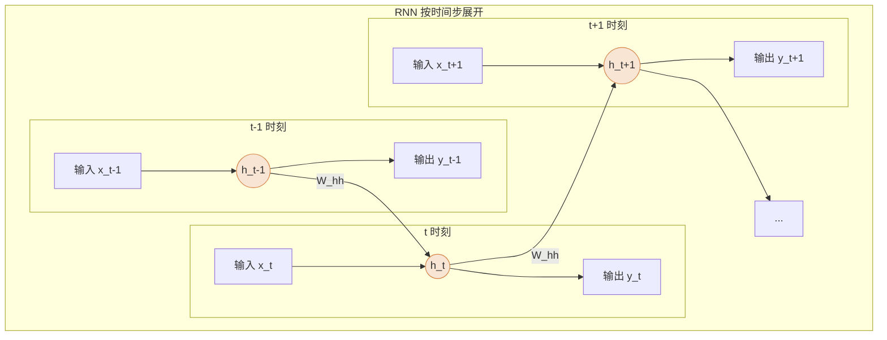

好的，这是紧接上一节内容的续写。

---

### 2.2 解决方案：循环神经网络（RNN）

上一节我们描绘了一个理想序列模型的蓝图：它需要一个能够承载历史信息的“记忆单元”，并在处理序列的每一步中不断更新和传递这份“记忆”。这个优雅而强大的思想，正是由**循环神经网络（Recurrent Neural Network, RNN）**首次用简洁的数学形式实现的。

RNN 的设计巧妙地解决了两个核心问题：如何处理可变长度的输入，以及如何在不同时间步之间共享知识。

#### 2.2.1 循环的奥秘：用“隐藏状态”记住过去

RNN 的核心在于其内部的“循环”结构。我们可以将其想象成一个拥有“工作记忆”的单元。在处理序列中的每一个元素（例如，一个词）时，这个单元会执行两个操作：
1.  **接收新信息**：读取当前时间步的输入（$x_t$）。
2.  **回顾旧记忆**：接收来自上一个时间步的“记忆摘要”（$h_{t-1}$）。

然后，它将这两部分信息融合，生成当前时间步的“记忆摘要”（$h_t$），并可以选择性地产生一个当前步的输出（$y_t$）。这个“记忆摘要”在神经网络的术语中被称为**隐藏状态（Hidden State）**。

这个过程可以用两个简单的公式来描述：

1.  **更新隐藏状态**：
    $h_t = \tanh(W_{hh}h_{t-1} + W_{xh}x_t + b_h)$

2.  **计算输出**：
    $y_t = W_{hy}h_t + b_y$

让我们来拆解一下这些符号：
*   $x_t$：$t$ 时刻的输入向量（比如，词“法国”的词嵌入）。
*   $h_{t-1}$：上一个时刻的隐藏状态，即“过去的记忆”。
*   $h_t$：当前时刻的隐藏状态，即融合了新输入后的“最新记忆”。
*   $y_t$：$t$ 时刻的输出向量（比如，预测下一个词的概率分布）。
*   $W_{xh}, W_{hh}, W_{hy}$：权重矩阵，它们是模型需要学习的参数。
*   $b_h, b_y$：偏置项，也是需要学习的参数。
*   $\tanh$：激活函数（双曲正切），用于引入非线性，帮助模型学习更复杂的关系。

最关键的一点在于，**权重矩阵 $W_{xh}$, $W_{hh}$ 和 $W_{hy}$ 在所有时间步都是共享的**。这意味着无论句子有多长，RNN 都是用同一套“规则”来处理每个词和更新记忆。这不仅极大地减少了模型的参数量，也赋予了它处理任意长度序列的能力。这正是我们对抗 N-Gram 模型“无参数共享”缺陷的有力武器。

为了更直观地理解信息流，我们通常会将 RNN 的循环结构按时间步展开（Unroll），形成一个链式结构。

在这个展开图中，我们可以清晰地看到，每个时间步的隐藏状态 $h_t$ 都像一个信息枢纽，它既接收来自底部的当前输入 $x_t$，也接收来自左侧的历史信息 $h_{t-1}$，然后将整合后的新信息传递给右侧的未来和上方的输出。

#### 2.2.2 RNN的致命缺陷：“短期记忆”问题

RNN 的设计在理论上是完美的。通过隐藏状态的循环传递，它似乎能够将序列开头的遥远信息一直保留到序列末尾。然而，在实践中，它却暴露了一个致命的缺陷。

让我们回到那个“法国”的例子：

> “我在**法国**南部的普罗旺斯地区长大，那里阳光明媚，薰衣草遍地。我从小就沉浸在那种独特的文化氛围里，学习当地的语言和习俗。所以，虽然我的母语是中文，但我也能说一口流利的 ______。”

当 RNN 处理到句子末尾时，它需要回忆起几十个词之前的关键信息“法国”。这意味着“法国”这个词所蕴含的信息，必须在隐藏状态 $h_t$ 中经过几十次更新和传递后，依然保持足够的影响力。

不幸的是，标准的 RNN 很难做到这一点。在训练过程中，当误差从序列末尾反向传播以更新权重时，梯度需要穿过长长的计算链条。在这个过程中，梯度会不断地与权重矩阵 $W_{hh}$ 相乘。这会导致两种极端情况：

1.  **梯度消失（Vanishing Gradients）**：如果 $W_{hh}$ 的值（在某种范数意义下）小于1，梯度在每一步传播中都会指数级衰减，当传到序列开头时，梯度几乎变为零。这意味着模型无法从遥远的过去中学习，来自“法国”这个词的“学习信号”完全消失了。
2.  **梯度爆炸（Exploding Gradients）**：如果 $W_{hh}$ 的值大于1，梯度则会指数级增长，最终变得巨大无比，导致模型训练过程极其不稳定，甚至崩溃。

梯度爆炸相对容易处理（例如通过梯度裁剪），但**梯度消失是 RNN 的根本性顽疾**。它使得 RNN 像一个只有**短期记忆**的人，只能记住最近发生的事情，而对于久远的、但可能至关重要的信息，则忘得一干二净。这就是著名的**长距离依赖问题（Long-Term Dependency Problem）**。

> [!WARNING]
> **常见误区：展开的 RNN ≠ 深度神经网络**
>
> 初学者看到 RNN 的展开图，可能会误以为它是一个层数非常深的前馈神经网络。这是一个关键的混淆点。
>
> *   **深度神经网络**：每一层都有**不同**的权重参数。
> *   **展开的 RNN**：所有时间步共享**相同**的权重参数（$W_{hh}, W_{xh}$ 等）。
>
> 它的“深度”体现在**时间维度**上，而非网络结构层数上。这正是参数共享的体现，也是其能够处理可变长度序列的关键。

RNN 的出现是神经网络在序列建模领域的一场革命。它首次引入了“记忆”的概念，打破了固定窗口的限制。然而，梯度消失问题使其“记忆”变得短暂而不可靠，无法真正捕捉语言中的长距离依赖。

为了让神经网络拥有更可靠的“长期记忆”，研究者们必须对 RNN 的核心——那个简单的“记忆单元”——进行一次彻底的升级改造。这便引出了我们下一节的主角：长短期记忆网络（LSTM）和门控循环单元（GRU）。

---

**本节要点**

*   **RNN 核心机制**：通过一个循环更新的**隐藏状态（Hidden State）** $h_t$ 来作为“记忆单元”。$h_t$ 由当前输入 $x_t$ 和前一时刻的隐藏状态 $h_{t-1}$ 共同决定。
*   **参数共享**：RNN 在所有时间步使用同一套权重参数，这使其能够高效地处理任意长度的序列。
*   **致命缺陷**：由于在反向传播过程中梯度需要穿越很长的时间步，导致了**梯度消失/爆炸**问题。
*   **后果**：梯度消失使得 RNN 难以学习到序列中的**长距离依赖关系**，表现得像一个只有“短期记忆”的模型。
*   **发展方向**：RNN 的“短期记忆”问题促使了更复杂的循环单元（如 LSTM、GRU）的诞生，旨在解决长距离依赖问题。