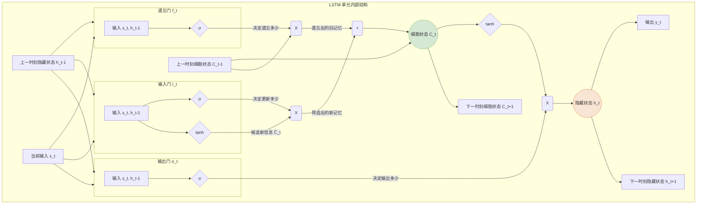

好的，这是紧接“2.2 解决方案：循环神经网络（RNN）”的续写内容。

---

### 2.3 改进方案：长短期记忆网络（LSTM）

RNN 向我们展示了利用循环结构来“记忆”信息的可能性，但梯度消失问题却让这份记忆变得短暂而脆弱。就像一个记忆力不佳的人，RNN 只能记住刚刚发生的事。要解决这个根本性缺陷，我们不能再简单地将新旧信息粗暴地混合在一起，而是需要一种更精细、更智能的机制来管理我们的“记忆单元”。

**长短期记忆网络（Long Short-Term Memory, LSTM）**正是为此而生。它不是对 RNN 的小修小补，而是一次彻头彻尾的革新。LSTM 的核心思想是：**引入一个专门的“记忆管道”和三个“阀门”，让信息有选择地流入、流出和遗忘。**

#### 2.3.1 智能的记忆系统：细胞状态与门控机制

想象一下，RNN 的隐藏状态 $h_t$ 就像一块不断被覆写的白板。每一步，我们都擦掉旧内容，然后将新输入和刚刚擦除的痕迹混合在一起，写上新内容。信息在这种反复擦写中很容易失真或消失。

LSTM 则设计了一套更先进的系统。它引入了一个全新的核心组件，叫做**细胞状态（Cell State）**，我们可以把它想象成一条**信息传送带**。

*   **细胞状态 ($C_t$)**：这条传送带贯穿整个序列处理过程，信息可以在上面平稳地流动，几乎不做改变。这使得来自久远过去的信息能够轻松地传递到未来，从根本上缓解了梯度消失的问题。

然而，如果信息只能进不能出，传送带很快就会堆满无用的信息。为此，LSTM 精心设计了三个“**门（Gate）**”结构，像智能阀门一样，严密地控制着信息如何进出这条传送带。这三个门分别是：**遗忘门、输入门和输出门**。

每个门本质上都是一个小型的神经网络层（通常是一个 Sigmoid 激活函数），它会读取当前输入 $x_t$ 和前一刻的隐藏状态 $h_{t-1}$，然后输出一个介于 0 到 1 之间的值。这个值就像一个开关：
*   **0** 代表“完全关闭”，不允许任何信息通过。
*   **1** 代表“完全打开”，让所有信息通过。
*   **0 到 1 之间的值** 代表“部分打开”，按比例让部分信息通过。

让我们看看这三个门是如何协同工作的：

**1. 遗忘门 (Forget Gate)：决定丢弃什么**

这是 LSTM 的第一步，它决定了我们要从细胞状态中丢弃哪些旧信息。
*   **工作流程**：遗忘门查看当前输入 $x_t$ 和上一个隐藏状态 $h_{t-1}$，然后为上一个细胞状态 $C_{t-1}$ 中的每个数字输出一个 0 到 1 之间的数值。1 表示“完全保留”，0 表示“完全丢弃”。
*   **应用场景**：当我们读到一个新的主语时，比如“我在法国长大... **但她**最喜欢的城市是罗马”，在处理到“她”这个词时，遗忘门就应该学会忘记前面关于“我”的性别信息。

**2. 输入门 (Input Gate)：决定存储什么**

接下来，我们需要决定哪些新信息要被存放到细胞状态中。
*   **工作流程**：这一步分为两部分。首先，输入门（一个 Sigmoid 层）决定哪些值需要更新。然后，一个 tanh 层创建一个候选值向量 $\tilde{C}_t$，准备添加到细胞状态中。最后，我们将这两部分结合起来，对细胞状态进行更新。
*   **应用场景**：在上面的例子中，当模型看到“她”时，输入门会决定将这个新的主语信息（性别为女）更新到细胞状态中。

**3. 输出门 (Output Gate)：决定输出什么**

最后，我们需要根据细胞状态来决定输出什么。这个输出就是新的隐藏状态 $h_t$。
*   **工作流程**：输出门决定我们要从细胞状态中输出哪些部分。它首先通过 Sigmoid 层得到一个判断条件，然后将细胞状态通过 tanh 函数进行缩放（值在 -1 到 1 之间），最后将两者相乘，得到最终的输出 $h_t$。这个 $h_t$ 既用于当前时刻的预测（比如预测下一个词），也作为“短期记忆”传递给下一个时间步。
*   **应用场景**：当需要预测“...能说一口流利的 ______”时，输出门会从细胞状态中提取出“法国”这个关键信息，并将其反映在隐藏状态 $h_t$ 中，从而模型能够做出“法语”的正确预测。

#### 2.3.2 LSTM 如何解决长距离依赖

通过这套精密的门控系统，LSTM 成功地克服了 RNN 的“短期记忆”问题。

| 对比 | 简单 RNN | LSTM |
| :--- | :--- | :--- |
| **记忆单元** | 单一的隐藏状态 $h_t$ | **细胞状态 $C_t$** (长期记忆) + 隐藏状态 $h_t$ (短期工作记忆) |
| **信息更新** | 粗暴的覆写：$h_t = \tanh(W_{hh}h_{t-1} + ...)$ | 精细的调控：通过门控加法和乘法，**选择性地**遗忘、添加信息 |
| **梯度流** | 在反向传播中，梯度需不断穿过激活函数和权重矩阵，容易消失或爆炸。 | 梯度可以通过细胞状态这条“高速公路”直接传递，绕开了大部分的连乘操作，从而保持稳定。 |
| **能力** | 擅长处理短期依赖 | 能够捕捉和利用**长距离依赖关系** |

回到最初的例子：

> “我在**法国**... 所以，虽然我的母语是中文，但我也能说一口流利的 ______。”

1.  当 LSTM 读到“法国”时，**输入门**会识别出这是一个重要的地理信息，并将其写入**细胞状态**。
2.  在接下来的几十个词中，由于没有强烈的信号指示要遗忘这个信息，**遗忘门**会一直让“法国”这个信息保留在细胞状态这条传送带上。
3.  当模型处理到句末需要预测时，**输出门**会检查细胞状态，发现“法国”这个信息与当前任务高度相关，于是将其提取到隐藏状态 $h_t$ 中。
4.  最终，基于这个包含了“法国”信息的隐藏状态，模型可以轻松地预测出下一个词是“法语”。

LSTM 的出现是序列建模领域的一座里程碑。它赋予了神经网络真正意义上的“长期记忆”能力，使其在机器翻译、语音识别、文本生成等众多任务上取得了突破性进展，并为后来更强大的模型（如 Transformer）奠定了坚实的基础。

---

**本节要点**

*   **核心创新**：LSTM 引入了**细胞状态（Cell State）**作为长期记忆的载体，以及**遗忘门、输入门、输出门**这三个门控机制来精确地管理信息流。
*   **工作原理**：
    *   **遗忘门**：决定从长期记忆中丢弃什么。
    *   **输入门**：决定将什么新信息存入长期记忆。
    *   **输出门**：决定从长期记忆中读取什么作为当前的短期工作记忆（隐藏状态）。
*   **解决的问题**：通过门控机制，LSTM 实现了对信息的选择性记忆和遗忘，使得梯度能够更顺畅地在时间序列中传播，从而有效解决了简单 RNN 的**梯度消失**和**长距离依赖**问题。
*   **意义**：LSTM 极大地提升了神经网络处理长序列的能力，是深度学习发展史上的一个关键模型。