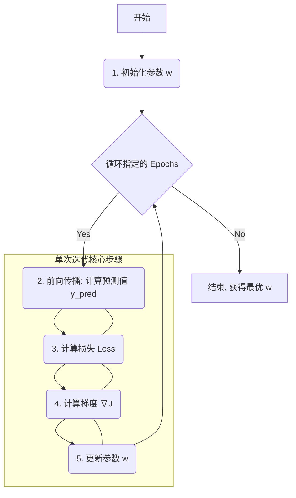

好的，老师就位！

同学们好，欢迎来到机器学习的核心腹地。在前面的课程中，我们已经知道了如何准备数据（训练集/验证集/测试集），也学会了如何用“损失函数”来衡量模型的好坏。现在，我们面临一个最激动人心的问题：**我们如何“命令”模型自动调整自己，变得越来越好，直到损失函数的值达到最小呢？**

这节课，我们就来学习解决这个问题的“万能钥匙”——**梯度下降法 (Gradient Descent)**。它几乎是所有现代机器学习和深度学习模型训练的基石。

---

### 1. 问题引入

想象一下，你是一位刚入门的“炼丹师”，你的任务是为你的线性回归模型 `y = w * x + b` 找到最合适的参数 `w` (权重) 和 `b` (偏置)，让它能最好地拟合你的数据。

我们已经有了“炼丹炉”——你的计算机，有了“评判标准”——损失函数（比如均方误差MSE）。每次你随机设置一组 `(w, b)`，损失函数就会告诉你这组参数有多“糟糕”。

问题来了：你总不能像无头苍蝇一样，一次又一次地手动、随机地尝试 `w` 和 `b` 吧？这效率太低了。我们需要一个**系统性的、自动化的方法**，能够聪明地、一步步地找到那个让损失最小的“黄金” `(w, b)` 组合。这个方法，就是我们今天要学习的优化算法：梯度下降法。

### 2. 核心思想与生活化类比

梯度下降法的核心思想非常直观，可以用一个简单的生活例子来类比：**“浓雾中下山”**。

想象一下，你被随机空降到一座连绵起伏的山脉上，四周都是浓雾，能见度只有一米。你的目标是尽快走到山谷的最低点。你该怎么办？

你无法看到整座山的全貌，但你可以环顾四周，感受脚下地面的坡度。最明智的策略是：

1.  **找到当前位置最陡峭的下坡方向**。
2.  **朝着这个方向迈出一小步**。
3.  **停下来，重复第一步**：在新的位置，再次寻找最陡的下坡方向。
4.  **不断重复**，直到你发现脚下已经是一片平地（或者坡度非常小），你就可以认为自己到达了谷底。

在这个类比中：
*   **山脉的地形**：就是我们的**损失函数**。山的海拔高度，就是损失函数的值。
*   **你所在的位置**：就是模型**当前的参数值**（比如当前的 `w` 和 `b`）。
*   **山谷的最低点**：就是损失函数的**最小值点**，对应着我们想找的**最优参数**。
*   **最陡峭的下坡方向**：在数学中，这就是**梯度的负方向**。梯度（Gradient）指向的是函数值上升最快的方向，那么它的反方向自然就是下降最快的方向。
*   **你迈出的每一步的大小**：这就是**学习率 (Learning Rate)**，一个控制我们“下山”步伐大小的超参数。

所以，梯度下降法的本质就是：**通过计算损失函数关于参数的梯度，来找到让损失下降最快的方向，然后沿着这个方向更新参数一小步，如此循环往复，直到找到损失函数的最小值。**

### 3. 最小可运行示例

Talk is cheap. Show me the code. 让我们来看一个最简单的梯度下降实现。我们只求解 `y = w * x` 中的 `w`，数据也非常简单，这样你就能一眼看出 `w` 的最优解是 2。

```python
import numpy as np

# 1. 准备数据 (Ground Truth: y = 2 * x)
X = np.array([1, 2, 3, 4], dtype=np.float32)
Y = np.array([2, 4, 6, 8], dtype=np.float32)

# 2. 初始化参数
# 我们从一个随机的 w 开始，比如 0
w = 0.0

# 3. 设置超参数
learning_rate = 0.01
epochs = 20 # 训练轮数

# 4. 训练循环 (梯度下降的核心)
print("--- 开始训练 ---")
for epoch in range(epochs):
    # a. 前向传播：用当前 w 计算预测值
    y_pred = w * X

    # b. 计算损失 (均方误差 MSE)
    # loss = 1/N * sum((y_pred - y)^2)
    loss = np.mean((y_pred - Y)**2)

    # c. 计算梯度
    # d(loss)/dw = 1/N * 2 * sum( (w*x - y) * x )
    # 这是均方误差损失函数对 w 的偏导数
    gradient = np.mean(2 * X * (y_pred - Y))

    # d. 更新参数：向梯度的反方向移动一小步
    # 这就是“下山”的那一步
    w = w - learning_rate * gradient

    # 打印训练过程
    if (epoch + 1) % 2 == 0:
        print(f'Epoch [{epoch+1}/{epochs}], w: {w:.3f}, Loss: {loss:.4f}')

print("--- 训练结束 ---")
print(f'模型学到的参数 w = {w:.3f}')

# --- 实际输出 ---
# --- 开始训练 ---
# Epoch [2/20], w: 0.555, Loss: 21.6750
# Epoch [4/20], w: 1.111, Loss: 6.0795
# Epoch [6/20], w: 1.445, Loss: 1.7042
# Epoch [8/20], w: 1.636, Loss: 0.4782
# Epoch [10/20], w: 1.754, Loss: 0.1342
# Epoch [12/20], w: 1.831, Loss: 0.0376
# Epoch [14/20], w: 1.880, Loss: 0.0105
# Epoch [16/20], w: 1.910, Loss: 0.0030
# Epoch [18/20], w: 1.929, Loss: 0.0008
# Epoch [20/20], w: 1.941, Loss: 0.0002
# --- 训练结束 ---
# 模型学到的参数 w = 1.941
```
观察输出，你可以清晰地看到，随着 `epoch` 的增加，`Loss` 在稳步下降，而 `w` 的值也越来越接近我们期望的 `2.0`。这就是梯度下降在起作用！

### 4. 原理剖析

让我们把上面的代码流程拆解开，并用图表和数学公式来深入理解。



**分步详解:**

1.  **初始化参数 (Initialization)**
    *   我们随机选择一个起点，比如 `w = 0`。这个起点的好坏有时会影响收敛速度，但对于简单的“碗状”损失函数，总能找到最低点。

2.  **前向传播 (Forward Pass)**
    *   用当前的 `w` 和输入 `X` 计算模型的预测值 `y_pred`。
    *   `y_pred = w * X`

3.  **计算损失 (Loss Calculation)**
    *   使用损失函数（这里是MSE）来量化预测值 `y_pred` 和真实值 `Y` 之间的差距。
    *   $J(w) = \frac{1}{N} \sum_{i=1}^{N} (w \cdot x_i - y_i)^2$
        *   这里的 $J(w)$ 就是我们的损失函数，它是一个关于参数 `w` 的函数。我们的目标是找到让 $J(w)$ 最小的 `w`。

4.  **计算梯度 (Gradient Calculation)**
    *   这是最关键的一步。我们要计算损失函数 $J(w)$ 对参数 `w` 的**偏导数（或梯度）**。梯度告诉我们，当 `w` 发生微小变化时，损失 `J(w)` 会如何变化，并且指向变化最快的方向。
    *   $ \nabla J(w) = \frac{\partial J}{\partial w} = \frac{2}{N} \sum_{i=1}^{N} (w \cdot x_i - y_i) \cdot x_i $
    *   这个公式就是代码中 `gradient = np.mean(2 * X * (y_pred - Y))` 的数学表达。它精确地告诉我们，在当前位置，哪个方向是“上山”最陡的方向。
    *   在NumPy代码中，我们利用了向量化操作：`2 * X * (y_pred - Y)` 会对每个样本计算括号内的值，而 `np.mean()` 则高效地完成了对所有样本结果求和并除以样本总数N的操作，这与数学公式的定义是等价的。

5.  **更新参数 (Parameter Update)**
    *   我们朝着梯度的**反方向**更新参数，从而实现“下山”的效果。
    *   $w_{new} = w_{old} - \alpha \cdot \nabla J(w)$
        *   $w_{new}$ 是更新后的参数。
        *   $w_{old}$ 是当前参数。
        *   $\alpha$ 是**学习率 (Learning Rate)**，也就是我们“下山”时每一步的步长。
        *   $\nabla J(w)$ 是我们刚计算出的梯度。
    *   这一步对应代码 `w = w - learning_rate * gradient`。

**重复循环**: 我们不断重复步骤 2-5，每一次迭代，`w` 都会向着更优的方向移动一点点，`Loss` 也会随之降低，直到我们达到设定的 `epochs` 次数，或者 `Loss` 的变化小到可以忽略不计。

**复杂度分析**
*   **时间复杂度**: $O(epochs \times N)$。其中 `epochs` 是训练轮数，`N` 是样本数量。因为在每次迭代中，我们都需要遍历所有 `N` 个样本来计算总的梯度。这种遍历整个数据集的梯度下降称为**批量梯度下降 (Batch Gradient Descent)**。
*   **空间复杂度**: $O(1)$ (不考虑存储原始数据)。算法本身只需要常数级别的额外空间来存储参数和梯度。

### 5. 常见误区与优化点

1.  **学习率 (`learning_rate`) 的选择是关键**
    *   **误区1: 学习率过大**：想象一下下山时一步迈得太大，你可能会直接跨过谷底，“飞”到对面的山坡上，导致损失值不降反升，来回震荡甚至发散（loss 变成 `inf` 或 `NaN`）。
    *   **误区2: 学习率过小**：下山的步子太小，就像蚂蚁搬家，虽然方向正确，但需要非常非常长的时间才能到达谷底，导致训练速度过慢。
    *   **优化点**: 学习率是一个需要精心调节的超参数。实践中常用**学习率衰减 (Learning Rate Decay)** 等策略，即在训练初期使用较大的学习率快速下降，后期逐渐减小学习率进行精细微调。

2.  **批量梯度下降的效率问题**
    *   **误区**: 认为每次都必须用全部数据来计算梯度。
    *   **优化点**: 当数据集非常大时（例如百万级样本），每次迭代都计算全部样本的梯度会非常耗时。因此，实践中更常用的是：
        *   **随机梯度下降 (SGD)**: 每次只随机取**一个**样本来计算梯度并更新参数。速度快，但下降路径不稳定，抖动剧烈。
        *   **小批量梯度下降 (Mini-batch GD)**: 每次取一小批数据（如 32, 64, 128 个样本）来计算梯度。这是速度和稳定性之间的一个完美折中，也是目前最主流的梯度下降变体。

### 6. 拓展应用

梯度下降法及其变体是现代机器学习的“发动机”，应用无处不在：

*   **深度学习**: 训练各种复杂的神经网络（如 CNN 用于图像识别，RNN 用于自然语言处理）都是先通过**反向传播 (Backpropagation)** 算法来高效地计算出损失函数对于海量参数的梯度，再结合**梯度下降法**及其变体（如 Adam, RMSprop）来使用这些梯度更新参数。
*   **逻辑回归**: 用于分类任务（如垃圾邮件识别、肿瘤良性/恶性判断）的模型，其参数也是通过梯度下降法来求解的。
*   **推荐系统**: 在协同过滤等算法中，梯度下降可以用来学习用户和物品的隐特征向量，从而进行个性化推荐。

### 7. 总结要点

| 方面 | 关键描述 |
| :--- | :--- |
| **核心目标** | 找到一组模型参数，使得损失函数的值最小化。 |
| **核心思想** | “迭代式下山”：沿着损失函数梯度（最陡峭方向）的**反方向**，持续小步更新参数。 |
| **关键公式** | 参数更新法则: $ w_{new} = w_{old} - \alpha \cdot \nabla J(w) $ |
| **三大要素** | 1. **当前位置** (当前参数) <br> 2. **下山方向** (负梯度) <br> 3. **下山步长** (学习率 $\alpha$) |
| **适用场景** | 几乎所有需要通过优化来求解参数的机器学习模型。是训练神经网络的标配。 |
| **重要超参数** | **学习率 (Learning Rate)**，其大小直接影响模型的收敛速度和效果。 |

### 8. 思考与自测

现在，你已经掌握了梯度下降的基本原理。请挑战一下自己，对我们第3节中的代码进行升级：

**任务**: 修改代码，使其能够同时学习模型 `y = w * x + b` 中的 **`w`** 和 **`b`** 两个参数。

**提示**: 
1.  你需要额外初始化一个参数 `b` (e.g., `b = 0.0`)。
2.  更新你的前向传播公式：`y_pred = w * X + b`。
3.  你需要计算损失函数对 `b` 的偏导数。思考一下，$ \frac{\partial J}{\partial b} $ 等于什么？（提示：它比对 `w` 的偏导更简单）
4.  在训练循环中，除了更新 `w`，你还需要根据 `b` 的梯度来同步更新 `b`。

完成这个挑战，你对梯度下降的理解将更上一层楼。祝你“下山”顺利！