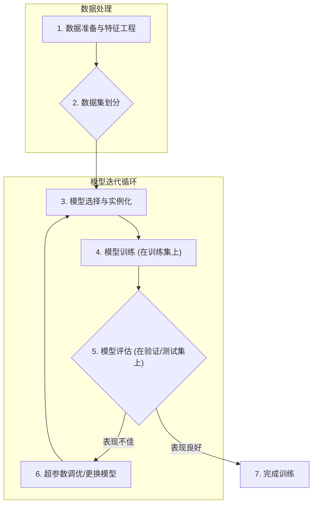

好的，教练就位。让我们一起构建一份清晰、可执行的“从数据到模型”的操作手册。我们将遵循引导式教学模型，确保每一步都坚实有力。

***

### **操作手册：训练流程：从数据到模型的完整步骤**

#### 1. **问题引入**

“我理解了训练集/验证集、损失函数和梯度下降这些基本概念，也知道有参数和超参数这回事。但是，当我真正拿到一份数据时，我应该遵循怎样的**标准流程**，一步步地将它变成一个训练好的模型呢？我需要一个不会出错的、清晰的执行顺序。”

#### 2. **核心目标与类比**

本流程的核心目标是建立一个**系统化、可复现**的机器学习模型训练工作流。

把它想象成**“烘焙一份完美的蛋糕”**：
*   **数据**是你的**原材料**（面粉、鸡蛋、糖）。
*   **特征工程**是**备料过程**（过筛、打发、混合）。
*   **模型训练**是**烘焙过程**（设定烤箱温度和时间）。
*   **模型评估**是**品尝成品**（检查是否松软、甜度是否合适）。

遵循这份“菜谱”，你就能稳定地“烘焙”出合格的“模型蛋糕”。

#### 3. **最小示例 (核心流程演练)**

在深入细节之前，我们先快速过一遍最核心、无分支的“主干流程”，让你对全局有一个清晰的认识。

1.  **数据准备**: 加载数据，进行基础的清洗。
2.  **特征工程**: 将原始数据转换为模型可以理解的数值特征。
3.  **数据集划分**: 将数据切分为训练集、验证集和测试集。
4.  **模型选择与实例化**: 根据任务选择一个合适的模型算法。
5.  **模型训练**: 在训练集上执行 `.fit()`，让模型学习数据中的模式。
6.  **模型评估**: 在验证集或测试集上检查模型的表现。

这个六步流程构成了我们整个工作的骨架。

#### 4. **原理剖析 (各步骤详解)**

现在，让我们为这个骨架添上血肉。下面是每一步的详细“操作指令”和“验收标准”。

首先，这是整个流程的概览图：



---

##### **✅ 第1步：数据准备与特征工程 (Data Prep & Feature Engineering)**

*   **操作指令**:
    1.  **加载数据**: 使用 Pandas 等库从 CSV、数据库或其他来源加载数据。
    2.  **数据清洗**: 处理缺失值（填充或删除）、异常值和重复数据。
    3.  **特征转换**:
        *   将类别特征（如“城市”、“颜色”）转换为数值（如独热编码）。
        *   对数值特征进行缩放（如标准化或归一化），特别是对于那些对尺度敏感的模型（如逻辑回归、SVM）。**（重要提示：为避免数据泄露，特征缩放的 `fit` 操作必须在训练集上进行，然后用训练集学到的变换参数应用于验证集和测试集。详见下方代码示例，其发生在数据集划分之后。）**
    4.  **特征创建**: 根据业务理解，从现有特征中构造新的、可能更有用的特征。

*   **验收标准**:
    *   所有数据都已加载到一个 DataFrame 中。
    *   数据集中没有非预期的缺失值。
    *   所有特征都已转换为数值类型。
    *   最终产出是一个干净的、可直接用于模型训练的特征矩阵 `X` 和目标向量 `y`。

---

##### **✅ 第2步：数据集划分 (Dataset Splitting)**

*   **操作指令**:
    1.  **划分比例**: 确定训练集、验证集、测试集的比例，常见为 70%/15%/15% 或 80%/10%/10%。
    2.  **执行划分**: 使用 `sklearn.model_selection.train_test_split` 函数。**关键：先划分出测试集，然后从剩余数据中再划分出训练集和验证集**，以保证测试集“纯净”。
    3.  **随机种子**: 设置 `random_state` 参数以确保每次划分的结果都一样，便于复现。

*   **验收标准**:
    *   得到了三组数据：`(X_train, y_train)`, `(X_val, y_val)`, `(X_test, y_test)`。
    *   三组数据之间没有交集。
    *   各组数据的维度正确。

---

##### **✅ 第3步：模型选择与实例化 (Model Selection & Instantiation)**

*   **操作指令**:
    1.  **选择算法**: 根据你的问题类型（分类/回归）、数据量大小和特点，选择一个初步的模型。例如，对于分类问题，可以从逻辑回归（`LogisticRegression`）或随机森林（`RandomForestClassifier`）开始。
    2.  **实例化模型**: 创建一个模型对象，并可以为其设置一些初始的超参数。

*   **验收标准**:
    *   创建了一个模型变量，例如 `model = RandomForestClassifier(n_estimators=100, random_state=42)`。

---

##### **✅ 第4步：模型训练 (Model Training)**

*   **操作指令**:
    1.  调用模型的 `.fit()` 方法。
    2.  将**训练集**的特征 `X_train` 和标签 `y_train` 作为参数传入。
    
    ```python
    model.fit(X_train, y_train)
    ```
    *说明：在执行 `.fit()` 的过程中，优化算法（如梯度下降）会根据损失函数的结果，不断调整模型的内部**参数 (Parameters)**，以最小化在训练数据上的“错误”。*

*   **验收标准**:
    *   `.fit()` 方法成功执行完毕，没有报错。
    *   `model` 对象现在是一个“已训练”的模型，其内部参数已经被学习和设定。

---

##### **✅ 第5步：模型评估 (Model Evaluation)**

*   **操作指令**:
    1.  使用训练好的模型对**验证集** `X_val` 进行预测，得到 `y_pred`。
    2.  比较预测结果 `y_pred` 和真实标签 `y_val`，计算评估指标（如准确率、精确率等）。

*   **验收标准**:
    *   得到模型在验证集上的性能分数。这个分数将作为我们判断模型好坏、是否需要调优的依据。

---

##### **✅ 第6步：超参数调优 (Hyperparameter Tuning) (迭代步骤)**

*   **操作指令**:
    1.  如果第5步的评估结果不理想，就需要调整**超参数 (Hyperparameters)**，例如随机森林的树的数量 `n_estimators` 或树的最大深度 `max_depth`。
    2.  **重复流程**: 调整超参数后，**返回第3步**，用新的超参数重新实例化模型，然后在**相同的训练集**上训练，在**相同的验证集**上评估。
    3.  持续这个循环，直到在验证集上找到一组表现最好的超参数。

*   **验收标准**:
    *   在验证集上的性能达到预期，或者继续调优带来的提升很小。

---

##### **✅ 第7步：最终评估与完成 (Final Evaluation & Completion)**

*   **操作指令**:
    1.  当你对超参数调优的结果满意后，用这组最佳超参数，在**合并后的训练集与验证集 (`X_train` + `X_val`)** 上重新训练一次模型。
    2.  最后，使用**从未被模型见过的测试集** `(X_test, y_test)` 来评估模型的最终性能。
    3.  **报告最终性能**: 测试集上的分数是模型泛化能力的最终度量，也是你应该向外界报告的性能指标。

*   **验收标准**:
    *   得到模型在“未知数据”（测试集）上的最终性能分数。
    *   训练流程结束，得到一个可用于部署的最终模型。

#### **代码示例**

```python
import pandas as pd
import numpy as np # 新增导入 numpy
from sklearn.model_selection import train_test_split
from sklearn.preprocessing import StandardScaler
from sklearn.ensemble import RandomForestClassifier
from sklearn.metrics import accuracy_score

# 模拟数据
data = {
    'feature1': [i for i in range(200)],
    'feature2': [i * 2 + 3 for i in range(200)],
    'category': ['A' if i % 2 == 0 else 'B' for i in range(200)],
    'target': [0 if i < 100 else 1 for i in range(200)]
}
df = pd.DataFrame(data)

# --- 1. 数据准备与特征工程 ---
# 独热编码分类特征
df = pd.get_dummies(df, columns=['category'], drop_first=True)

# 定义特征和目标
X = df.drop('target', axis=1)
y = df['target']

# --- 2. 数据集划分 ---
# 定义期望的划分比例
initial_test_size = 0.15  # 测试集占总体的比例
validation_size_absolute = 0.15 # 验证集占总体的比例

# 先分出测试集
X_train_val, X_test, y_train_val, y_test = train_test_split(X, y, test_size=initial_test_size, random_state=42, stratify=y)

# 计算验证集在剩余数据 (X_train_val) 中的相对比例
validation_size_relative = validation_size_absolute / (1.0 - initial_test_size)

# 再从剩余数据中分出训练集和验证集
X_train, X_val, y_train, y_val = train_test_split(X_train_val, y_train_val, test_size=validation_size_relative, random_state=42, stratify=y_train_val)

# 特征缩放 (在划分后进行，防止数据泄露)
scaler = StandardScaler()
X_train = scaler.fit_transform(X_train)
X_val = scaler.transform(X_val)
X_test = scaler.transform(X_test)

print(f"训练集大小: {X_train.shape}")
print(f"验证集大小: {X_val.shape}")
print(f"测试集大小: {X_test.shape}")

# --- 3. 模型选择与实例化 ---
# 假设经过调优，我们确定 max_depth=5 是一组表现不错的超参数
model = RandomForestClassifier(n_estimators=100, random_state=42, max_depth=5)

# --- 4. 模型训练 ---
print("\n开始训练模型...")
model.fit(X_train, y_train)
print("训练完成！")

# --- 5. 模型评估 (在验证集上) ---
y_val_pred = model.predict(X_val)
val_accuracy = accuracy_score(y_val, y_val_pred)
print(f"\n验证集准确率: {val_accuracy:.4f}")

# --- 6. 超参数调优 (此处为简化演示，假设我们对结果满意，并确定了max_depth=5) ---
# 在实际项目中，你会在这里尝试不同的 max_depth, n_estimators 等，然后重复3-5步

# --- 7. 最终评估 (在测试集上) ---
# 按照最佳实践，在找到最佳超参数后，使用最佳超参数在『全部』训练数据(X_train + X_val)上重新训练最终模型
print("\n用 X_train 和 X_val 合并后的数据集重新训练最终模型...")

# 合并训练集和验证集的特征和标签
# 注意：X_train 和 X_val 已经过相同的 scaler.transform() 处理，可以直接合并
X_full_train = np.vstack((X_train, X_val))
y_full_train = np.concatenate((y_train, y_val))

# 实例化最终模型（这里的超参数应是经过调优后确定的最佳值，此处沿用之前确定的）
final_model = RandomForestClassifier(n_estimators=100, random_state=42, max_depth=5)
final_model.fit(X_full_train, y_full_train)
print("最终模型训练完成！")

# 使用最终模型在测试集上进行评估
y_test_pred = final_model.predict(X_test)
test_accuracy = accuracy_score(y_test, y_test_pred)
print(f"最终测试集准确率: {test_accuracy:.4f}")

```

#### 5. **常见误区 (风险与回退)**

*   **风险1：数据泄露 (Data Leakage)**
    *   **表现**: 在训练/验证时表现极好，但在真实世界中表现很差。
    *   **原因**: 在**划分数据集之前**就进行了数据处理（如标准化）。这会导致训练集“偷看”到了验证集和测试集的信息（例如全局均值和方差）。
    *   **解决方案**: 严格遵守**“先划分，再处理”**的原则。`fit_transform` 只在训练集上做，`transform` 应用于验证集和测试集。

*   **风险2：在测试集上进行调优**
    *   **表现**: 你报告了一个非常高的模型性能，但这个性能是“虚假”的。
    *   **原因**: 反复用测试集评估并据此调整超参数，模型会逐渐“过拟合”到测试集上。测试集失去了其作为最终、公正裁判的意义。
    *   **解决方案**: 永远将测试集**锁在保险箱里**，直到所有模型选择和超参数调优都已在训练集和验证集上完成后，才拿出来做最后一次评估。

*   **风险3：忘记对类别特征编码**
    *   **表现**: 模型训练时直接报错，提示无法处理字符串等非数值类型。
    *   **解决方案**: 在特征工程阶段，确保所有输入到模型的特征都是数值。使用独热编码（One-Hot Encoding）或标签编码（Label Encoding）。

#### 6. **拓展应用 (分支与变体)**

*   **变体1：交叉验证 (Cross-Validation)**
    *   **适用场景**: 当数据集较小，单独划分一个验证集会使训练数据更少，导致模型学习不充分。
    *   **做法**: 不再单独划分验证集，而是将训练数据（`X_train_val`）分为K份（例如5份）。每次用其中4份做训练，1份做验证，重复5次，最后取平均性能作为模型评估标准。这比单一验证集更稳健。

*   **变体2：使用管道 (Pipeline)**
    *   **适用场景**: 当预处理步骤很复杂时，为了简化代码、避免数据泄露。
    *   **做法**: 使用 `sklearn.pipeline.Pipeline` 将预处理步骤（如特征缩放）和模型训练步骤封装成一个单一的对象。这样，你只需要对管道对象调用一次 `.fit()` 和 `.predict()`，它会自动在内部按正确顺序处理数据，非常优雅且安全。

#### 7. **总结要点 (Checklist)**

在你开始下一次模型训练时，请使用这个清单来检查你的流程：

-   [ ] **数据准备**: 数据已加载并完成清洗（缺失值、异常值）。
-   [ ] **特征工程**: 所有特征已转换为数值，必要时已进行缩放。
-   [ ] **数据划分**: 已将数据严格划分为训练、验证、测试三部分。
-   [ ] **预处理时机**: 所有 `fit` 或 `fit_transform` 操作**只**在训练集上进行。
-   [ ] **模型训练**: 模型已在训练集 (`X_train`, `y_train`) 上成功 `.fit()`。
-   [ ] **调优过程**: 所有超参数的探索和调整**只**依赖于验证集 (`X_val`) 的性能。
-   [ ] **最终评估**: 测试集 (`X_test`) **只**在流程的最后一步使用了一次，用于报告最终性能。
-   [ ] **可复现性**: 是否设置了所有相关的随机种子 (`random_state`)？

#### 8. **思考与自测**

**问题**: 如果你的数据集非常小，只有几百条记录，那么在“第2步：数据集划分”时，直接划分为训练集和测试集（或训练/验证/测试）可能会有什么风险？你会如何调整整个流程来应对这个问题？

**思考引导**:
*   一个很小的验证集或测试集，其评估结果是否可靠？
*   从本手册的“拓展应用”部分，你能找到更适合小数据集的评估策略吗？
*   如果采用了那个策略，你的训练和评估循环会发生怎样的变化？