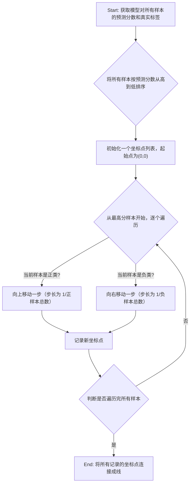

### ROC曲线与AUC值：理解分类器的诊断能力

#### 1. 问题引入

假设您正在为一个医疗诊断AI开发一个模型，用于根据病人的生理指标预测其是否患有某种罕见的严重疾病。模型输出的是一个0到1之间的“患病概率”。现在，您需要向医生们交付这个模型。一个关键问题摆在面前：应该将概率的“阈值”设为多少来判定一个病人为“阳性”？

- 如果阈值设得太高（例如0.95），您会非常有信心地找出那些病情最明显的患者，但可能会漏掉大量早期或不典型的病例（高假阴性率，False Negative）。
- 如果阈值设得太低（例如0.1），您几乎能识别出所有真正的患者，但同时会将大量健康的人误诊为病人（高假阳性率，False Positive），导致不必要的恐慌和医疗资源浪费。

显然，单一的阈值无法全面评估模型的诊断潜力。我们需要的不是一个在特定阈值下的“快照”，而是一个能展现模型在**所有可能阈值**下性能权衡的全景图。我们如何才能实现这种与阈值无关的、对模型“排序能力”的综合评估呢？

#### 2. 核心定义与生活化类比

**核心定义**

*   **ROC曲线 (Receiver Operating Characteristic Curve)**：它是一个二维图表，以**假阳性率 (False Positive Rate, FPR)** 为横轴，以**真阳性率 (True Positive Rate, TPR)** 为纵轴，描绘了分类器在所有可能的决策阈值下，这两个指标之间的权衡关系。
*   **AUC值 (Area Under the Curve)**：它是ROC曲线下方的面积。AUC值是一个介于0和1之间的标量，它量化了分类器在所有阈值下的整体性能。一个完美的分类器AUC为1，而一个随机猜测的分类器AUC为0.5。

**生活化类比：经验丰富的安检员**

想象一位经验丰富的机场安检员，他的任务是识别行李中的违禁品。这位安检员的“模型”就是他的经验和直觉。

*   **决策阈值**：是安检员内心的“怀疑程度”。他可以非常严格，对任何稍微可疑的行李都开箱检查；也可以非常宽松，只检查那些几乎确定有问题的行李。
*   **真阳性率 (TPR)**：是他成功找出所有违禁品行李的比例。这相当于他的“检出率”或“敏感度”。
*   **假阳性率 (FPR)**：是他将普通行李误判为有问题而开箱检查的比例。这相当于他的“误报率”。

这位安检员在一天中可能会根据客流量、警报级别等因素调整自己的“怀疑阈值”。**ROC曲线**就如同这位安检员在**所有可能“怀疑度”**下，其“检出率”与“误报率”关系的完整记录。而**AUC值**，则可以理解为这位安检员**区分“有问题行李”和“普通行李”的内在、稳定能力**的量化得分，与他当天碰巧采取的某个具体检查标准（阈值）无关。

#### 3. 最小示例

在实践中，我们通常利用`scikit-learn`库来计算和绘制ROC曲线。关键在于，我们需要的是模型预测的**概率分数（scores）**，而不是最终的分类标签。

```python
import numpy as np
from sklearn.metrics import roc_curve, auc

# 真实标签 (0: 负类, 1: 正类)
y_true = np.array([0, 0, 1, 1, 0, 1, 0, 1])

# 模型预测的属于正类的概率分数
# 注意：这里不是0或1的预测结果，而是连续的概率值
y_scores = np.array([0.1, 0.3, 0.4, 0.8, 0.2, 0.7, 0.05, 0.9])

# 1. 计算ROC曲线的各个点
# fpr: False Positive Rates (横轴)
# tpr: True Positive Rates (纵轴)
# thresholds: 计算每个(fpr, tpr)点时所采用的决策阈值
fpr, tpr, thresholds = roc_curve(y_true, y_scores)

# 2. 计算AUC值
roc_auc = auc(fpr, tpr)

# -- 输出结果 --
print("False Positive Rates (FPR):")
print(fpr)
# 输出: [0.   0.   0.25 0.25 0.5  0.5  1.   1.  ]

print("\nTrue Positive Rates (TPR):")
print(tpr)
# 输出: [0.   0.25 0.25 0.5  0.5  1.   1.   1.  ]

print("\nThresholds:")
print(thresholds)
# 输出: [1.9  0.9  0.8  0.7  0.4  0.3  0.2  0.05]
# 请注意，`thresholds`列表的第一个值（1.9）通常是`scikit-learn`为了确保曲线从(0,0)点开始而设定的，它比所有预测分数都大。

print(f"\nAUC Value: {roc_auc:.4f}")
# 输出: AUC Value: 0.8750
```
这段代码的核心是`roc_curve`函数，它通过遍历所有可能的阈值（实际上是`y_scores`中的独特值），计算出每个阈值对应的(FPR, TPR)坐标对，从而构成了ROC曲线。`auc`函数则基于这些点计算曲线下的面积。

#### 4. 原理剖析

**数学基础**

首先，回顾两个核心比率的定义，它们都源于混淆矩阵：
*   **真阳性率 (TPR)**，也称为**灵敏度 (Sensitivity)** 或**召回率 (Recall)**：
    $TPR = \frac{TP}{TP + FN}$
    它衡量的是在所有真实为正类的样本中，被模型正确识别为正类的比例。
*   **假阳性率 (FPR)**，也称为**(1 - 特异度 (Specificity))**：
    $FPR = \frac{FP}{FP + TN}$
    它衡量的是在所有真实为负类的样本中，被模型错误识别为正类的比例。

**ROC曲线的构建过程**

ROC曲线的构建是一个优雅的算法过程，不依赖于预设的单一阈值。



**AUC的概率解释**

AUC值有一个非常重要的、超越几何面积的概率解释：**AUC值等于从正类样本中随机抽取一个样本，其预测分数大于从负类样本中随机抽取一个样本的预测分数的概率**。

形式化地，令$S_p$为正类样本的分数，$S_n$为负类样本的分数，则：
$AUC = P(S_p > S_n)$

这个解释揭示了AUC的本质：它衡量的是模型的**排序能力**。一个高AUC模型能有效地将正类样本排在负类样本前面，而与具体的阈值选择无关。这也解释了为何AUC与Wilcoxon-Mann-Whitney U检验在统计上是等价的。

#### 5. 常见误区

1.  **误区：AUC是评估不平衡数据集分类的最佳指标。**
    *   **辨析**：这是一个普遍但危险的误解。虽然这种计算方式使ROC曲线对类别不平衡的**‘比例’**不敏感，但这恰恰是其潜在的陷阱，因为它可能掩盖在少数类预测中**‘数量’**上的巨大代价。在极端不平衡（如99%负类，1%正类）的情况下，一个模型即使只做出了非常微弱的有效预测，其FPR的微小增长也可能被巨大的TN基数稀释，从而得到一个看似很高（如0.9+）的AUC值。然而，在实际应用中，我们更关心的是对稀有正类的识别效果。在这种场景下，**精确率-召回率曲线 (Precision-Recall Curve, PRC)** 通常能更真实地反映模型在少数类上的性能，因为精确率的分母（TP+FP）直接受到FPR的影响。因此，对于严重不平衡的数据，应同时考察ROC-AUC和PR-AUC。

2.  **误区：AUC值更高的模型在任何情况下都更优。**
    *   **辨析**：不一定。AUC是模型在所有阈值下的**平均**性能。如果两个模型的ROC曲线发生了交叉，情况就变得复杂了。例如，模型A的AUC为0.90，模型B的AUC为0.88。但是，在FPR极低（<0.05）的区域，模型B的曲线可能在模型A之上。如果业务场景对假阳性极其敏感（例如，代价高昂的后续验证），那么在那个特定操作区间内，模型B实际上是更优的选择。最终决策应结合业务需求，确定ROC曲线上的最佳操作点（Operating Point），而不仅仅是比较总面积。

#### 6. 总结要点

1.  **阈值无关性**: ROC曲线和AUC值通过评估模型在所有可能决策阈值下的表现，提供了一个独立于阈值选择的综合性能度量。
2.  **核心权衡**: ROC曲线直观地展示了分类器在真阳性率（收益）和假阳性率（成本）之间的权衡。
3.  **概率本质**: AUC的根本含义是模型将随机正样本排在随机负样本之前的概率，它衡量的是模型的排序质量而非分类准确性。
4.  **场景适用性**: 虽然AUC在许多场景下非常有用，但在处理严重类别不平衡问题时，应谨慎解读，并建议结合PR曲线进行综合评估。

#### 7. 思考与自测

1.  **场景选择**: 假设有两个模型，模型A的AUC为0.85，模型B的AUC为0.82。但模型B的ROC曲线在FPR非常低的区域（例如FPR < 0.1）始终高于模型A。如果你的应用场景是信用卡欺诈检测（其中误报会导致用户体验下降，但漏报会导致巨大资金损失），你会倾向于选择哪个模型，并如何向团队阐述你的理由？
2.  **AUC的鲁棒性**: 假设你对模型的所有预测概率分数应用一个单调递增的变换（例如，取对数或平方），这会改变ROC曲线的形状或AUC值吗？为什么？这个特性揭示了AUC的什么本质？