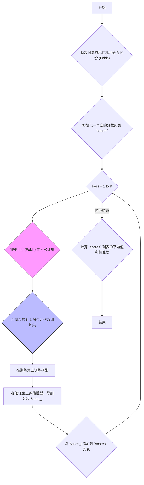

好的，同学！欢迎来到新一节的课程。

在之前的学习中，我们已经探讨了模型的“两大敌人”——欠拟合与过拟合，也掌握了像“正则化”这样的“武器”来对抗它们。我们还学会了用“学习曲线”来“诊断”模型的健康状况。

但这里有一个关键问题：我们所有的诊断和评估，都依赖于一次简单的 `train_test_split`。这样做真的可靠吗？万一我们那一次分割，碰巧分出了一份特别“简单”的测试集，导致模型得分虚高，我们岂不是会错误地认为一个过拟合的模型是好模型？反之亦然。

今天，我们就来学习一种更严谨、更可靠的模型评估方法，它能有效避免这种“运气”成分。让我们开始吧！

### 1. 问题引入

想象一下，你训练了一个图像分类模型，用来识别图片中的猫和狗。你按照常规操作，将1000张图片分为800张训练集和200张测试集。

-   **第一次运行**: `train_test_split(random_state=0)`，模型在测试集上达到了95%的准确率。你非常高兴，准备向老板汇报。
-   **第二次运行**: 同事想复现你的结果，但他用了 `train_test_split(random_state=42)`。这次，模型准确率只有88%。
-   **第三次运行**: 另一个人不设置随机种子，每次运行结果都不一样，有时高，有时低。

现在问题来了：**到底哪个分数才是模型真实性能的可靠估计？** 95% 可能是因为测试集里的图片恰好都是模型“擅长”的简单样本。88% 则可能是因为测试集“碰巧”包含了很多模棱两可的困难样本。

依赖单次划分得到的评估结果，就像只考一次模拟考就去预测高考成绩一样，充满了偶然性。我们需要一个方法，让模型“多考几次”，综合评估它的平均水平和稳定性。这就是**交叉验证 (Cross-Validation)** 要解决的核心问题。

### 2. 核心思想与生活化类比

**核心思想**: 与其将数据一次性分为“训练集”和“测试集”，不如我们把数据集分成好几“份”（fold）。然后，我们进行多轮评估。在每一轮中，我们轮流选择其中一“份”作为测试集，剩下的所有“份”合并起来作为训练集。最后，将所有轮次的评估得分取平均值，得到一个更稳健的评估结果。

**生活化类比**: **“分科模拟考”**

这就像一位高中生准备高考。他不会只做一套数学模拟卷，然后就断定自己的数学水平。

一个更聪明的做法是：
1.  **准备多套试卷**: 找来5套不同年份、不同地区的数学模拟卷（相当于把数据集分成5份）。
2.  **轮流模考**: 
    *   **第一轮**: 用第1套卷子考试（测试集），同时复习其他4套卷子里的知识点（训练集）。
    *   **第二轮**: 用第2套卷子考试（测试集），复习第1, 3, 4, 5套卷子里的知识点（训练集）。
    *   **... 以此类推，直到第5轮。**
3.  **综合评估**: 考完5次后，他会得到5个分数（比如：135, 140, 132, 138, 130）。他会计算**平均分**（135分），这比任何单次考试成绩都更能代表他的真实水平。同时，他还能看到分数的**波动情况**（标准差），了解自己发挥的稳定性。

这个“分科模拟考”的过程，就是最常见的交叉验证方法——**K折交叉验证 (K-Fold Cross-Validation)** 的精髓。

### 3. 最小可运行示例

让我们用代码来实现这个“模拟考”过程。我们将使用 `scikit-learn` 这个强大的库，它已经为我们准备好了一切。这里我们使用最经典的 **5折交叉验证 (5-Fold CV)**。

```python
# 导入必要的库
import numpy as np
from sklearn.model_selection import KFold, cross_val_score
from sklearn.linear_model import LogisticRegression
from sklearn.datasets import make_classification

# --- 1. 准备数据 (就像准备复习资料和模拟试卷) ---
# 生成一个模拟的二分类数据集
# X: 特征 (学生的知识储备)
# y: 标签 (题目的答案)
X, y = make_classification(
    n_samples=100,      # 100道练习题
    n_features=20,      # 每道题涉及20个知识点
    n_informative=10,
    n_redundant=5,
    n_classes=2,
    random_state=42     # 保证每次生成的数据都一样，便于复现
)

# --- 2. 定义模型 (确定要评估的学生) ---
# 我们选择逻辑回归模型
model = LogisticRegression(solver='liblinear')

# --- 3. 设置交叉验证策略 (制定模拟考计划) ---
# KFold 会将数据分成 k 份，这里 k=5
# shuffle=True: 在划分前打乱数据，避免数据有序导致划分不均
# random_state=42: 保证每次打乱和划分的方式都一样
kf = KFold(n_splits=5, shuffle=True, random_state=42)

# --- 4. 执行交叉验证并获取分数 (开始多轮模拟考) ---
# cross_val_score 是一个便捷函数，它会自动完成整个循环过程
# cv=kf: 告诉它使用我们上面定义的5折划分策略
# scoring='accuracy': 指定评估指标为“准确率”
# 它会返回一个包含每次验证分数的列表
scores = cross_val_score(model, X, y, cv=kf, scoring='accuracy')

# --- 5. 分析结果 (分析考试成绩) ---
print(f"交叉验证的5次准确率得分: {scores}")
print(f"平均准确率: {scores.mean():.4f}")
print(f"准确率标准差: {scores.std():.4f}")

# --- 预期输出 ---
# 交叉验证的5次准确率得分: [0.85 0.8  0.8  0.75 0.9 ]
# 平均准确率: 0.8200
# 准确率标准差: 0.0506
```

**代码解读**:
*   `make_classification`: 创建了一个虚拟的数据集，方便我们快速演示。
*   `LogisticRegression`: 这是我们要评估的模型。
*   `KFold(n_splits=5, ...)`: 这就是我们“分科模拟考”的核心，它定义了如何将数据分成5份并进行轮换。
*   `cross_val_score(...)`: `scikit-learn` 的一个高级函数，它像一个“自动监考老师”，帮我们完成了所有5轮的训练、测试和评分工作。
*   **结果分析**: 我们得到的不再是单一的分数，而是一个包含5个分数的数组。平均值 `0.8200` 是对模型性能更可靠的估计。标准差 `0.0506` 告诉我们模型在不同数据子集上的表现稳定性如何，标准差越小，说明模型性能越稳定。

### 4. 原理剖析

`cross_val_score` 在背后到底做了什么？让我们用一个流程图和分步讲解来揭开它的神秘面纱。

#### K-Fold 交叉验证流程图



#### 分步讲解

1.  **数据分组 (Partition)**:
    *   首先，获取整个数据集 `(X, y)`。
    *   如果设置了 `shuffle=True`，先将数据随机打乱。这非常重要，可以防止数据因原始排序（例如，按类别排序）而导致切分出有偏差的数据份。
    *   然后，像切蛋糕一样，将数据平均切成 `K` 份。例如，100个样本分成5份，每份20个样本。

2.  **循环验证 (Iteration)**:
    *   **第1轮**:
        *   **验证集**: 第1份数据 (样本1-20)。
        *   **训练集**: 第2, 3, 4, 5份数据合并 (样本21-100)。
        *   模型在训练集上训练，在验证集上评估，得到分数 `score_1`。
    *   **第2轮**:
        *   **验证集**: 第2份数据 (样本21-40)。
        *   **训练集**: 第1, 3, 4, 5份数据合并 (样本1-20, 41-100)。
        *   重新初始化一个**全新的模型**，在新的训练集上训练，在验证集上评估，得到分数 `score_2`。
    *   ... 这个过程会一直重复 `K` 次，直到每一份数据都扮演过一次验证集。

3.  **性能汇总 (Aggregation)**:
    *   当 `K` 轮循环全部结束后，我们会得到一个包含 `K` 个分数的列表 `[score_1, score_2, ..., score_K]`。
    *   **最终评估分数**: 通常计算这个列表的**平均值**，作为模型性能的最终估计。
    *   **稳定性评估**: 计算这个列表的**标准差**，它可以衡量模型在不同数据子集上性能的波动性。如果标准差很大，说明模型可能对数据的划分方式很敏感，性能不稳定。

#### 时间/空间复杂度
*   **时间复杂度**: 约为 `K * T`，其中 `T` 是在 `(K-1)/K` 比例的数据上训练一次模型所需的时间。简单来说，你需要付出训练 `K` 次模型的计算成本。
*   **空间复杂度**: 非常低，只需要额外的空间来存储 `K` 个评估分数。

### 5. 常见误区与优化点

交叉验证虽然强大，但如果使用不当，也会掉入陷阱。

**误区1：数据泄露 (Data Leakage) — 最致命的错误！**
*   **错误操作**: 在交叉验证**之前**，对**整个**数据集进行了预处理（如标准化 `StandardScaler`、缺失值填充 `SimpleImputer`）。
*   **为什么错**: 这意味着在训练时，模型通过预处理步骤“偷看”到了验证集的信息。例如，计算标准化所需的均值和标准差时，你使用了本应完全未知的验证集数据。这会导致评估分数过于乐观，与模型在真实新数据上的表现严重不符。
*   **正确做法**: 使用 `scikit-learn` 的 **Pipeline**！将预处理步骤和模型本身打包成一个管道。然后，将整个 `pipeline` 对象传入 `cross_val_score`。这样，在交叉验证的每一轮中，预处理步骤（如 `fit_transform`）都**只**会在当前的训练集上进行，然后用同样的预处理规则（`transform`）应用到验证集上，完美避免数据泄露。

**优化点1：分层交叉验证 (Stratified Cross-Validation)**
*   **问题场景**: 在分类问题中，如果某个类别的样本非常少（类别不均衡），常规的`KFold`随机划分可能会导致某个验证集中完全没有这个少数类的样本，这会让评估和训练过程产生严重偏差。
*   **解决方案**: 使用 `StratifiedKFold` 代替 `KFold`。`StratifiedKFold` 在划分数据时，会确保每一份（fold）中的类别比例与原始数据集中**完全相同**。
*   **实践建议**: 对于任何分类问题，**优先使用 `StratifiedKFold`** 是一个安全且专业的选择。`cross_val_score` 函数很智能，如果它检测到你传入的是一个分类器模型，它会默认使用 `StratifiedKFold`。

### 6. 拓展应用

交叉验证不仅仅是模型评估的“黄金标准”，它更是许多高级机器学习任务的基石。

1.  **超参数调优 (Hyperparameter Tuning)**:
    *   你的模型有很多“旋钮”可以调，比如逻辑回归的正则化强度 `C`，或者决策树的最大深度 `max_depth`。哪个值最好？
    *   你可以对每个候选值（例如 `C` in `[0.1, 1, 10]`）都运行一次完整的交叉验证，然后选择那个**平均交叉验证分数最高**的参数值。`GridSearchCV` 和 `RandomizedSearchCV` 等工具就是自动完成这个过程的。

2.  **模型选择 (Model Selection)**:
    *   面对一个问题，你不知道是用逻辑回归、支持向量机（SVM）还是随机森林更好。
    *   你可以对这三个模型分别进行交叉验证，得到它们各自可靠的性能分数。然后，选择那个交叉验证分数最高的模型作为你的最终方案。

3.  **特征选择 (Feature Selection)**:
    *   你有100个特征，但怀疑其中很多是无用甚至有害的。
    *   你可以尝试不同的特征子集，用交叉验证来评估每个子集下模型的表现，从而找到那个能让模型性能最大化的最优特征组合。

### 7. 总结要点

让我们快速回顾一下交叉验证的精华：

*   **核心目的**: 解决单次 `train_test_split` 评估结果的**偶然性**，提供一个更**稳定、可靠**的模型性能估计。
*   **工作原理 (K-Fold)**: 将数据分为 `K` 份，进行 `K` 轮验证，每轮用不同的份作验证集，其余作训练集，最后对 `K` 次结果取平均。
*   **关键优势**: 充分利用了所有数据，每个样本都被用作过一次验证数据，得到的性能评估更为稳定（即对模型真实性能的估计值的方差更小），并且可以量化其波动性，因此更具说服力。
*   **首要警惕**: **数据泄露**！始终将数据预处理步骤放在交叉验证的**循环内部**，最佳实践是使用 `Pipeline`。
*   **重要变体**: 对于分类问题，特别是类别不均衡时，应使用 `StratifiedKFold` 来保持各类别比例。
*   **核心应用**: 模型评估、超参数调优、模型选择。

### 8. 思考与自测

现在，你已经掌握了交叉验证的原理和实践。来挑战一个任务，检验一下你的学习成果吧！

**任务**:
请修改第3部分的 "最小可运行示例" 代码，以应对一个更真实的情况：**类别不均衡**。

1.  在 `make_classification` 中，添加参数 `weights=[0.9, 0.1]` 来创建一个类别极不均衡的数据集（90%是类别0，10%是类别1）。
2.  将交叉验证策略从 `KFold` 改为 `StratifiedKFold`。
3.  思考并回答：在这种不均衡的情况下，为什么从 `KFold` 切换到 `StratifiedKFold` 是至关重要的？如果不切换，可能会发生什么最坏的情况？

动手试试看吧！通过解决这个问题，你将对交叉验证的理解更上一层楼。
