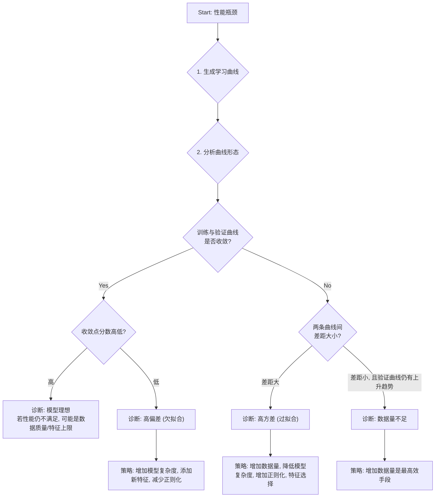

好的，专家。我们将进入诊断模式。

本次诊断的目标是：系统化地运用学习曲线，精确判断模型性能瓶颈的根源，究竟是偏差（欠拟合）、方差（过拟合），还是数据量不足。我们将遵循一套严谨的、可复现的诊断流程。

---

### **学习曲线诊断工作台**

#### **1. 问题引入 (典型症状)**

**初始报告:** 模型在交叉验证中的表现已陷入停滞。初步尝试增加更多训练数据，但验证集分数（Validation Score）提升微乎其微。同时，尝试使用更复杂的模型（如增加树的深度或增加网络层数）虽然能显著提高训练集分数（Training Score），但验证集分数要么提升不大，要么甚至开始下降。

**核心困境:** 当前无法确定下一步优化的最佳方向。是应该继续投入成本获取更多数据，还是应该专注于特征工程，或是调整模型结构与正则化强度？任何一个错误决策都可能导致资源浪费。

#### **2. 核心思路与类比**

**诊断哲学：假设驱动的排错 (Hypothesis-Driven Troubleshooting)**

我们将把模型调优过程类比为**“医生问诊”**。直接根据症状（验证分数低）就开药（随机调参）是极其危险的。我们的方法是：

1.  **望 (Observe):** 观察最终的性能指标，这是表层症状。
2.  **闻 (Listen):** 倾听模型在“学习过程”中的表现。学习曲线就是模型的“心电图”或“生长曲线”，它记录了模型从少量数据到大量数据学习时的“健康状况”。
3.  **问 (Inquire):** 针对曲线形态，提出关于数据质量、模型复杂度的具体问题。
4.  **切 (Diagnose & Prescribe):** 基于曲线的明确形态，诊断出是高偏差、高方差还是其他问题，并开出精确的“处方”。

学习曲线的核心价值在于，它将“偏差”和“方差”这两个抽象概念，可视化为两条曲线的**收敛行为**与**相对差距**。

#### **3. 最小示例 (最快复现)**

为了精准复现诊断情景，我们将构建一个受控环境。我们将使用`scikit-learn`生成一个非线性关系的合成数据集，并故意使用一个过于简单的模型（高偏差）和一个过于复杂的模型（高方差）来观察学习曲线的典型形态。

```python
# code_lang: python

import numpy as np
import matplotlib.pyplot as plt
from sklearn.model_selection import learning_curve
from sklearn.pipeline import make_pipeline
from sklearn.preprocessing import PolynomialFeatures
from sklearn.linear_model import LinearRegression

# 1. 环境设定：生成一个可控的、有非线性关系的数据集
def generate_data(n_samples=100):
    """生成 y = X^2 + noise 的数据"""
    np.random.seed(42)
    X = np.sort(np.random.rand(n_samples))
    y = np.cos(1.5 * np.pi * X) + np.random.randn(n_samples) * 0.1
    return X[:, np.newaxis], y

X, y = generate_data()

# 2. 诊断工具：定义学习曲线绘制函数
def plot_learning_curve(estimator, title, X, y, ylim=None, cv=None, n_jobs=-1, train_sizes=np.linspace(.1, 1.0, 5)):
    """
    一个标准化的学习曲线绘制函数。
    """
    plt.figure(figsize=(10, 6))
    plt.title(title)
    if ylim is not None:
        plt.ylim(*ylim)
    plt.xlabel("Training examples")
    plt.ylabel("Score (R^2)")
    
    train_sizes, train_scores, test_scores = learning_curve(
        estimator, X, y, cv=cv, n_jobs=n_jobs, train_sizes=train_sizes, scoring='r2')
    
    train_scores_mean = np.mean(train_scores, axis=1)
    train_scores_std = np.std(train_scores, axis=1)
    test_scores_mean = np.mean(test_scores, axis=1)
    test_scores_std = np.std(test_scores, axis=1)
    
    plt.grid()
    
    plt.fill_between(train_sizes, train_scores_mean - train_scores_std,
                     train_scores_mean + train_scores_std, alpha=0.1,
                     color="r")
    plt.fill_between(train_sizes, test_scores_mean - test_scores_std,
                     test_scores_mean + test_scores_std, alpha=0.1, color="g")
    
    plt.plot(train_sizes, train_scores_mean, 'o-', color="r",
             label="Training score")
    plt.plot(train_sizes, test_scores_mean, 'o-', color="g",
             label="Cross-validation score")
    
    plt.legend(loc="best")
    return plt

# 3. 复现典型场景
# 场景A: 高偏差 (欠拟合) - 使用简单线性模型拟合非线性数据
estimator_bias = LinearRegression()
plot_learning_curve(estimator_bias, "Learning Curve (High Bias)", X, y, cv=5)

# 场景B: 高方差 (过拟合) - 使用高阶多项式模型
estimator_variance = make_pipeline(PolynomialFeatures(degree=20), LinearRegression())
plot_learning_curve(estimator_variance, "Learning Curve (High Variance)", X, y, cv=5, ylim=(-0.1, 1.1))

plt.show()

```
**预期输出:**
*   **图 A (高偏差):** 训练分数和验证分数会很快收敛到一个较低的水平，且两者之间的差距很小。增加数据量后，曲线几乎是平的，分数不再提升。
*   **图 B (高方差):** 训练分数会非常高，接近完美。验证分数则远低于训练分数，两者之间存在巨大差距。随着数据量增加，这个差距可能会缓慢缩小，验证分数也会缓慢提升。

#### **4. 原理剖析 (诊断流程)**

我们采用一个结构化的清单来执行诊断。

##### **诊断流程图 (Mermaid)**


##### **排错清单 (Steps Checklist)**

**Phase 1: 信息收集 (Information Gathering)**

*   [ ] **生成学习曲线:** 使用上述代码或类似工具，针对当前模型和数据集，生成训练集和交叉验证集的学习曲线。
    *   **关键参数:** 确保`train_sizes`覆盖了从少量样本到接近全部样本的范围，以便观察趋势。
    *   **评分指标:** 使用项目相关的评估指标（如`R^2`, `F1-score`, `AUC`）。
*   [ ] **观察最终收敛点:** 检查当训练样本数最大时，两条曲线的最终得分（`score`）水平。
*   [ ] **观察曲线间隙 (Gap):** 评估在整个训练过程中，特别是样本数较大时，训练曲线与验证曲线之间的垂直距离。
*   [ ] **观察曲线斜率 (Slope):** 评估随着训练样本数的增加，验证曲线是否仍有明显的上升趋势。

**Phase 2: 原因假设 (Hypothesis Generation based on Patterns)**

*   [ ] **假设1: 高偏差 (High Bias / Underfitting)**
    *   **证据:** 训练曲线和验证曲线很早就收敛了，并且收敛到一个较低的分数。两条曲线之间的间隙非常小。
    *   **解读:** 模型过于简单，无法捕捉数据的底层规律。即使给它再多数据，它也学不会，因为其表达能力已达上限。
*   [ ] **假设2: 高方差 (High Variance / Overfitting)**
    *   **证据:** 训练曲线分数很高，而验证曲线分数明显较低。两者之间存在一个显著且持续的“鸿沟”。
    *   **解读:** 模型过于复杂，学习了训练数据中的噪声而非信号。它对新数据的泛化能力很差。增加数据量通常会使验证曲线缓慢上升，并缩小差距。
*   [ ] **假设3: 数据量不足 (Insufficient Data)**
    *   **证据:** 这是一个高方差的特例。两条曲线差距较大，但最关键的特征是：随着样本量增加，验证曲线仍然呈现出明显的、未趋于平缓的上升趋势。
    *   **解读:** 模型有潜力学得更好，但目前的数据量不足以让它充分学习并收敛。增加数据是当前最有效的解决方案。
*   [ ] **假设4: 模型理想 (Ideal Fit)**
    *   **证据:** 训练曲线和验证曲线收敛到一个较高的分数，且两者之间的间隙很小。
    *   **解读:** 当前模型复杂度和数据量达到了一个良好的平衡。如果此时性能仍不达标，问题可能出在特征质量或数据本身的信噪比上。

**Phase 3: 逐一验证与实施 (Verification & Action)**

*   [ ] **如果诊断为高偏差:**
    *   **执行:** 增加模型复杂度（例如，使用更高阶的多项式、增加决策树深度、增加神经网络的层/单元数）。
    *   **执行:** 进行特征工程，添加更能描述问题的新特征。
    *   **执行:** 减小正则化强度（降低`C`值，减小`alpha`值）。
    *   **验证:** 重新绘制学习曲线，观察收敛点是否提高，以及是否开始出现方差。
*   [ ] **如果诊断为高方差:**
    *   **执行:** **获取更多训练数据** (如果可行，这通常是最佳策略)。
    *   **执行:** 降低模型复杂度（与高偏差的操作相反）。
    *   **执行:** 增加正则化强度。
    *   **执行:** 进行特征选择，移除冗余或无关的特征。
    *   **验证:** 重新绘制学习曲线，观察曲线间的间隙是否缩小。
*   [ ] **如果诊断为数据量不足:**
    *   **执行:** 集中资源获取更多、更多样化的数据。
    *   **验证:** 数据增加后，重新绘制学习曲线，确认验证分数是否如预期般提升并开始收敛。

#### **5. 常见误区**

1.  **头痛医头：盲目增加数据。** 最常见的误区是认为“数据是万能的”。如果学习曲线明确指向高偏差，投入巨大成本去收集更多数据将是完全无效的。诊断必须先行。
2.  **只看终点，不看过程。** 只关心最终的交叉验证分数，而忽略了学习曲线揭示的“为什么”达到这个分数。这会导致你无法区分一个“因数据不足而表现不佳的高方差模型”和一个“本身能力不足的高偏差模型”。
3.  **忽略评分指标的尺度。** 在解释“高分”或“低分”时，必须结合具体业务。在某些任务中，80%的准确率可能已经接近理论上限（高贝叶斯错误率），此时即使曲线形态像高偏差，也可能意味着问题本身就很难，而非模型问题。

#### **6. 拓展应用 (预防措施)**

*   **集成到模型开发流水线:** 将学习曲线的生成和分析作为模型评估的标准化步骤。在每次重大模型迭代（如尝试新架构或新特征集）后，都自动生成学习曲线报告，作为决策依据。
*   **作为模型选型的关键依据:** 在对比不同算法（如SVM vs. 随机森林）时，学习曲线可以揭示哪种模型对数据量的依赖更小，或者哪种模型的“容量”更适合当前的数据规模。
*   **监控数据漂移的信号:** 在生产环境中，如果模型的性能随时间下降，可以抽取新数据重新绘制学习曲线。如果发现模型在新数据上表现出更高方差的形态，这可能是数据分布发生变化的信号。

#### **7. 总结要点**

*   **根本原因:** 模型的泛化错误主要由偏差和方差构成。优化方向的冲突根植于此。
*   **诊断思路:** 学习曲线是一种非侵入式的诊断工具，它通过可视化模型在不同数据规模下的学习能力，将偏差/方差问题从抽象理论转化为具体的图形模式。
*   **标准流程:**
    1.  **观察症状：** 发现性能瓶颈。
    2.  **执行诊断：** 生成学习曲线。
    3.  **分析图形：** 识别四种典型模式（高偏、高方、缺数据、理想）。
    4.  **对症下药：** 根据诊断结果采取最直接有效的优化措施。

#### **8. 思考与自测**

**问题：** 如果在你的诊断中，你观察到**训练曲线本身（红线）就有许多剧烈的抖动，并且不是单调递增的**，而验证曲线（绿线）同样不稳定。这超出了我们讨论的四种典型模式，你的排查思路会有什么不同？

**思路引导：**
1.  **稳定性的质疑:** 经典的偏差/方差分析假设了训练过程本身是相对稳定的。训练曲线的不稳定首先挑战了这个假设。
2.  **可能的原因假设:**
    *   **优化算法不稳定:** 如果是梯度下降类算法，可能是学习率过高，导致优化过程在最优解附近震荡而无法收敛。
    *   **数据划分的随机性:** 如果每次交叉验证的折（fold）划分差异巨大，或者小批量（mini-batch）数据的随机性过强，可能导致每次测量的分数波动剧烈。特别是当数据集较小或存在极端异常值时。
    *   **模型本身的随机性:** 某些模型（如未设置随机种子的决策树、某些初始化方式的神经网络）本身就带有随机性，这会直接反映在分数上。
3.  **下一步诊断步骤:**
    *   **固定随机种子:** 在所有可能的地方（数据划分、模型初始化等）固定`random_state`，看抖动是否消失。如果消失，说明是随机性问题。
    *   **调整优化器参数:** 如果是神经网络或GBDT等，尝试降低学习率，或使用更稳定的优化器（如Adam）。
    *   **检查数据预处理:** 确保数据归一化等步骤在交叉验证的每一折内都正确执行，防止数据泄露或尺度不一。
    *   **增加CV折数:** 增加交叉验证的折数（如从5折增加到10折）或使用重复交叉验证（`RepeatedKFold`）可以平滑评估结果，看清整体趋势。

这个异常现象表明，问题可能不是出在偏差/方差权衡上，而是更底层的**训练/评估过程的稳定性**上。必须先解决稳定性问题，才能进行有效的偏差/方差诊断。