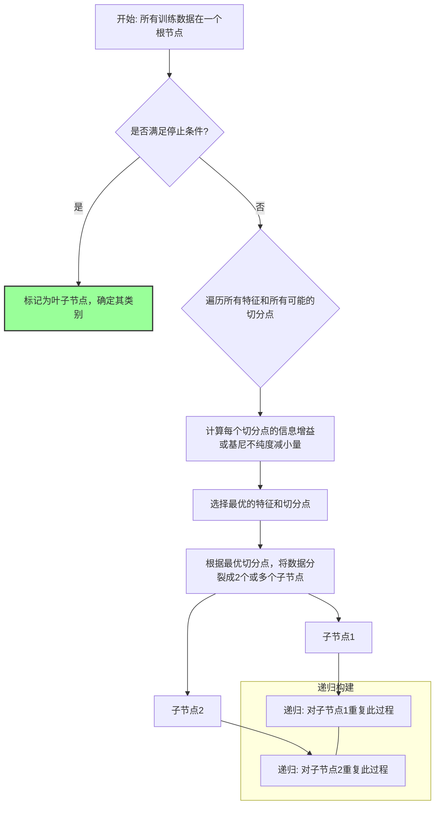

好的，老师来了！

同学们好，我们已经学习了线性回归、逻辑回归这些强大的模型。它们在很多场景下表现优异，但它们的核心思想大多是寻找一个“决策边界”，比如一条直线或一个超平面。今天，我们要学习一种思路完全不同的模型——**决策树 (Decision Trees)**。它不像在数据中画一条线，而更像是在构建一个决策流程图，这让它的每一个判断都变得清晰可见。

准备好了吗？让我们一起揭开决策树的神秘面纱，看看它是如何通过一系列简单的问题来做出复杂决策的。

---

### 1. 问题引入

想象一下，你是一位银行的信贷审批员。每天，你都要根据客户的申请材料来决定是否批准一笔贷款。你的桌上放着一份申请表，上面有申请人的年龄、是否有工作、名下是否有房产、以及过往的信用记录。

你并不会用一个复杂的数学公式来计算一个“批准分数”，而是会进行一系列的判断，就像下面这样：

*   **首先**，我看这个客户的信用记录，如果是“差”，那风险太高了，直接拒绝。
*   **如果**信用记录是“好”或“一般”，我再看他名下有没有房产。
*   **如果**他有房产，那还款能力有保障，基本可以批准。
*   **如果**他没有房产，我最后再看他有没有一份稳定的工作。有工作，就批准；没有，就拒绝。

这个审批流程，其实就是一棵决策树。我们通过一系列“是/否”的问题，将复杂的决策过程分解成一连串简单的、可解释的步骤，最终抵达一个结论（批准或拒绝）。机器学习中的决策树算法，就是让计算机自动地、从数据中学习出这样一套高效的决策规则。

### 2. 核心思想与生活化类比

**核心思想**: 决策树的核心策略是 **“分而治之” (Divide and Conquer)**。它从包含所有数据的“根节点”开始，通过一个“贪心”的策略，每次都选择**当前看来最优的特征**来对数据进行划分，目的是让划分后的数据子集尽可能地“纯净”（即每个子集中的样本都属于同一类别）。这个过程不断重复，直到满足某个停止条件，就形成了一棵树状的决策模型。

**生活化类比**: 这个过程就如同我们玩 **“20个问题”** 的游戏。

假设你的朋友心里想了一个动物，比如“猫”。你的目标是在20个问题内猜出来。

*   你不会一上来就问：“是猫吗？”。这效率太低了。
*   你可能会先问一个能最大程度排除可能性的问题，比如：“它是哺乳动物吗？”。这个问题一下子就把鱼类、鸟类、昆虫等都排除了。
*   朋友回答“是”之后，你不会再问和哺乳动物无关的问题。你会在剩下的可能性中继续寻找最优问题，比如：“它是食肉动物吗？”。
*   ...就这样，你每问一个问题，都在对可能的答案进行一次“分裂”，直到最后将范围缩小到只剩一个答案。

决策树构建的过程，就是让算法自己学会问出这些“好问题”的顺序和内容。什么样的问题是“好问题”？就是那个能让数据的“不确定性”下降得最快的问题。

### 3. 最小可运行示例

让我们用代码来构建一个上面提到的贷款审批决策树。我们会用 `scikit-learn` 这个强大的库，你会发现构建和可视化一个决策树模型是如此简单。

```python
# 引入必要的库
import pandas as pd
from sklearn.tree import DecisionTreeClassifier, plot_tree
import matplotlib.pyplot as plt

# 1. 准备数据
# 我们手动创建一个小型数据集，模拟贷款申请
# 特征：'Has_Job', 'Owns_House', 'Credit_Rating'
# 目标：'Loan_Approved' (1: Yes, 0: No)
data = {
    'Has_Job': [1, 1, 0, 0, 1, 1, 0, 1],
    'Owns_House': [0, 1, 0, 1, 0, 1, 0, 1],
    # 注意：我们将信用评级映射为数值。由于决策树通过寻找分裂点（如 Credit_Rating <= 1.5）来工作，
    # 这种保留了顺序关系的数值编码是有效的，模型可以自动学习到最佳分割阈值。
    'Credit_Rating': [1, 2, 1, 1, 0, 2, 0, 2], # 0: Bad, 1: Average, 2: Good
    'Loan_Approved': [0, 1, 0, 1, 0, 1, 0, 1]
}
df = pd.DataFrame(data)

# 分离特征 (X) 和目标 (y)
X = df[['Has_Job', 'Owns_House', 'Credit_Rating']]
y = df['Loan_Approved']

print("--- 原始数据 ---")
print(df)
print("\n")

# 2. 创建并训练决策树模型
# criterion='gini' -> 使用基尼不纯度作为分裂标准
# max_depth=3 -> 设置树的最大深度为3，防止过拟合
# random_state=42 -> 保证每次运行结果一致
model = DecisionTreeClassifier(criterion='gini', max_depth=3, random_state=42)

# 训练模型
model.fit(X, y)

print("--- 模型训练完成 ---")
print(f"模型学到的特征重要性: {model.feature_importances_}\n")

# 3. 进行预测
# 假设有一个新申请人: 没有工作(0), 有房子(1), 信用良好(2)
new_applicant = [[0, 1, 2]]
prediction = model.predict(new_applicant)
proba = model.predict_proba(new_applicant)

print(f"--- 新申请人预测 ---")
print(f"申请人数据: {new_applicant}")
print(f"预测结果: {'批准' if prediction[0] == 1 else '拒绝'}")
print(f"预测概率 (拒绝, 批准): {proba}\n")

# 4. 可视化决策树
# 这是决策树最强大的地方：可解释性
plt.figure(figsize=(12, 8))
plot_tree(model, 
          feature_names=X.columns, 
          class_names=['Refused', 'Approved'], 
          filled=True, 
          rounded=True)
plt.title("贷款审批决策树可视化")
plt.show()

```

**预期输出:**

```text
--- 原始数据 ---
   Has_Job  Owns_House  Credit_Rating  Loan_Approved
0        1           0              1              0
1        1           1              2              1
2        0           0              1              0
3        0           1              1              1
4        1           0              0              0
5        1           1              2              1
6        0           0              0              0
7        1           1              2              1


--- 模型训练完成 ---
模型学到的特征重要性: [0.         0.57142857 0.42857143]


--- 新申请人预测 ---
申请人数据: [[0, 1, 2]]
预测结果: 批准
预测概率 (拒绝, 批准): [[0. 1.]]

```

<!-- [此处应插入运行上述代码后生成的决策树可视化图像] -->

这张图就是我们模型学到的决策规则！你可以清晰地看到，模型首先检查 `Owns_House`，然后根据情况检查 `Credit_Rating`，完全符合我们对一个决策过程的直观理解。

### 4. 原理剖析

那么，计算机是如何自动“想”出这棵树的呢？它遵循一个清晰的、可重复的构建流程。



**分步讲解:**

1.  **开始**: 所有的训练数据都在一个节点，我们称之为“根节点”。
2.  **寻找最佳分裂点**: 这是算法的核心。
    *   算法会遍历**每一个特征**（比如 `Has_Job`, `Owns_House`）。
    *   对于每一个特征，它会尝试所有**可能的分割点**（比如 `Credit_Rating` < 1, `Credit_Rating` < 2）。
    *   它需要一个指标来衡量哪个分割是“最佳”的。这个指标就是**不纯度 (Impurity)** 的下降程度。一个节点越“纯”，意味着它里面的数据类别越统一。我们的目标是让分裂后的子节点尽可能地纯。
3.  **衡量不纯度的指标 (math_depth: light)**
    *   **基尼不纯度 (Gini Impurity)**: 这是 `scikit-learn` 的默认选项。它衡量了从一个数据集中随机抽取两个样本，其类别标签不一致的概率。公式为：
        $$Gini(p) = 1 - \sum_{i=1}^{C} p_i^2$$
        其中，$p_i$ 是节点中类别 $i$ 的样本所占的比例，$C$ 是类别总数。
        *   如果一个节点是“纯”的（所有样本都属于一个类别），比如 $p_1=1, p_2=0$，那么 $Gini = 1 - (1^2 + 0^2) = 0$。
        *   如果一个节点是“最不纯”的（类别均匀分布），比如一个二分类问题中 $p_1=0.5, p_2=0.5$，那么 $Gini = 1 - (0.5^2 + 0.5^2) = 0.5$。
    *   **信息增益 (Information Gain)**: 基于**熵 (Entropy)** 的概念。熵衡量的是系统的不确定性或混乱程度。信息增益就是父节点的熵减去所有子节点熵的加权平均。我们选择信息增益最大的分裂方式。
        $$Entropy(p) = -\sum_{i=1}^{C} p_i \log_2(p_i)$$
4.  **分裂**: 算法选择那个能让“基尼不纯度”下降最多（或者说“信息增益”最大）的特征和分割点，来分裂当前节点，生成新的子节点。
5.  **递归**: 对每一个新的子节点，重复第2步到第4步，直到...
6.  **停止条件 (Stopping Conditions)**: 递归不能无限进行下去，否则树会变得异常复杂。停止的条件通常是：
    *   节点已经“纯净”（所有样本都属于同一类别）。
    *   树达到了预设的**最大深度 (max_depth)**。
    *   节点中的样本数量少于一个预设的阈值 (**min_samples_split**)。
    *   分裂后无法带来足够的不纯度下降。

**时间/空间复杂度**: 

*   **训练时间复杂度**: 训练时间复杂度主要取决于建树过程。对于一个含有 $N_{samples}$ 个样本的平衡树，其深度约为 $\log(N_{samples})$。在构建过程中，算法需要在每个节点上遍历所有特征和样本来寻找最佳分裂点，因此总的计算量大致与 $N_{features} \times N_{samples} \times \log(N_{samples})$ 成正比。
*   **预测时间复杂度**: $O(\log(N_{samples}))$ 或 $O(depth)$。预测非常快，只需要顺着树从根走到叶子。
*   **空间复杂度**: $O(N_{nodes})$，取决于树有多少个节点。

### 5. 常见误区与优化点

**最大误区：过拟合 (Overfitting)**

决策树有一个致命的弱点：如果不对其生长加以限制，它会倾向于长得非常深、非常繁茂，试图完美地拟合训练数据中的每一个样本。这会导致它在训练集上表现完美（正确率100%），但在新的、未见过的数据（测试集）上表现很差。这棵“完美”的树学习到的不是普适规律，而是训练数据中的噪声。

**如何解决？——剪枝 (Pruning)**

剪枝是对抗过拟合的主要手段，就像园丁修剪树木，让它长得更健康、更结实。

1.  **预剪枝 (Pre-pruning)**: 在树的生长过程中就进行限制。这是最常用和最简单的方法。
    *   `max_depth`: 限制树的最大深度。这是最有效的参数之一。
    *   `min_samples_split`: 设置一个节点必须包含至少多少样本才能被分裂。
    *   `min_samples_leaf`: 设置一个叶子节点必须包含至少多少样本。
    *   `max_features`: 在寻找最佳分裂时，只考虑一部分特征。

2.  **后剪枝 (Post-pruning)**: 先让树完全生长，然后再自底向上地剪掉一些“价值不大”的枝叶。`scikit-learn` 中的 `DecisionTreeClassifier` 提供了 `ccp_alpha` (Cost Complexity Pruning) 参数来实现后剪枝，这是一种更高级的策略。

**优化点**: 

*   对于初学者，**首先应该调整 `max_depth`**。通过交叉验证找到一个合适的深度，往往能在模型的复杂度和泛化能力之间取得很好的平衡。
*   决策树对特征的缩放不敏感（因为它只关心分割点），所以通常**不需要进行标准化或归一化**，这是它相比于SVM等模型的一个便利之处。

### 6. 拓展应用

决策树本身就是一个强大的模型，但它更重要的角色是作为更高级、更强大的**集成模型 (Ensemble Models)** 的基石。

1.  **回归问题 (Decision Tree Regressor)**: 决策树不仅能分类，也能做回归。它的结构完全一样，只是分裂标准和叶节点输出不同。
    *   **分裂标准**: 不再使用基尼不纯度，而是使用**均方误差 (MSE)** 或**平均绝对误差 (MAE)**。目标是让分裂后的子节点内，样本真实值的方差最小。
    *   **叶节点输出**: 不再是类别，而是该叶节点内所有样本目标值的**平均值**。

2.  **随机森林 (Random Forest)**: 同时构建很多棵不同的决策树（每棵树只看一部分数据和一部分特征），然后通过“投票”的方式进行决策。这极大地降低了单棵决策树过拟合的风险，是目前最流行、最稳健的模型之一。

3.  **梯度提升决策树 (GBDT, XGBoost, LightGBM)**: 同样是构建很多棵树，但不是并行的。它采用一种“接力”的方式，后一棵树主要学习前面所有树加起来的残差（预测错误），不断地优化和逼近最终结果。这类模型在各种数据科学竞赛中占据统治地位。

4.  **特征重要性分析**: 训练好的决策树可以告诉我们哪些特征在决策过程中被使用的次数更多、带来的不纯度下降更显著。这对于业务理解和特征选择非常有价值。

### 7. 总结要点

| 特性 | 描述 |
| :--- | :--- |
| **核心思想** | 分而治之，通过贪心算法，递归地寻找最优特征进行分裂。 |
| **模型类型** | 非线性、非参数模型。 |
| **最大优点** | **可解释性强**（白盒模型），可以可视化决策规则，易于理解和沟通。 |
| **最大缺点** | 容易**过拟合**，模型不够稳定（数据的微小变动可能导致树结构剧变）。 |
| **关键参数** | `max_depth`, `min_samples_split` 等用于**预剪枝**的参数。 |
| **适用场景** | 需要模型有强解释性的场景（如金融风控、医疗诊断）、作为更强大的集成模型的基石。 |
| **数据预处理** | 对特征缩放不敏感，但无法处理缺失值。 |

### 8. 思考与自测

现在你已经掌握了决策树的基本原理和实现。让我们来挑战一个实际问题，加深你的理解。

**任务**:

1.  在我们的贷款审批数据中，增加一个新的特征 `Income_Level` (0: Low, 1: Medium, 2: High)。
    ```python
    # 假设新的数据如下
    'Income_Level': [0, 2, 1, 1, 2, 2, 0, 1]
    ```
2.  将这个新特征加入到 `X` 中，重新训练决策树模型。
3.  **观察并回答**:
    *   新的决策树是怎样利用 `Income_Level` 这个特征的？它是否成为了一个重要的决策节点？
    *   尝试将 `max_depth` 参数设置为 `1`，重新训练并可视化。这棵“树桩”选择了哪个特征作为唯一的决策依据？这说明了什么？

这个练习将帮助你直观地感受特征如何影响树的构建，以及 `max_depth` 是如何控制模型复杂度的。动手试试看吧，编程和实践是掌握算法的最好途径！