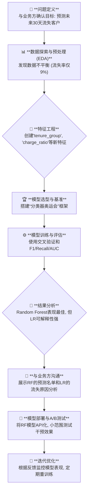

好的，请坐。让我们泡上一杯咖啡，我来给你讲一个关于“InnovateCloud”的故事。那是一家快速成长的SaaS公司，也是我职业生涯中一个相当经典的战役。这个故事，完美诠释了“**案例分析：使用多种分类器进行客户流失预测**”的精髓，远比教科书上的理论要来得生动和深刻。

---

### **1. 问题引入 (故事背景)**

那是在一个季度财报会议之后，空气中弥漫着一股紧张的气氛。CEO，一位名叫 David 的数据驱动型领导者，用激光笔指着屏幕上一条缓缓上扬的红线——“客户流失率”。“各位，”他沉声说道，“我们的获客成本在增加，但客户的‘水桶’却在漏水。上个季度，我们流失了将近15%的订阅用户，这正在吞噬我们的利润。我需要一个方案，一个能让我们从‘被动响应’变为‘主动干预’的方案。我需要知道，**谁**是下一个要离开的人，以及我们能在他们打包走人**之前**做些什么。”

这个任务，自然就落到了我们数据科学团队的肩上。挑战很明确：
*   **业务挑战**: 客户流失悄无声息，当客户点击“取消订阅”时，一切为时已晚。我们需要一个“预警系统”。
*   **技术目标**: 构建一个高精度的预测模型，提前识别出具有高流失风险的客户群体，并将名单交给客户成功团队进行精准干预。

这不仅仅是一个技术问题，它直接关系到公司的生命线。

### **2. 核心方案与类比**

面对这个挑战，团队里的新人可能会立刻说：“我们用逻辑回归吧！”或者“决策树的可解释性最强！”。但作为负责人，我知道，没有任何一种武器能包打天下。我们的核心方案是：**举办一场“分类器奥运会”**。

这就像为一项复杂的任务组建一个专家顾问团。
*   **逻辑回归 (Logistic Regression)**: 这位是经验丰富、说话条理清晰的**老顾问**。他的模型简单、快速、结果一目了然（可解释性强），能迅速给我们一个基准线（Baseline）。
*   **决策树 (Decision Trees)**: 这位是擅长流程图和规则的**策略分析师**。他能把复杂的决策过程拆解成一系列“如果...那么...”的规则，让业务部门一眼就能看懂客户流失的路径。
*   **支持向量机 (SVM)**: 这位是追求极致的**数学家**。他致力于在数据中找到那条最完美的“分界线”（最大间隔超平面），理论上非常强大，尤其在处理非线性、高维数据时。
*   **随机森林 (Random Forest)**: 这是由一群**策略分析师（决策树）**组成的“智囊团”。他们通过集体投票来做决定，通常比任何单一成员都更准确、更稳健，能有效避免个别分析师的偏见（过拟合）。

我们的目标不是评选出哪个顾问“最聪明”，而是看哪个顾问（或顾问团）的**建议**（预测结果）对于我们“挽留客户”这项**具体任务**最有效、最可靠。

### **3. 最小示例 (关键代码/配置)**

我们没有浪费时间在繁琐的单模型脚本上，而是直接构建了一个可扩展的实验框架。这是我们当时用于“分类器奥运会”的核心代码片段，它体现了我们系统化比较的思想。

```python
# include_code: true
# code_lang: python

import pandas as pd
from sklearn.model_selection import train_test_split, StratifiedKFold, cross_val_score
from sklearn.preprocessing import StandardScaler, OneHotEncoder
from sklearn.compose import ColumnTransformer
from sklearn.pipeline import Pipeline
from sklearn.metrics import recall_score, precision_score, f1_score, roc_auc_score, make_scorer

# 导入我们的“参赛选手”
from sklearn.linear_model import LogisticRegression
from sklearn.tree import DecisionTreeClassifier
from sklearn.svm import SVC
from sklearn.ensemble import RandomForestClassifier

# --- 假设 df 是我们加载并清洗过的数据 ---
# X = df.drop('Churn', axis=1)
# y = df['Churn'] # 目标变量 (0: No, 1: Yes)

# 1. 定义预处理步骤
# 区分数值特征和类别特征
numeric_features = ['tenure', 'MonthlyCharges', 'TotalCharges']
categorical_features = ['gender', 'Partner', 'Dependents', 'PhoneService', 'Contract']

preprocessor = ColumnTransformer(
    transformers=[
        ('num', StandardScaler(), numeric_features),
        ('cat', OneHotEncoder(handle_unknown='ignore'), categorical_features)])

# 2. 创建我们的“参赛选手”字典
classifiers = {
    "Logistic Regression": LogisticRegression(random_state=42, class_weight='balanced'),
    "Decision Tree": DecisionTreeClassifier(random_state=42, class_weight='balanced'),
    "SVM": SVC(probability=True, random_state=42, class_weight='balanced'),
    "Random Forest": RandomForestClassifier(random_state=42, class_weight='balanced')
}

# 3. 举办“奥运会”：循环评估每个模型
results = {}
for name, clf in classifiers.items():
    # 使用Pipeline将预处理和模型打包，防止数据泄露
    pipeline = Pipeline(steps=[('preprocessor', preprocessor),
                               ('classifier', clf)])
    
    # 由于数据不平衡，我们关注 Recall 和 F1-Score
    # 'scoring' can be a dictionary for multiple metrics in newer sklearn versions
    # For simplicity here, we'll focus on F1, but in practice we tracked multiple
    kfold = StratifiedKFold(n_splits=5, shuffle=True, random_state=42)
    cv_f1 = cross_val_score(pipeline, X, y, cv=kfold, scoring='f1_macro').mean()
    cv_recall = cross_val_score(pipeline, X, y, cv=kfold, scoring='recall_macro').mean()
    cv_roc_auc = cross_val_score(pipeline, X, y, cv=kfold, scoring='roc_auc').mean()
    
    results[name] = {"F1 Score": cv_f1, "Recall": cv_recall, "ROC AUC": cv_roc_auc}
    print(f"评估完成: {name}")

# 4. 展示比赛结果
results_df = pd.DataFrame(results).T
print("\n--- 分类器奥运会比赛结果 ---")
print(results_df.sort_values(by="F1 Score", ascending=False))
```

**代码解读**:
*   **`Pipeline`**: 这是我们成功的关键。它将数据预处理（标准化、独热编码）和模型训练打包成一个原子操作，确保在交叉验证的每一步中，预处理都只基于训练数据，严谨地避免了数据泄露。
*   **`class_weight='balanced'`**: 这是一个重要的参数。我们的流失客户是少数群体，数据极不平衡。这个参数会自动调整类别权重，对少数类（流失客户）的错误施加更大的惩罚，迫使模型更努力地去识别他们。
*   **`StratifiedKFold`**: 在交叉验证时，我们使用分层抽样，确保每个折叠（fold）中的流失客户比例与整体数据集保持一致，这对于不平衡数据集的可靠评估至关重要。

### **4. 原理剖析 (方案执行与决策过程)**

我们的项目流程，就像一场精心策划的战役。



**关键决策点与思考**:

1.  **“准确率陷阱”**: 在EDA阶段，我们发现流失客户只占总数的9%。如果我们建立一个“什么都不做，预测所有用户都不流失”的傻瓜模型，准确率也能高达91%。这让我们立刻意识到，**准确率（Accuracy）在这个项目中是完全无用的、具有欺骗性的指标**。
    *   **决策**: 我们将核心评估指标转向更能反映业务价值的 `Recall`（召回率：所有真正流失的客户中，我们成功预测出了多少）和 `Precision`（精确率：所有我们预测为流失的客户中，有多少是真会流失的），以及它们的综合体 `F1-Score` 和 `AUC-ROC`。业务方的要求是“宁可错杀一千，不能放过一个”，所以 `Recall` 的优先级被我们提得非常高。

2.  **“黑盒” vs “白盒”的抉择**: 跑完实验（如上面的代码），结果出来了。
    | 模型 | F1 Score | Recall | ROC AUC | 可解释性 |
    | :--- | :--- | :--- | :--- | :--- |
    | **Random Forest** | **0.68** | **0.75** | **0.84** | 低 |
    | Logistic Regression | 0.62 | 0.65 | 0.81 | 高 |
    | SVM | 0.65 | 0.70 | 0.82 | 中 |
    | Decision Tree | 0.59 | 0.61 | 0.72 | 极高 |

    Random Forest在各项指标上都遥遥领先。但当我们把结果呈现给客户成功团队的主管 Sarah 时，她问了一个直击灵魂的问题：“这个模型说客户A有90%的概率会流失，**你能告诉我为什么吗？** 是因为他的月费太高，还是因为他最近提交了两次服务工单？”
    *   **决策**: 我们不能只交付一个“黑盒子”。最终方案是**“组合拳”**：
        *   **主模型 (For Action)**: 使用性能最强的 **Random Forest** 来生成高风险客户名单，交给客户成功团队直接干预。
        *   **辅助模型 (For Insight)**: 使用 **Logistic Regression** 和 **Decision Tree** 来向业务方解释造成客户流失的关键因素（比如，模型系数显示“合同期为月度”的权重极高）。这帮助他们理解了问题的根源，甚至推动了产品部门去优化年度合同的优惠方案。

### **5. 常见误区 (复盘与反思)**

回看这场战役，我们并非一帆风顺，也踩过几个坑：

1.  **忽视了“时间”的维度**: 我们最初的版本将所有历史数据一把抓来训练。但后来发现，半年前导致用户流失的原因（比如某次糟糕的产品更新）和现在的原因可能完全不同。模型上线后，性能出现了衰减。
    *   **反思**: 客户行为是动态的。模型需要**定期使用最新的数据进行重训练**，并且在特征工程中应考虑时间衰减效应，比如“近3个月的投诉次数”比“历史总投诉次数”可能是个更好的特征。

2.  **对模型输出的“概率”过于自信**: 我们早期直接将预测概率大于50%的客户定义为“高风险”。但对于业务方来说，联系一个只有51%概率流失的客户，可能成本很高且效果不佳。
    *   **反思**: 模型的概率输出需要**校准 (Calibration)**，并且最佳的**决策阈值**不一定是0.5。我们后来通过分析不同阈值下的 `Precision-Recall` 曲线，与业务方一起找到了一个平衡点（比如，阈值设为0.7），在这个点上，我们能以可接受的精确度（骚扰较少的非流失客户）覆盖掉大部分真正要流失的客户。

### **6. 拓展应用 (经验迁移)**

这次客户流失预测的经历，为我们团队沉淀了宝贵的方法论，可以迁移到很多其他业务场景：

*   **金融反欺诈**: 和流失预测一样，欺诈交易也是典型的小概率事件。同样需要放弃准确率，拥抱 `Recall` 和 `Precision`，并采用多模型对比的策略。
*   **医疗诊断预测**: 预测病人是否患有某种罕见病。错误地将病人诊断为“健康”（False Negative）的代价极高，因此 `Recall` 是这里的生命线。
*   **广告点击率(CTR)预估**: 虽然不是不平衡问题，但多模型对比和Pipeline化的实验框架同样适用，可以快速迭代，找到在特定广告场景下表现最好的模型。

核心经验就是：**业务问题的成功转化，远比算法本身的复杂度重要。一个系统化的、可衡量、可迭代的实验框架，是连接技术与业务的桥梁。**

### **7. 总结要点**

InnovateCloud 的客户流失率在模型上线的两个季度后，成功下降了5个百分点。这次成功的关键，并非我们发明了什么惊世骇俗的算法，而是：

1.  **问题定义的精准**: 从一开始就明确了业务目标是“主动干预”，这指导了我们后续所有的技术选型。
2.  **系统化的模型评估**: “分类器奥运会”的策略让我们避免了单一模型的局限性，找到了在性能和可解释性之间最适合业务的解决方案。
3.  **度量指标的正确选择**: 放弃“准确率陷阱”，选择能真实反映业务价值的 `Recall` 和 `F1-Score`，是项目成功的基石。
4.  **技术与业务的深度融合**: 我们没有把模型当成一个交付后就结束的黑盒，而是通过可解释模型与业务方持续沟通，形成了从“预测”到“洞察”再到“行动”的闭环。

**案例分析：使用多种分类器进行客户流失预测**，其核心不在于展示你知道多少种分类器，而在于展示你如何像一位指挥官一样，了解每个“兵种”（分类器）的特长与短板，并将它们策略性地部署在最合适的战场上，最终赢得胜利。

### **8. 思考与自测**

现在，把指挥棒交给你。

**如果你是当时的项目负责人，在“模型抉择”那个关键节点，面对 Random Forest（性能高但不可解释）和 Logistic Regression（性能稍低但完全透明）的选择，而你的业务方——客户成功团队主管 Sarah 坚持“如果不能解释原因，我的团队就无法信任和使用这个名单”，你会做出不同的选择吗？比如，你会不会尝试用 SHAP 或 LIME 这类模型解释性工具去“撬开”Random Forest这个黑盒，以此来说服她？这样做可能会带来哪些新的机遇和挑战？为什么？**

---
#### **参考文献**

1.  *An Introduction to Statistical Learning* - James, Witten, Hastie, Tibshirani. (对于理解各模型背后的原理非常有帮助)
2.  Scikit-learn documentation on `sklearn.pipeline.Pipeline` and `ColumnTransformer`. (构建健壮机器学习工作流的圣经)
3.  "Interpretable Machine Learning" by Christoph Molnar. (关于模型可解释性，如SHAP, LIME的绝佳读物)