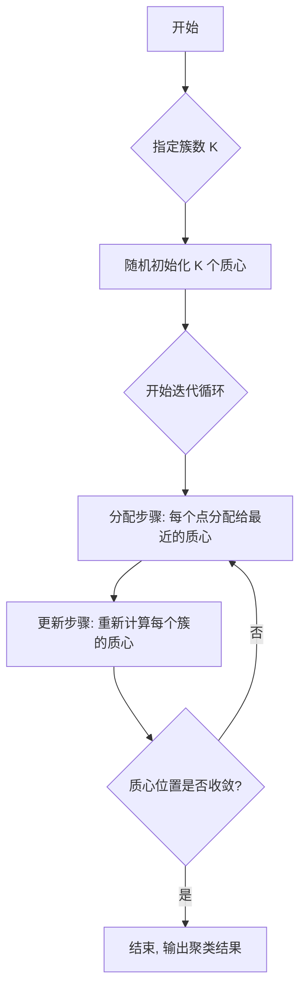

好的，同学你好！欢迎来到《经典算法精讲》的课堂。今天，我们将一起探索无监督学习中最著名、最经典的算法之一：**K-均值聚类 (K-Means)**。

作为你的算法老师，我将不仅仅告诉你它是什么，更会像一名代码向导，一步步带你理解它的思想、看懂它的代码、并最终能亲手实现和应用它。

准备好了吗？让我们开始吧！

---

### 1. 问题引入

想象一下，你是一家新开的线上商城的运营经理。经过几个月的运营，你积累了上千名用户的消费数据，比如他们“平均每单消费金额”和“月均购买次数”。现在，你想为不同的用户群体推送不同的优惠券，实现精准营销，但你并不知道该如何划分这些用户。

你眼前是一张散点图，每个点代表一个用户。

-   **横坐标 (X)**: 月均购买次数
-   **纵坐标 (Y)**: 平均每单消费金额

你看到的可能是一片“混乱”的点，但直觉告诉你，这些点似乎可以被分成几堆：
*   **A群**: 购买次数多、消费金额也高（高价值客户）
*   **B群**: 购买次数少、但单次消费金额高（潜力客户）
*   **C群**: 购买次数多、但单次消费金额低（薄利多销型客户）
*   **D群**: 两项指标都低（低价值客户）

问题来了：**如何在没有任何预先分类的情况下，让计算机自动地、智能地找出这些“天然的”用户群体呢？**

这就是一个典型的聚类问题。K-Means 算法正是解决这类问题的利器。它能帮助我们自动地将数据点“物以类聚”。

### 2. 核心思想与生活化类比

K-Means 的核心思想非常直观，可以用两个词来概括：**“分堆”**和**“迭代”**。

它是一种**划分聚类**算法，意味着它会尝试将数据集划分为 K 个不重叠的“簇”（Cluster）。算法的目标是让同一个簇内的数据点尽可能相似（距离近），而不同簇之间的数据点尽可能不同（距离远）。

**生活化类比：为新小区设立 K 个便民服务站**

假设一个新开发的小区里住满了居民，你需要为他们设立 `K` 个便民服务站（比如快递站或小超市），目标是让所有居民到自己**最近的**那个服务站的距离之和最小。你会怎么做？

一个直观的迭代方法是：

1.  **初始选址 (Initialization)**: 你对小区布局还不熟，所以在地图上随机拍了 `K` 个点作为服务站的初始位置。
2.  **居民分组 (Assignment)**: 通知所有居民，让他们各自去离自己家**直线距离最近**的那个服务站。这样，所有居民就被分成了 `K` 组。
3.  **站点优化 (Update)**: 第一轮分组后，你发现有些服务站门可罗雀，有些则人满为患。为了更公平，你为每个分组找到了他们的“地理中心点”（所有居民位置的平均值），然后把服务站**搬到**这个新的中心位置。
4.  **循环往复 (Iteration)**: 服务站搬家后，一些居民可能会发现，离他们最近的服务站变了！于是，你需要重新进行第 2 步（居民重新选择最近的服务站），然后是第 3 步（服务站再次搬到新中心）。

你不断重复“**分组 -> 优化位置**”这个过程，直到服务站的位置不再有明显变动为止。这时，你就找到了一个相对最优的服务站布局方案。

这个过程，就是 K-Means 算法的灵魂！
-   **居民**: 数据点
-   **服务站**: 簇的中心，称为**质心 (Centroid)**
-   **K**: 你要划分的簇的数量
-   **直线距离**: 衡量数据点相似度的标准（在 K-Means 中通常是欧氏距离）

### 3. 最小可运行示例

Talk is cheap, show me the code! 让我们用 Python 的 `scikit-learn` 库来看一个最简单的 K-Means 实例。我们会创建一些二维数据点，然后让 K-Means 自动把它们分成 3 个簇。

```python
# 引入必要的库
import numpy as np
import matplotlib.pyplot as plt
from sklearn.cluster import KMeans
from sklearn.datasets import make_blobs # 这是一个专门用来生成聚类测试数据的函数

# --- 1. 生成模拟数据 ---
# 我们生成 300 个样本点，希望它们天然地分为 3 个簇
# n_samples: 样本总数
# centers: 簇的数量
# cluster_std: 簇内数据的离散程度，值越大越分散
# random_state: 确保每次运行代码生成的数据都一样，便于复现
X, y_true = make_blobs(n_samples=300, centers=3, cluster_std=0.80, random_state=42)

# --- 2. 创建并训练 K-Means 模型 ---
# n_clusters: 指定要划分的簇的数量 K
# n_init='auto': 这是 scikit-learn 的一个智能设置，它会自动运行多次K-Means（用不同的随机初始质心）并选择最好的结果
# random_state: 同样为了结果可以复现
kmeans = KMeans(n_clusters=3, n_init='auto', random_state=42)

# 让模型学习数据 X
kmeans.fit(X)

# --- 3. 获取聚类结果 ---
# 获取每个数据点被分配到的簇的标签（0, 1, 或 2）。
# 对于已训练的模型，直接访问 .labels_ 属性是更符合惯例的做法。
y_kmeans = kmeans.labels_
# 或者，如果希望一步完成拟合和获取标签，可以使用 fit_predict 方法：
# y_kmeans = kmeans.fit_predict(X)

# 获取最终确定的质心坐标
centers = kmeans.cluster_centers_

print("每个数据点的聚类标签:")
print(y_kmeans[:20]) # 打印前20个点的标签看看
print("\n三个簇的质心坐标:")
print(centers)

# --- 4. 可视化结果 ---
plt.figure(figsize=(8, 6))
# s=50 表示点的大小, c=y_kmeans 表示根据聚类标签自动选择颜色
plt.scatter(X[:, 0], X[:, 1], s=50, c=y_kmeans, cmap='viridis')

# 将质心用红色星星标记出来
plt.scatter(centers[:, 0], centers[:, 1], c='red', s=200, marker='*', label='Centroids')

plt.title('K-Means Clustering Result')
plt.xlabel('Feature 1')
plt.ylabel('Feature 2')
plt.legend()
plt.grid(True)
plt.show()

```

**预期输出:**

```
每个数据点的聚类标签:
[0 0 0 1 2 2 1 2 2 1 1 2 2 1 0 1 0 0 2 0]

三个簇的质心坐标:
[[-1.43268132  8.01021431]
 [ 2.9157833   1.03324881]
 [-1.84860126  2.83058203]]
```

同时，你会看到一张漂亮的散点图，其中数据点被清晰地分成了三种颜色，每个颜色簇的中心都有一个红色的星星标记。这表明算法成功地找到了数据的内在结构！

### 4. 原理剖析

现在，让我们深入到代码背后，拆解 K-Means 的执行流程。

#### 算法步骤

K-Means 的执行流程与我们上面的“服务站”类比完全对应：

1.  **初始化 (Initialization)**
    *   **动作**: 首先，你必须指定一个超参数 `K`，也就是你希望数据被分成的簇数。
    *   **执行**: 算法从数据集中随机选择 `K` 个点作为初始的**质心 (Centroids)**。

2.  **分配 (Assignment Step)**
    *   **动作**: 遍历每一个数据点。
    *   **执行**: 计算该点到所有 `K` 个质心的距离。最常用的距离是**欧氏距离 (Euclidean Distance)**。
    *   **数学公式 (`light` level)**: 对于二维空间中的两个点 `p(x1, y1)` 和 `q(x2, y2)`，它们的欧氏距离为：
        $$
        d(p, q) = \sqrt{(x_2 - x_1)^2 + (y_2 - y_1)^2}
        $$
    *   **结果**: 将该数据点分配给离它最近的那个质心所代表的簇。

3.  **更新 (Update Step)**
    *   **动作**: 当所有点都被分配完毕后，重新计算每个簇的质心。
    *   **执行**: 对于每个簇，将其所有成员数据点的坐标取平均值，得到一个新的坐标。这个新的坐标就是该簇的新质心。

4.  **迭代 (Iteration)**
    *   **动作**: 重复执行**步骤 2 (分配)** 和**步骤 3 (更新)**。
    *   **终止条件**: 这个循环会一直进行，直到满足以下任一条件：
        *   质心的位置不再发生变化（或变化非常小，小于一个预设的阈值）。
        *   数据点的簇分配不再改变。
        *   达到了预设的最大迭代次数。

当算法终止时，我们就得到了最终的聚类结果。

#### Mermaid 流程图



#### 算法复杂度

*   **时间复杂度**: `O(n * K * i * d)`
    *   `n`: 数据点的数量
    *   `K`: 簇的数量
    *   `i`: 迭代次数
    *   `d`: 每个数据点的维度（特征数量）
    *   **解释**: 在每次迭代中 (`i`)，我们需要为 `n` 个数据点中的每一个点，计算它到 `K` 个质心的距离，而每次距离计算涉及 `d` 个维度的运算。通常 `K`, `i`, `d` 远小于 `n`，所以 K-Means 被认为是一个相对高效的算法。

*   **空间复杂度**: `O(n * d + K * d)`
    *   **解释**: 主要需要存储原始数据集 (`n*d`) 和 `K` 个质心的坐标 (`K*d`)。

### 5. 常见误区与优化点

K-Means 虽然简单强大，但也有一些“坑”需要注意：

1.  **误区一：K 值的选择是算法的一部分**
    *   **辨析**: K-Means **无法**自动确定最佳的 `K` 值。`K` 是一个需要我们**预先指定**的超参数。如果 `K` 值选择不当（比如上例中，你强行让 K=2），算法也会给出一个结果，但这个结果可能毫无意义。
    *   **优化点**: 如何选择 `K`？业界常用“肘部法则 (Elbow Method)”或“轮廓系数 (Silhouette Score)”等方法来辅助选择一个较优的 `K` 值。

2.  **误区二：初始点的随机性不影响结果**
    *   **辨析**: K-Means 对初始质心的选择是**敏感**的。一次糟糕的随机初始化可能会让算法陷入一个“局部最优解”，而不是“全局最优解”。想象一下，在服务站的例子里，如果初始的 `K` 个站点都选在了小区的同一个角落，最终的结果可能就不会太好。
    *   **优化点**: 
        *   **多次运行**: `scikit-learn` 的 `KMeans` 类通过 `n_init` 参数解决了这个问题。它会用不同的随机初始值多次运行整个算法，然后选择最好的那次结果（根据簇内平方和最小的原则）。
        *   **K-Means++ 初始化**: 这是一种更智能的初始化方法，它在选择初始质心时会尽量让它们相互远离。这是 `scikit-learn` 中 `init='k-means++'` 的默认行为，它能极大地提高获得高质量结果的概率。

3.  **误区三：K-Means 适用于所有形状的数据**
    *   **辨析**: K-Means 假设簇是**球状**的、大小相似的。因为它基于距离来度量，所以对于非球形的簇（如月牙形、环形）或者大小差异悬殊的簇，它的表现会很差。

### 6. 拓展应用

K-Means 的应用非常广泛，远不止于客户分群：

*   **图像处理 - 颜色量化**: 在一张彩色图片中，有成千上万种颜色。可以用 K-Means 将这些颜色聚类成 `K` 种主色调，从而在不严重影响视觉效果的情况下，大幅压缩图像大小。
*   **自然语言处理 - 文档聚类**: 将大量新闻文章或文本文档根据词频特征进行聚类，自动发现隐藏的主题，比如“体育”、“科技”、“财经”等。
*   **生物信息学 - 基因表达数据分析**: 对基因表达模式进行聚类，以识别具有相似功能的基因群。
*   **异常检测**: 在聚类完成后，那些离所有质心都非常远的数据点，可以被认为是“离群点”或“异常数据”。

### 7. 总结要点

让我们快速回顾一下 K-Means 的关键知识点：

*   **算法类型**: 无监督学习，划分聚类算法。
*   **核心思想**: 通过“分配-更新”的迭代过程，找到 `K` 个簇的质心，使得簇内数据点紧凑，簇间数据点疏远。
*   **关键步骤**: (1) 初始化 `K` 个质心 -> (2) 分配数据点到最近的质心 -> (3) 更新质心为簇的均值 -> (4) 重复直至收敛。
*   **主要优点**: 
    *   算法简单，易于理解和实现。
    *   计算效率高，对于大规模数据集是可行的。
*   **主要缺点**: 
    *   需要预先指定 `K` 值。
    *   对初始质心的选择敏感。
    *   对异常值和噪声敏感。
    *   难以处理非球形、大小不一的簇。

### 8. 思考与自测

现在，轮到你来动手实践了！为了更好地理解 K-Means 的特性，请尝试下面的挑战：

**挑战**: 在我们第 3 节的示例代码中，我们生成了 3 个簇的数据，并将 `n_clusters` 设置为 3，得到了完美的结果。请尝试将 `n_clusters` 修改为 `2` 或 `4`，然后重新运行代码。

**观察并思考**:
1.  当 `K=2` 时，算法是如何强行将三个“天然”的簇合并成两个的？
2.  当 `K=4` 时，算法又是如何将某个“天然”的簇拆分成两个的？
3.  这个小实验如何证明了 K-Means 对超参数 `K` 的选择是多么重要和敏感？

通过这个简单的修改和观察，你将对 K-Means 的工作方式和它的局限性有更深刻的体会。

希望这堂课对你有所帮助！聚类是探索数据内在结构的强大工具，而 K-Means 是你必须掌握的入门第一招。

---
#### 参考文献
1.  MacQueen, J. (1967). *Some methods for classification and analysis of multivariate observations*. Proceedings of the Fifth Berkeley Symposium on Mathematical Statistics and Probability.
2.  Arthur, D., & Vassilvitskii, S. (2007). *k-means++: The advantages of careful seeding*. Proceedings of the eighteenth annual ACM-SIAM symposium on Discrete algorithms.
3.  Pedregosa, F., Varoquaux, G., Gramfort, A., Michel, V., Thirion, B., Grisel, O., ... & Duchesnay, E. (2011). *Scikit-learn: Machine learning in Python*. Journal of machine learning research.