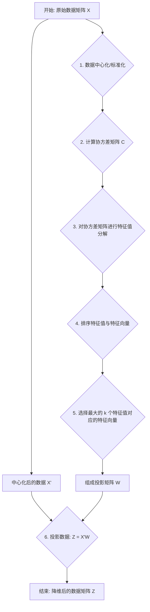

好的，老师这就为你开课！

你好，同学！欢迎来到我们的算法深度解析课堂。之前我们探讨了聚类和降维的基本思想，你已经知道了为什么要给数据“瘦身”。今天，我们将深入降维技术中最核心、最经典的算法——**主成分分析 (Principal Component Analysis, PCA)**。

这不仅仅是一个简单的API调用，我们将一起从零开始，推开数学的大门，真正理解数据是如何在我们的“魔术”下降维的。准备好了吗？让我们一起揭开PCA的神秘面纱！

---

### 1. 问题引入

想象一下，你是一位数据分析师，正在处理一份包含数百个特征的用户行为数据集。这些特征可能包括：`每日登录次数`、`平均会话时长`、`总购买金额`、`过去30天购买频率`、`浏览商品种类数`、`加入购物车次数`...

你的目标是进行用户分群（就像我们之前学的K-Means），但有两个巨大的挑战：
1.  **维度灾难 (Curse of Dimensionality)**：在数百个维度上计算距离，不仅计算量巨大，而且距离的意义也会变得模糊，导致聚类效果不佳。
2.  **数据冗余 (Data Redundancy)**：`每日登录次数`和`平均会话时长`很可能高度相关；`购买金额`和`购买频率`也可能正相关。这么多特征其实在描述一些共同的潜在特性（比如“用户活跃度”或“购买力”）。

我们能否不粗暴地丢弃特征，而是聪明地将这些相关特征融合成少数几个、全新的、能最大程度保留原始数据信息的“超级特征”呢？

这就是PCA要解决的核心问题：**如何在信息损失最小的情况下，对数据进行降维？**

### 2. 核心思想与生活化类比

#### 核心思想
PCA的核心思想是**寻找数据中方差最大的方向**。

它试图找到一个新的坐标系，在这个坐标系下，数据点的分布尽可能地分散。第一个坐标轴（称为第一主成分）指向数据方差最大的方向；第二个坐标轴（第二主成分）与第一个正交（垂直），并指向剩余方差最大的方向，以此类推。

通过保留方差最大的前k个方向（主成分），我们就可以将原始数据投影到这个k维子空间上，从而达到降维的目的。因为方差越大，代表数据在这个方向上包含的信息越多。

#### 生活化类比：给物体拍一张信息最丰富的“证件照”

想象一下，你有一个精美的三维航天飞机模型，现在你想用一张二维照片来最大程度地展示它的样貌。

*   **糟糕的拍摄角度**：如果你从飞机的正前方或正后方拍摄，照片上可能只有一个小小的机头或喷气口轮廓。你丢失了机翼、机身等大量形状信息。这相当于选择了一个方差很小的方向进行投影。
*   **优秀的拍摄角度**：如果你从一个斜45度的侧上方拍摄，你就能同时看到机身、机翼和尾翼的轮廓。这张照片的“信息量”最大，能最好地代表这个三维模型。

PCA就像一个专业的摄影师，它会自动寻找那个“信息量最大”的拍摄角度（**第一主成分**）。如果你需要第二张照片来补充信息，它会找到与第一个角度垂直（正交）且信息量次之的角度（**第二主成分**）。我们降维，就是选择用前几张信息量最丰富的“照片”来代表整个三维模型。

### 3. 最小可运行示例

在我们深入数学推导之前，让我们先通过 `scikit-learn` 这个强大的库，直观地感受一下PCA的效果。我们将创建一个相关的二维数据集，然后用PCA将其降至一维。

```python
# 引入必要的库
import numpy as np
import matplotlib.pyplot as plt
from sklearn.decomposition import PCA

# 1. 创建一个相关的二维数据集
# 让 y 约等于 2*x + noise，这样数据点会呈现在一个倾斜的带状区域
np.random.seed(42)
X = np.random.rand(100, 1) # x 坐标
y = 2 * X + 0.5 * np.random.randn(100, 1) # y 坐标，带有噪声
data = np.hstack((X, y)) # 水平堆叠成 (100, 2) 的矩阵

print("原始数据形状:", data.shape)

# 2. 初始化并应用PCA
# 我们希望将数据从二维降到一维
pca = PCA(n_components=1)
# 训练模型并进行转换
data_transformed = pca.fit_transform(data)

print("降维后数据形状:", data_transformed.shape)

# 3. 分析结果
print("\n找到的主成分 (方向向量):", pca.components_)
print("每个主成分解释的方差比例:", pca.explained_variance_ratio_)

# 4. 可视化
# 为了在图上画出主成分方向，我们需要将其还原回原始空间
# pca.components_ 是方向向量, pca.mean_ 是中心点
# 我们画出以均值为起点，主成分为方向的向量
plt.figure(figsize=(8, 6))
plt.scatter(data[:, 0], data[:, 1], alpha=0.7, label='Original Data')

# 绘制主成分方向
for length, vector in zip(pca.explained_variance_, pca.components_):
    v = vector * 3 * np.sqrt(length) # 缩放向量以便于观察
    plt.plot([pca.mean_[0], pca.mean_[0] + v[0]], 
             [pca.mean_[1], pca.mean_[1] + v[1]], 
             '-', color='red', lw=3, label='Principal Component 1')

plt.title('PCA on 2D Data')
plt.xlabel('Feature 1')
plt.ylabel('Feature 2')
plt.axis('equal')
plt.legend()
plt.grid(True)
plt.show()

# 预期输出:
# 原始数据形状: (100, 2)
# 降维后数据形状: (100, 1)
#
# 找到的主成分 (方向向量): [[0.4636687  0.88601233]]
# 每个主成分解释的方差比例: [0.9786343]
```
**代码解读**:
*   我们创建的数据点大致分布在一条斜线上。
*   `PCA(n_components=1)` 告诉算法我们最终只需要1个维度。
*   `pca.fit_transform(data)` 执行了PCA的所有步骤，并返回了降维后的结果。
*   `pca.components_` 显示了找到的主成分方向。在这个例子中，它是一个指向数据分布最长方向的单位向量。
*   `pca.explained_variance_ratio_` 显示第一个主成分捕捉了原始数据约97.8%的方差！这意味着我们用一维数据就几乎保留了二维数据的所有信息。
*   可视化结果清晰地展示了红色的主成分向量，它完美地穿过了数据的“主干”，也就是方差最大的方向。

### 4. 原理剖析

代码用起来很简单，但内部的数学原理才是精髓。让我们一步步揭开 `pca.fit_transform()` 的黑盒。



#### 深入数学推导 (Math Depth: Deep)

假设我们有 $m$ 个样本，每个样本有 $d$ 个特征，构成数据矩阵 $X$（$m \times d$）。

**第1步：数据中心化 (Data Centering)**
PCA的目标是找到方差最大的方向。方差是围绕均值计算的，所以第一步是让所有数据的均值为0。对每个特征（每一列），减去该特征的均值。

$X' = X - \bar{X}$

其中 $\bar{X}$ 是每列的均值向量。这一步确保了我们是在寻找数据本身的散布方向，而不是围绕某个非零中心的散布方向。

**第2步：计算协方差矩阵 (Covariance Matrix)**
为了度量不同特征之间的相关性以及每个特征自身的离散程度（方差），我们需要计算协方space差矩阵 $C$。

$C = \frac{1}{m-1} (X')^T X'$

*   $C$ 是一个 $d \times d$ 的对称矩阵。
*   其对角线元素 $C_{ii}$ 是第 $i$ 个特征的方差。
*   非对角线元素 $C_{ij}$ 是第 $i$ 个和第 $j$ 个特征的协方差。协方差为正表示正相关，为负表示负相关，为0表示不相关。

**第3步：对协方差矩阵进行特征值分解 (Eigen-decomposition)**
这一步是PCA最核心的数学魔法。我们想找到一个新的坐标系（一组基向量），使得数据在这些基向量上的投影方差最大，且基向量之间线性无关（正交）。

协方差矩阵的**特征向量 (Eigenvectors)** 正是这些新坐标轴的方向，而对应的**特征值 (Eigenvalues)** 则度量了数据在这些方向上的方桑。

我们要解下面的方程：
$C\vec{v} = \lambda\vec{v}$

*   $\vec{v}$ 是协方差矩阵 $C$ 的特征向量，它代表了一个主成分的方向。
*   $\lambda$ 是对应的特征值，它代表了数据在 $\vec{v}$ 方向上的方差大小。

因为 $C$ 是一个 $d \times d$ 的对称矩阵，它一定有 $d$ 个实数特征值和 $d$ 个相互正交的特征向量。

**第4步 & 5步：选择主成分**
我们将得到的 $d$ 个特征值按从大到小的顺序排列：$\lambda_1 \ge \lambda_2 \ge ... \ge \lambda_d$。
然后，选择与最大的前 $k$ 个特征值 ($\lambda_1, \lambda_2, ..., \lambda_k$) 相对应的特征向量 ($\vec{v_1}, \vec{v_2}, ..., \vec{v_k}$)。

这 $k$ 个特征向量构成了一个新的特征空间。我们将它们组合成一个**投影矩阵** $W$（$d \times k$），其中每一列是一个特征向量。

$W = [\vec{v_1}, \vec{v_2}, ..., \vec{v_k}]$

**第6步：投影数据**
最后，我们将中心化后的原始数据 $X'$ 投影到这个新的 $k$ 维子空间上，得到降维后的数据 $Z$。

$Z = X'W$

*   $X'$ 的维度是 $m \times d$。
*   $W$ 的维度是 $d \times k$。
*   最终得到的 $Z$ 的维度是 $m \times k$。

我们成功地将 $d$ 维数据降到了 $k$ 维！并且这 $k$ 维是相互正交的，它们捕获了原始数据中最大部分的方差。

**算法复杂度**:
*   主要计算开销在协方差矩阵的计算 ($O(md^2)$) 和特征值分解 ($O(d^3)$)上。当特征维度 $d$ 很高时，计算会非常耗时。

### 5. 常见误区与优化点

1.  **误区一：忘记数据标准化**
    *   **问题**：如果你的特征单位不同（例如，一个是“年龄”，范围20-60；另一个是“年收入”，范围50,000-1,000,000），年收入的方差会远远大于年龄的方差。PCA会被这个高方差的特征主导，而忽略了年龄这个特征可能包含的重要信息。
    *   **解决方案**：在进行PCA之前，通常需要对数据进行**标准化 (Standardization)**，即让每个特征的均值为0，标准差为1（使用`sklearn.preprocessing.StandardScaler`）。这样可以消除量纲的影响，让每个特征在计算中处于同等地位。

2.  **误区二：将PCA用于特征选择**
    *   **问题**：PCA降维后得到的主成分是原始特征的**线性组合**，例如`PC1 = 0.7*feature1 - 0.5*feature2 + 0.1*feature3...`。这意味着新的特征通常是不可解释的，你失去了原始特征的业务含义。它不是从原始特征中挑选出一部分，而是创造了全新的特征。
    *   **结论**：如果你的目标是保留原始特征的可解释性，并从中选择一个子集，那么应该使用特征选择（Feature Selection）方法，而不是PCA。

3.  **优化点：使用SVD（奇异值分解）**
    *   在实际的库实现中（包括`scikit-learn`），PCA通常不是通过计算协方差矩阵再进行特征值分解来实现的，因为当特征数量巨大时，这在数值上可能不稳定。
    *   更常见和稳健的方法是直接对中心化后的数据矩阵 $X'$ 进行**奇异值分解 (Singular Value Decomposition, SVD)**。SVD能直接得到特征值和特征向量，避免了计算庞大的协方差矩阵，效率更高，数值稳定性也更好。

### 6. 拓展应用

PCA作为一种基础且强大的技术，应用极其广泛：

1.  **图像压缩**：将图像的像素矩阵视为数据，通过PCA找到最重要的主成分来表示图像，可以用更少的数据量存储图像的主要信息。
2.  **人脸识别 (Eigenfaces)**：将每张人脸图片展平成一个高维向量。对大量人脸向量进行PCA，得到的主成分被称为“特征脸 (Eigenfaces)”。任何一张新的人脸都可以通过这些特征脸的线性组合来近似，从而进行识别。
3.  **金融领域**：在股票市场分析中，可以用PCA来分析大量股票价格的波动，提取出几个能代表整个市场走势的主成分（如“市场宏观因素”、“行业特定因素”等），用于风险建模和投资组合优化。
4.  **生物信息学**：分析基因表达数据，这些数据通常有数万个基因（特征）但只有几百个样本。PCA可以帮助研究人员发现基因之间的模式，并对样本进行分类。

### 7. 总结要点

*   **目标**：无监督学习的降维技术，旨在最大程度保留数据方差（信息）。
*   **核心原理**：通过**特征值分解**协方差矩阵，找到数据方差最大的方向（主成分）。
*   **关键步骤**：数据中心化/标准化 -> 计算协方差矩阵 -> 特征值分解 -> 选择top-k特征向量构成投影矩阵 -> 数据投影。
*   **前提条件**：强烈建议在使用PCA前对数据进行**标准化**，以避免不同特征尺度带来的影响。
*   **产出**：得到的新特征是原始特征的线性组合，它们之间**线性无关（正交）**，且失去了原始的物理意义。

### 8. 思考与自测

现在你已经掌握了PCA的原理，让我们来解决一个实际应用中非常重要的问题。

在我们的代码示例中，我们硬编码了 `n_components=1`。但在真实场景下，我们如何决定降维到几维（即 `k` 的值）才是最合适的呢？

**问题**：
修改上面的Python代码，不要预设 `n_components` 的值（即 `PCA()`）。然后，计算并绘制一个“**累积解释方差贡献率曲线**”。横轴是主成分的数量，纵轴是这些主成分累计解释的方差比例。通过这个图，判断为了保留原始数据至少 **95%** 的信息，我们应该选择多少个主成分？

**提示**：
当你用 `pca.fit(data)` 训练模型后，`pca.explained_variance_ratio_` 属性会返回一个数组，其中每个元素代表对应主成分解释的方差比例。你可以使用 `np.cumsum()` 函数来计算累积和。

这个问题将引导你从“会用PCA”迈向“用好PCA”，这也是数据科学家在实践中决定降维维度的标准做法。动手试试吧！

---
### 参考文献
1.  Jolliffe, I. T. (2002). *Principal Component Analysis*. Springer.
2.  Shlens, J. (2014). *A Tutorial on Principal Component Analysis*. arXiv preprint arXiv:1404.1100.
3.  *Scikit-learn documentation on PCA*: [https://scikit-learn.org/stable/modules/generated/sklearn.decomposition.PCA.html](https://scikit-learn.org/stable/modules/generated/sklearn.decomposition.PCA.html)