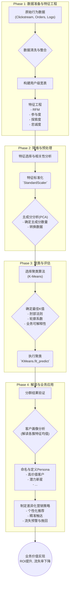

好的，请坐稳。让我们拉开帷幕，回到那个数据还没有被贴上“黄金”标签，但其价值已初现端倪的时代。我将带你走进一个真实的数字化转型战场，重温我们团队是如何利用用户行为数据，为一家陷入增长瓶颈的电商巨头“E-Verse”绘制出第一张精细化的客户藏宝图。

这不仅仅是一个关于算法的故事，更是一场关于数据、业务和人性洞察的远征。

---

### **流程实践：基于用户行为数据的客户分群**

#### 1. **问题引入 (故事背景)**

那是在一个初夏，E-Verse的会议室里气氛有些凝重。作为公司首席数据科学家，我面前的PPT上展示着一连串令人沮丧的数字：用户增长放缓，营销活动的投资回报率（ROI）持续下滑，客户流失率却在悄然攀升。

“我们的营销就像在用霰弹枪打蚊子，”市场总监艾米丽一针见血，“我们向所有人推送同样的信息——‘夏季大促！全场五折！’——但结果呢？高价值客户觉得受到了骚扰，新用户觉得我们只会降价，而那些即将流失的用户，根本没看到他们真正关心的东西。”

挑战很明确：我们拥有海量的用户行为数据——点击流、浏览历史、加购、收藏、搜索关键词、停留时长——但这些数据像一盘散沙，没有形成合力。我们的目标是，**从这些无标签的行为数据中，识别出具有不同需求和价值的用户群体，从而实现个性化营销，提升用户生命周期价值。** 我们需要从“大众营销”转向“精准滴灌”。

#### 2. **核心方案与类比**

我们提出的核心方案是：**构建一个基于用户行为数据的无监督学习流程，通过降维和聚类算法，实现动态的、数据驱动的客户分群。**

为了让艾米丽和她的团队理解这个技术方案，我用了一个他们熟悉的类比：

“想象一下，我们不是在管理一个网站，而是在经营一座巨大的城市。过去，我们只知道城市里有多少‘居民’（用户），以及他们在‘主干道’（首页）上的‘车流量’（PV/UV）。但我们不知道他们住在哪个‘社区’，喜欢去‘公园’还是‘购物中心’，是‘朝九晚五的上班族’还是‘深夜出没的艺术家’。”

“我们的方案，就是要成为这座城市的**社会地图绘制师**。首先，我们会用 **特征工程 (Feature Engineering)** 捕捉居民的各种行为习惯，比如‘通勤路线’（访问路径）、‘消费场所’（购买品类）、‘活跃时段’（登录时间）等等。然后，通过 **主成分分析 (PCA)** 这位‘城市规划师’，将上百个复杂的行为指标，浓缩成几个核心的‘生活方式’维度，比如‘消费能力’、‘活跃度’、‘探索欲’。最后，**K-均值聚类 (K-Means)** 算法就像一位经验丰富的社区调查员，根据这些核心维度，自动将居民划分到不同的‘社区’（客户分群）——这里是‘高端住宅区’（高价值客户），那里是‘潮流青年聚集地’（时尚追随者），还有那边是‘精打细算的家庭生活区’（价格敏感型客户）。

一旦地图绘制完成，你们市场团队就可以为每个社区量身定制服务和信息，而不是在全城上空用飞机撒传单。”

这个类比瞬间拉近了技术与业务的距离。他们明白了，我们要做的不只是分组，而是**发现和定义群体画像 (Persona)**。

#### 3. **最小示例 (关键代码/配置)**

对于熟悉代码的你来说，千言万语不如一段核心逻辑。这个项目的精髓在于将数据预处理、降维和聚类无缝衔接。我们没有选择孤立地执行每一步，而是构建了一个可复用的`Pipeline`。

```python
# include_code: true
# code_lang: python

import pandas as pd
from sklearn.pipeline import Pipeline
from sklearn.preprocessing import StandardScaler
from sklearn.decomposition import PCA
from sklearn.cluster import KMeans

# 假设 `feature_df` 是经过特征工程后的数据帧
# 行是用户，列是行为特征（如：recency, frequency, monetary, avg_session_duration, etc.）
feature_df = pd.DataFrame({
    'user_id': ['U001', 'U002', 'U003', 'U004', 'U005'],
    'recency': [10, 150, 30, 5, 300],
    'frequency': [20, 2, 8, 25, 1],
    'monetary': [5000, 50, 1000, 6000, 20],
    'avg_session_duration': [1200, 150, 600, 1500, 80],
    'distinct_categories_viewed': [15, 3, 7, 18, 2]
})

# 我们只对特征进行聚类
X = feature_df.drop('user_id', axis=1)

# 构建一个自动化的数据处理与建模管道
# 这是一个非常典型的无监督学习工作流
segmentation_pipeline = Pipeline([
    ('scaler', StandardScaler()),  # 步骤1: 特征标准化
    ('pca', PCA(n_components=2)), # 步骤2: 降维到2个主成分，便于可视化和解释
    ('kmeans', KMeans(n_clusters=3, random_state=42, n_init='auto')) # 步骤3: K-Means聚类
])

# 将管道应用于数据
feature_df['cluster'] = segmentation_pipeline.fit_predict(X)

print("--- 用户分群结果 ---")
print(feature_df[['user_id', 'cluster']])

# 案例片段 (include_case_snippets: true)
# 在实际项目中，n_components 和 n_clusters 的选择是数据驱动的，
# 而不是像这里一样硬编码。我们会通过分析PCA的累计方差贡献率来确定n_components，
# 通过肘部法则(Elbow Method)和轮廓系数(Silhouette Score)来寻找最佳的n_clusters。
```

这段代码的核心思想是**流程化**和**标准化**，它将数据科学的“手工作业”提升到了“工业化生产”的层面。

#### 4. **原理剖析 (方案执行与决策过程)**

我们的远征并非一帆风顺，每一步都充满了决策与权衡。

##### **第一阶段：特征工程——从原始日志到洞察画布**

我们面对的是TB级的原始点击流日志。我们做的第一件事，不是建模，而是与业务团队（市场、产品、运营）进行长达数周的头脑风暴。

*   **决策点**: 我们应该构建哪些特征？
*   **思考过程**: 我们没有局限于经典的RFM模型（Recency, Frequency, Monetary）。因为对于一个内容丰富的电商平台，用户的**浏览和互动行为**同样重要。我们扩充了维度：
    *   **参与度 (Engagement)**: 平均会话时长、访问天数/周、收藏/加购比率。
    *   **探索度 (Exploration)**: 浏览的商品类目广度、搜索关键词的多样性。
    *   **忠诚度 (Loyalty)**: 复购率、优惠券使用偏好（是偏好满减还是折扣券）。
    *   **生命周期阶段 (Lifecycle Stage)**: 用户注册时长、首次购买至今时长。
*   **结果**: 我们构建了一个包含70多个候选特征的宽表。这是一个好的开始，但也带来了“维度灾难”的风险。

##### **第二阶段：降维——在噪声中寻找信号**

70多个特征，很多是高度相关的（例如，访问时长和访问深度）。直接聚类效果会很差，且难以解释。

*   **决策点**: 如何有效降维？PCA还是其他方法？
*   **思考过程**: 我们之所以选择PCA，基于三个原因：
    1.  **效率**: PCA计算速度快，对于大规模数据集至关重要。
    2.  **去相关性**: 它能将相关的特征转化为一组线性无关的主成分，这对于依赖距离计算的K-Means算法非常友好。
    3.  **可解释性 (相对)**: 虽然主成分是原始特征的线性组合，但通过分析每个主成分的载荷(loadings)，我们可以赋予它们业务含义。例如，我们发现第一个主成分（PC1）主要由`monetary`, `frequency`, `avg_order_value`等高载荷构成，我们将其命名为“**消费价值**”轴。第二个主成分（PC2）则与`distinct_categories_viewed`, `search_diversity`等相关，我们称之为“**探索活跃度**”轴。
*   **执行**: 我们通过绘制累计方差贡献率图，最终决定保留前10个主成分，它们解释了原始数据85%以上的方差，成功实现了在保留主要信息的前提下的大幅降维。

##### **第三阶段：聚类与画像——从数据簇到鲜活的人**

这是最关键的一步：确定到底分几群（K值），以及每个群代表什么。

*   **决策点**: 如何确定最佳的K值？
*   **思考过程**: 我们采取了“**数据指标为主，业务理解为辅**”的策略。
    *   **数据指标**: 我们同时使用了**肘部法则**和**轮廓系数**。肘部法则的“拐点”指向K=5或6，而轮廓系数在K=5时达到峰值。
    *   **业务理解**: 我们将K=4, 5, 6三种情况下的聚类结果都进行了初步画像分析，然后与市场总监艾米丽一起评审。艾米丽反馈，6个群体过于细碎，有些群体的差异在营销上难以实施区分策略。而4个群体又过于笼统，会把一些有价值的细分群体合并掉。最终，我们选择了**K=5**，这是一个在数据表现和业务可操作性上都达到最佳平衡的点。

*   **从簇到画像 (Persona)**: 这是数据科学的“最后一公里”。我们通过分析每个簇的特征均值（在标准化之前），为它们赋予了生动的画像：
    *   **簇0: 高价值忠诚客户**: RFM得分极高，浏览品类集中，复购率强。
    *   **簇1: 潜力新星**: 注册时间短，但近期活跃度和加购行为频繁，消费额中等。
    *   **簇2: 价格敏感的购物者**: 优惠券使用率极高，只在大型促销季活跃，浏览大量打折商品。
    *   **簇3: 沉睡流失边缘用户**: 最近访问时间（Recency）很长，各项指标均处于低位。
    *   **簇4: 随意闲逛者**: 访问频繁，浏览品类广泛，但加购和购买转化率极低。

##### **流程图 (Mermaid Diagram)**



#### 5. **常见误区 (复盘与反思)**

回顾这次远征，我们虽然成功，但也踩过几个“坑”：

1.  **静态分群的陷阱**: 项目初期，我们交付了一份静态的分群报告，皆大欢喜。但三个月后，市场团队发现效果开始减弱。我们意识到，**用户是会流动的**！一个“潜力新星”可能成长为“高价值客户”，也可能因为体验不佳而“流失”。
    *   **反思与改进**: 我们后来将整个流程部署成一个定期的ETL任务（每周更新一次），并追踪用户在不同群体间的迁移路径，这本身又成了一个新的、极具价值的分析维度。

2.  **“平均值”的误导**: 在进行画像分析时，我们最初只关注每个簇的特征均值。但后来发现，某个簇的“平均购买金额”很高，可能是由少数几个“超级鲸鱼”用户拉高的，大部分用户其实消费平平。
    *   **反思与改进**: 除了均值，我们还引入了中位数、分位数和特征分布的可视化，来更全面地理解每个群体的内部结构，避免被极端值误导。

3.  **忽略特征尺度的“初级错误”**: 在第一次建模时，一个实习生忘记了进行`StandardScaler`标准化。结果，`monetary`这种数值范围大的特征完全主导了聚类结果，模型几乎只根据消费金额把用户分成了“高、中、低”三档，完全忽略了其他行为。幸好在交叉验证时及时发现，否则后果不堪设想。这是一个对专家来说都值得警惕的细节。

#### 6. **拓展应用 (经验迁移)**

这个“绘制城市地图”的工作流，其核心思想——**在无标签数据中发现结构化洞察**——具有极强的可迁移性。

*   **产品分析**: 可以对App内的功能使用行为进行聚类，识别出“效率工具型用户”、“社交分享型用户”和“内容消费型用户”，从而指导产品迭代和功能优化。
*   **内容推荐**: 对文章或视频的元数据（标签、类别、时长）和用户互动数据（观看完成率、点赞、评论）进行聚类，可以发现内容主题簇，优化推荐系统的多样性和深度。
*   **异常检测**: 在金融风控中，可以将正常交易行为聚类。当一个新交易远离任何一个已知的“正常簇”中心时，它就可能是一个需要警惕的异常或欺诈行为。

这个流程的本质，是为机器赋予一种“归纳”和“理解”的能力，是构建更智能系统的前置步骤。

#### 7. **总结要点**

E-Verse项目之所以成功，关键在于我们构建了一个**端到端的、从数据到价值的闭环流程**，而不仅仅是调用了一个算法。

*   **业务驱动**: 整个流程的起点和终点都是业务问题——如何实现精准营销。
*   **技术组合拳**: 我们没有迷信单一算法，而是巧妙地将**特征工程（领域知识）、PCA（数据简化）和K-Means（模式发现）**有机结合，各司其职。
*   **人机协同**: 算法负责从海量数据中发现模式（“是什么”），而数据科学家和业务专家则负责解读这些模式，赋予其商业意义（“为什么”和“怎么办”）。
*   **迭代与动态**: 认识到客户分群不是一劳永逸的，建立动态更新和追踪机制是项目长期成功的保障。

`流程实践：基于用户行为数据的客户分群 (Workflow Practice: Customer Segmentation with User Behavior Data)` 在这个项目中，扮演了连接原始数据和商业决策的**翻译官和战略地图**的角色。它将杂乱无章的用户行为，翻译成市场团队能听懂的语言（用户画像），并为他们指明了不同战场（细分市场）的进攻方向。

##### **项目成功关键步骤清单 (include_steps_checklist: true)**
- [x] **明确业务目标**: 与利益相关者对齐分群的目的。
- [x] **数据探索与整合**: 收集所有相关的用户行为数据。
- [x] **深度特征工程**: 结合业务理解，创建丰富的、可解释的特征。
- [x] **数据预处理**: 严格执行缺失值处理、异常值检测和特征缩放。
- [x] **降维处理**: 使用PCA等技术处理高维稀疏特征，提升模型性能和可解释性。
- [x] **科学选择K值**: 综合使用数据指标（肘部法则、轮廓系数）和业务可操作性来确定最佳分群数。
- [x] **聚类模型训练**: 使用K-Means或其他合适的算法进行聚类。
- [x] **分群画像解读**: 深入分析各分群的特征，转化为可理解的业务画像 (Persona)。
- [x] **部署与自动化**: 将流程工程化，实现定期更新。
- [x] **效果追踪与迭代**: 监控分群的稳定性，并根据业务反馈进行模型调优。

##### **核心评估指标 (include_eval_metrics: true)**
*   **轮廓系数 (Silhouette Score)**: 衡量簇内样本的紧凑度和簇间样本的分离度。分数越高，聚类效果越好。这是我们在技术上选择K值的核心依据。
*   **Calinski-Harabasz指数**: 另一种衡量聚类效果的指标，通过计算簇间离散度与簇内离散度的比值来评估。
*   **业务指标 (Business Metrics)**: 最终的试金石。在分群后，我们会进行A/B测试，比较针对不同分群的个性化营销策略与传统“一刀切”策略在**转化率、用户留存率、ARPU值**等指标上的差异。

#### 8. **思考与自测**

现在，把指挥棒交给你。

**如果你是当时的项目负责人，在“确定最佳K值”这个决策点上，假设数据指标（轮廓系数）明确指向K=7时效果最佳，但市场总监艾米丽坚持认为她的团队最多只能有效管理4个不同的客户群体，并为此制定营销策略。你会如何决策？是坚持数据上的“最优解”，还是选择业务上的“可行解”？你会如何推动这个决策，并设计后续的行动方案？**

---
**参考文献 (include_references: true)**
1.  Grus, J. (2019). *Data Science from Scratch: First Principles with Python*. O'Reilly Media.
2.  Müller, A. C., & Guido, S. (2016). *Introduction to Machine Learning with Python: A Guide for Data Scientists*. O'Reilly Media. (尤其关于 `sklearn` `Pipeline` 的应用)
3.  Fader, P. S., Hardie, B. G., & Lee, K. L. (2005). “Counting your customers” the easy way: An alternative to the Pareto/NBD model. *Marketing science*, 24(2), 275-284. (关于客户行为建模的经典文献)