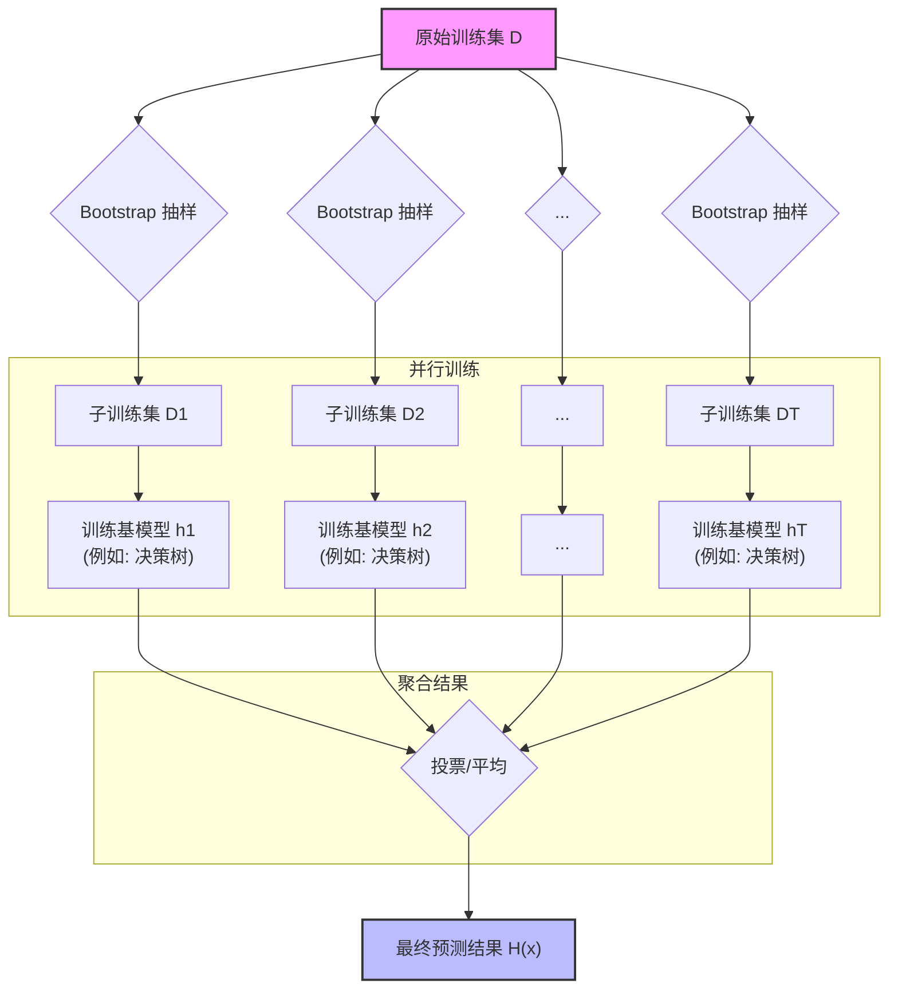

好的，老师这就上线！

各位同学，大家好！今天我们要学习集成学习家族中一位非常重要的成员——Bagging，以及它最著名的“青出于蓝而胜于蓝”的变体——随机森林（Random Forest）。

在上一节课，我们学习了 Boosting，它像一位严师，不断地纠正学生的错误，是一种“串行”的智慧。而今天我们要学的 Bagging，则更像一位民主的组织者，它相信“群众的智慧”，采用的是一种“并行”的策略。

让我们一起进入并行集成的世界，看看它是如何通过团队协作来提升模型性能的。

---

### **1. 问题引入**

想象一下，你是一家医院的数据科学家，你的任务是构建一个模型来预测患者是否患有某种心脏疾病。你收集了大量的病人数据，包括年龄、血压、胆固醇水平、心率等等。

你决定先用我们熟悉的决策树来构建模型。你训练了一棵非常深的决策树，它在训练数据上表现完美，准确率高达99%！你非常高兴，准备将它部署到线上。

然而，当新病人数据进来时，你发现模型的预测效果大打折扣，准确率掉到了70%。这是为什么呢？

这就是典型的**过拟合 (Overfitting)**。那棵决策树学得“太细”了，它把训练数据中的每一个细枝末节甚至噪声都记住了，导致它的**方差 (Variance)** 非常高。就像一个只会在模拟考试中拿高分，一到真实考场就发挥失常的考生。

我们该如何构建一个既能学到数据规律，又不会被噪声过度影响的稳定模型呢？Bagging 和随机森林就是为了解决这类高方差问题而生的。

### **2. 核心思想与生活化类比**

Bagging 的全称是 **Bootstrap Aggregating**，听起来很专业，但思想却非常朴素。我们可以把它拆成两个关键词来理解：

1.  **Bootstrap (自助法采样)**: 这是一种有放回的抽样方法。
2.  **Aggregating (聚合)**: 将多个结果汇总起来。

**生活化类比：集体诊断**

这就像我们刚才提到的医生诊断案例。与其只依赖一位学识渊博但容易钻牛角尖、对个别特殊病例反应过度的‘专家医生’（单个复杂的决策树），我们不如组建一个“专家委员会”。

*   **Bootstrap (分发病历)**: 我们不把完整的病人病历档案（原始数据集）给委员会里的每一位医生。相反，我们为每位医生准备一份“定制版”的病历。我们从原始档案中随机抽取一份病历，记录下来，然后**再放回去**，重复这个过程直到定制版病历和原始档案一样大。这样，每位医生拿到的病历组合都略有不同，有的病历可能被重复看到，有的则一次也没看到。这就是 **Bootstrap**。

*   **并行诊断 (独立训练)**: 委员会里的100位医生可以同时开始工作，互不干扰。每位医生根据自己手上的那份定制病历，独立地做出诊断（训练一个决策树模型）。由于他们看到的“病人样本”不同，他们诊断的侧重点和结论也会有所差异。

*   **Aggregating (投票决策)**: 当所有医生都给出诊断后，我们进行投票。如果100位医生中有80位认为病人“患病”，20位认为“健康”，那么最终的集体诊断就是“患病”。这就是 **Aggregating**。

通过这种方式，即使个别医生因为看到了某些有误导性的病历而做出了错误判断，这个错误也会被大多数其他医生的正确判断所“淹没”，最终的集体决策会比任何单个医生的决策都更加稳健和准确。**Bagging 的核心就是通过引入随机性（抽样）来降低模型的方差。**

而**随机森林 (Random Forest)** 在这个基础上，更进了一步。它在医生诊断的“过程中”也增加了随机性：每位医生在诊断的每一个环节（决策树的每个节点分裂），都不能查看所有的检查指标（特征），而是只能从随机抽取的几个指标里选择一个最好的来进行判断。这进一步增加了医生之间的差异性，使得整个委员会更加多样化，决策也更可靠。

### **3. 最小可运行示例**

让我们用代码来实现这个“集体智慧”的过程。我们将使用 `scikit-learn` 库，它为我们提供了现成的 `RandomForestClassifier`。

```python
# 引入必要的库
import numpy as np
from sklearn.ensemble import RandomForestClassifier
from sklearn.model_selection import train_test_split
from sklearn.datasets import make_classification

# --- 1. 准备数据 ---
# 生成一个模拟的二分类数据集
# n_samples: 样本数量
# n_features: 特征总数
# n_informative: 有效特征数量
# random_state: 保证每次生成的数据集都一样，便于复现
X, y = make_classification(n_samples=1000, 
                           n_features=20, 
                           n_informative=10, 
                           n_redundant=5, 
                           random_state=42)

# 将数据集划分为训练集和测试集
X_train, X_test, y_train, y_test = train_test_split(X, y, test_size=0.3, random_state=42)


# --- 2. 构建并训练随机森林模型 ---
# n_estimators: 委员会里医生的数量 (决策树的数量)
# max_features: 每个医生在诊断环节能看的指标数量 (每次分裂时考虑的特征数)
# random_state: 保证模型训练过程可复现
# n_jobs=-1: 使用所有可用的CPU核心并行训练，体现了Bagging的并行优势
rf_classifier = RandomForestClassifier(n_estimators=100, 
                                       max_features='sqrt', 
                                       random_state=42, 
                                       n_jobs=-1)

# 使用训练数据对模型进行训练
print("开始训练随机森林...")
rf_classifier.fit(X_train, y_train)
print("训练完成！")


# --- 3. 进行预测 ---
# 拿一个测试集中的样本来预测
sample_to_predict = X_test[0].reshape(1, -1)
prediction = rf_classifier.predict(sample_to_predict)

# --- 4. 查看结果 ---
print("\n--- 预测示例 ---")
print(f"待预测样本的特征: \n{sample_to_predict[0][:5]}...") # 只显示前5个特征
print(f"真实标签: {y_test[0]}")
print(f"模型预测结果: {prediction[0]}")

# 评估模型在整个测试集上的准确率
accuracy = rf_classifier.score(X_test, y_test)
print(f"\n模型在测试集上的准确率: {accuracy:.4f}")

```

**预期输出:**

```text
开始训练随机森林...
训练完成！

--- 预测示例 ---
待预测样本的特征: 
[-1.68494246  0.34211144 -0.37069352  0.02497886  0.276466  ]...
真实标签: 1
模型预测结果: 1

模型在测试集上的准确率: 0.8933
```

这段代码完整地展示了从数据准备到训练、预测和评估一个随机森林模型的全过程。`n_estimators=100` 就代表我们组建了一个包含100棵决策树的“森林”。

### **4. 原理剖析**

现在，我们来深入剖析 Bagging 和随机森林的内部工作流程。

#### Bagging 算法流程

$\text{给定训练集 } D = \{(x_1, y_1), (x_2, y_2), ..., (x_N, y_N)\} \text{ 和基学习器 } \mathcal{H}$

1.  **For** `t = 1 to T` (T 是基学习器的数量):
    *   **Bootstrap Sampling**: 从 $D$ 中有放回地抽取 $N$ 个样本，构建一个大小为 $N$ 的自助样本集 $D_t$。由于是有放回抽样，平均而言，每个 $D_t$ 约包含原数据集中 63.2% 的独特样本。
    *   **Train Base Model**: 使用 $D_t$ 作为训练集，训练一个基学习器 $h_t(x)$。

2.  **Aggregate**: 将所有 $T$ 个基学习器聚合起来。
    *   **分类问题**: 使用多数投票法。最终模型 $H(x) = \text{argmax}_{c} \sum_{t=1}^{T} I(h_t(x) = c)$，其中 $I(\cdot)$ 是指示函数。
    *   **回归问题**: 使用简单平均法。最终模型 $H(x) = \frac{1}{T} \sum_{t=1}^{T} h_t(x)$。

#### 随机森林 (Random Forest) 的增强

随机森林在 Bagging 的流程基础上，对第 1.2 步（训练基模型）做了增强，这里的基模型特指**决策树**。

*   **Train Base Model (增强版)**: 在训练决策树 $h_t(x)$ 的过程中，对于树的每一个节点，在选择最佳分裂特征时，**不是从全部 $d$ 个特征中选择，而是先随机抽取一个包含 $k$ 个特征的子集（通常 $k \ll d$，例如 $k = \sqrt{d}$），然后再从这个子集中选择最优分裂特征。**

这个小小的改动，就是随机森林的精髓！它引入了**属性扰动**，进一步增强了基学习器之间的多样性，从而使得最终模型的泛化能力更强。

#### 流程图



#### 复杂度分析

*   **时间复杂度**: 假设有 $N$ 个样本， $d$ 个特征，构建 $T$ 棵树，每棵树的最大深度为 `max_depth`。对于单棵决策树（如CART），其训练复杂度约为 $O(N \log N \cdot d)$。
    *   **随机森林训练**: $O(T \cdot N \log N \cdot k)$，其中 $k$ 是每次分裂时考虑的特征子集大小。由于 $k$ 通常远小于 $d$，且训练过程可以完全并行化，所以在大规模数据集和多核CPU上效率很高。
    *   **预测**: $O(T \cdot \text{max\_depth})$，需要遍历森林中的每一棵树并汇总结果。
*   **空间复杂度**: $O(T \cdot \text{size\_of\_tree})$，需要存储森林中所有的决策树。当树的数量和深度较大时，模型会占用较多内存。

### **5. 常见误区与优化点**

1.  **误区：Bagging 和随机森林是两种完全不同的算法。**
    *   **纠正**: 随机森林是 Bagging 的一种特例和优化。可以理解为：**随机森林 = Bagging + 决策树 + 特征随机选择**。如果你用 `sklearn.ensemble.BaggingClassifier` 并把基学习器设置为 `DecisionTreeClassifier`，它就非常接近一个随机森林了，只是还缺少节点分裂时的特征随机化。

2.  **误区：树的数量（`n_estimators`）越多越好，会过拟合。**
    *   **纠正**: 对于 Bagging 和随机森林，增加树的数量通常不会导致过拟合。随着树的增多，模型的性能会趋于一个稳定值。但是，树的数量越多，训练和预测所需的时间就越长，内存占用也越大。在实践中，我们通常会选择一个让模型性能稳定且计算成本可接受的数值（如100, 200, 500等）。

3.  **优化点：利用 Out-of-Bag (OOB) 数据进行评估。**
    *   还记得 Bootstrap 采样吗？由于是有放回抽样，平均而言，为训练单个基学习器而创建的每个自助样本集，会包含约 63.2% 的来自原始数据集的*独特*样本。那么剩下约 36.8% 从未被抽中的独特样本就称为‘袋外数据 (Out-of-Bag, OOB)’。
    *   这些 OOB 数据没有参与 $h_t$ 的训练，因此可以被当作一个天然的验证集来评估 $h_t$ 的性能。对于整个森林，我们可以计算每个样本作为 OOB 样本时的预测误差，从而得到一个无偏的模型性能估计，称为 **OOB Score**。
    *   这非常有用，因为它让你在不划分额外验证集的情况下就能评估模型，特别是在数据量较少时。在 `scikit-learn` 中，只需在初始化 `RandomForestClassifier` 时设置 `oob_score=True` 即可。

### **6. 拓展应用**

Bagging 和随机森林因其高准确性、鲁棒性和易用性，在工业界和学术界都得到了广泛应用：

*   **金融风控**: 用于信用卡欺诈检测、客户信用评分和贷款违约预测。
*   **医疗健康**: 辅助疾病诊断（如癌症识别）、基因序列分类。
*   **电子商务**: 预测用户购买意向、识别恶意刷单行为、客户流失预警。
*   **遥感影像**: 对卫星图像进行地貌分类，如识别森林、农田、城市等。
*   **特征重要性评估**: 随机森林可以给出一个特征对预测的贡献度排名，帮助我们理解数据和筛选重要特征。

### **7. 总结要点**

| 特性 | 描述 |
| :--- | :--- |
| **核心思想** | Bootstrap Aggregating：通过自助采样创建多样性，通过聚合结果降低方差。 |
| **算法本质** | 并行集成方法，各个基学习器独立训练，互不影响。 |
| **主要解决** | 单个模型（尤其是决策树）的过拟合问题，即高方差问题。 |
| **随机森林** | Bagging 的成功应用，基学习器为决策树，并引入了特征随机化以增强多样性。 |
| **优点** | 1. 泛化能力强，不易过拟合。<br>2. 能处理高维数据，并能评估特征重要性。<br>3. 训练过程高度并行化，计算效率高。<br>4. 对数据缺失和噪声不敏感。 |
| **缺点** | 1. 模型可解释性差，像一个“黑盒子”，难以直观理解其内部决策逻辑。<br>2. 对于大数量的决策树，模型训练和预测阶段占用内存和计算资源较多。 |

### **8. 思考与自测**

现在，轮到你来动手了！请思考以下问题并尝试修改代码：

**问题**：我们知道随机森林是 Bagging 和决策树的结合。那么，Bagging 方法本身是否可以和其他类型的分类器（比如支持向量机 SVM）结合呢？

**任务**：
1.  请修改上面“最小可运行示例”中的代码。
2.  使用 `sklearn.ensemble.BaggingClassifier` 来替换 `RandomForestClassifier`。
3.  在 `BaggingClassifier` 中，将基学习器 `estimator` 设置为 `sklearn.svm.SVC()`。（注意：需要导入 `SVC`）
4.  训练这个基于 SVM 的 Bagging 模型，并观察其在测试集上的表现。

```python
# 引入必要的库
import numpy as np
from sklearn.ensemble import BaggingClassifier # 导入BaggingClassifier
from sklearn.svm import SVC # 导入SVC
from sklearn.model_selection import train_test_split
from sklearn.datasets import make_classification

# --- 1. 准备数据 ---
X, y = make_classification(n_samples=1000, 
                           n_features=20, 
                           n_informative=10, 
                           n_redundant=5, 
                           random_state=42)

X_train, X_test, y_train, y_test = train_test_split(X, y, test_size=0.3, random_state=42)


# --- 2. 构建并训练基于SVM的Bagging模型 ---
# n_estimators: 基学习器的数量
# estimator: 基学习器（此处为SVC的实例）
# random_state: 保证模型训练过程可复现
# n_jobs=-1: 使用所有可用的CPU核心并行训练
svm_bagging_classifier = BaggingClassifier(estimator=SVC(random_state=42), 
                                           n_estimators=100, 
                                           max_samples=1.0, # 每次采样样本比例，1.0表示使用所有样本，但会进行有放回抽样
                                           max_features=1.0, # 每次采样特征比例，1.0表示使用所有特征
                                           random_state=42, 
                                           n_jobs=-1)

print("开始训练基于SVM的Bagging模型...")
svm_bagging_classifier.fit(X_train, y_train)
print("训练完成！")


# --- 3. 进行预测 ---
sample_to_predict = X_test[0].reshape(1, -1)
prediction = svm_bagging_classifier.predict(sample_to_predict)

# --- 4. 查看结果 ---
print("\n--- 预测示例 ---")
print(f"待预测样本的特征: \n{sample_to_predict[0][:5]}...")
print(f"真实标签: {y_test[0]}")
print(f"模型预测结果: {prediction[0]}")

# 评估模型在整个测试集上的准确率
accuracy = svm_bagging_classifier.score(X_test, y_test)
print(f"\n模型在测试集上的准确率: {accuracy:.4f}")
```

这个练习将帮助你理解 Bagging 作为一个通用框架的强大之处，它不仅仅局限于决策树。

---
**参考文献**

1.  Breiman, L. (1996). Bagging predictors. *Machine learning*, 24(2), 123-140.
2.  Breiman, L. (2001). Random forests. *Machine learning*, 45(1), 5-32.
3.  *scikit-learn documentation*: `sklearn.ensemble.RandomForestClassifier`, `sklearn.ensemble.BaggingClassifier`.