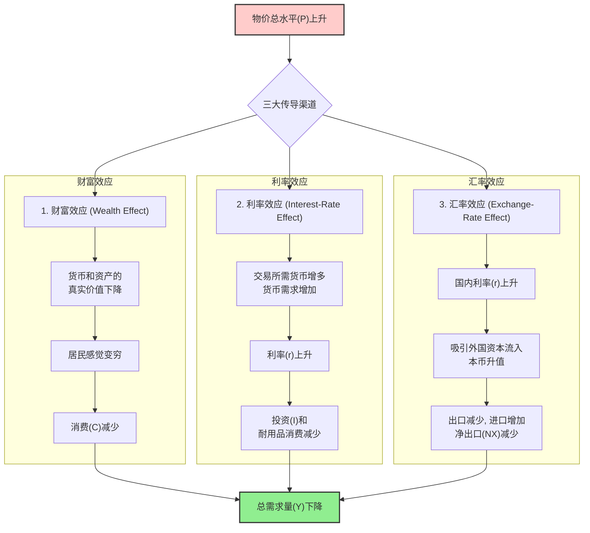

好的，我们开始吧。作为你的知识讲解者，我将遵循“引导式教学模型”，带你一步步深入理解一个宏观经济学中的核心问题：总需求（AD）曲线为何向右下方倾斜。

### **总需求曲线为何向右下方倾斜？三大效应解析**

---

#### 1. **问题引入**

想象一下，你正在收听一则财经新闻。新闻主播提到：“由于近期整体物价水平出现上涨苗头，经济学家普遍预测，未来几个季度的整体经济产出需求可能会有所放缓。”

你可能会感到困惑：在我们的日常经验中，某个商品涨价，我们可能会少买它，而去买别的替代品。但如果所有东西——从面包、汽车到理发服务——的**平均价格**都在上涨，整个国家对商品和服务的总需求为什么会下降呢？难道大家不还是得生活、消费和投资吗？这背后并没有简单的“替代品”可以转换。这个看似简单实则深刻的问题，正是我们今天要探讨的核心。

#### 2. **核心定义与生活化类比**

**核心定义**:
总需求（AD）曲线向右下方倾斜，描述的是一个经济体中**整体物价水平（Price Level）**与**所有商品和服务的总需求量（Real GDP）**之间的负相关关系。简单来说，当物价总水平上升时，经济中的总需求量会下降；反之，当物价总水平下降时，总需求量会上升。

**生活化类比：“商场购物”的两种情景**

*   **情景一（微观经济学）：单个店铺打折**
    你走进一家大商场，发现只有你最喜欢的A品牌服装店在打五折。你很可能会把原本准备买B品牌或C品牌鞋子的钱，拿来多买几件A品牌的衣服。这体现了替代效应，是解释微观需求曲线为何向下的关键原因之一——你用更便宜的商品替代了其他商品。

*   **情景二（宏观经济学）：整个商场普涨**
    现在，想象一个完全不同的情况：商场广播通知，由于成本上升，**所有店铺**的**所有商品**价格都上涨10%。这时，你无法通过“从B品牌换到A品牌”来省钱，因为所有东西都变贵了。你的钱包里的现金能买到的东西变少了，你可能会觉得手头变紧，决定取消购买那件非必需的外套，甚至推迟换手机的计划。

总需求曲线的逻辑更像情景二。它探讨的不是单个商品价格变化，而是整个经济“大商场”里物价总水平的变化如何影响你的总购买力、借贷成本和国际购买力，从而改变整个经济的总需求。

#### 3. **最小示例：一个简单的场景走查**

假设经济中的物价总水平（可以理解为消费者价格指数CPI）从100上升到120。我们来看这对经济中的不同决策者意味着什么：

*   **对于一个家庭（影响消费C）**: 你银行里有10万元存款，这是你的财富。当物价水平是100时，这10万元的购买力很强。当物价水平上升到120时，同样是10万元，能买到的东西变少了。你感觉自己“变穷”了，于是决定将原定的海外旅行计划缩减为国内游。**你的消费需求下降了。**

*   **对于一家企业（影响投资I）**: 物价上涨，人们进行日常交易需要更多的现金。为了持有更多现金，人们可能会出售债券或从银行提款。这导致对货币的需求增加，从而推高了借贷的成本——即利率。作为一家希望贷款扩大生产线的企业，你发现借款成本变高了，于是决定推迟投资计划。**企业的投资需求下降了。**

*   **对于国际贸易（影响净出口NX）**: 国内利率上升，吸引了希望获得更高回报的外国投资者。他们需要用外币兑换本国货币来投资，这导致本国货币升值。本国货币“变贵”了，意味着本国生产的商品在国际市场上也变贵了，出口会减少。同时，外国商品相对变得便宜，进口会增加。一减一增之间，**净出口需求下降了。**

你看，一个物价总水平的上升，通过三个不同的渠道，最终导致了消费、投资和净出口的减少，从而使总需求量下降。

#### 4. **原理剖析：三大效应的内在机制**

总需求曲线向右下方倾斜的背后，是三个核心的经济学效应在同时起作用。它们共同解释了物价水平如何影响总需求量。

 

 

1.  **财富效应（The Wealth Effect）**
    *   **核心逻辑**: 当物价水平P上升时，公众手中持有的货币以及以名义价值固定的资产（如某些债券）的真实购买力就会下降。
    *   **传导路径**: 人们会感觉自己的真实财富减少了，变得“更穷”，因此会减少消费支出（C）。由于消费是总需求（C+I+G+NX）的最大组成部分，消费的下降会直接导致总需求量下降。

2.  **利率效应（The Interest-Rate Effect）**
    *   **核心逻辑**: 当物价水平P上升时，人们需要更多的货币来完成日常交易（买同样的咖啡需要花更多的钱）。这增加了对货币的需求。
    *   **传导路径**: 在货币供给没有变化的情况下，货币需求的增加会推高“货币的价格”——也就是利率。更高的利率意味着企业贷款扩张和家庭贷款购买房屋、汽车的成本都上升了。因此，投资支出（I）和部分对利率敏感的消费支出（如购买耐用品）会减少，从而导致总需求量下降。在大多数大型经济体中，这通常被认为是**最重要**的效应。

3.  **汇率效应（The Exchange-Rate Effect）**
    *   **核心逻辑**: 这是利率效应在国际贸易中的延伸。
    *   **传导路径**: 如上所述，物价水平P上升导致国内利率上升。这会吸引寻求高回报的外国投资者，他们需要购买本国货币以投资于本国的资产（如债券）。对本国货币需求的增加会导致本国货币相对于外币升值（汇率上升）。本币升值使得本国商品在国际上变得更贵，从而抑制出口；同时，外国商品相对便宜，会刺激进口。因此，净出口（NX = 出口 - 进口）会下降，导致总需求量下降。

这三个效应共同作用，构成了物价总水平与总需求量之间的负相关关系，使得总需求曲线呈现出向右下方倾斜的形态。

#### 5. **常见误区**

*   **误区一：把总需求曲线当成微观需求曲线的简单加总。**
    *   **辨析**：这是最根本的误解。微观需求曲线向下倾斜的核心是**替代效应**和**收入效应**。但在宏观层面，当**所有**商品和服务的价格普遍上涨时，你无法像在超市里那样“用便宜的苹果替代贵的梨”，因为所有东西都变贵了。总需求曲线的逻辑是建立在上述财富、利率和汇率效应上的，这是一个完全不同的分析框架。

*   **误区二：认为物价变化会“移动”总需求曲线。**
    *   **辨析**：物价总水平的变化只会导致**沿着同一条总需求曲线的移动（movement along the curve）**。例如，从A点（P1, Y1）移动到B点（P2, Y2）。而能够让整条曲线发生**移动（shift）**的，是那些在任何物价水平下都会影响总需求的非价格因素，例如政府支出政策的变化、消费者信心的改变或外国经济的繁荣与衰退等。

#### 6. **总结要点**

为了让你牢牢记住核心知识，这里有几个关键点：

*   **反向关系**: 总需求曲线向右下方倾斜，表明物价总水平与总需求量之间存在负相关关系。
*   **三大引擎**: 这种负相关关系是由**财富效应**（影响消费C）、**利率效应**（影响投资I）和**汇率效应**（影响净出口NX）共同驱动的。
*   **宏观非微观**: 其背后的逻辑与解释单个商品需求曲线的微观经济学原理（替代效应和收入效应）完全不同。
*   **点动而非线动**: 物价水平的变化引起的是沿曲线的**点移动**，而非整条曲线的**线移动**。

#### 7. **思考与自测**

现在，检验一下你是否真正掌握了今天的内容：

1.  **反向思考**：如果一个经济体出现了通货紧缩，即物价总水平**持续下降**，那么上述三大效应会如何反向作用，从而导致总需求量增加？请试着分别描述一遍这个过程。
2.  **情景应用**：在一个对外贸易依存度非常高的小型开放经济体中（例如新加坡），你认为财富效应、利率效应和汇率效应中，哪一个效应对总需求曲线斜率的影响可能最大？为什么？