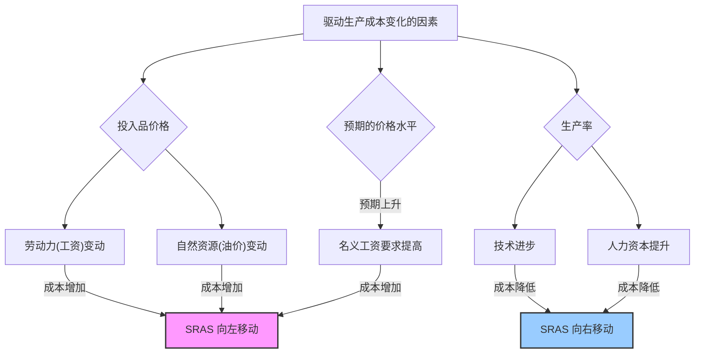

好的，我们开始。作为你的知识讲解者，我将遵循“引导式教学模型”，带你一步步深入理解**总供给曲线的移动**这一宏观经济学的核心概念。

***

### 总供给曲线的移动：驱动生产成本变化的因素

#### 1. 问题引入

想象一下，2020年初，全球性的公共卫生事件爆发。一夜之间，许多工厂停工，港口拥堵，国际物流近乎中断。这导致了芯片、原材料乃至集装箱的严重短缺。不久后，你可能会发现，无论是购买一辆新车，还是一台笔记本电脑，都需要等待更长的时间，并且价格也上涨了不少。

这并非偶然。为什么一个看似孤立的外部事件，会广泛地影响到整个经济体的生产能力和物价水平？这背后其实就是**总供给（Aggregate Supply, AS）**发生了变化。这引出了我们今天要探讨的核心问题：是什么力量在“幕后”推动着整个经济体的总供给曲线移动呢？

#### 2. 核心定义与生活化类比

**核心定义**:
总供给曲线的**移动**（Shift）是指，在**每一个**可能的价格水平上，一个经济体愿意且能够生产的商品和服务的总量发生了变化。这与“沿着曲线的移动”（Movement along the curve）不同，后者仅仅是由于整体价格水平变化而导致的供给量变化。总供给曲线的移动，本质上反映了企业**生产成本**的系统性改变。

*   当生产成本**降低**时，企业在任何售价下都愿意生产更多，总供给曲线向**右**移动（供给增加）。
*   当生产成本**升高**时，企业在任何售价下都只能生产更少，总供给曲线向**左**移动（供给减少）。

**生活化类比：披萨店的菜单**
把整个国家的经济想象成一家巨大的披萨店。
*   **价格水平**就是菜单上的披萨售价。
*   **总供给量**就是这家店在特定售价下，一天能做出多少披萨。

现在，假设制作披萨最重要的原料——面粉，价格突然翻了一番。
*   **成本冲击**: 对于披萨店老板来说，现在每制作一个披萨的成本都显著增加了。
*   **供给决策**: 如果菜单价格不变，老板的利润会大幅缩水，甚至亏本。为了维持利润，他可能会决定减少披萨的产量，或者在同样的价格下，只能提供尺寸更小的披萨。
*   **曲线移动**: 这意味着，无论菜单上的标价是50元、60元还是70元，这家店现在愿意供应的披萨数量都比以前少了。这就好比整个“供给能力”的清单都缩水了，反映在图上，就是总供给曲线向左移动了。

反之，如果一项新的烘焙技术让烤箱效率加倍，节省了电力和时间（成本降低），老板在任何价格下都乐意生产更多的披萨，总供给曲线就会向右移动。

#### 3. 最小示例

我们用一个简单的宏观经济场景来走查这个过程：

1.  **初始状态**: 假设一个经济体处于稳定状态。企业对劳动力、能源和原材料的成本有着稳定的预期，短期总供给曲线（SRAS）位置固定。
2.  **外部冲击**: 突然，由于地缘政治冲突，全球主要产油国宣布大幅减产，导致国际原油价格在短时间内飙升。
3.  **成本传导**: 对于这个经济体中的绝大多数企业而言，石油是关键的生产投入。无论是工厂的机器运转、物流卡车的运输，还是办公室的电力供应，其成本都直接或间接地与油价挂钩。因此，普遍性的**生产成本上升**了。
4.  **企业反应**: 面对更高的成本，在现有的产品售价下，企业的利润空间被严重挤压。为了应对，企业会选择减少产量和雇佣，甚至进行裁员。
5.  **宏观结果**: 由于大量的企业都采取了类似行动，导致在任何给定的总体价格水平下，整个经济体生产的商品和服务总量都减少了。在图形上，这表现为**短期总供给曲线（SRAS）整体向左平移**。

这个过程正是“石油危机如何引发滞胀”的核心逻辑之一：供给减少（产出下降）同时伴随着成本推动的通货膨胀（价格水平上升）。

#### 4. 原理剖析

短期总供给曲线（SRAS）的移动，根本上源于那些改变企业生产成本、但又**不是**整体价格水平（P）本身变化的因素。我们可以将这些因素归纳为三大类：

1.  **投入品价格（Input Prices）的变动**
    这是最直接的驱动因素。当关键生产要素的价格发生变化时，会直接影响企业的成本结构。
    *   **劳动 (Labor)**: 工资是许多企业最大的成本之一。如果最低工资标准上调、工会力量增强导致工资集体上涨，或者劳动者对未来通胀预期提高而要求加薪，都会增加劳动力成本，使SRAS左移。
    *   **资本 (Capital)**: 这里主要是指生产设备、机器等。如果企业运营所必需的通用软件订阅费、设备维护费用或关键进口零部件价格普遍上涨，也会直接增加当期生产成本，导致SRAS左移。
    *   **自然资源 (Natural Resources)**: 这是最典型的供给冲击来源。例如，石油价格（影响能源和运输成本）、金属矿产价格、农产品价格（影响食品加工业）等。如我们的示例中，油价上涨导致SRAS左移。反之，发现新的大型油田则可能使SRAS右移。

2.  **生产率（Productivity）的变动**
    生产率衡量的是单位投入（如每小时劳动）能够产出的商品和服务数量。生产率的提高，意味着单位产出的成本降低。
    *   **技术进步 (Technological Progress)**: 这是提高生产率最主要的动力。互联网的普及、自动化生产线的应用、人工智能的赋能，都使得企业可以用更少的投入获得更多的产出，从而降低了生产成本，使SRAS向**右**移动。
    *   **人力资本 (Human Capital)**: 劳动者的教育水平和技能提升，也会带来生产率的提高，效果与技术进步类似，推动SRAS右移。

3.  **预期的未来价格水平（Expected Price Level）的变动**
    这是宏观经济学中一个较为精妙的机制，与“粘性工资”和“粘性价格”理论紧密相关。
    *   **机制**: 如果企业和工人都**预期**未来的物价会普遍上涨，工会和员工就会在当下的工资谈判中要求更高的名义工资，以维持未来的实际购买力。
    *   **影响**: 企业如果同意了加薪（因为他们也预期未来能以更高的价格卖出产品），那么劳动力成本**立即**就上升了。这种成本的上升，在实际价格水平还未变化之前，就已经发生了。
    *   **结果**: 对未来价格的**高预期**，会导致**当前**的生产成本上升，从而使SRAS向**左**移动。反之，如果预期未来会通缩，则可能使SRAS右移。

我们可以用一个流程图来总结这些驱动因素：

#### 5. 常见误区

1.  **误区一：混淆“曲线上移动”与“曲线的移动”**
    *   **错误理解**: “物价上涨了，企业为了多赚钱，肯定会生产更多，所以总供给曲线向右移动。”
    *   **纠正**: 物价（整体价格水平）上涨，企业确实会增加供给量，但这表现为**沿着**一条既定的、向右上方倾斜的SRAS曲线向右上角移动。而**曲线本身的移动**，是由物价之外的、影响**生产成本**的因素（如油价、工资、技术）所驱动的。前者是“量变”，后者是“质变”。

2.  **误区二：认为任何商品价格变化都会移动总供给曲线**
    *   **错误理解**: “最近猪肉价格上涨了，这会使总供给曲线向左移动。”
    *   **纠正**: 只有那些作为**广泛生产投入**的、具有**系统性影响**的要素价格变动，才会显著移动宏观经济的总供给曲线。猪肉价格主要影响的是食品行业和消费者，但它不是像石油或劳动力那样贯穿所有行业的基础性投入。因此，它的影响不足以导致整个SRAS曲线发生宏观意义上的移动。

#### 6. 拓展应用

（此部分根据指令不包含具体案例片段，仅作原理性阐述）

1.  **分析经济冲击与政策应对**:
    理解SRAS的移动，是区分**需求冲击**（如政府增加开支）和**供给冲击**（如石油危机）的关键。供给冲击（尤其是负向的）通常更难处理，因为它同时带来失业（产出下降）和通胀（价格上涨），即“滞胀”。这使得货币政策和财政政策陷入两难：刺激需求会加剧通胀，而抑制需求则会加深衰退。

2.  **评估长期经济增长潜力**:
    虽然我们讨论的是短期总供给曲线，但驱动其向右移动的积极因素——尤其是**技术进步**和**人力资本积累**——也正是推动长期总供给曲线（LRAS）移动、实现经济长期增长的根本动力。因此，分析这些因素的变化，有助于预测一个国家长期的发展潜力。

#### 7. 总结要点

1.  **核心驱动力**: 短期总供给曲线（SRAS）的移动，根源在于**生产成本**的普遍性变化，而非整体价格水平的变动。
2.  **三大因素**: 导致SRAS移动的主要因素可归为三类：**投入品价格**（如工资、油价）、**生产率**（如技术进步）和**对未来价格的预期**。
3.  **移动方向**: 生产成本**上升**（如油价上涨、预期通胀加剧）导致SRAS向**左**移动（供给减少）；生产成本**下降**（如技术突破）导致SRAS向**右**移动（供给增加）。
4.  **重要区分**: 务必分清“沿着曲线的移动”（由价格水平P变化引起）和“曲线本身的移动”（由成本等非P因素变化引起）。

#### 8. 思考与自测

1.  如果一个国家近年来大力投资于职业教育和技能培训，使得劳动者的平均技能水平显著提高。这会对该国的短期总供给曲线产生什么影响？为什么？
2.  在我们的“披萨店”类比中，如果政府宣布为所有餐饮企业提供电费补贴（相当于降低了能源成本），同时，由于经济前景不佳，人们普遍预期未来物价会下降。这两种因素将如何分别影响披萨店的“总供给曲线”？最终曲线会向哪个方向移动？