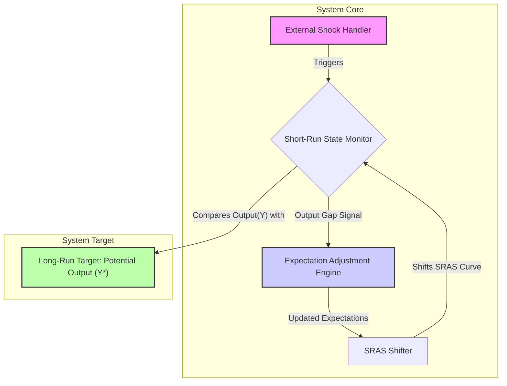

好的，请坐。作为你的架构设计导师，今天我们不谈代码，不谈服务器，我们来聊聊一个宏观、复杂但极具魅力的系统——宏观经济。

你已经掌握了总供给（AS）与总需求（AD）这些基础“组件”，也理解了粘性工资等“系统特性”。现在，我们的任务是**将这些静态的组件组装起来，设计一个能够模拟经济体如何从受到冲击的“瞬时异常状态”自动“恢复”到“长期稳定状态”的动态系统架构**。

我们将严格遵循架构设计的八步模型来完成这次推演。

### 1. **问题引入 (Problem Introduction)**

在系统设计中，我们最怕的不是系统在稳定状态下的表现，而是它在遭受外部冲击（如流量洪峰、依赖服务宕机）时的行为。同样，在宏观经济学中，仅仅描绘出短期均衡点A和长期均衡点C的“静态快照”是远远不够的。

**业务痛点在于：** 静态模型无法解释系统从A到C的**路径（Path）**、**耗时（Latency）**以及**内部状态的迁移逻辑（State Transition Logic）**。当一个负面需求冲击（比如金融危机）发生后，经济系统是如何从一个高失业、低产出的“降级状态”自动进行“故障恢复”（Self-healing），并最终回归其“设计容量”（Potential Output）的？

我们的设计挑战，就是构建一个能够清晰展现这一动态、自愈过程的系统架构。

### 2. **核心目标与类比 (Core Goal & Analogy)**

**核心设计目标：**

*   **Resilience (弹性/韧性):** 设计一个具有负反馈机制的系统，使其在遭受外部冲击后，能够自动回归到预设的长期稳定状态。
*   **State Awareness (状态感知):** 系统的核心组件必须能够准确感知当前状态（如产出缺口）并触发相应的调整逻辑。
*   **Configurable Latency (可配置的延迟):** 系统的调整速度（即工资和价格的“粘性”程度）应被视为一个可配置的关键参数，它直接决定了系统“自愈”过程的痛苦程度和持续时间。

**架构类比：现代数据中心的“自动温控系统”**

*   **长期均衡 (Long-Run Equilibrium / LRAS):** 这就像数据中心设定的**恒定目标温度**（比如 22°C）。这是系统最有效率、最可持续的运行状态。
*   **短期均衡 (Short-Run Equilibrium):** 这是机房内传感器的**实时温度读数**。它可能因为各种原因偏离目标。
*   **外部冲击 (Shock):** 突然打开服务器机柜门（**负面需求冲击**，冷空气涌入），导致局部温度骤降。或者，一台核心服务器的散热风扇故障（**负面供给冲击**），导致局部过热。
*   **粘性价格/工资 (Sticky Prices/Wages):** 温控系统的**响应延迟**。传感器检测到温度变化，但空调压缩机不会瞬间全功率启动或停止。它有一个内置的、防止系统频繁振荡的阻尼/延迟机制。
*   **动态调整过程 (Adjustment Process):** 系统检测到温度偏离（产出缺口），通过内部的PID控制器（**预期调整机制**），逐步、平滑地增加或减少冷气输出（**调整短期总供给**），直到实时温度再次稳定在22°C的目标上。

我们的任务，就是设计这个经济体的“PID控制器”和其反馈回路。

### 3. **最小示例 (核心组件图)**

让我们用一张最简化的流程图来勾勒出这个自愈系统的核心反馈回路。



*   **Shock Handler (冲击处理器):** 系统的入口，负责接收并应用外部事件（如AD或SRAS的初始移动）。
*   **Short-Run State Monitor (短期状态监视器):** AD与当前SRAS的交点，持续输出系统的当前状态（`Output Y`, `Price Level P`）。
*   **Expectation Adjustment Engine (预期调整引擎):** 系统的“大脑”。它持续比较`Y`和`Y*`，产生“产出缺口”信号，并据此调整内部的工资/价格预期。
*   **SRAS Shifter (短期总供给调整器):** 根据“预期调整引擎”的输出，物理地移动SRAS曲线。
*   **Long-Run Target (长期目标):** 系统的基准或“设定点”，即潜在产出 `Y*`（由LRAS定义）。

### 4. **原理剖析 (详细设计与权衡)**

现在我们深入到每个组件的内部，并用一张序列图来展示一次典型的负面需求冲击后的系统交互过程。

**组件详细职责：**

1.  **Shock Handler (Event-Driven):**
    *   **接口:** `applyShock(type, magnitude)`，例如 `applyShock('NegativeDemand', -X)`，其中 `-X` 代表总需求曲线在横轴上向左平移的量。
    *   **职责:** 接收外部事件，直接修改对应曲线的“配置”（例如，将AD曲线的截距向左平移）。这是整个动态过程的触发器。

2.  **State Monitor & Gap Detector (Continuous Polling/Event-Triggered):**
    *   **职责:**
        *   计算AD和SRAS曲线的交点，得到瞬时 `(P, Y)`。
        *   从`Long-Run Target`组件获取 `Y*`。
        *   计算 `OutputGap = Y - Y*`。
        *   广播 `StateUpdate` 事件，包含 `(P, Y, OutputGap)`。
    *   **设计权衡:** 这是一个状态计算单元。它的更新频率可以被认为是连续的。

3.  **Expectation Adjustment Engine (The Core Logic):**
    *   **职责:** 监听 `StateUpdate` 事件。这是整个自愈机制的核心。
        *   **IF `OutputGap < 0` (Recessionary Gap):** 系统检测到“资源闲置”（高失业率）。这会触发一个降低名义工资和价格预期的过程。逻辑上，工人会逐渐接受较低的工资增长，企业也会因需求不足而下调价格预期。此过程将驱动SRAS曲线向右（下）移动，直到产出缺口消除。
        *   **IF `OutputGap > 0` (Inflationary Gap):** 系统检测到“超负荷运载”（低失业率，劳动力短缺）。这会触发一个提升名义工资和价格预期的过程。逻辑上，工人会要求更高的工资，企业也会因需求旺盛而提升价格预期。此过程将驱动SRAS曲线向左（上）移动，直到产出缺口消除。
    *   **关键参数 (Trade-off): `AdjustmentSpeed (α)`**
        *   这个参数代表了工资和价格的“粘性”程度。`α` 越大，代表粘性越小，预期调整越快，系统恢复到 `Y*` 的速度就越快。
        *   **凯恩斯主义视角:** `α` 非常小，尤其是在萧条时期（工资只上不下），自愈过程极其漫长且痛苦，因此需要外部干预。
        *   **新古典主义视角:** `α` 相对较大，市场能相当有效地自行调整。

4.  **SRAS Shifter (The Actuator):**
    *   **职责:** 接收来自`Expectation Adjustment Engine`的指令，更新SRAS曲线的方程（通常是纵轴截距）。预期的降低会使SRAS曲线**向右（下）**移动，反之则**向左（上）**移动。

**动态交互序列图 (以负面需求冲击为例):**

```mermaid
sequenceDiagram
    participant User as External Event
    participant ShockHandler as SH
    participant AD_Curve as AD
    participant SRAS_Curve as SRAS
    participant StateMonitor as SM
    participant ExpectationEngine as EE

    User->>SH: applyShock('NegativeDemand')
    SH->>AD_Curve: shiftLeft()
    note right of AD_Curve: 经济进入衰退，从初始长期均衡点 A 移动到新的短期均衡点 B (Y1 < Y*, P1 < P0)。
    
    loop Adjustment Process (t=1, 2, ... n)
        SM->>SRAS_Curve: getCurrentSRAS()
        SM->>AD_Curve: getCurrentAD()
        SM-->>SM: calculateIntersection(Y1, P1)
        SM-->>EE: notifyState(OutputGap < 0)
        
        note right of EE: 检测到衰退缺口，失业率高。
工资和价格预期开始下降。
        EE->>EE: lowerExpectations(α)
        EE->>SRAS_Curve: command.shiftRightAndDown()
        
        note left of SRAS_Curve: 生产成本降低，
SRAS曲线向右（下）移动。
        
        SM->>SM: calculateNewIntersection(Y2, P2)
        note right of SM: 经济从点 B 逐步调整，达到中间短期均衡点 (Y2, P2)。
产出部分恢复，价格进一步下降。
    end

    note over User, EE: 此循环持续进行，
直到产出缺口消失 (Yn ≈ Y*)，
经济在更低的价格水平(Pn)上
恢复到新的长期均衡点 C。
```

### 5. **常见误区 (Anti-patterns)**

*   **反模式1：混淆状态与配置 (Confusing State with Configuration)**
    *   **误区:** 将沿着总需求曲线的移动（由价格水平变化引起）与总需求曲线本身的移动（由外部冲击引起）相混淆。
    *   **架构师视角:** 这是混淆了系统的**运行时状态变化**（沿着曲线移动）和一个**配置变更**（曲线平移）。`Shock Handler`执行的是配置变更，而`State Monitor`计算的是在当前配置下的运行时状态。

*   **反模式2：忽略系统的延迟/惯性 (Ignoring System Latency)**
    *   **误区:** 假设经济体会从一个均衡点“跳跃”到另一个，而忽略了调整过程。
    *   **架构师视角:** 这相当于设计了一个没有考虑到网络延迟、磁盘I/O延迟或CPU调度延迟的系统。正是“粘性”（Latency）这个特性，才使得短期和长期的区分成为必要，才产生了整个动态调整的故事。

*   **反模式3：硬编码调整速度 (Hardcoding Adjustment Speed)**
    *   **误区:** 认为工资和价格的调整速度是恒定不变的。
    *   **架构师视角:** `AdjustmentSpeed (α)` 不是一个常量，它本身可能是一个复杂的函数，取决于经济环境（例如，在通胀高企时，人们对价格调整更敏感，`α` 更大）。一个优秀的架构应该将这个参数模块化，而不是硬编码。

### 6. **拓展应用 (演进路线)**

**v1.0: 自愈系统 (当前设计)**
*   一个纯粹的、依赖内部负反馈机制进行自我修正的系统。对应于一个没有政府或央行干预的古典经济模型。

**v2.0: 引入主动干预控制器 (Adding Policy Controller Module)**
*   自愈过程可能非常缓慢，导致长期的社会痛苦（如高失业）。因此，我们需要引入一个“主动运维”模块。
*   **新组件: `Policy Controller` (政府 & 中央银行)**
    *   **职责:** 同样监听`StateMonitor`发布的 `StateUpdate` 事件。
    *   **操作:** 当检测到巨大的负向 `OutputGap` 时，不再被动等待 `ExpectationEngine` 缓慢工作，而是可以主动出手：
        *   **货币策略:** `PolicyController.monetaryStimulus()` -> `AD_Curve.shiftRight()` (通过降息等手段)
        *   **财政策略:** `PolicyController.fiscalStimulus()` -> `AD_Curve.shiftRight()` (通过增加政府支出或减税)
*   **新引入的权衡 (New Trade-offs):**
    *   **干预速度 vs. 精准度:** 主动干预可以大大缩短恢复时间，但可能因为数据延迟和模型不准导致“操作过猛”（Overshooting），引发未来通货膨胀等新问题。
    *   **短期修复 vs. 长期依赖:** 过度依赖主动干预，可能会削弱系统自身的`Expectation Adjustment Engine`的效率，形成“政策依赖”。

### 7. **总结要点**

1.  **核心是负反馈回路:** 宏观经济的长期稳定性，源于一个基于“产出缺口”的负反馈调节机制。`产出缺口 -> 预期调整 -> SRAS移动 -> 产出缺口缩小`。
2.  **“粘性”是关键:** 工资和价格的“粘性”是系统的核心“延迟”特性，它创造了短期和长期的区别，是理解经济波动的关键。
3.  **状态驱动设计:** 整个调整过程是状态驱动的。系统的每一步行为都取决于其当前所处的状态（主要是产出缺口的大小和方向）。
4.  **模型演进:** 从一个纯粹的自愈系统（v1.0）演进到一个包含主动干预控制器的更复杂的系统（v2.0），这反映了从古典经济学到凯恩斯主义经济学的核心思想演变。

### 8. **思考与自测**

现在，轮到你了。请运用我们今天建立的架构思维来回答这个问题：

**“如果系统中发生了一个持续性的、正面的技术冲击（例如AI技术的普及），永久性地提升了经济的生产效率，从而提高了潜在产出（Y*）。现有架构的哪个组件的‘核心配置’最先需要被更新？这个更新会如何通过我们设计的系统传导，最终形成新的长期均衡？”**
