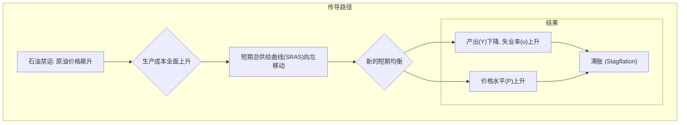

好的，我们现在进入宏观经济的“实战推演室”。想象一下，时间拨回到上世纪70年代，你我都是美联储某个核心政策分析小组的成员。当时，经济仪表盘上的指针正以一种前所未见的方式疯狂摆动，所有经典的教科书理论似乎都失灵了。我们正面临一场前所未有的风暴，而我们的任务，就是在这片迷雾中，找到风暴的核心，并绘制出它的路径。

这，就是关于“滞胀”（Stagflation）——这个曾让一代经济学家束手无策的怪兽——的真实故事。

---

### **案例透视：石油危机如何引发“滞胀”？**

#### **1. 问题引入 (故事背景)**

那是1973年的秋天。会议室里烟雾缭绕，墙上挂着巨大的图表，其中最引人注目的是菲利普斯曲线——我们过去几十年笃信不疑的信条，它清晰地描绘了通货膨胀与失业率之间的反向关系。然而，桌上最新的电传数据显示，这个信条正在崩塌。

> **[案例片段]**
> *来自经济分析局的紧急备忘录 (1973年11月):*
> “初步数据显示，失业率正攀升至4.9%，与此同时，消费者价格指数（CPI）同比上涨超过8%。两个指标同时恶化，这与我们模型预测的‘权衡取舍’完全背离。我们必须重新评估宏观经济环境。”

我们的挑战是巨大的：我们所面对的，不是简单的经济过热（高通胀、低失业）或衰退（低通胀、高失业）。我们面对的是一个“混合体”——经济停滞（Stagnation）与通货膨胀（Inflation）同时发生。我们的目标是：**解释这个“不可能”现象的成因，并为决策者提供一个可靠的分析框架，以应对这场前所未有的危机。**

#### **2. 核心方案与类比**

当时，主流的凯恩斯主义模型主要聚焦于总需求（AD）的管理。但数据显示，仅仅调整需求端的阀门（如政府支出或利率）似乎无法解决问题。小组里一位资深的、更注重供给面分析的经济学家，让我们把目光从需求曲线移开，转向那条我们之前认为相对稳定的**短期总供给曲线（SRAS）**。

他提出的核心方案是：**这次危机的根源并非需求失控，而是一次剧烈的、负面的“供给冲击”（Supply Shock）。**

为了让大家理解，他打了一个生动的比方：
“各位，请把我们的经济想象成一台精密的内燃机。总需求（AD）就像是油门，决定了我们想让引擎转多快。而总供给（AS）则是引擎本身的工作效率和它所使用的燃料。几十年来，我们一直在研究如何踩油门。但现在，问题出在了燃料上。有人往我们的汽油里掺了沙子——这就是OPEC（石油输出国组织）的石油禁运。这沙子（高昂的石油成本）不仅让燃料变得极其昂贵（**通货膨胀**），还严重磨损了引擎，使其运转效率大大降低，输出功率下降（**经济停滞**）。你现在再怎么猛踩油门，引擎也只会发出更大的噪音、产生更多的热量，但转速就是上不去。”

这个类比一针见血：问题的核心是**生产成本的外部冲击**，它直接打击了经济的供给能力。

#### **3. 最小示例 (关键代码/配置)**

*(此部分根据指令不适用)*

#### **4. 原理剖析 (方案执行与决策过程)**

我们的分析小组沿着“供给冲击”这条线索，一步步解构了整个事件的传导链条。

**第一步：识别冲击源头 (The Shock)**

1973年10月，第四次中东战争爆发，OPEC为了打击对手以色列及支持以色列的国家，宣布实施石油禁运，并大幅提高油价。原油价格在短短几个月内飙升了近4倍。

> **[案例片段]**
> *路透社电讯 (1974年1月):*
> “西德克萨斯中质原油价格已突破每桶10美元，而一年前仅为3美元。全球工业的‘血液’正在以前所未有的速度变得昂贵。”

**第二步：追踪传导机制 (The Transmission)**

石油是现代经济的命脉，从交通运输到工业生产，再到化肥电力，无处不在。油价的飙升，意味着几乎所有企业的生产成本都急剧上升。

根据我们之前讨论的“粘性工资理论”——即名义工资在短期内是固定的或调整缓慢的——现在，企业面临着飙升的能源成本，但工资成本却是“粘性”的。为了维持利润（或者说减少亏损），企业只有两个选择：
1.  **提高产品售价**，将成本压力转嫁给消费者。
2.  **削减产量和雇员**，因为在任何给定的价格水平上，生产的利润空间都变小了。

这两个选择的宏观经济后果，恰好就是通胀和失业。

**第三步：模型化分析 (The AD-AS Model in Action)**

我们将这一过程在AD-AS模型图上进行了推演：
*   **初始状态 (点A)**：经济处于长期均衡点，产出等于自然产出率（Yn），物价水平为P1。
*   **供给冲击**：急剧上升的生产成本导致**短期总供给曲线（SRAS）向左上方移动**（从SRAS1移动到SRAS2）。这意味着在任何给定的价格水平上，企业愿意且能够供给的商品和服务总量都减少了。
*   **新的短期均衡 (点B)**：总需求曲线（AD）未变，但它现在与新的SRAS2相交于点B。在这一点上，我们看到了一个全新的、令人不安的组合：**产出水平下降**（从Yn到Y2），导致经济衰退和失业率上升；同时，**价格水平上升**（从P1到P2），引发了严重的通货膨胀。

**“滞胀”在图形上得到了完美的解释。**

**第四步：直面政策困境 (The Policy Dilemma)**

这个分析框架揭示了一个极为棘手的政策难题。如果我们采用传统的扩张性政策（增加政府支出或降息）来刺激总需求（将AD1右移），试图将产出拉回Yn，那么新的均衡点（点C）虽然能使产出恢复到Yn，但其价格水平（P3）将会变得更高，从而**加剧通货膨胀**。反之，如果我们采用紧缩性政策来抑制通胀（将AD1左移），则会**进一步扼杀产出，加剧经济衰退和失业**。

决策者陷入了“两难”的绝境。这解释了为什么70年代的宏观政策显得如此摇摆不定和无效。

#### **5. 通胀预期的自我实现与螺旋 (The Self-Fulfilling Prophecy of Inflation)**

然而，滞胀并非仅仅是短期供给冲击的即时结果。其持续性和顽固性，更深层的原因在于**通胀预期的脱锚（Unanchored Inflation Expectations）**。

在最初的石油冲击导致物价飙升后，工人和企业开始改变他们对未来通胀的预期。工人要求更高的名义工资，以弥补生活成本的上涨；企业则在定价时考虑更高的未来成本，并提前提高产品价格。这种“工资-物价螺旋”（Wage-Price Spiral）形成了自我实现的循环：
*   **更高的通胀预期 → 工资上涨要求 → 企业生产成本进一步上升 → 企业提高产品价格 → 更高的实际通胀 → 进一步强化通胀预期**。

在AD-AS模型中，这意味着即使初始的石油冲击平息，但只要通胀预期保持高位，短期总供给曲线（SRAS）就会持续向左上方移动。这种持续的供给侧收缩，使得经济长期处于高通胀和高失业并存的“滞胀陷阱”中，常规的需求管理政策变得更加无效。决策者面临的挑战不仅是要应对当前的冲击，更要重建公众对物价稳定的信心，重新“锚定”通胀预期。这正是后来美联储主席保罗·沃尔克（Paul Volcker）在80年代初采取极端紧缩政策的关键原因，他宁愿冒着严重衰退的风险，也要打破通胀预期，恢复央行的公信力。

#### **6. 常见误区 (复盘与反思)**

我们复盘时发现，当时最大的误区在于**“路径依赖”的思维定式**。

*   **误区**：将所有经济问题都归因于总需求不足或过度。当看到失业率上升时，政策制定者的第一反应是“需求不足，需要刺激”；看到通胀时，则认为是“需求过热，需要紧缩”。他们无法想象两者会同时发生。
*   **反思**：这次危机给我们上了痛苦但宝贵的一课——**必须区分冲击的来源是需求侧还是供给侧**。用应对需求冲击的药方去治疗供给冲击，不仅无效，反而会加重病情。这就像给一个因失血而休克的病人使用降压药一样，是致命的错误。我们本可以更早地识别出这是一次成本推动型通胀，而非需求拉动型通胀。

#### **7. 拓展应用 (经验迁移)**

70年代石油危机的经验，成为了宏观经济学一块不朽的基石。它的教训在今天依然适用，甚至更为重要。

*   **2020-2022年全球疫情与供应链危机**：全球供应链中断、劳动力市场错配、港口拥堵，这些都是典型的负向供给冲击。它导致许多商品（如芯片、汽车）供给减少、价格飞涨，同时经济增长放缓。许多国家都出现了“滞胀”的魅影。
*   **2022年俄乌冲突**：冲突直接导致全球能源和粮食价格飙升，这与1973年的石油危机如出一辙，是一次经典的供给冲击。各国央行再次面临着70年代那种在“抗通胀”和“稳增长”之间的艰难抉择。

核心经验就是：**在制定宏观政策前，首要任务是诊断冲击的性质。面对供给侧冲击，单纯的需求管理工具效果有限，甚至可能适得其反。政策工具箱需要扩展到包括改善供给效率、保障关键物资链、推动技术创新等长期结构性改革。**

#### **8. 总结要点**

这场危机深刻地改变了宏观经济学。我们小组最终向决策层提交的报告，核心要点如下：

1.  **“滞胀”的根源**：70年代的滞胀并非需求失调，而是由石油禁运引发的**剧烈负向供给冲击**。
2.  **核心分析工具**：**AD-AS模型**，特别是对SRAS曲线移动的分析，是理解滞胀现象不可或缺的框架。它清晰地展示了成本冲击如何同时导致产出下降和物价上涨。
3.  **政策的局限性**：传统的总需求管理政策在应对供给冲击时面临“两难困境”，无法同时实现控制通胀和稳定就业的双重目标。
4.  **范式转变**：滞胀暴露了菲利普斯曲线的局限性，并强调了**通胀预期管理**的重要性，催生了对理性预期、供给学派经济学等新理论的深入研究。

#### **9. 思考与自测**

现在，把问题交给你。

**“如果你是当时的美联储主席亚瑟·伯恩斯（Arthur Burns），在1974年初，已经清楚地认识到这是一场供给冲击。当时，公众对通胀的愤怒和对失业的恐惧同样强烈。在你的政策工具箱里，只有利率和货币供给。你会选择优先对抗哪一个‘敌人’——通胀还是衰退？你的决策逻辑是什么？并请思考，你的选择会对接下来几年的经济路径（例如，通胀预期的形成）产生怎样的深远影响？”**

---
### **参考文献**
1.  Blinder, A. S. (1979). *Economic Policy and the Great Stagflation*. Academic Press.
2.  Mankiw, N. G. (2021). *Macroeconomics*. Worth Publishers. (Relevant chapters on Aggregate Supply and the Phillips Curve).
3.  Barsky, R. B., & Kilian, L. (2004). Oil and the Macroeconomy since the 1970s. *Journal of Economic Perspectives, 18*(4), 115-134.
