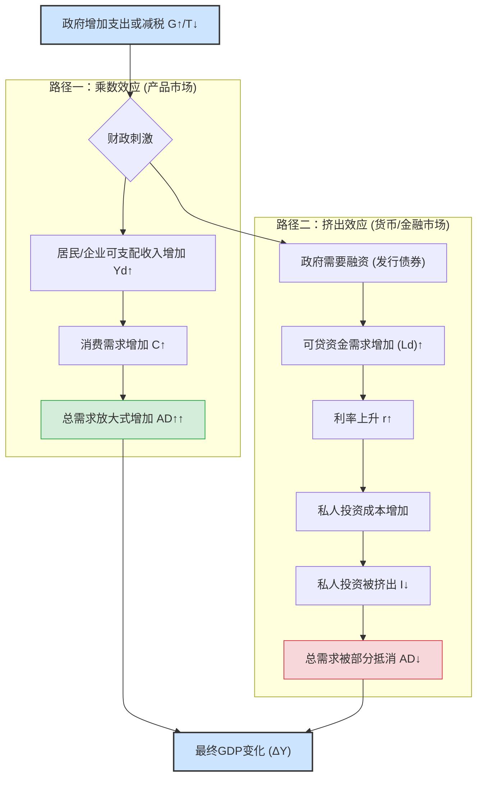

好的，我们开始吧。作为你的知识讲解者，我将采用“引导式教学模型”，带你一步步深入理解财政政策传导机制中的两大核心力量：**乘数效应**与**挤出效应**。

---

### **财政政策的传导：乘数效应与挤出效应**

#### 1. 问题引入

想象一下，经济正处于低谷，失业率攀升，消费低迷。政府为了“救市”，宣布了一项宏大的计划：投资1000亿元修建一条新的高速铁路。

一个直观的问题立刻浮现在我们脑海中：这1000亿元的投资，最终能让整个国家的经济总量（GDP）增加多少呢？是正好1000亿，还是会更多，或者……甚至更少？

这个问题正是我们今天要探讨的核心。政府的财政支出就像是投入经济这部机器的一股初始力量，但这股力量如何传导、会产生怎样的连锁反应，以及是否会遇到阻力，就是由“乘数效应”和“挤出效应”这两个概念来解释的。

#### 2. 核心定义与生活化类比

让我们先用最通俗的语言来定义这两个概念。

*   **乘数效应 (Multiplier Effect)**: 指政府的初始支出，通过一轮又一轮的消费和再支出，最终导致国民总收入成倍增加的效果。这是一种“放大”效应。
*   **挤出效应 (Crowding-Out Effect)**: 指政府为增加支出而进行的借贷行为，推高了利率，从而抑制（或“挤出”）了私人部门的投资和消费。这是一种“削弱”效应。

**生活化类比：一场篝火晚会**

把整个经济想象成一场篝火晚会。

*   **乘数效应就像“添柴火”**：
    *   政府投入1000亿（**第一根大木柴**）点燃了篝火。
    *   拿到钱的建筑工人（第一批参与者）会把一部分钱用于消费，比如去餐厅吃饭（他们添了**一些小木柴**）。
    *   餐厅老板赚了钱，又会去买更多的食材，或者给员工发奖金（他们又添了**更小的碎木柴**）。
    *   就这样，一根大木柴引发了连锁反应，让篝火越烧越旺。最初的一点投入，带来了远超其本身的热量。

*   **挤出效应就像“抢氧气”**：
    *   篝火燃烧需要氧气（经济中的**可贷资金**）。
    *   政府为了买那根“大木柴”，需要大量借钱，这就像一个巨大的鼓风机在**猛吸篝火周围的氧气**。
    *   旁边有家小公司，也想点一堆自己的小火（私人投资），但他们发现周围的“氧气”变少了，或者说“借氧气”的成本（**利率**）变高了，于是他们只好放弃或缩小自己的计划。
    *   最终，虽然主篝火很旺，但它却抑制了周围其他小火苗的燃烧。

财政政策的最终效果，就是这场“添柴”与“抢氧气”的博弈结果。

#### 3. 最小示例

我们来用一个简化的数字场景走查一遍。

**场景**: 政府投资100亿元修建公园。我们假设一个关键参数：**边际消费倾向 (Marginal Propensity to Consume, MPC)** 为0.8。这意味着人们每增加1元收入，会将其中的0.8元用于消费，0.2元用于储蓄。

*   **第一轮**: 政府支付100亿元给建筑公司和工人。这100亿直接计入GDP。
*   **第二轮**: 工人和公司股东们获得了100亿元的新收入。根据MPC=0.8，他们会花掉其中的 `100亿 * 0.8 = 80亿` 用于购买商品和服务（比如汽车、食物、娱乐）。这80亿也计入了GDP。
*   **第三轮**: 卖汽车、食物的商家获得了这80亿元的新收入。他们同样会花掉其中的 `80亿 * 0.8 = 64亿`。这64亿再次计入GDP。
*   **第四轮、第五轮...**: 这个过程会持续下去，每一轮的支出都成为下一轮的收入，直到新增的支出趋近于零。

这是一个无穷等比数列求和：`100 + 80 + 64 + 51.2 + ...`

最终增加的总GDP是多少呢？这里有一个简单的数学公式：

$$ 
\text{乘数 (Multiplier)} = \frac{1}{1 - \text{MPC}}
$$

在这个例子中，乘数 = `1 / (1 - 0.8) = 1 / 0.2 = 5`。

这意味着，政府最初投入的100亿元，理论上最终能使GDP增加 `100亿 * 5 = 500亿`。这就是乘数效应的威力。

#### 4. 原理剖析

现在，我们深入剖析这两种效应背后的经济学原理，并用图表将它们联系起来。

**乘数效应的传导链条：**
其核心在于**消费的连锁反应**。每一次政府支出都直接创造了等额的收入，而这笔收入的大部分（由MPC决定）又会转化为新的消费支出，如此循环往复，形成一个不断放大的正向反馈循环。这个过程直接作用于**产品市场**，拉动总需求。

**挤出效应的传导链条：**
其核心在于**资金市场的资源竞争**。
1.  **政府融资需求**: 政府增加支出，若非增税，通常需要通过发行国债来向社会借钱。
2.  **资金需求增加**: 政府进入**可贷资金市场**（Loanable Funds Market），成为一个主要的借款人，导致对资金的总需求上升。
3.  **利率上升**: 在资金供给不变的情况下，需求的增加必然推高资金的价格——也就是**利率**。
4.  **私人投资下降**: 对于企业和个人而言，更高的利率意味着借款成本增加。原本在较低利率下有利可图的投资项目（如建新工厂、买新设备）现在可能变得无利可图。因此，私人投资意愿下降。
5.  **总需求被部分抵消**: 私人投资是总需求的重要组成部分。它的下降部分抵消了政府支出增加带来的总需求扩张。

下图清晰地展示了财政政策如何同时触发这两条路径：

这个流程图清晰地揭示了，任何一次扩张性财政政策（增加政府支出 G 或减税 T）都会像一个分叉路口，同时激活“乘数”这条正向放大路径和“挤出”这条负向抵消路径。最终的政策效果，取决于这两股力量的相对大小。

#### 5. 常见误区

1.  **误区一：“乘数的大小是固定不变的。”**
    *   **纠正**：乘数的大小（即 `1/(1-MPC)`）在现实中是动态变化的。MPC本身就不是一个恒定的数字。例如，在经济萧条时期，人们对未来悲观，可能更倾向于储蓄而非消费，MPC会降低，乘数效应也随之减弱。此外，如果人们将新增收入用于购买进口商品，这部分支出就流向了国外，无法在国内产生连锁反应（这被称为“进口泄漏”），也会削弱乘数。

2.  **误区二：“只要有政府支出，就一定有强烈的挤出效应。”**
    *   **纠正**：挤出效应的强度取决于经济所处的状态。
        *   **在深度衰退时**：此时私人投资本就非常疲弱，企业和个人持有大量闲置资金，利率也处于低位。政府借款很可能只是动用了这些“沉睡”的储蓄，对利率的影响很小，因此挤出效应也**非常微弱**。这时，乘数效应会占据主导。
        *   **在接近充分就业时**：此时经济资源（劳动力、资本）已经接近满负荷运转，资金市场也比较紧张。政府大规模借款会显著推高利率，导致强烈的挤出效应，甚至可能完全抵消乘数效应。

#### 6. 总结要点

1.  **财政政策的双重传导**：政府的财政刺激会兵分两路，一路通过消费链条产生“乘数效应”放大总需求，另一路通过金融市场竞争产生“挤出效应”削弱总需求。
2.  **乘数效应的核心是MPC**：边际消费倾向（MPC）越高，收入转化为消费的比例越大，连锁反应越强，乘数效应也就越大。
3.  **挤出效应的核心是利率**：政府借贷推高利率，从而抑制私人投资，是挤出效应的主要机制。
4.  **最终效果是净效应**：一项财政政策对经济的最终影响，是乘数效应带来的扩张与挤出效应带来的收缩相互角力后的净结果，其大小取决于当时的经济环境。

#### 7. 思考与自测

1.  假设一个国家正处于严重的经济衰退中，失业率很高，利率接近于零。此时，政府决定实施大规模的基建投资。你认为在这种情况下，乘数效应和挤出效应哪个会更显著？为什么？
2.  如果政府的政策不是增加支出，而是给所有公民发放一笔现金（相当于减税）。你认为这项政策的乘数效应，与直接投资基建项目的乘数效应相比，可能会有何不同？（提示：可以从人们如何处理这笔“意外之财”的角度思考MPC。）