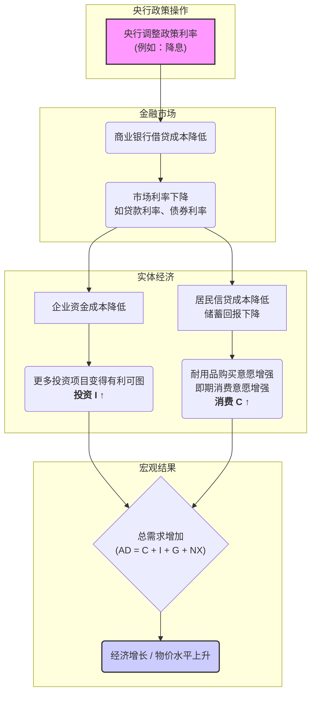

好的，我们开始吧。作为你的知识讲解者，我将遵循“引导式教学模型”，带你深入理解货币政策这个重要的经济调节工具是如何通过利率这根“杠杆”来影响我们每个人的消费和企业的投资决策的。

---

### 货币政策的传导：利率如何影响投资与消费

#### 1. 问题引入

你可能经常在新闻中看到这样的标题：“美联储宣布加息25个基点以应对通胀”或“欧洲央行降息以刺激经济增长”。这些决策似乎离我们的日常生活很远，只是金融世界里的数字游戏。

但你是否想过，为什么一个远在首都的中央银行调整一个我们几乎从不直接接触的“政策利率”，就能影响到你申请的房屋贷款利率、一家本地企业是否决定扩张建厂，甚至整个国家的就业形势？这背后神秘的“涟漪效应”究竟是如何发生的？今天，我们就来揭开这层神秘的面纱，探寻货币政策的“传导机制”。

#### 2. 核心定义与生活化类比

**核心定义**:
货币政策传导机制（Monetary Policy Transmission Mechanism）是指中央银行运用货币政策工具（如调整政策利率），通过金融体系影响一系列经济变量（如市场利率、资产价格、信贷供给等），最终作用于总需求（即投资和消费），从而实现其稳定物价、促进就业等最终目标的全过程。

简单来说，它就是央行的政策意图从“发令枪”响起到“撞线”的全过程。而我们今天关注的，是其中最核心、最直接的一条跑道——**利率渠道**。

**生活化类比：水库大坝的闸门**

想象一个巨大的水库，水库里的水代表着整个经济体系中的资金。中央银行就是这个水库大坝的管理员。

*   **大坝的闸门**：就是中央银行控制的“政策利率”。
*   **流向下游农田和工厂的水流**：代表着流向家庭和企业的信贷资金。

当经济干旱（衰退）时，管理员需要放水灌溉。他不会直接把水送到每一块田地，而是**打开（调低）大坝的闸门**。闸门开得越大（利率越低），水流就越强劲，下游的河流（商业银行）水位上升，灌溉渠道（贷款）里的水就越多、流速越快，农田（企业投资）和居民用水（家庭消费）就变得更容易、更便宜。

反之，当洪水泛滥（通货膨胀）时，管理员则会**关小（调高）闸门**，控制水流，防止过度泛滥。这个通过控制总闸门来影响整个灌溉系统的过程，就是货币政策通过利率的传导。

#### 3. 最小示例

让我们以一次典型的“降息”为例，走查一下这个过程：

1.  **央行行动**: 中央银行宣布，将其关键的政策利率下调0.25%。
2.  **影响银行**: 商业银行从中央银行借款的成本降低了。同时，银行之间的短期拆借利率也随之下降。
3.  **传导至企业 (投资)**:
    *   **场景**: 一家制造企业“远大公司”原本在犹豫是否要贷款500万来购买一条新生产线。
    *   **降息前**: 贷款年利率为5%，每年利息成本是25万。公司评估后认为项目利润微薄，决定暂缓。
    *   **降息后**: 商业银行将企业贷款利率下调至4.5%。现在每年的利息成本降至22.5万。这2.5万的差额让项目的预期回报率变得更有吸引力。
    *   **结果**: “远大公司”决定申请贷款，进行投资。**投资增加了**。
4.  **传导至家庭 (消费)**:
    *   **场景**: 一对年轻夫妇小张和小李一直想买一辆车，但觉得车贷月供压力有点大。
    *   **降息前**: 车贷利率为6%，每月还款额较高。
    *   **降息后**: 银行将消费贷款利率下调至5.5%，这意味着在同样的贷款总额和期限下，每月还款额减少了。
    *   **结果**: 小张和小李觉得可以负担了，决定贷款买车。**消费增加了**。

通过这个简单的链条，央行的一次降息操作，最终成功地“撬动”了实体经济中的投资与消费。

#### 4. 原理剖析

利率之所以能成为货币政策的核心杠杆，是因为它本质上是**资金的价格**——即借钱的成本，或是存钱的收益。当这个价格发生变化时，会系统性地改变企业和家庭的行为决策。

我们可以从两个主要方面来剖析其内在机制：

**A. 对投资的影响**

企业的投资决策通常遵循一个基本原则：**预期回报率 vs. 资金成本**。

*   **资金成本**: 当企业需要借款来投资新项目（如建厂房、买设备）时，贷款利率就是最直接的资金成本。
*   **决策过程**: 企业会评估一系列潜在的投资项目，每个项目都有一个预期的回报率。只有当项目的预期回报率**高于**资金成本时，这个项目才是值得投资的。
*   **利率的作用**:
    *   **降息**：降低了资金成本。之前因为回报率略低于利率而被搁置的项目，现在变得可行了。这会激励企业增加投资。
    *   **加息**：提高了资金成本。一些原本看起来还不错的项目，现在可能无利可图了。这会抑制企业的投资冲动。

**B. 对消费的影响**

利率对消费的影响主要通过两个途径：

1.  **影响耐用品消费 (Durable Goods Consumption)**:
    *   像汽车、房屋、大型家电这类价值高、寿命长的商品，消费者通常需要贷款购买。
    *   **降息**：使得抵押贷款、汽车贷款和分期付款的成本降低，减轻了每月的还款负担，从而刺激了对这些商品的需求。
    *   **加息**：则会产生相反的效果。

2.  **影响储蓄与消费的权衡 (Intertemporal Substitution)**:
    *   利率也代表了储蓄的回报。
    *   **降息**：意味着现在把钱存起来，未来能获得的利息变少了。这使得“即时行乐”（现在就消费）相对于“延迟满足”（储蓄以备未来消费）变得更有吸引力。人们可能会减少储蓄，增加当期消费。
    *   **加息**：提高了储蓄的吸引力，可能会促使人们推迟部分消费，增加储蓄。

下面这个流程图清晰地展示了利率渠道的传导路径：

#### 5. 常见误区

1.  **误区一：“央行可以直接设定我申请的房贷利率。”**
    *   **纠正**：这是一个常见的误解。央行通常只控制一个或几个非常短期的“政策利率”（比如银行间市场的借贷利率）。它通过影响商业银行的资金成本，来**间接引导**长期的、与消费者和企业相关的贷款利率（如房贷、车贷、企业贷款）。这个传导过程不是100%完美和即时的，商业银行还会考虑自身的风险、利润等因素。

2.  **误区二：“只要央行降息，经济就一定能被刺激起来。”**
    *   **纠正**：货币政策并非万能。在某些极端情况下，比如严重的经济萧条时期，即使利率降到很低（甚至接近于零），企业和消费者也可能因为对未来极度悲观而不愿意借款投资或消费。这种现象被称为“**流动性陷阱**”(Liquidity Trap)，经济学家形象地称之为“你可以把马拉到水边，但不能强迫它喝水”（You can lead a horse to water, but you can't make it drink）。此时，货币政策就像在“推一根绳子”，很难发力。

#### 6. 拓展应用

除了直接的利率渠道，货币政策的传导还通过其他几个相互关联的渠道发挥作用，形成一个复杂的网络：

*   **资产价格渠道 (Asset Price Channel)**: 降息会使得债券、股票、房地产等资产相对于银行存款更具吸引力，可能推高这些资产的价格。资产价格的上涨会产生“**财富效应**”，让持有这些资产的人感觉更富有，从而增加消费。
*   **汇率渠道 (Exchange Rate Channel)**: 在开放经济中，降息会降低以本币计价资产的相对回报率，可能引发资本外流，从而导致本国货币汇率下降（贬值）。本币贬值使得出口商品在国际市场上更便宜，而进口商品更贵，这会刺激出口、抑制进口，从而增加净出口（总需求的另一个组成部分）。
*   **信贷渠道 (Credit Channel)**: 宽松的货币政策能改善商业银行的资产负债状况，增加其可贷资金，从而提高其放贷意愿，直接增加对企业和家庭的信贷供给。

理解这些不同的渠道，能帮助我们更全面地认识到，央行的每一个举动是如何通过多种路径，立体地影响着整个经济体系。

#### 7. 总结要点

1.  **核心机制**: 货币政策通过利率渠道传导，其本质是改变**资金的价格**，从而影响企业和家庭的经济决策。
2.  **两大目标**: 降息主要通过**降低企业投资的资金成本**和**降低家庭信贷消费的成本**来刺激总需求。加息则反之。
3.  **传导链条**: 央行调整政策利率 → 影响市场利率 → 改变投资和消费行为 → 影响总需求和宏观经济。
4.  **政策非万能**: 传导机制存在时滞，并且在经济极度悲观时可能失效（“流动性陷阱”）。

#### 8. 思考与自测

1.  **反向思考**: 如果当前经济面临严重的通货膨胀问题，中央银行决定**加息**。请你尝试按照我们今天学习的传导路径，一步步描述加息将如何为经济“降温”？它会对企业的投资决策和你的消费计划产生什么影响？
2.  **融会贯通**: 在之前的学习中，我们了解了扩张性财政政策（如政府增加基建支出）可能会导致利率上升，从而产生“挤出效应”，抑制私人投资。现在请思考：如果政府在实施扩张性财政政策的同时，央行为了稳定经济也采取了扩张性货币政策（降息），这两种政策组合会对利率和私人投资产生怎样的综合影响？
