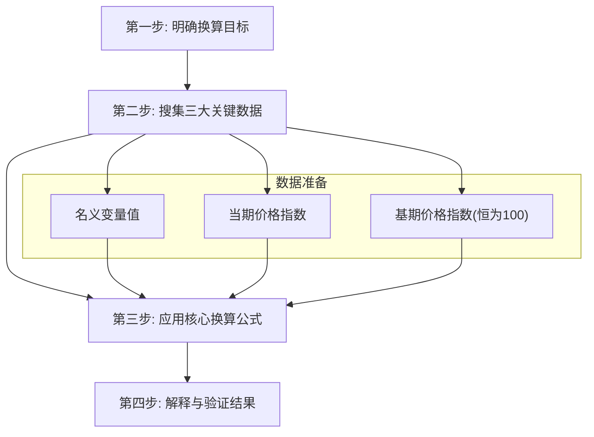

好的，作为一名资深流程教练，我将使用“引导式教学模型”为您构建一份关于“名义变量与实际变量换算”的清晰操作手册。

---

### **操作手册：名义变量与实际变量的换算**

你好！欢迎来到宏观经济学的“厨房”。在这里，我们将学习一项经济学家必备的核心技能：如何为经济数据“挤水分”，从名义值中提炼出真实价值。

#### **1. 问题引入**

你可能会遇到这样的困惑：“我看到新闻说，今年的GDP（国内生产总值）首次突破120万亿元，比十年前的60万亿元翻了一番。这是否意味着我们的产出真的翻倍了？考虑到这些年物价也在上涨，我该如何进行‘苹果对苹果’的公平比较，弄清楚真实的经济增长情况？正确的流程是怎样的？”

这是一个非常好的问题。直接比较不同时期的名义变量，就像比较一个加了水和另一个没加水的面粉重量一样，会得出误导性的结论。本手册将带你一步步掌握“挤掉”价格水分，获得可比的“干货”——实际变量的完整流程。

#### **2. 核心目标与类比**

本流程的核心目标是：**将一个以“当期价格”计算的名义变量，转换为以某个“基期价格”计算的实际变量，从而剔除价格变动的影响，实现跨时期的可比性。**

你可以把这个流程想象成一份 **“货币购买力校准说明书”**。

*   **名义变量 (Nominal Variable)**：就像你在不同国家旅行时口袋里的当地货币（日元、欧元、美元）。数字本身很大或很小，但若不换算，你无法直观比较它们的真实购买力。
*   **实际变量 (Real Variable)**：就像将所有外币都换算成你熟悉的“人民币”后的金额。这样一来，你就能清楚地知道哪笔钱的购买力更强。

我们的任务，就是通过一个标准化的流程，完成这次“汇率换算”。

#### **3. 最小示例 (核心流程演练)**

让我们用一个最简单的例子，快速走一遍核心流程。

**任务**：计算以2015年为基期，2023年的实际GDP。

**已知数据**: 

*   2023年名义GDP: 126万亿元
*   2023年的GDP平减指数 (一种价格指数): 120
*   基期 (2015年) 的GDP平减指数: 100 (基期的价格指数永远是100)

**演练步骤**: 

1.  **明确目标**：将126万亿元的名义GDP，换算成2015年的价格水平。
2.  **套用公式**：核心换算公式为：
    *   `实际变量 = (名义变量 / 当期价格指数) * 基期价格指数`
3.  **代入计算**：
    *   2023年实际GDP = (126万亿元 / 120) * 100 = 105万亿元
4.  **解读结果**：以2015年的价格水平来衡量，2023年我们生产的商品和服务的总价值是105万亿元。这个数字剔除了从2015年到2023年间20%的通货膨胀影响，可以更公平地与2015年的GDP进行比较。

看，是不是很简单？你已经掌握了最核心的换算逻辑。

#### **4. 原理剖析 (各步骤详解)**

现在，我们把上述流程分解为标准操作步骤（SOP），并明确每一步的“操作指令”和“验收标准”。

---

##### **✅ 步骤1: 明确换算目标**

*   **操作指令**: 
    1.  确定你想要换算的**名义变量**是什么（例如：名义GDP、名义工资、名义零售额）。
    2.  确定你希望将它换算到哪个**基期**的价格水平上（例如：以2010年价格计算、以去年价格计算）。
*   **验收标准**: 
    *   能够清晰地陈述一句话：“我的目标是，将 [2023年] 的 [名义GDP] 换算成以 [2015年] 价格计算的实际GDP。”

---

##### **✅ 步骤2: 搜集三大关键数据**

*   **操作指令**: 
    1.  **名义变量 (Nominal Value)**: 找到目标年份的名义值。通常由国家统计局等官方机构发布。
    2.  **当期价格指数 (Current Price Index)**: 找到目标年份对应的价格指数。**注意**：指数必须与变量匹配（见“常见误区”）。
    3.  **基期价格指数 (Base Year Price Index)**: 基期的价格指数定义为100。
*   **验收标准**: 
    *   三个数字都已找到并记录下来，单位和年份明确无误。

---

##### **✅ 步骤3: 应用核心换算公式**

*   **操作指令**: 
    1.  写出标准公式。
    2.  将步骤2中搜集到的三个数据准确代入公式。
    3.  进行计算。
*   **数学公式**: 
    $
    \text{实际变量} = \left( \frac{\text{名义变量}}{\text{当期价格指数}} \right) \times \text{基期价格指数}
    $
    由于基期价格指数通常是100，公式常简化为：
    $
    \text{实际变量} = \left( \frac{\text{名义变量}}{\text{当期价格指数}} \right) \times 100
    $
*   **验收标准**: 
    *   计算过程清晰，结果准确。

---

##### **✅ 步骤4: 解释与验证结果**

*   **操作指令**: 
    1.  **解释含义**: 用通俗的语言说明计算结果的经济学意义。
    2.  **合理性验证**: 
        *   如果从基期到当期存在**通货膨胀**（当期价格指数 > 100），那么**实际值 < 名义值**。
        *   如果存在**通货紧缩**（当期价格指数 < 100），那么**实际值 > 名义值**。
        *   检查你的结果是否符合这个逻辑。
*   **验收标准**: 
    *   能用一句话清晰地解释结果，例如：“按2015年的价格计算，2023年的GDP为105万亿元。”
    *   结果通过了合理性验证。

#### **5. 常见误区 (风险与回退)**

*   **误区一：价格指数与变量不匹配。**
    *   **风险**: 这是最致命的错误。计算实际GDP，应优先使用 **GDP平减指数 (GDP Deflator)**；计算实际居民消费或实际工资，使用 **消费者价格指数 (CPI)** 更为合适（因为CPI衡量的是消费者购买的一篮子商品和服务的价格，更贴近居民生活成本；而GDP平减指数衡量的是所有国内生产的最终商品和服务的价格，范围更广）。用错了指数，就像用量体重的秤去量身高。
    *   **回退方案**: 暂停计算，返回步骤2，重新查找与你的名义变量最相关的价格指数。
*   **误区二：混淆基期。**
    *   **风险**: 在比较两个年份的实际值时，它们必须基于**同一个基期**进行换算，否则比较毫无意义。
    *   **回退方案**: 检查所有用于比较的实际变量，确保它们的“计价单位”（基期价格）是统一的。
*   **误区三：混淆价格指数的标度（例如 120 vs 1.2）。**
    *   **风险**: 很多价格指数发布时是1.20的形式（基期为1），而不是120的形式（基期为100）。如果你用 `名义值 / 120`，会得到一个错误的结果。正确的应该是 `名义值 / 120 * 100` 或 `名义值 / 1.2`。
    *   **回退方案**: 检查价格指数的发布形式，明确基期是1还是100，并相应调整公式。

#### **6. 拓展应用 (分支与变体)**

掌握了核心流程后，你可以轻松应对以下变体：

1.  **从名义值计算实际增长率**: 
    *   **流程**: 先分别计算出两个年份的实际值（基于同一基期），然后再用标准增长率公式 `(期末值 - 期初值) / 期初值` 计算。
    *   **近似速算**: `实际增长率 ≈ 名义增长率 - 通货膨胀率`。这是一个在名义增长率和通货膨胀率数值都较小（例如，均在10%以内）时非常准确的估算方法。

2.  **反向计算价格指数 (隐含的平减指数)**: 
    *   **场景**: 如果你知道某年的名义GDP和实际GDP，可以反推出当年的GDP平减指数。
    *   **公式**: `价格指数 = (名义GDP / 实际GDP) * 100`。

3.  **计算实际工资、实际利率等**: 
    *   **流程完全一样**: 只需将变量替换即可。
    *   **实际工资**: `实际工资 = (名义工资 / CPI) * 100`，衡量的是工资的真实购买力。
    *   **实际利率**: `实际利率 ≈ 名义利率 - 通货膨胀率` (费雪方程式的近似形式)。

#### **7. 总结要点 (Checklist)**

在你进行下一次换算时，请使用这个最终的检查清单，确保万无一失。

-   [ ] **1. 目标明确**: 我要将哪一年的名义[变量名]换算成哪一年的实际值？
-   [ ] **2. 数据齐全**: 是否已找到三个关键数字：名义值、当期价格指数、基期价格指数(100)？
-   [ ] **3. 指数匹配**: 我选择的价格指数是否与变量的性质最匹配？（GDP -> GDP平减指数；消费/工资 -> CPI）
-   [ ] **4. 公式正确**: 是否严格按照公式 `实际值 = (名义值 / 当期价格指数) * 100` 进行计算？
-   [ ] **5. 结果校验**: 结果是否符合直觉？（通胀期，实际值应小于名义值）
-   [ ] **6. 解释清晰**: 我能用一句话向别人解释这个实际值的含义吗？

#### **8. 思考与自测**

为了检验你是否已真正掌握，请思考以下问题：

> “如果国家统计局决定将GDP的基准年从2015年改为2020年，那么我们计算2023年实际GDP的流程中，**第2步（搜集数据）**和**第3步（应用公式）**需要做什么调整？这对最终计算出的2023年‘实际GDP’数值本身有何影响？对基于新旧基准年计算出的2022年到2023年的‘实际GDP增长率’又有何影响？”

**提示**: 想想“尺子”的刻度单位变了，测量的数值会怎样，但物体本身的增长比例会变吗？

---
通过以上8个步骤，你不仅学会了“如何做”，更理解了“为什么这么做”。现在，你已经具备了像经济学家一样，透过货币的面纱看清经济实质的关键能力。祝你练习愉快！