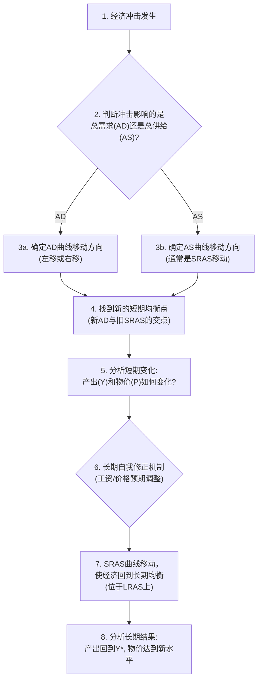

好的，我们现在开始进入宏观经济学的核心工具之一：总供给-总需求（AS-AD）模型。这个模型就像是经济学家的“瑞士军刀”，能帮助我们分析整个国家的经济波动。

### 1. 问题引入

想象一下，你是一位国家的高级经济顾问。最近，全球原油价格突然飙升，同时，为了刺激经济，中央银行决定降低利率。你的团队成员众说纷纭：有人认为经济会过热，通货膨胀将失控；另一些人则担心经济会陷入衰退，失业率会上升。

总统向你提出了一个直接的问题：“这些事件会如何影响我们国家的整体产出（GDP）和物价水平？我们应该采取什么措施？”

要回答这个问题，你不能只看石油市场或银行体系。你需要一个能够将整个经济——所有生产者、所有消费者、政府和国际贸易——都纳入考量的框架。这个框架，就是我们今天要构建和学习的总供给-总需求（AS-AD）模型。

### 2. 核心定义与生活化类比

**核心定义**:
总供给-总需求（AS-AD）模型是一个宏观经济模型，它通过展示经济体在特定时期内对所有最终商品和服务的**总供给**与**总需求**之间的关系，来解释物价总水平和总产出（真实GDP）的短期波动。其中，**总供给**指一个经济体在特定时期内愿意并能够生产的所有最终商品和服务的总价值；**总需求**指一个经济体在特定时期内愿意购买的所有最终商品和服务的总价值。

**生活化类比**:
想象一个巨大的城市集市，这个集市代表着整个国家的经济。

*   **总需求 (AD)** 就像是来到这个集市的所有买家——包括家庭、企业（购买投资品）、政府和外国游客——在**不同的物价水平**下，他们总共愿意购买多少商品和服务。如果集市上的所有东西都变贵了（物价总水平上升），大家可能会捂紧钱包，总购买量就会下降。
*   **总供给 (AS)** 就像是这个集市里所有的摊主和店铺——所有国内的生产者——在**不同的物价水平**下，他们总共愿意生产和销售多少商品和服务。如果物价普遍上涨，短期内他们可能会觉得有利可图，于是加班加点，增加供应。
*   **经济的均衡** 就是在这个大集市里，买家愿意购买的总量正好等于卖家愿意出售的总量。此时的价格就是国家的**物价总水平**，而成交量就是国家的**总产出（真实GDP）**。

这个模型的核心任务，就是分析是什么因素导致买家群体（AD）或卖家群体（AS）的行为发生变化，以及这些变化如何影响整个集市的“价格”和“成交量”。

### 3. 最小示例

我们来看一个最简单的场景走查：**政府突然增加了一项大规模的高速公路建设计划。**

1.  **初始状态**: 假设经济处于一个稳定的状态，产出和物价水平都很平稳。这在我们的模型里，是总供给曲线和总需求曲线的交点。

2.  **分析冲击**: 政府增加开支，是总需求的直接组成部分（$Y = C + I + G + NX$ 中的 $G$）。这意味着在任何物价水平下，整个经济的总需求都增加了。

3.  **曲线移动**: 因此，**总需求（AD）曲线会向右移动**。

4.  **短期结果**: 新的AD曲线与原有的短期总供给（SRAS）曲线相交于一个新的点。在这个新的短期均衡点上，我们会发现：
    *   **总产出 (Y) 增加**: 因为需求旺盛，企业会雇佣更多工人，增加生产来满足这些新的订单。
    *   **物价总水平 (P) 上升**: 因为更多的需求追逐相对固定的供给，导致了物价的普遍上涨，即通货膨胀压力。

这个简单的例子展示了AS-AD模型如何将一个具体的政策（增加政府开支）与宏观经济的两个关键指标（GDP和通货膨胀）联系起来。

### 4. 原理剖析

要深入理解AS-AD模型，我们需要解构它的三个核心部件：总需求（AD）、短期总供给（SRAS）和长期总供给（LRAS）。

#### 模型坐标系
*   **横轴 (X轴)**: 真实GDP (Y)，代表经济的总产出或总收入。
*   **纵轴 (Y轴)**: 物价总水平 (P)，通常用GDP平减指数或CPI来衡量。

#### (1) 总需求 (AD) 曲线

AD曲线表示在不同的物价水平下，经济中所有部门（家庭、企业、政府、国外）计划支出的总量。**它向右下方倾斜**，这意味着物价水平 (P) 越低，总需求量 (Y) 越高。为什么？主要有三个效应：

*   **财富效应 (Wealth Effect)**: 当物价水平P下降时，人们持有的货币和资产的实际购买力上升了。感觉自己更富有了，因此会增加消费支出 (C)。
*   **利率效应 (Interest-Rate Effect)**: 当物价水平P下降时，人们为了日常交易不需要持有那么多现金。他们会把多余的钱存入银行或购买债券，这增加了可贷资金的供给，导致利率 (r) 下降。较低的利率会刺激企业增加投资 (I) 和家庭购买耐用品。
*   **汇率效应 (Exchange-Rate Effect)**: 当国内利率 (r) 下降时，本国资产对外国投资者的吸引力减小，导致资本外流，本国货币在汇率市场上的供给增加，汇率 (e) 下降（本币贬值）。本币贬值使得本国商品对外国人来说更便宜，而外国商品对本国人来说更贵，从而刺激净出口 (NX) 增加。

**轻量数学表达**:
总需求可以表达为：
$Y = C(P, ...) + I(P, ...) + G + NX(P, ...)$
这里的 $P$ 表明消费C、投资I和净出口NX都与物价水平P负相关，导致了AD曲线的向下倾斜。

#### (2) 总供给 (AS) 曲线

AS曲线表示在不同的物价水平下，经济中所有企业愿意生产和销售的商品与服务的总量。这里必须区分短期和长期。

*   **长期总供给 (LRAS) 曲线**: 在长期，一个经济体的生产能力由其资本、劳动、自然资源和技术水平决定，而**与物价水平无关**。无论物价是100还是200，工厂的数量、工人的技能和可用的技术都是固定的。因此，**LRAS曲线是一条垂直线**，位于经济的“潜在产出”或“自然产出率” ($Y^*$) 水平上。

*   **短期总供给 (SRAS) 曲线**: 在短期内，**SRAS曲线是向右上方倾斜的**。这意味着物价水平 (P) 上升时，企业会增加产出。为什么？因为短期内至少有一种价格是“粘性”的（调整缓慢）：
    *   **粘性工资理论 (Sticky-Wage Theory)**: 劳动合同通常是提前签订的，名义工资在短期内是固定的。当物价水平P意外上升时，企业的产品售价提高了，但付给工人的名义工资没变，这意味着实际工资下降了，企业利润增加，因此它们会雇佣更多工人，增加产量。
    *   **粘性价格理论 (Sticky-Price Theory)**: 由于存在“菜单成本”（调整价格的成本），一些企业不会立即根据宏观经济变化调整其产品价格。当整体物价水平P上升时，那些价格未变的企业产品会显得相对便宜，需求量增加，促使它们增加生产。

**轻量数学表达**:
一个常见的SRAS方程形式为：
$Y = Y^* + \alpha(P - P^e)$
其中 $Y$ 是实际产出，$Y^*$ 是自然产出率，$\alpha$ 是一个正数，代表产出对未预期到的物价变化的反应程度，$P$ 是实际物价水平，$P^e$ 是预期的物价水平。**这个公式表明，当实际物价水平(P)高于人们的预期(P^e)时，产出(Y)会暂时超过其长期潜力(Y*)。这正是粘性工资/价格理论所描述的——企业因未预料到的价格上涨而增加生产的短期现象。**

#### (3) 模型的动态分析流程

分析任何经济冲击的步骤通常如下：

### 5. 常见误区

1.  **误区一：把总需求曲线当作是微观需求曲线的简单加总。**
    *   **纠正**: 微观需求曲线向下倾斜是因为替代效应和收入效应。当苹果价格上涨时，你会买更多梨（替代），或者因为你的购买力下降而少买所有东西（收入）。但对于整个经济而言，你无法“替代”到另一个经济体去。AS-AD模型中AD曲线向下倾斜是基于前面提到的财富、利率和汇率这三个完全不同的宏观机制。

2.  **误区二：认为政策可以轻易地将经济永久维持在超过其长期潜力的水平上。**
    *   **纠正**: 模型显示，通过刺激总需求，政府或许可以在短期内将产出推高至$Y^*$之上。但这会导致物价上涨，工人们最终会要求更高的名义工资来弥补购买力的损失。工资成本的上升会使SRAS曲线向左移动，最终产出将退回到$Y^*$，但代价是永久性的更高物价水平（通货膨胀）。

### 6. 拓展应用

AS-AD模型是分析宏观经济政策和外部冲击的强大工具。

*   **分析财政政策**: 如上文的“最小示例”所示，扩张性财政政策，例如增加政府购买G（直接增加总需求），或减税T（通过增加居民可支配收入和企业利润来刺激消费C和投资I），会使AD曲线右移，短期内增加产出和物价。紧缩性财政政策则相反。

*   **分析货币政策**: 中央银行增加货币供给（例如，通过公开市场操作），从而降低利率，会刺激投资I和消费C，使AD曲线右移。反之，收紧货币政策（例如，通过减少货币供给导致利率上升）会使AD曲线左移，这常被用来对抗高通胀。

*   **分析供给冲击**: 假设发生石油危机，石油是许多企业的重要生产成本。这会导致企业的生产成本在任何价格水平上都上升了，因此**短期总供给（SRAS）曲线会向左移动**。模型预测的结果是：产出Y下降（经济衰退），同时物价水平P上升（通货膨胀）。这种“停滞性通货膨胀”（Stagflation）的棘手情况，AS-AD模型能够清晰地解释。

### 7. 总结要点

1.  **核心框架**: AS-AD模型通过物价总水平 (P) 和真实总产出 (Y) 这两个核心变量，描绘了整个宏观经济的图景。
2.  **需求方**: 总需求(AD)曲线因财富、利率和汇率效应而向右下方倾斜，反映了支出与物价水平的负相关关系。
3.  **供给方**: 总供给(AS)曲线分为垂直的长期曲线（LRAS，由生产要素决定）和向右上方倾斜的短期曲线（SRAS，由价格/工资粘性决定），这是理解短期波动和长期趋势的关键。
4.  **分析能力**: 该模型是分析财政政策、货币政策以及外部供给冲击对一个国家通货膨胀和经济增长短期影响的标准工具。

### 8. 思考与自测

1.  如果一个国家的中央银行为了抑制严重的通货膨胀，决定大幅提高利率。请使用AS-AD模型的分析流程，推导这一政策对短期和长期的产出与物价水平会产生什么影响？（提示：思考利率如何影响总需求）
2.  假设由于全球供应链的改善和技术的进步，企业的生产效率大幅提高。这属于哪一种冲击？它会如何影响SRAS和LRAS曲线？最终对一个经济体的产出和物价水平有何影响？