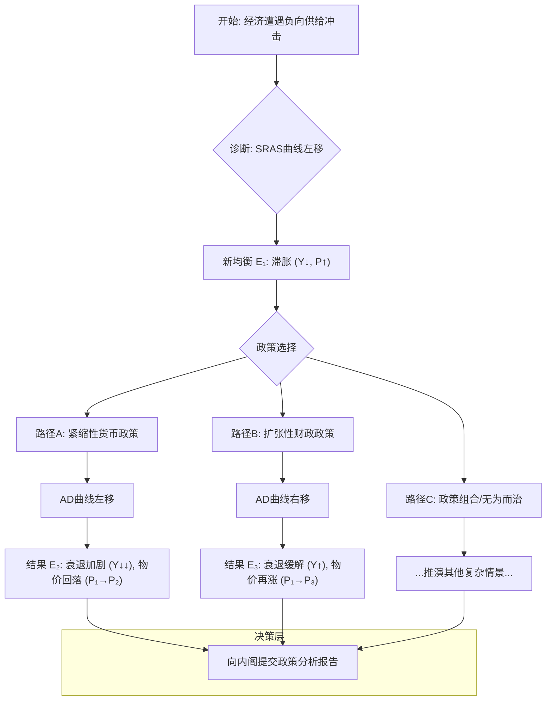
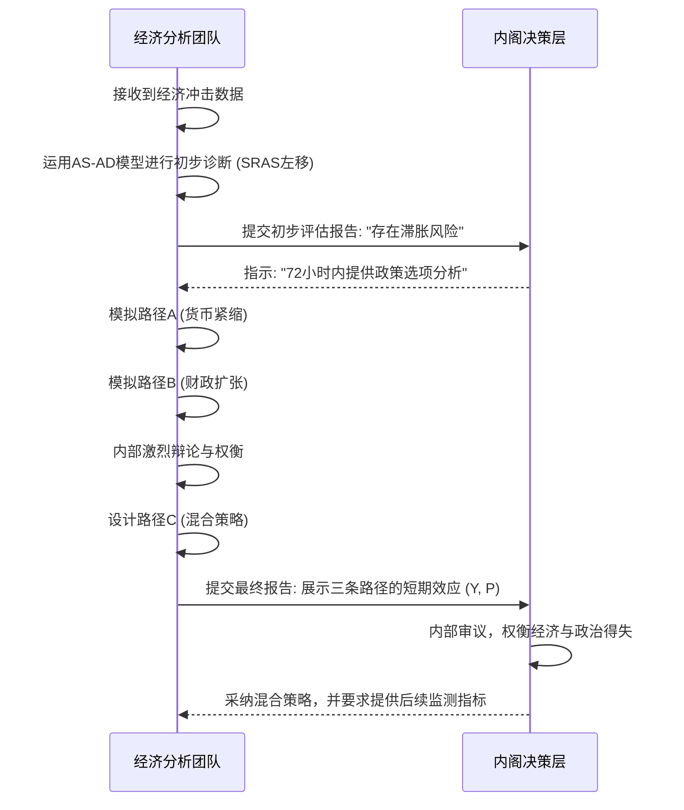

# 案例研究：在“战情室”中使用AS-AD模型应对滞胀危机

好的，我们现在进入国家经济战略委员会的“战情室”。想象一下，空气中弥漫着咖啡的香气和紧张的气氛。我是这里的资深经济学家，而你，是我的同事，我们共同面对一场突如其来的经济风暴。这不仅仅是一次理论推演，这是一场真实的决策模拟。

---

### **1. 问题引入 (故事背景)**

那是2022年的一个深秋清晨，我们团队被紧急召集。屏幕上闪烁着令人不安的数据：全球主要能源出口国联盟突然宣布超预期减产，同时，一条关键的国际航运要道因地缘政治冲突而半中断。这是典型的负向供给冲击，而且是双重打击。

我们的任务？在72小时内，向内阁提交一份关于宏观经济政策应对方案的分析报告，并给出明确的短期建议。

**挑战**非常棘手：

*   **双重压力**：能源价格飙升直接推高生产成本（成本推动型通胀），而供应链中断则减少了商品的可获得性。这两者都会导致物价上涨和产出下降——这是最糟糕的组合，经济学上称为“滞胀”（Stagflation）。
*   **决策两难**：传统的宏观调控工具似乎都失灵了。如果采取紧缩政策（如加息）来抑制通胀，会进一步打击本已脆弱的生产和就业，加剧经济衰退。如果采取扩张政策（如财政补贴）来刺激经济，又会火上浇油，让通胀彻底失控。
*   **时间紧迫**：市场在等待信号，公众在感受痛苦，任何犹豫都可能引发恐慌性预期，让情况变得更糟。

我们的**目标**：利用经济模型，清晰、量化地展示不同政策选项的短期后果，特别是对通货膨胀率（P）和国民产出（Y）的影响，为内阁的艰难抉择提供最可靠的“战场地图”。

### **2. 核心方案与类比**

面对这种复杂局面，拍脑袋式的决策是灾难性的。我们需要一个能够整合所有关键变量、并推演其相互作用的思想框架。这时，我们的核心武器——**总供给-总需求（AS-AD）模型**——被推到了白板的中央。

对于我们这样的专家来说，AS-AD模型早已烂熟于心。但在此刻，它不再是教科书上的静态图形，而是我们的**“经济飞行模拟器”**。

这个类比非常贴切：
*   **模拟器反映核心系统**：就像飞行模拟器模拟了飞机的升力、推力、阻力和重力，AS-AD模型捕捉了经济体的核心力量——总供给（生产能力与成本）和总需求（消费、投资、政府支出、净出口）。
*   **输入外部冲击**：我们可以在模拟器中输入各种“天气状况”或“系统故障”。这次的“能源危机”和“供应链中断”就是我们输入的“突发性强侧风”和“引擎部分失灵”。
*   **测试应对策略**：最关键的是，我们可以在模拟器中测试不同的“驾驶操作”（宏观经济政策）。我们可以尝试“拉高杆”（加息）或者“推节流阀”（财政刺激），然后观察模拟器显示的“飞行姿态”（经济走向）——是失速下坠，还是稳定航线？

这个“模拟器”能让我们在造成真实伤害前，预见政策的可能后果，理解其中的利弊权衡。

### **3. 最小示例 (关键代码/配置)**

尽管我们用复杂的计算机模型进行量化，但其核心逻辑可以追溯到几个关键方程。例如，总需求（AD）曲线的逻辑根基，可以简化地从IS-LM模型推导出来。AD曲线表达了物价水平（P）和总产出（Y）之间的关系。其背后的简化数学表达形式为：

$Y = f(M/P, G, T)$

其中：
*   $Y$ 是总产出或国民收入。
*   $M$ 是名义货币供给量（央行的政策工具）。
*   $P$ 是总体物价水平。$M/P$ 代表了实际货币余额，影响利率，进而影响投资和消费。
*   $G$ 是政府购买（财政部的政策工具）。
*   $T$ 是税收（财政部的另一政策工具）。

这个看似简单的函数，却是我们“模拟器”的控制面板。其内在逻辑是：当物价水平 P 下降时，实际货币余额 M/P 增加，这会使LM曲线右移，导致均衡利率下降和产出 Y 增加。AD曲线描绘的正是这一系列 (P, Y) 的均衡点。它清晰地告诉我们，央行（通过 $M$）和财政部（通过 $G$ 和 $T$）的每一个动作，将如何与物价水平 $P$ 相互作用，最终决定经济的总需求 $Y$。在“战情室”里，我们争论的焦点，就是如何调整这几个变量的组合。

### **4. 原理剖析 (方案执行与决策过程)**

我们的分析过程，就像一部紧张的悬疑片，分为几个关键阶段：

**第一幕：诊断冲击——确定起点**

我们首先在AS-AD图上标定出经济的初始状态（E₀），位于长期总供给（LRAS）、短期总供给（SRAS₀）和总需求（AD₀）的交点，代表着充分就业和稳定的通胀。

紧接着，我们模拟这次双重供给冲击。这毫无疑问地表现为**短期总供给曲线（SRAS）的急剧左移**（从 SRAS₀ 到 SRAS₁）。因为对于任意给定的价格水平，企业的生产成本都大幅上升，因此愿意并且能够供给的商品和服务减少了。经济体从 E₀ 移动到了新的短期均衡点 E₁，结果是产出下降（Y₀ → Y₁，经济衰退）和物价上涨（P₀ → P₁，通货膨胀）。

> **“战情室”片段**
> *数据分析师敲击着键盘，屏幕上的图表实时更新。*
>
> **初级分析师**：“初步模型显示，如果不进行任何干预，下个季度GDP增长率可能跌至-1.5%，而CPI将突破8%。”
>
> **我**：“确认一下，这个模型里对通胀预期的参数设定是什么？是适应性预期还是理性预期？供给冲击下，预期的变化会非常快，它可能会导致SRAS曲线发生二次移动。”

**第二幕：政策模拟——两条路径的推演**

现在，我们开始“驾驶模拟器”，测试两种纯粹的政策路径。

*   **路径A：鹰派的回应——优先抑制通胀**
    *   **操作**：央行执行紧缩性货币政策，大幅提高基准利率。
    *   **模型推演**：高利率抑制了投资和消费，导致**总需求曲线（AD）左移**（从 AD₀ 到 AD₂）。新的均衡点 E₂ 显示，物价水平被成功压低（从 P₁ 回到 P₂，可能仍高于 P₀），但代价是产出进一步萎缩（从 Y₁ 到 Y₂），衰退加深，失业率飙升。
    *   **决策思考**：这让人想起了上世纪80年代初的“沃尔克冲击”。虽然长痛不如短痛，但短期内巨大的社会成本（大规模失业）和政治风险是内阁必须考虑的。

*   **路径B：鸽派的回应——优先稳定就业**
    *   **操作**：政府出台扩张性财政政策，例如，向家庭发放能源补贴，或增加政府公共项目开支。
    *   **模型推演**：政府支出增加或减税刺激了消费，导致**总需求曲线（AD）右移**（从 AD₀ 到 AD₃）。新的均衡点 E₃ 显示，产出在一定程度上得到了恢复（从 Y₁ 回到接近 Y₀ 的水平），衰退得以缓解。但代价是，物价水平在 P₁ 的基础上被进一步推高至 P₃，通胀彻底失控。
    *   **决策思考**：这能暂时保住民生和就业，但可能导致恶性通胀和长期的经济不稳定。一旦通胀预期失控，未来抑制它的成本会更高。

这是我们的核心决策流程图：

**第三幕：激烈辩论与“第三条路”**

“战情室”里爆发了激烈的讨论。纯粹的路径A或B都无法接受。这时，我们开始探索政策组合（Policy Mix）。

> **“战情室”片段**
>
> **财政部联络员**：“我们不能接受失业率飙升，社会稳定是第一位的。我倾向于路径B的财政支持。”
>
> **央行观察员**：“绝对不行！那样会彻底摧毁市场对我们控制通胀的信心。一旦通胀预期脱锚，未来十年都难以挽回。我坚持路径A。”
>
> **我**：“两位，让我们回到模型。模型告诉我们这是一个权衡。那么，有没有可能设计一种既能表明我们抗击通胀的决心，又能精准缓解最痛苦群体的政策组合？比如，央行温和加息，发出明确的紧缩信号来管理通胀预期；同时，财政部放弃普惠式刺激，改为向低收入家庭提供精准的、有额度上限的能源代金券。这样，对AD的总体影响是温和的，甚至对SRAS曲线也有积极影响：通过保障低收入群体的基本生活，维持了其劳动力参与意愿，从而在一定程度上缓解了劳动力供给的萎缩。”

这就是模型的威力：它将一个看似无解的哲学辩论，转化为一个可以量化分析和设计的技术问题。

以下是我们与决策层交互的简化时序图：

### **5. 常见误区 (复盘与反思)**

这次高强度的实战，也让我们对模型的应用有了更深刻的认识，避免了几个常见的陷阱：

1.  **误区一：模型的机械化应用**
    *   **陷阱**：仅仅将冲击视为一条线的移动，然后得出结论。
    *   **反思**：我们差点就犯了这个错误。最初的版本只移动了SRAS。但我们很快意识到，一个持续的能源危机会**侵蚀消费者和投资者信心**，这本身就会导致AD曲线发生一定程度的左移。同时，它还会**改变公众的通胀预期**，这可能让SRAS曲线持续处于不利位置，甚至改变其斜率。一个好的分析，必须是动态的，要考虑预期的反馈循环。

2.  **误区二：忽略政策的时滞效应 (Time Lags)**
    *   **陷阱**：模型是瞬时反应的，但现实世界不是。
    *   **反思**：我们的初稿被一位经验丰富的老顾问驳回了。他提醒我们，货币政策的效果通常有6到18个月的滞后，而财政政策的执行也需要时间。因此，我们今天采取的紧缩政策，可能在经济已经开始自我修复时才显现其全部威力，导致“政策超调”（Overshooting）。我们的最终报告中，特别增加了一节关于“政策时滞风险”的量化评估。

3.  **误区三：总量的幻觉 (The Illusion of Aggregates)**
    *   **陷阱**：模型关注的是宏观总量（总产出Y，总体物价P），但政策的痛苦和收益在不同人群中的分布是极不均匀的。
    *   **反思**：仅仅说“失业率上升2%”是冷冰冰的。我们的财政团队坚持要求我们在报告中加入补充分析，说明这种失业将主要集中在哪些行业（如运输、制造业）和哪些技能水平的劳动力上。这使得我们的“精准财政补贴”建议更具说服力和人道主义色彩。

### **6. 拓展应用 (经验迁移)**

这次经历凝练出的经验，可以迁移到任何复杂的宏观经济事件分析中：

*   **经验一：模型是“共识的语言”**：在多部门、多利益方的决策环境中，AS-AD模型提供了一个共同的分析框架和沟通语言。它让财政部和央行的人能在一个频道上对话，将分歧从“主义之争”转变为“参数之辩”。
*   **经验二：从“单一预测”到“情景矩阵”**：模型的最大价值不在于给出一个精确的GDP预测数字，而在于构建一个“如果...那么...”的情景矩阵。我们最终提交的不是一个点预测，而是一个包含不同政策组合及其对应（高/中/低概率）经济后果的决策树，让决策者清楚地看到每一个选择的风险和回报。
*   **经验三：定性与定量的结合**：纯粹的数学模型是骨架，但必须填充定性的“血肉”。对历史先例的借鉴（如沃尔克时代）、对社会心理的洞察（如通胀预期的形成）、对政治可行性的考量，这些都是模型本身无法提供，但对最终决策至关重要的“软信息”。

### **7. 总结要点**

这次成功的危机应对，关键在于我们不仅仅将AS-AD模型看作一个学术工具，而是将其作为一种**动态的、交互式的决策支持系统**。

*   **结构化思维**：模型为我们在混乱的信息中提供了一个清晰的分析路径：诊断冲击 → 识别传导机制 → 模拟政策干预 → 评估权衡。
*   **量化权衡**：它将“保增长”还是“抗通胀”这个两难问题，具体化为AD和SRAS曲线的移动幅度和最终均衡点的选择，使决策的成本收益一目了然。
*   **沟通桥梁**：生动的图形化展示，让我们能够向非经济学专业的内阁成员直观地解释清楚，为什么看似“两全其美”的政策是不存在的，以及为什么我们推荐某个看似“折中”的方案。

最终，模型本身没有给出答案，但它照亮了通往答案的几条道路，并清晰地标出了每一条路上的“险滩”和“暗礁”。

### **8. 思考与自测**

现在，轮到你了。设想一下这个场景：

**如果你是当时的项目负责人**，在“战情室”的激烈辩论中，一位极具影响力的内阁成员（比如财政部长）强力主张采用路径B（大规模财政刺激），理由是“即将到来的中期选举要求我们不惜一切代价保住就业”。他认为通胀是全球性的，我们无法控制，但失业是国内的，是政府的责任。

在那个决策点上，你会做出和我们团队一样的“混合策略”建议，还是会屈服于政治压力？你会如何运用AS-AD模型，来构建你的论点，以一种最有说服力的方式，向这位部长解释纯粹财政扩张在短期内可能带来的灾难性后果？你的论证逻辑会是什么？

---
**参考文献 (References):**

1.  Mankiw, N. G. (2021). *Macroeconomics*. Worth Publishers. (For the foundational AS-AD framework).
2.  Blanchard, O. (2021). *Macroeconomics*. Pearson. (For a more dynamic and expectations-augmented view of the model).
3.  Romer, D. (2018). *Advanced Macroeconomics*. McGraw-Hill. (For deeper insights into the microfoundations and limitations of such models).
4.  Bernanke, B. S. (2015). The Taylor rule: A benchmark for monetary policy? *Ben Bernanke's Blog*, Brookings Institution. (For practical application of policy rules within such frameworks).