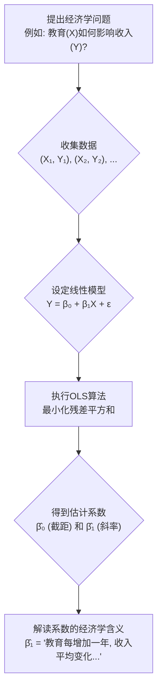

好的，同学你好！作为你的算法与数据科学老师，今天我们来一起攻克回归分析这个经济学家工具箱里的“瑞士军刀”。

你已经了解了“相关性不等于因果关系”，也接触过像双重差分法（DID）这样的高级方法。这非常好，说明你已经站在了实证研究的门口。回归分析，正是连接这扇门内外最基础、也是最重要的一座桥梁。它能帮助我们从“X和Y看起来有关系”升级到“X每变动一个单位，Y平均会变动多少单位”，实现关系的**量化**。

让我们遵循引导式教学的8个步骤，由浅入深，彻底掌握它。

---

### 1. 问题引入

想象一下，你是一位城市的政策制定者。市长交给你一个任务：评估我市近年来在教育上的投入是否“物有所值”。具体来说，他想知道一个核心问题：**“市民多接受一年教育，他们的年收入平均会增加多少？”**

你手头有几千份市民的匿名调查数据，包括他们的受教育年限和年收入。数据点杂乱无章，你隐约看到一个趋势：教育年限越长，收入似乎越高。但“似乎”对于制定政策是远远不够的。你需要一个精确的、可量化的答案，比如“多一年教育，年收入增加5000元”，这样才能进行成本效益分析。

这个问题，正是回归分析要解决的经典问题：**如何从一堆嘈杂的数据点中，找出一个清晰的、量化的关系公式。**

### 2. 核心思想与生活化类比

回归分析的核心思想非常直观：**在散乱的数据点中，画出一条“最贴合”所有点的直线。**

这条直线就像是数据整体趋势的一个最佳代表或“平均状态”。一旦有了这条线，我们就能用它来做两件事：
1.  **描述关系**：直线的斜率告诉我们，X 每增加一个单位，Y 会“平均”变化多少。
2.  **进行预测**：给定一个新的 X 值，我们可以用这条线来预测对应的 Y 值大概是多少。

**生活化类比：猜商品价格**

想象你在参加一个电视节目，猜测一件商品（比如一台冰箱）的真实价格（Y）。主持人会给你一个关键提示，比如这台冰箱的容积（X）。

*   你脑中会迅速回忆过往的经验：100升的冰箱大概2000元，200升的4000元，500升的要10000元... 这些经验就是你的“**数据点**”。
*   你不会死记硬背，而是在脑中形成一个大概的“**价格-容积关系**”，这就像一条无形的直线。
*   现在主持人告诉你，这台冰箱是350升。你就会利用你脑中的那条“关系线”进行估算：“嗯，应该在6000到7000元之间。”

回归分析做的，就是用一种数学上最优的方法（**最小二乘法**），帮你精确地画出那条“关系线”，而不是凭感觉。它要找的这条线，能让所有数据点到这条线的“整体距离”（严格来说是距离的平方和）最小，也就是让预测的“总误差”最小。

### 3. 最小可运行示例

(前提: 你需要安装 `numpy` 和 `statsmodels` 这两个Python库。如果没有，请运行 `pip install numpy statsmodels`)

让我们用代码来解决刚才的教育与收入问题。我们先手动创造一些符合直觉的模拟数据。

```python
# code_lang: python

import numpy as np
import statsmodels.api as sm
import matplotlib.pyplot as plt

# --- 1. 生成模拟数据 ---
# 假设我们调查了100个人
num_samples = 100
# 受教育年限 (X)，在9到22年之间 (高中到博士)
# np.random.uniform 会在指定范围内生成均匀分布的随机数
education_years = np.random.uniform(9, 22, num_samples)

# 真实的基本关系：基础收入2万，每多一年教育，收入增加5000元
# 我们还加入一些随机“噪声”，因为现实中收入还受很多其他因素影响
# np.random.randn(num_samples) 生成100个符合标准正态分布的随机数（噪声）
# 乘以 8000 是为了控制噪声的幅度
true_intercept = 20000  # 基础收入 (β₀)
true_slope = 5000       # 教育的回报率 (β₁)
noise = 8000 * np.random.randn(num_samples)
income = true_intercept + true_slope * education_years + noise

# --- 2. 准备并运行回归模型 ---
# 在statsmodels中，我们需要手动为自变量X添加一列常数项(1)，用于估计截距β₀
X = sm.add_constant(education_years)
# 因变量y就是收入
y = income

# 创建OLS(Ordinary Least Squares, 普通最小二乘法)模型
# OLS是实现回归分析最经典的方法
model = sm.OLS(y, X)

# 拟合模型，也就是让算法找到那条最佳拟合线
results = model.fit()

# --- 3. 查看并解释结果 ---
print(results.summary())

# --- 4. (可选) 可视化结果 ---
plt.scatter(education_years, income, label='原始数据点')
plt.plot(education_years, results.predict(X), color='red', linewidth=2, label='回归拟合线')
plt.xlabel('受教育年限 (Years of Education)')
plt.ylabel('年收入 (Annual Income)')
plt.title('教育与收入的关系')
plt.legend()
plt.show()

```

**预期输出 (关键部分解读):**

你会看到一个详细的统计表格。现在，我们只关注最重要的部分：`Coefficients`（系数）表格。

```
==============================================================================
                 coef    std err          t      P>|t|      [0.025      0.975]
------------------------------------------------------------------------------
const       21834.33    ...           ...      ...         ...         ...
x1           4895.12    ...           ...      ...         ...         ...
==============================================================================
```

*   `const` (Intercept) 的 `coef` 是 `21834.33` (你的数字会略有不同，因为数据是随机的)。这是我们估计出的截距 $\hat{\beta}_0$，代表当教育年限为0时，预测的平均收入。
*   `x1` (我们输入的 `education_years`) 的 `coef` 是 `4895.12`。这是我们估计出的斜率 $\hat{\beta}_1$，也是市长最想知道的答案！它的含义是：**在其他条件不变的情况下，受教育年限每增加1年，年收入平均增加约4895元。**

你看，这个结果和我们当初设定的真实关系（基础2万，回报5000）非常接近！这证明了回归分析确实有效地从带噪声的数据中恢复了潜在的真实关系。

### 4. 原理剖析

回归分析的背后，是一个简洁优美的数学模型。

#### 数学模型 (`math_depth`: light)

对于一个自变量（X，如教育）和一个因变量（Y，如收入），我们假设它们的关系可以用一条直线来近似描述：

$$
Y = \beta_0 + \beta_1 X + \epsilon
$$

*   $Y$: 因变量 (Dependent Variable)，我们想要解释或预测的变量（收入）。
*   $X$: 自变量 (Independent Variable)，我们用来解释Y的变量（教育年限）。
*   $\beta_0$: **截距 (Intercept)**。代表当 $X=0$ 时，$Y$ 的期望值。在我们的例子里，就是0年教育的理论基础收入。
*   $\beta_1$: **斜率 (Slope/Coefficient)**。代表 $X$ 每增加一个单位，$Y$ 平均变化多少。这是我们最关心的，即“教育的回报率”。
*   $\epsilon$: **误差项 (Error Term)**。代表除了 $X$ 之外，所有能影响 $Y$ 的其他随机因素（如个人能力、机遇、家庭背景等）。正是因为 $\epsilon$ 的存在，数据点才不会完美地落在线上。

#### 算法流程：普通最小二乘法 (OLS)

算法的目标是找到最优的 $\hat{\beta}_0$ 和 $\hat{\beta}_1$（$\hat{}$ 表示是估计值），来画出那条“最佳拟合线” $ \hat{Y} = \hat{\beta}_0 + \hat{\beta}_1 X $。

“最佳”的定义是：让所有真实值 $Y_i$ 和预测值 $\hat{Y}_i$ 之间的**残差平方和 (Sum of Squared Residuals)** 最小。

残差就是 $e_i = Y_i - \hat{Y}_i$。我们要最小化 $ \sum_{i=1}^{n} e_i^2 $。

通过微积分（对 $\beta_0$ 和 $\beta_1$ 求偏导并令其为0），可以推导出 $\hat{\beta}_0$ 和 $\hat{\beta}_1$ 的精确计算公式。但作为初学者，你只需要理解其核心思想：**OLS像一个不知疲倦的调整师，不断微调直线的位置和角度，直到找到那个能让所有点到线的垂直距离平方和最小的唯一位置。**

#### Mermaid 流程图 (`diagram_depth`: light)



**复杂度分析**：对于简单的双变量回归，计算主要涉及矩阵运算。其时间复杂度大致为 $O(n \cdot p^2)$，其中 $n$ 是样本数量， $p$ 是自变量的数量。在我们的例子中 $p=1$，所以非常快。

### 5. 常见误区与优化点

1.  **最大误区：将相关性等同于因果性！**
    *   我们的回归结果显示教育和收入有很强的**正相关**关系。但这**不一定**意味着是教育 *导致* 了高收入。可能存在“遗漏变量”，比如“个人能力”。能力高的人既倾向于接受更高等的教育，也更容易在职场上获得高薪。如果是这样，我们估计出的 $\hat{\beta}_1$ 就**高估**了教育的真实回报。
    *   **记住**：标准的OLS回归只能告诉你变量之间的**关联强度**。要推断因果，你需要更高级的设计，比如我们之前提到的自然实验、双重差分法（DID）等，它们本质上都是为了更好地处理这类“遗漏变量”问题。

2.  **误区二：忽略截距项的解释**
    *   在 `statsmodels` 中忘记用 `sm.add_constant(X)` 添加常数项，会导致模型强行穿过原点(0,0)，这在大多数经济学场景下是错误的，会严重扭曲斜率的估计。
    *   截距 $\beta_0$ 的解释有时没有实际意义。例如，教育年限为0的人在现实中几乎不存在，所以不必过度解读“0年教育的基础收入”。它的主要作用是保证直线能在正确的高度上“自由浮动”。

3.  **优化点：检查线性假设**
    *   回归分析假设X和Y之间是线性关系。但万一“教育的回报”是递减的呢？（即从12年到13年教育的收入增加，比从19年到20年的增加要多）。这时，简单的直线就不是最佳拟合了。你可以通过绘制残差图来检查，或者在模型中加入X的平方项（$X^2$）来捕捉非线性关系。

### 6. 拓展应用

回归分析是实证经济学乃至整个数据科学的基石。它的应用无处不在：

*   **金融领域**：评估一家公司的股价（Y）与其盈利（X1）、市场利率（X2）等因素的关系（这是多元回归）。
*   **市场营销**：分析广告投入（X）与产品销量（Y）之间的关系，计算广告的投资回报率 (ROI)。
*   **公共政策**：研究最低工资标准的变化（X）对失业率（Y）的影响。
*   **房地产**：建立房价（Y）预测模型，自变量包括房屋面积（X1）、房间数量（X2）、离市中心的距离（X3）等。

### 7. 总结要点

*   **核心目的**：量化两个或多个经济变量间的线性关系。
*   **核心思想**：通过**最小二乘法 (OLS)** 找到一条最佳拟合线，使得数据点到该线的残差平方和最小。
*   **关键输出**：**系数 (Coefficients)**，特别是斜率系数 $\beta_1$，它解释了自变量X每变动一个单位，因变量Y平均会变动多少。
*   **适用场景**：当你需要理解和量化变量间的关联，或基于一个变量预测另一个变量时。
*   **最大警示**：回归分析本身只揭示**相关性**，不能直接证明**因果性**。解释结果时必须结合理论知识和研究设计，警惕遗漏变量等问题。

### 8. 思考与自测

现在，轮到你来当一回经济学家了。

**挑战任务：**

我们刚才的模型有一个潜在的“遗漏变量”：**个人工作经验**。一个人的收入不仅受教育影响，也和他的工作年限密切相关。

请你尝试修改上面的Python代码，回答下面这个问题：

1.  **增加一个变量**：在生成模拟数据部分，增加一个名为 `experience` 的新变量（例如，`experience = np.random.uniform(1, 30, num_samples)`）。
2.  **更新收入公式**：在生成 `income` 的公式里，加入 `experience` 的影响（例如，每多一年经验，收入增加2000元，`+ 2000 * experience`）。
3.  **运行多元回归**：现在，你的自变量X将有两个：`education_years` 和 `experience`。你需要把这两个变量都放进模型里去拟合。
4.  **观察变化**：对比新的回归结果和我们之前的简单回归结果。当你把“工作经验”这个变量**控制住**之后，`education_years` 的系数（$\hat{\beta}_1$）发生了什么变化？是变大了还是变小了？为什么？

这个问题将引导你从**简单回归**迈向**多元回归**，并亲身体会“遗漏变量偏误”是如何影响我们对变量关系的判断的。这是成为一名合格实证研究者的关键一步！动手试试吧！