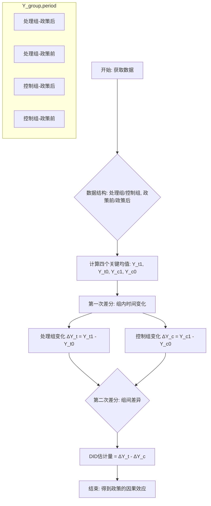

好的，同学。欢迎来到我们的高级实证方法课程。今天，我们将深入探讨政策评估的基石方法之一：**双重差分法 (Difference-in-Differences, DID)**。

你已经了解了相关性不等于因果关系，也掌握了回归分析的基本工具，并认识到“自然实验”在识别因果中的威力。DID 正是利用自然实验进行量化评估的最经典、最巧妙的工具之一。今天，我们将不仅理解其然，更要理解其所以然。

---

### 1. 问题引入

想象一下，你是新泽西州（New Jersey）的经济顾问。1992年，州政府决定将最低工资从每小时4.25美元提高到5.05美元。一场激烈的辩论随之而来：反对者认为，这将迫使快餐店等企业裁员，导致失业率上升；支持者则认为，影响微乎其微。

州长向你提出一个尖锐的问题：“**我们如何科学地、令人信服地评估这次最低工资上调对就业的真实影响？**”

这是一个典型的政策评估问题。我们面临的核心挑战是**“反事实困境”** (Counterfactual Problem)：我们永远无法观测到“假如新泽西州没有提高最低工资”这个平行宇宙中的就业情况。简单地比较政策前后的就业变化是不可靠的，因为经济本身就在波动（可能存在一个全国性的经济衰退或复苏趋势）。同样，简单地在政策实施后，将新泽西州与另一个州（比如邻近的宾夕法尼亚州，Pennsylvania，它没有提高最低工资）进行比较也是有偏的，因为这两个州本身就存在系统性差异（比如产业结构、人口密度等）。

那么，我们如何才能剥离这些混杂因素，分离出政策的纯粹因果效应呢？这正是双重差分法要解决的问题。

### 2. 核心思想与生活化类比

#### 核心思想

双重差分法的核心思想是：**通过一次差分剔除不随时间变化的个体差异，再通过第二次差分剔除不随个体变化的共同时间趋势，最终剩下的就是政策带来的净效应。**

这个方法需要两个群体和两个时期的数据：
*   **处理组 (Treatment Group)**: 受到政策干预的群体（如：新泽西州）。
*   **控制组 (Control Group)**: 未受到政策干预的群体（如：宾夕法尼亚州）。
*   **政策前 (Pre-treatment Period)**: 政策实施之前的时间段。
*   **政策后 (Post-treatment Period)**: 政策实施之后的时间段。

其背后最关键、最核心的假设是 **“平行趋势假设” (Parallel Trends Assumption)**：即在没有政策干预的情况下，处理组和控制组的结果变量（如就业率）随时间变化的趋势是相同的。我们稍后会深入探讨这个假设。

#### 生活化类比：两名赛跑运动员

想象有两名长跑运动员，A和B，正在进行训练。
*   **运动员A (处理组)**：我们的重点关注对象。
*   **运动员B (控制组)**：一个很好的陪练。

他们俩的跑步速度（结果变量）本身就不同，可能A一直比B快一些（**个体差异**）。

*   **第一阶段 (政策前)**：他们一起训练了1小时。我们记录下他们各自在第1小时结束时的速度。我们发现，在这一小时里，两人的速度都在平稳提升，且提升的幅度（趋势）几乎一样（**平行趋势**）。

*   **干预措施 (政策)**：在第1小时结束后，我们给了运动员A一双全新的、高科技的跑鞋，而运动员B继续穿旧鞋。

*   **第二阶段 (政策后)**：他们继续跑了1小时。我们再次记录他们各自在第2小时结束时的速度。

如何评估这双新鞋的威力（政策效应）？

1.  **第一次差分（组内差分）**：
    *   计算A的速度变化量：`A在第2小时的速度 - A在第1小时的速度`。这个变化包含了新鞋的效果和共同的体力消耗/恢复趋势。
    *   计算B的速度变化量：`B在第2小时的速度 - B在第1小時的速度`。这个变化 **只** 包含了共同的体力消耗/恢复趋势（因为他没有新鞋）。

2.  **第二次差分（组间差分）**：
    *   用A的速度变化量减去B的速度变化量：`(A的变化) - (B的变化)`。
    *   这个最终结果，就剔除了共同的体力趋势，净“剩下”的就是我们想知道的——那双新鞋带来的纯粹速度提升。

这就是双重差分法的精髓。

### 3. 最小可运行示例

我们将用 Python 创建一个模拟数据来演示 DID 的计算。假设我们有新泽西州（NJ, 处理组）和宾夕法尼亚州（PA, 控制组）在政策前（`t=0`）和政策后（`t=1`）的快餐店平均雇员人数。

```python
import pandas as pd
import statsmodels.formula.api as smf

# 1. 创建模拟数据
# 假设NJ在政策前有20个雇员，PA有22个 (存在固有差异)
# 假设有一个共同的负向经济趋势，导致就业减少1人
# 假设政策本身导致NJ的就业额外减少了2.5人
data = {
    'state': ['NJ', 'NJ', 'PA', 'PA'],
    'time': [0, 1, 0, 1],  # 0: pre-policy, 1: post-policy
    'employment': [20.0, 20.0 - 1.0 - 2.5, 22.0, 22.0 - 1.0] 
    # NJ_post = 20(base) - 1(trend) - 2.5(policy) = 16.5
    # PA_post = 22(base) - 1(trend) = 21.0
}
df = pd.DataFrame(data)

# 2. 创建DID所需的虚拟变量
# treat = 1 if a state is in the treatment group (NJ), 0 otherwise
df['treat'] = (df['state'] == 'NJ').astype(int)
# post = 1 if it is the post-policy period, 0 otherwise
df['post'] = (df['time'] == 1).astype(int)
# did is the interaction term
df['did'] = df['treat'] * df['post']

print("--- 模拟数据 ---")
print(df)
print("\n")

# 3. 使用回归模型进行DID分析
# OLS回归: employment = b0 + b1*treat + b2*post + b3*did + e
# b3 是我们关心的DID估计量
model = smf.ols('employment ~ treat + post + did', data=df)
results = model.fit()

# 4. 输出结果并解读
print("--- 回归结果 ---")
print(results.summary())
print("\n")

print("--- 结果解读 ---")
# 'did'项的系数就是双重差分估计量
did_estimator = results.params['did']
print(f"双重差分估计的政策效应 (Coefficient for 'did'): {did_estimator:.4f}")
print("这个值 -2.5 精确地捕捉到了我们设定的政策真实影响。")

# 预期输出:
# --- 模拟数据 ---
#   state  time  employment  treat  post  did
# 0    NJ     0        20.0      1     0    0
# 1    NJ     1        16.5      1     1    1
# 2    PA     0        22.0      0     0    0
# 3    PA     1        21.0      0     1    1
#
# --- 回归结果 ---
# ... (OLS Regression Results Table) ...
#                 coef    std err          t      P>|t|      [0.025      0.975]
# ------------------------------------------------------------------------------
# Intercept     22.0000        inf        nan        nan         nan         nan
# treat         -2.0000        inf        nan        nan         nan         nan
# post          -1.0000        inf        nan        nan         nan         nan
# did           -2.5000        inf        nan        nan         nan         nan
# ...
#
# --- 结果解读 ---
# 双重差分估计的政策效应 (Coefficient for 'did'): -2.5000
# 这个值 -2.5 精确地捕捉到了我们设定的政策真实影响。
# (注：由于数据是精确生成的，没有随机误差，标准误会显示为inf或nan，这在真实数据中不会发生)
```

### 4. 原理剖析

#### 流程图



#### 数学原理 (`math_depth: "deep"`)

双重差分法可以通过简单的均值比较，也可以通过更强大、更灵活的回归框架来实现。

**1. 均值比较法**

令 $Y$ 为结果变量， $T$ 为处理组 ($T=1$) 或控制组 ($T=0$)，$P$ 为政策后 ($P=1$) 或政策前 ($P=0$)。
$\bar{Y}_{T,P}$ 表示特定组在特定时期的平均结果。

*   处理组的时间变化： $\Delta Y_T = \bar{Y}_{T, P=1} - \bar{Y}_{T, P=0}$
*   控制组的时间变化： $\Delta Y_C = \bar{Y}_{C, P=1} - \bar{Y}_{C, P=0}$

DID 估计量 $\hat{\delta}_{DID}$ 就是这两个变化的差：
$$
\hat{\delta}_{DID} = \Delta Y_T - \Delta Y_C = (\bar{Y}_{T,1} - \bar{Y}_{T,0}) - (\bar{Y}_{C,1} - \bar{Y}_{C,0})
$$

**2. 回归框架法 (更常用)**

我们可以构建如下的线性回归模型来等价地实现DID，并且该框架更容易引入控制变量和处理异质性。
对于个体 $i$ 在时间 $t$ 的观测值 $Y_{it}$：

$$
Y_{it} = \beta_0 + \beta_1 \cdot \text{Treat}_i + \beta_2 \cdot \text{Post}_t + \beta_3 \cdot (\text{Treat}_i \times \text{Post}_t) + \epsilon_{it}
$$

其中：
*   $Y_{it}$ 是结果变量（如：就业）。
*   $\text{Treat}_i$ 是一个虚拟变量，如果个体 $i$ 属于处理组，则为1，否则为0。
*   $\text{Post}_t$ 是一个时间虚拟变量，如果时期 $t$ 在政策后，则为1，否则为0。
*   $\text{Treat}_i \times \text{Post}_t$ 是 **交互项**，当且仅当个体 $i$ 属于处理组 **且** 时期 $t$ 在政策后，该项才为1。
*   $\epsilon_{it}$ 是随机扰动项。

让我们来解读每个系数的含义：
*   $\beta_0$: **截距项**。当 $\text{Treat}_i=0, \text{Post}_t=0$ 时，$E[Y_{it}] = \beta_0$。这代表 **控制组在政策前** 的平均就业水平。
*   $\beta_1$: **处理组固定效应**。当 $\text{Post}_t=0$ 时，处理组和控制组的差异是 $(\beta_0 + \beta_1) - \beta_0 = \beta_1$。这代表在政策实施前，处理组和控制组之间存在的 **固有、不随时间变化的差异**。
*   $\beta_2$: **时间趋势效应**。当 $\text{Treat}_i=0$ 时，政策后和政策前的差异是 $(\beta_0 + \beta_2) - \beta_0 = \beta_2$。这代表了影响 **所有组** 的 **共同时间趋势**。
*   $\beta_3$: **真正的DID估计量**。这个系数衡量的是，相对于控制组的时间趋势，处理组在政策实施后 **额外** 的变化量。这正是我们想估计的政策净效应！

通过计算条件期望，可以清晰地看到 $\beta_3$ 与均值法的等价性：
*   $E[Y | T=0, P=0] = \beta_0$
*   $E[Y | T=0, P=1] = \beta_0 + \beta_2$
*   $E[Y | T=1, P=0] = \beta_0 + \beta_1$
*   $E[Y | T=1, P=1] = \beta_0 + \beta_1 + \beta_2 + \beta_3$

因此，
$$
\begin{align*}
\hat{\delta}_{DID} &= (E[Y|T=1,P=1] - E[Y|T=1,P=0]) - (E[Y|T=0,P=1] - E[Y|T=0,P=0]) \\
&= ((\beta_0+\beta_1+\beta_2+\beta_3) - (\beta_0+\beta_1)) - ((\beta_0+\beta_2) - \beta_0) \\
&= (\beta_2 + \beta_3) - (\beta_2) \\
&= \beta_3
\end{align*}
$$

这证明了回归模型中的交互项系数 $\beta_3$ 就是我们所求的DID估计量。

#### 复杂度分析
*   **时间复杂度**: 主要取决于回归模型的求解。对于OLS，通常是 $O(N \cdot k^2)$，其中 $N$ 是样本量， $k$ 是特征数（在基础DID中 $k=4$）。对于大样本，计算成本很低。
*   **空间复杂度**: $O(N \cdot k)$，用于存储数据矩阵。

### 5. 常见误区与优化点

1.  **误区一：忽视平行趋势假设的检验**
    *   **问题**: DID的整个逻辑建立在平行趋势假设之上。如果政策实施前，处理组和控制组的趋势本就不同，那么DID估计量就会错误地将这种趋势差异归因于政策效果。
    *   **修正/检验**:
        *   **可视化**：在有多期政策前数据的情况下，画出处理组和控制组结果变量的时间趋势图，直观判断它们是否平行。
        *   **安慰剂检验 (Placebo Test)**：使用政策实施前的数据，假定政策在更早的时间点发生，然后进行DID分析。如果在一个本不该有政策效应的时期发现了显著的“效应”，则强烈表明平行趋势假设可能不成立。

2.  **误区二：标准误计算错误 (The Bertrand, Duflo, and Mullainathan Problem)**
    *   **问题**: 在面板数据中，同一个体（如州、公司）在不同时间点的扰动项 $\epsilon_{it}$ 很可能是相关的（序列自相关）。标准的OLS标准误假设扰动项独立同分布，这会导致标准误被严重低估，从而夸大了统计显著性。
    *   **优化**: 使用 **聚类稳健标准误 (Clustered Standard Errors)**，将标准误聚类在个体层面（如州层面）。这允许同一个州内部的扰动项存在任意形式的自相关，从而得到更可靠的统计推断。在`statsmodels`或`Stata`中，这只是一个简单的选项调整。

3.  **误区三：忽略同期其他冲击**
    *   **问题**: 如果在政策实施的同时，处理组恰好发生了另一件影响结果变量的事件（而控制组没有），DID会把这个事件的影响也算作政策效应。例如，新泽西州在提高最低工资的同时，还推出了一个大型的就业培训计划。
    *   **修正**: 这没有简单的统计修复方法，需要研究者基于对背景的深入了解来判断是否存在这类混淆因素，并在论文中进行详细讨论。

### 6. 拓展应用

DID的框架极为灵活，被广泛应用于各个领域：
*   **公共卫生**: 评估某城市实施禁烟令后，对当地餐厅收入或居民心血管疾病发病率的影响。
*   **市场营销**: 评估在一个城市投放电视广告（处理组） vs. 未投放的另一个相似城市（控制组），对产品销量的影响。
*   **金融**: 评估一项新的金融监管政策对特定类型银行（如小型银行）的风险承担行为的影响。
*   **科技**: 评估对部分用户（处理组）上线一个新UI界面，对用户留存率或点击率的影响（此时与A/B测试思想相通）。

任何能够找到一个受到“准自然实验”冲击的处理组和一个未受冲击的、具有可比趋势的控制组的场景，都可以考虑使用DID方法。

### 7. 总结要点

*   **核心逻辑**: “差分再差分”，通过两次相减来分离出政策的纯粹因果效应，有效控制了不随时间变化的个体异质性和不随个体变化的共同时间趋势。
*   **关键假设**: **平行趋势假设**。这是整个方法有效性的基石，必须在使用前进行审慎检验和论证。
*   **实现方式**: 可以通过简单的四格均值表计算，但更推荐使用包含**交互项**的OLS回归模型，因为它更灵活、易于扩展并进行统计推断。
*   **适用场景**: 适用于评估一项在特定时间点对特定群体生效的政策或事件所产生的影响，前提是能找到一个合适的控制组。
*   **实践要点**: 注意检验平行趋势，并使用聚类稳健标准误进行可靠的统计推断。

### 8. 思考与自测

现在，请你思考一个进阶问题，这也是实践中经常遇到的情况。

**问题**: 在我们上面的最低工资案例中，假设你认为各州的**制造业占比 (`manu_share`)** 是一个重要的、随时间变化的控制变量，它可能同时影响就业水平和最低工资政策的制定。

你应该如何修改我们的回归模型来控制这个变量？请写出新的回归方程，并思考这样做背后的逻辑是什么。

**提示**: 在DID框架中加入时变的控制变量，可以帮助放松平行趋势假设。原来的假设是 $Y$ 的趋势平行，加入控制变量 $X$ 后，我们只需要假设在控制了 $X$ 之后，残余的趋势是平行的。

---
### 参考文献
*   Card, David, and Alan B. Krueger. 1994. "Minimum Wages and Employment: A Case Study of the Fast-Food Industry in New Jersey and Pennsylvania." *American Economic Review* 84 (4): 772–93. (这是DID方法最经典的引用文献之一)
*   Angrist, Joshua D., and Jörn-Steffen Pischke. 2008. *Mostly Harmless Econometrics: An Empiricist's Companion*. Princeton University Press. (计量经济学的必读经典，对DID有深入浅出的讲解)
*   Bertrand, Marianne, Esther Duflo, and Sendhil Mullainathan. 2004. "How Much Should We Trust Differences-in-Differences Estimates?" *The Quarterly Journal of Economics* 119 (1): 249–75. (关于DID中标准误问题的经典论文)