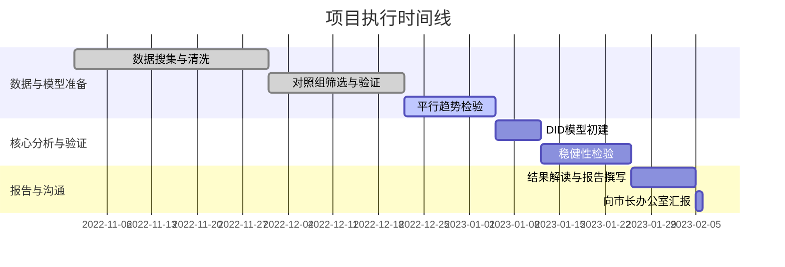

好的，我们现在就启程。想象一下，你我正坐在一个堆满报告和图表的项目作战室里，咖啡已经凉了，白板上还留着上次激烈讨论的痕迹。我们的任务，不仅仅是分析数据，而是要从历史的数字回响中，为未来的决策找到最清晰的路径。

***

### 案例分析：从历史数据中汲取政策教训

#### 1. 问题引入 (故事背景)

故事开始于一座名为“Veridia”的繁华都市。多年来，Veridia的市中心（CBD）一直饱受交通拥堵和空气质量下降的困扰。经过数轮激辩，市长办公室推行了一项颇具争议的政策：在CBD区域征收“拥堵费”。政策目标很明确：减少车流量，改善环境。

一年后，我们被市长办公室召集。他们抛出了一个棘手的问题：“拥堵费政策到底有没有用？”

*   **挑战**: 媒体上的声音两极分化。支持者拿出空气质量监测站的图表，显示PM2.5浓度有所下降；反对者则举着本地商户联合会的报告，声称政策导致客流锐减，零售业收入断崖式下跌。两种说法都有数据支撑，但都可能只是**相关性**，而非**因果关系**。经济可能正在进入下行周期，全国零售业都不景气呢？或者，去年冬天风特别大，吹散了污染物？
*   **目标**: 我们的任务是，穿透这些噪音，为市长提供一个关于拥堵费政策对“CBD区域商业活动净影响”的、具备因果解释力的量化评估。这份评估将直接影响到该政策是继续推行、调整还是被废止。

#### 2. 核心方案与类比

面对这个挑战，我们不能简单地比较Veridia市CBD实施政策前后的商业数据。这种“前-后”对比法，无法剔除与政策无关的其他经济、社会因素的影响。

我们的核心方案是借鉴医学临床试验的逻辑，构建一个**自然实验**，并使用**双重差分法（Difference-in-Differences, DID）**来识别因果效应。

**类比**: 想象一下，为了测试一种新药的疗效，我们找到了两组病人。一组服用新药（**处理组**），另一组服用安慰剂（**对照组**）。我们比较的不是服药后处理组的体温变化，而是**处理组的体温变化**与**对照组的体温变化**之间的**差异**。对照组的变化，帮我们控制了环境温度变化、病毒自愈趋势等“混淆因素”。

在这个案例中：
*   **处理组**: Veridia市的CBD商圈。
*   **“药物”**: 拥堵费政策。
*   **对照组**: 我们需要找到Veridia的“双胞胎”——另一座在人口规模、产业结构、经济发展水平上都极为相似，但在同期**没有**实施拥堵费政策的城市，我们称之为“Metropolis”。
*   **“疗效”**: 拥堵费政策对商业活动（如零售额）的真实影响。

DID模型的核心，就是通过“两次相减”来剥离混淆因素，分离出纯粹的政策效应。

#### 3. 最小示例 (关键代码/配置)

在我们庞大的数据集中，最核心的分析可以用一个非常简洁的回归模型来概括。假设我们已经整理好了两个城市、两年（政策前一年、政策后一年）的面板数据。

if `include_case_snippets`:
> **案例数据片段**:
>
> | city_id | city_name | year | is_post_period | is_veridia | monthly_revenue_M |
> | :--- | :--- | :--- | :--- | :--- | :--- |
> | 1 | Veridia | 2021 | 0 | 1 | 150.5 |
> | 1 | Veridia | 2022 | 1 | 1 | 145.2 |
> | 2 | Metropolis | 2021 | 0 | 0 | 142.1 |
> | 2 | Metropolis | 2022 | 1 | 0 | 140.5 |
>
> 在这个简化片段里，`is_post_period`代表政策实施后时期（=1），`is_veridia`代表处理组（=1）。

if `include_code`:
```python
# 使用 Python 的 statsmodels 库进行 DID 回归分析
import pandas as pd
import statsmodels.formula.api as smf

# 假设 df 是我们整理好的面板数据 DataFrame
# 变量定义:
# monthly_revenue_M: 因变量，月度平均零售额（百万）
# is_veridia: 处理组虚拟变量 (1=Veridia, 0=Metropolis)
# is_post_period: 政策实施后时期虚拟变量 (1=2022年, 0=2021年)

# 创建交互项，即DID项
df['did_interaction'] = df['is_veridia'] * df['is_post_period']

# 构建并拟合 OLS 回归模型
# Y_it = β₀ + β₁ * Treat_i + β₂ * Post_t + δ * (Treat_i * Post_t) + ε_it
model_did = smf.ols('monthly_revenue_M ~ is_veridia + is_post_period + did_interaction', data=df)
results = model_did.fit()

# 打印回归结果摘要
print(results.summary())

# 我们最关心的就是 did_interaction 项的系数 (δ) 和它的p值
# 这个系数 δ 就是我们估算出的政策净效应
```

为了更直观地理解，我们可以手动进行“两次相减”：
1.  Veridia政策前后的变化：145.2 (2022年) - 150.5 (2021年) = -5.3。
2.  Metropolis同期的变化：140.5 (2022年) - 142.1 (2021年) = -1.6。
3.  两者变化的差异（即DID估计值）：(-5.3) - (-1.6) = -3.7。

回归模型中 `did_interaction` 的系数(δ)所估计的，正是这个值。

这个`did_interaction`项的系数，就是我们千辛万苦寻找的答案。它量化了拥堵费政策在控制了时间趋势和城市固有差异后，对Veridia市CBD商业收入的“净效应”。

#### 4. 原理剖析 (方案执行与决策过程)

这个项目的执行过程，远比那几行代码要复杂得多。它是一场在数据、理论和现实约束之间不断权衡的旅程。

if `include_mermaid`:


**关键决策点1：寻找“不存在的孪生兄弟”**

我们最初的挑战就是选择Metropolis。完美的对照组在现实中并不存在。我们团队内部产生了争论：城市A在人口结构上更像Veridia，但产业结构偏向制造业；城市B产业结构相似，但人口规模小一圈。

*   **决策过程**: 我们没有凭感觉二选一，而是采用了一种更系统的方法。我们收集了政策实施前5年，大约10个候选城市的多维度数据（人口、GDP、产业构成、交通流量、零售额等）。通过**倾向得分匹配（Propensity Score Matching）**，我们量化了每个候选城市与Veridia在政策实施前的“相似度”。最终，Metropolis综合得分最高。我们在报告中明确说明了选择标准和过程，增加了分析的透明度和可信度。

**关键决策点2：检验“平行趋势”这一命门**

DID模型的灵魂假设是**平行趋势假设**：即在没有政策干预的情况下，处理组和对照组的结果变量（商业收入）会保持相同的发展趋势。如果这个假设不成立，我们的所有结论都将是空中楼阁。

*   **执行过程**: 我们绘制了Veridia和Metropolis在政策实施前5年（2017-2021）的季度零售额指数。从图上看，两条曲线几乎是平行的，这给了我们极大的信心。
*   if `include_math`:
    > 数学上，这个假设意味着：
    > $E[Y_{i,t-1} - Y_{i,t-2} | D_i=1] = E[Y_{i,t-1} - Y_{i,t-2} | D_i=0]$
    > 其中 $Y$ 是结果变量, $D_i=1$ 代表处理组, $t$ 为政策实施时间点。
    > 简而言之，这个公式意味着：在政策实施之前，Veridia的商业收入变化趋势（例如，年增长率）应该和Metropolis的商业收入变化趋势是基本一致的。

**关键决策点3：从“显著为负”到“拨云见日”**

初次运行模型后，结果让所有人心里一沉：`did_interaction`的系数显著为负。这似乎印证了反对者的说法。但作为严谨的分析师，我们知道工作才刚刚开始。

*   **决策过程（稳健性检验）**: 
    1.  **加入控制变量**: 我们在模型中加入了可能影响零售额的城市级别变量，如当季失业率、平均气温等。结果显示，`did_interaction`的系数依然为负，但绝对值变小了。
    2.  **安慰剂检验（Placebo Test）**: 我们“伪造”了政策实施时间，假设政策在2020年（实际是2022年）就实施了，然后重新运行DID。结果显示，伪造的DID系数不显著。这说明我们的模型没有捕捉到虚假的效应，增强了主结果的可靠性。
    3.  **异质性分析**: 我们将CBD商户分为餐饮、零售、服务等不同类别。一个惊人的发现出现了：政策对高端零售和服务业的冲击较大，但对快餐、便利店等“刚需”业态影响不明显，甚至略有正向作用。

最终，我们向市长办公室呈现的不是一个简单的负数，而是一个有层次、有深度的结构性影响分析。

#### 5. 常见误区 (复盘与反思)

*   **误区一：对“平行趋势”的盲目自信**。我们早期仅凭肉眼观察图表就感到满意。后来在一位资深顾问的建议下，我们进行了更严格的统计检验（如在回归中加入时间趋势与处理组的交互项），这让我们的论证更加坚实。未来，应始终将严格检验作为标准流程。
*   **误区二：忽略溢出效应（Spillover Effects）**。我们的模型假设Veridia的政策不会影响到Metropolis。但如果Veridia的某些大公司因为拥堵费，将部分业务或会议转移到了Metropolis，那么对照组就被“污染”了，会低估政策的负面影响。我们在报告的局限性部分坦诚了这一点，并建议未来研究可以选取地理上更远的城市作为对照。
*   **误区三：数据颗粒度的陷阱**。我们最初只有年度数据，这使得平行趋势检验的说服力较弱。团队花了一个月的时间，与统计部门艰难沟通，最终拿到了季度数据。这个过程提醒我们，高质量、高频的数据是做出精准评估的生命线。

#### 6. 拓展应用 (经验迁移)

这次Veridia拥堵费的评估项目，为我们团队沉淀了宝贵的方法论，可以迁移到其他政策评估场景：

1.  **“反事实思维”的制度化**: 在评估任何新举措（例如，公司实施新的销售激励计划）时，第一步永远是问：“我们的‘对照组’是什么？”。它可以是未实施新政的销售团队、可以是历史同期数据，也可以是行业平均水平。养成寻找基准和反事实的习惯，是数据驱动决策的起点。
2.  **稳健性检验清单**: 我们将这次用到的稳健性检验方法（添加控制变量、安慰剂检验、更换对照组、分样本讨论等）整理成了一份标准清单。未来任何重要的因果推断项目，都必须至少完成清单中的三项检验。
3.  **定性与定量结合的叙事**: 冰冷的回归系数无法打动决策者。我们的最终报告，将`did_interaction`的量化结果与对CBD商户的深度访谈相结合。一位店主说：“大客户不愿开车进来了，但周边的上班族午餐消费反而多了。” 这句鲜活的话，完美诠释了我们发现的“异质性效应”，让数据变得有血有肉。

#### 7. 总结要点

历史数据是一座富矿，但要从中“汲取教训”而非“提炼偏见”，需要一套严谨的科学方法。

*   **成功的关键**: 
    *   **构建合理的反事实**: 通过精心选择对照组，我们得以模拟出“如果Veridia没有实施拥堵费”的世界线。
    *   **严谨的模型假设检验**: 对平行趋势的反复验证，是我们结论有效性的基石。
    *   **超越单一模型的视角**: 稳健性检验和异质性分析，将我们的发现从一个单薄的数字，变成了一个丰富、立体的故事。
*   **案例分析的角色**: 在这个过程中，案例分析（或更广义的因果推断方法，如DID）扮演了**“思想的脚手架”**。它迫使我们系统性地思考混淆变量，明确识别假设，并以一种结构化的方式去逼近那个难以捉摸的“因果真相”。

#### 8. 思考与自测

现在，把聚光灯打在你身上。

**情景**: 在项目复盘会上，一位来自交通部门的同事提出了一个尖锐的问题：“我们的分析显示，政策对商业有轻微的负面净效应。但我们收集的交通流量数据显示，CBD的高峰期拥堵指数下降了30%，空气质量AQI指数平均降低了12%。这些巨大的正向收益，在你们的商业模型里完全没有体现。你们的结论是否片面，甚至误导了市长？”

**问题**: 如果你是当时的项目负责人，在市长和各部门负责人面前，你会如何回应这个挑战？你的回答应该如何体现经济学家的权衡（trade-off）思维，并维护你团队分析的专业性和完整性？

***
if `include_references`:
> **参考文献与延伸阅读**:
> 1.  Angrist, J. D., & Pischke, J. S. (2009). *Mostly Harmless Econometrics: An Empiricist's Companion*. Princeton University Press. (因果推断领域的“圣经”)
> 2.  Card, D., & Krueger, A. B. (1994). Minimum Wages and Employment: A Case Study of the Fast-Food Industry in New Jersey and Pennsylvania. *American Economic Review*, 84(4), 772-793. (DID方法的经典应用)
> 3.  Bertrand, M., Duflo, E., & Mullainathan, S. (2004). How Much Should We Trust Differences-in-Differences Estimates?. *The Quarterly Journal of Economics*, 119(1), 249-275. (关于DID方法在使用中的一些潜在问题)
