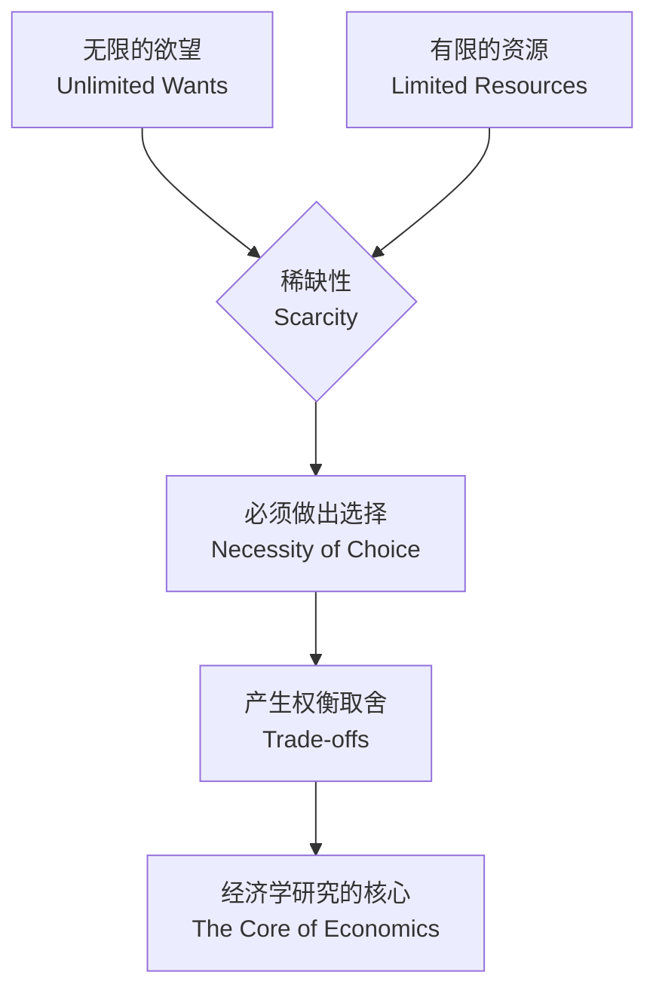

### 1.1 核心问题：稀缺性与选择 (The Core Problem: Scarcity and Choice)

在正式踏入经济学的殿堂之前，让我们先思考一个贯穿你我生活每一天的问题：**你为什么无法拥有所有你想要的东西？**

你可能想要最新的智能手机，一场说走就走的环球旅行，每天睡到自然醒，同时还想在学业上名列前茅。然而，现实是，你的时间、金钱和精力都是有限的。正是这种“想要”与“拥有”之间的永恒差距，构成了经济学研究的基石。

#### 硬币的两面：无限的欲望与有限的资源

经济学家观察世界时，首先会注意到两个基本事实：

1.  **人类欲望的无限性 (Unlimited Wants):** 人的欲望是无止境的。这并非指人性的贪婪，而是一种自然倾向。当我们满足了一个基本需求（如温饱）后，会立刻产生更高级的需求（如更好的居住环境、更丰富的精神生活）。即使是世界上最富有的人，也可能想要更多的时间、更健康的身体或是探索宇宙的无限可能。欲望的边界会随着我们认知和能力的拓展而不断外延。

2.  **世界资源的有限性 (Limited Resources):** 与无限的欲望相对，我们用来满足这些欲望的资源却是有限的。**资源** (Resources) 在经济学中是一个广义的概念，它包括：
    *   **自然资源：** 土地、矿产、水源、石油等。
    *   **资本资源：** 生产商品和服务的工具、机器、厂房等。
    *   **人力资源：** 劳动者的体力、智力、技能和时间。其中，**时间**是最具刚性约束的稀缺资源，对每个人来说，一天都只有24小时。

#### 根本性的经济问题：稀缺性 (Scarcity)

当**无限的欲望**遭遇**有限的资源**时，一个无法回避的矛盾便产生了，经济学家将其称为 **稀缺性 (Scarcity)**。

> **定义：稀缺性** 是指相对于人们无穷的欲望而言，经济资源是有限的这样一种状态。

需要强调的是，**稀缺性不等于贫穷，也不等于罕见**。贫穷是指生活在基本需求得不到满足的状态，而稀缺性是一种普遍存在于所有社会、所有个人（无论贫富）的境况。比尔·盖茨拥有巨额财富，但他依然面临时间的稀缺性；空气对我们至关重要且储量巨大，但在污染严重的城市，洁净的空气就是一种稀缺资源。

#### 不可避免的结果：选择 (Choice) 与权衡 (Trade-offs)

正是因为稀缺性的存在，我们才**必须做出选择**。你不能同时用同一笔钱去买一部手机和一台电脑；你也不能在同一个晚上既去听音乐会又在家复习备考。选择，意味着放弃。

这种为了得到某样东西而必须放弃另一样东西的局面，就是 **权衡取舍 (Trade-off)**。经济学研究的核心，在很大程度上就是研究个人、企业和政府在面对稀缺性时如何做出最优的选择。

***

> **案例分析：一个学生的周末抉择**
>
> 假设一位名叫小明的学生，他的周末时间是有限的（48小时）。他想利用这个周末做很多事：
>
> - **欲望清单：**
>   1.  为下周的微观经济学期中考试复习（预计需要10小时）。
>   2.  和朋友去看一场期待已久的电影（约3小时）。
>   3.  完成一份兼职工作，赚取生活费（8小时）。
>   4.  参加一场社团的派对活动（4小时）。
>   5.  保证充足的睡眠和休息（至少16小时）。
>
> - **资源约束：** 他的总时间只有48小时。
>
> - **面临的稀缺性与选择：** 小明渴望完成的活动总时长（41小时）几乎占满了他的整个周末。更重要的是，“有限的48小时”这一资源本身就构成了根本性的约束，迫使他在众多想完成的活动中做出取舍，尤其当这些活动在时间点上是相互排斥的。例如，电影和派对可能都在周六晚上。他必须做出选择：去看电影，就意味着放弃参加派对的机会。这个被放弃的“参加派对的乐趣”，就是他选择看电影的**机会成本**（我们将在后续章节深入学习这个概念）。他的每一个决定，都是一次基于资源稀缺性的权衡取舍。

***

#### 经济学家的世界观：一个关于选择的框架

至此，我们可以构建出经济学分析问题的基本逻辑链条。这个思维框架是所有经济学理论的起点。

这个简单的流程图揭示了经济学为何被称为“关于选择的科学”。从个人决定午餐吃什么，到企业决定投资哪个项目，再到国家决定如何分配财政预算，所有经济行为的本质都是在稀缺性的约束下进行选择。

---

#### **要点回顾**

- **经济学的起点：** 源于“无限欲望”与“有限资源”之间的基本矛盾。
- **核心概念：稀缺性 (Scarcity)** 是指资源相对于欲望的有限性，它是一种普遍存在的状态，而非等同于贫穷。
- **必然结果：** 稀缺性迫使我们必须做出 **选择 (Choice)**，任何选择都伴随着 **权衡取舍 (Trade-off)**。
- **经济学的本质：** 是一门研究社会如何管理其稀缺资源，或者说，是一门关于在约束条件下如何做出最优选择的科学。

理解了稀缺性与选择，你就掌握了开启经济学大门的钥匙。在接下来的学习中，我们将探讨经济学家是如何使用一系列原则和模型来分析人们做出选择的方式及其后果的。