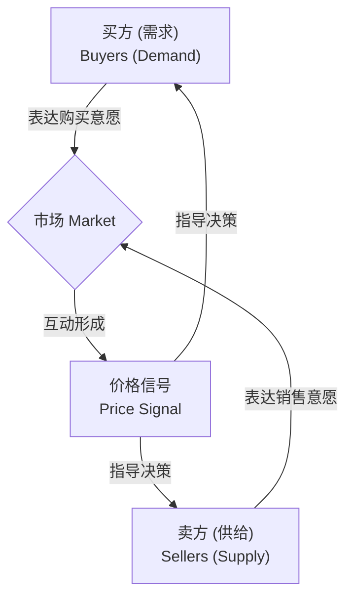

好的，作为一位资深的教育作者，我将紧接“2.1 起点：什么是市场？”的介绍，自然地续写下一段内容。

---

我们已经知道，市场是“看不见的手”发挥作用的舞台。那么，这只手究竟是如何实现买卖双方——这两个素未谋面、目标各异的群体——的“握手”的呢？答案在于市场中一种强大而简洁的语言：**价格**。

### 2.1.1 市场的语言：价格信号 (The Language of the Market: Price Signals)

价格绝不仅仅是你为一瓶水或一部手机支付的那个数字。在经济学中，价格是一个蕴含着丰富信息、能够协调无数人决策的**信号**。它就像市场的神经系统，高效地传递着关于稀缺性、偏好和成本的关键情报。

想象一下：

*   **对于消费者（买方）**：
    *   当一款新手机的价格高昂时，这个价格信号告诉你：”它很受欢迎，或者生产成本很高，或者供应有限。请谨慎购买，或者考虑替代品。“
    *   当超市里的牛油果降价促销时，这个信号则在说：”现在供应充足，快来买吧！“
    *   因此，价格帮助消费者在有限的预算内，做出如何分配支出的最优决策。

*   **对于生产者（卖方）**：
    *   高昂的手机价格信号也在对生产者呼喊：”消费者非常渴望这款产品，这是一个巨大的盈利机会，快投入资源生产更多！“
    *   牛油果的低价则警告农场主：”市场上的牛油果太多了，或者消费者兴趣下降了，或许应该减少种植面积，或者将资源转移到其他更有利可图的作物上。“
    *   因此，价格引导生产者决定生产什么、生产多少，从而将稀缺的社会资源配置到最被需要的地方。

价格就是这样，无需任何中央机构的指令，便悄无声息地协调了数百万个独立的经济决策。它既是衡量价值的标尺，也是分配资源的指挥棒。

### 2.1.2 “握手”的双方：需求与供给 (The Two Parties of the Handshake: Demand and Supply)

现在我们明白了价格是沟通的语言，那么沟通的双方又是谁呢？在任何市场中，都存在着两个基本力量，它们共同决定了价格的形成。这就是我们即将深入探讨的核心概念：

1.  **需求 (Demand)**：代表了在不同价格水平下，**买方**愿意并且能够购买的商品或服务的数量。他们的目标通常是最大化个人满足感（经济学中称为“效用”）。
2.  **供给 (Supply)**：代表了在不同价格水平下，**卖方**愿意并且能够提供到市场上的商品或服务的数量。他们的目标通常是最大化利润。

市场，正是在这两股力量的角逐与互动中，找到了一个平衡点。我们可以用一个简单的流程图来描绘这个动态的互动过程：

这个由无数次出价与要价的博弈自发形成的价格，就是“看不见的手”完成“握手”的瞬间。它不是由任何人强加的，而是市场参与者共同“协商”出的结果。

#### 本节小结 (Key Takeaways)

*   **市场是一种机制**：它让买卖双方能够进行交易，其核心是信息传递与决策协调。
*   **价格是核心信号**：价格不仅仅是一个数字，它是传递关于稀缺性、价值和机会成本等关键信息的语言。
*   **价格协调决策**：价格信号引导消费者如何消费，引导生产者如何生产，从而实现了社会资源的有效配置。
*   **两大核心力量**：市场的互动主体是买方（构成需求）和卖方（构成供给），他们的互动共同决定了价格。

在接下来的内容中，我们将分别解构“需求”和“供给”这两股力量，看看它们各自遵循什么样的规律，以及它们是如何共同谱写市场的交响乐的。