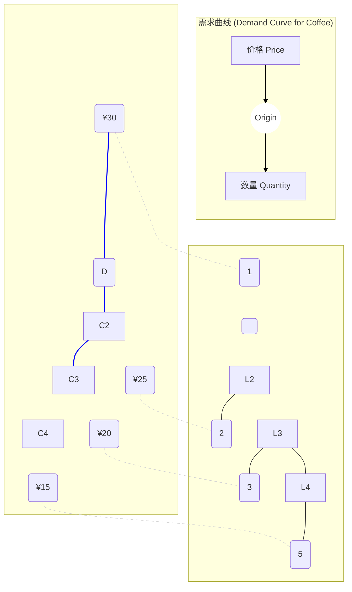
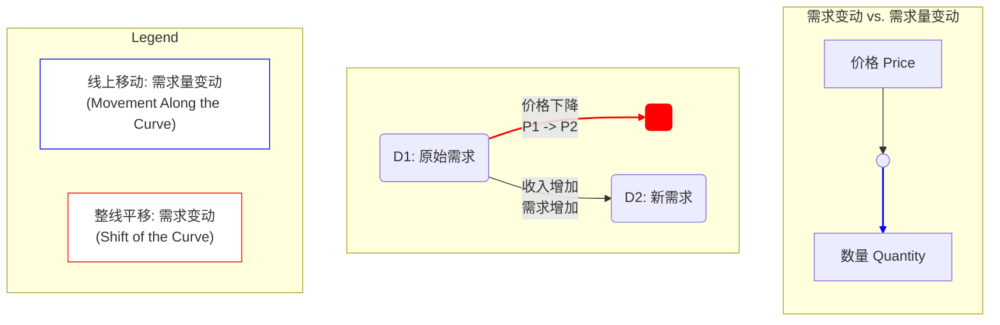

好的，作为一位资深的教育作者，我将紧接之前的介绍，自然地续写下一小节的内容。

---

我们已经将市场的参与者分为了买方（需求）和卖方（供给），并将价格视为他们沟通的语言。现在，让我们把聚光灯打在买方身上，深入探究市场引擎的一侧——**需求 (Demand)**。它遵循着怎样简单而深刻的规律？

### 2.2 引擎的一侧：需求 (Demand)

在日常对话中，“需求”常常和“想要”混为一谈。但在经济学中，**需求**的定义要严格得多。它不仅仅是欲望，而是指在一定时期内，在各种可能的价格水平下，消费者**愿意并且能够（willing and able）**购买的某种商品或服务的数量。

“愿意”体现了消费者的偏好，而“能够”则强调了购买力的约束。你可能想拥有一座私人岛屿，但这并不构成经济学意义上的需求，除非你同时拥有购买它的财力。

#### 2.2.1 需求定律：价格与意愿的“反向舞蹈” (The Law of Demand: The Inverse Dance of Price and Willingness)

消费者是如何决定购买多少的呢？答案简单得几乎是常识，却构成了经济学最坚实的基石之一——**需求定律 (The Law of Demand)**。

> **需求定律**：在其他条件保持不变（ceteris paribus）的情况下，一种商品的价格越低，消费者对它的需求量（Quantity Demanded）就越大；反之，价格越高，需求量就越小。

这种价格和需求量之间的负相关关系，我们可以通过一个具体的例子来理解。假设我们正在研究小王每周对现磨咖啡的需求：

*   **需求表 (Demand Schedule)**
    这是一个表格，清晰地展示了价格与小王愿意并能够购买的数量之间的对应关系。

| 咖啡价格 (Price per cup) | 需求量 (Quantity Demanded per week) |
| :----------------------- | :---------------------------------- |
| ¥30                      | 1 杯                                |
| ¥25                      | 2 杯                                |
| ¥20                      | 3 杯                                |
| ¥15                      | 5 杯                                |
| ¥10                      | 7 杯                                |

*   **需求曲线 (Demand Curve)**
    将需求表中的关系用图形表示出来，我们就得到了**需求曲线**。它是一条向右下方倾斜的曲线，直观地描绘了需求定律。

**为什么需求定律会成立？**

这背后有几个关键的经济学逻辑：

1.  **替代效应 (Substitution Effect)**：当咖啡价格下降时，它相对于其他饮品（如奶茶）变得更便宜了。理性的消费者会选择用相对便宜的咖啡来替代一部分原本要消费的奶茶，从而增加了咖啡的需求量。
2.  **收入效应 (Income Effect)**：当咖啡价格下降时，你的实际购买力增强了。即使你的工资没变，但现在买同样的咖啡花钱更少了，你感觉自己变“富裕”了，因此有能力购买更多的咖啡（或其他商品）。
3.  **边际效用递减 (Diminishing Marginal Utility)**：你喝第一杯咖啡时获得的满足感（效用）通常是最大的。第二杯依然很棒，但满足感可能略有下降。你只有在价格足够低时，才愿意为那份“递减的”满足感支付费用，购买第三杯、第四杯。

#### 2.2.2 关键区分：“线上移动”与“整线平移” (Movement Along the Curve vs. Shift of the Curve)

这是理解需求时最关键，也最容易混淆的一个点。价格变化带来的影响，和其它因素变化带来的影响，是完全不同的。

*   **需求量的变动 (Change in Quantity Demanded)**
    这是指**沿着同一条需求曲线的移动**。
    *   **唯一原因**：商品**自身的价格**发生变化。
    *   **表现**：从曲线上的A点移动到B点。
    *   **例子**：星巴克将拿铁从¥30降价到¥25，导致小王每周的购买量从1杯增加到2杯。这只是在同一条需求曲线上向下移动，是**需求量的增加**。

*   **需求的变动 (Change in Demand)**
    这是指**整条需求曲线的移动**，向右平移（需求增加）或向左平移（需求减少）。
    *   **原因**：除了商品自身价格以外的**任何其他因素**发生了变化。这些因素打破了“其他条件保持不变”的假设。
    *   **表现**：整条曲线从D1移动到D2（增加）或D3（减少）。
    *   **例子**：假设小王的**工资上涨了**。现在，即使咖啡价格仍然是¥25，他也可能愿意每周购买3杯而不是2杯了。在每一个价格水平上，他都愿意买更多。这就导致他的整条需求曲线向右移动。

**影响需求变动（导致曲线平移）的主要因素有哪些？**

1.  **收入 (Income)**：
    *   **正常品 (Normal Goods)**：收入增加，需求增加（曲线右移）。如旅游、牛排。
    *   **低档品 (Inferior Goods)**：收入增加，需求反而减少（曲线左移）。如泡面、长途巴士。
2.  **相关商品的价格 (Prices of Related Goods)**：
    *   **替代品 (Substitutes)**：一种商品价格上涨，导致另一种商品需求增加。例如，可口可乐涨价，百事可乐的需求曲线会向右移动。
    *   **互补品 (Complements)**：一种商品价格上涨，导致另一种商品需求减少。例如，汽油价格飙升，大排量SUV的需求曲线会向左移动。
3.  **偏好 (Tastes and Preferences)**：健康报告指出红酒有益心脏，红酒的需求曲线就会向右移动。
4.  **预期 (Expectations)**：如果你预期下个月房价会大涨，你现在买房的需求就会增加（曲线右移）。
5.  **买家数量 (Number of Buyers)**：一个城市的人口流入增加，该城市对住房、食品等几乎所有商品的需求曲线都会向右移动。

> **【常见错误预警 Common Mistake Warning】**
>
> **请务必区分“需求”和“需求量”！**
> *   “由于价格下降，iPhone的**需求**增加了。” **（错误！）**
> *   “由于价格下降，iPhone的**需求量**增加了。” **（正确！）**
>
> 价格本身的变化，只会引起**需求量**沿着固定曲线的变动。只有当收入、偏好等非价格因素变化时，我们才能说**需求**本身发生了变化（整条曲线移动）。这是经济学分析的基石，混淆这两者会让你在后续的学习中寸步难行。

#### 本节小结 (Key Takeaways)

*   **需求定律**是核心规律：价格与需求量呈反比关系，其背后是替代效应、收入效应和边际效用递减的共同作用。
*   **需求曲线**是需求定律的视觉呈现，它向右下方倾斜。
*   **区分两种变动是关键**：
    *   **需求量的变动**：由商品**自身价格**变化引起，表现为**沿线移动**。
    *   **需求的变动**：由**非价格因素**（如收入、偏好等）变化引起，表现为**整条线的平移**。

理解了需求这一侧的力量后，我们下一步将转向市场的另一端，看看供给方的行为逻辑。