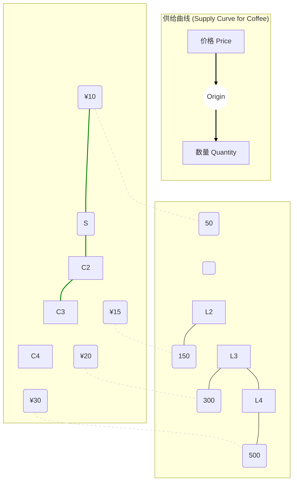

好的，作为一位资深的教育作者，我将紧接“2.2 需求”的介绍，自然地续写下一小节“2.3 供给”的内容，保持叙事和教学风格的连贯性。

---

我们已经深入剖析了市场这枚硬币的一面——消费者的需求行为。现在，是时候翻转硬币，将我们的目光投向引擎的另一侧，探究生产者或卖方的行为逻辑。他们是如何决定向市场提供多少商品和服务的？

### 2.3 引擎的另一侧：供给 (Supply)

与需求类似，经济学中的**供给**也有其精确的定义。它不是指生产者仓库里堆积的存货，而是指在一定时期内，在各种可能的价格水平下，生产者**愿意并且能够（willing and able）**提供出售的某种商品或服务的数量。

“愿意”反映了生产者的盈利动机，而“能够”则受到了生产技术、成本和资源的限制。一家咖啡馆可能梦想着每天卖出一万杯咖啡，但如果它的咖啡机和员工数量只能支持每天生产五百杯，那么其有效的供给能力就受限于后者。

#### 2.3.1 供给定律：价格与意愿的“同向奔赴” (The Law of Supply: The Direct Dance of Price and Willingness)

生产者决策的核心逻辑是什么？答案同样简单直观，它构成了与需求定律相对应的经济学基石——**供给定律 (The Law of Supply)**。

> **供给定律**：在其他条件保持不变（ceteris paribus）的情况下，一种商品的价格越高，生产者对它的供给量（Quantity Supplied）就越大；反之，价格越低，供给量就越小。

这种价格和供给量之间的正相关关系，与需求定律恰好相反。我们可以站在一个咖啡馆老板的角度来理解这背后的逻辑：

1.  **盈利动机 (Profit Motive)**：这是最直接的原因。一杯咖啡的价格越高，每卖出一杯的利润就越大。更高的利润像一块磁铁，强烈吸引着生产者投入更多资源（如雇佣更多咖啡师、延长营业时间）来增加产量，以获取更多收益。
2.  **边际成本递增 (Increasing Marginal Cost)**：在短期内，当一个生产者试图快速增加产量时，往往会面临成本上升的困境。例如，为了生产更多咖啡，咖啡馆可能需要让员工加班（支付更高的加班费），或者让机器超负荷运转（增加损耗和维护成本）。这种生产额外一单位产品所增加的成本，我们称之为“边际成本”。由于边际成本是递增的，生产者只有在市场价格高到足以覆盖这些额外成本并仍有利润时，才愿意去生产更多的产品。

让我们用同样的方式，将供给定律具象化。假设我们研究一家咖啡馆每周的咖啡供给情况：

*   **供给表 (Supply Schedule)**
    这个表格清晰地展示了价格与咖啡馆愿意并能够供应的数量之间的对应关系。

| 咖啡价格 (Price per cup) | 供给量 (Quantity Supplied per week) |
| :----------------------- | :---------------------------------- |
| ¥30                      | 500 杯                              |
| ¥25                      | 400 杯                              |
| ¥20                      | 300 杯                              |
| ¥15                      | 150 杯                              |
| ¥10                      | 50 杯 (低于此价格可能亏本，不愿生产) |

*   **供给曲线 (Supply Curve)**
    将供给表中的关系绘制成图，我们就得到了**供给曲线**。它是一条向右上方倾斜的曲线，直观地展示了价格和供给量之间的正向关系。

#### 2.3.2 再次区分：“线上移动”与“整线平移” (Movement Along the Curve vs. Shift of the Curve)

和需求一样，区分供给量的变动和供给的变动，是掌握供给理论的关键。这里的逻辑与需求侧完全平行。

*   **供给量的变动 (Change in Quantity Supplied)**
    *   **定义**：沿着**同一条供给曲线的移动**。
    *   **唯一原因**：商品**自身的价格**发生变化。
    *   **表现**：从曲线上的A点移动到B点。
    *   **例子**：由于市场需求旺盛，咖啡的市场价格从每杯¥20上涨到¥25。作为回应，该咖啡馆将其每周的产量从300杯增加到400杯。这是在同一条供给曲线上向右上方的移动，是**供给量的增加**。

*   **供给的变动 (Change in Supply)**
    *   **定义**：**整条供给曲线的移动**，向右平移（供给增加）或向左平移（供给减少）。
    *   **原因**：除了商品自身价格以外的**任何其他因素**发生了变化，打破了“其他条件保持不变”的假设。
    *   **表现**：整条曲线从S1移动到S2（增加）或S3（减少）。
    *   **例子**：假设**咖啡豆（一种生产要素）的价格大幅下降**了。现在，即使咖啡售价仍然是¥20，咖啡馆的利润空间也变大了，因此它愿意提供更多的咖啡，比如每周400杯。在每一个价格水平上，它都愿意供给更多。这就导致它的整条供给曲线向右移动。

**影响供给变动（导致曲线平移）的主要因素有哪些？**

1.  **投入品价格 (Input Prices)**：这是影响生产成本的核心因素。如果咖啡豆、牛奶、工人工资或店面租金下降，生产成本降低，供给曲线会向右移动（供给增加）。反之则向左移动。
2.  **技术进步 (Technology)**：新的咖啡机能用更少的咖啡豆和时间制作出同样品质的咖啡，这降低了成本，提高了效率。技术进步总是使供给曲线向右移动。
3.  **预期 (Expectations)**：如果咖啡馆老板预期下周咖啡豆会因恶劣天气而涨价，他可能会选择现在囤积咖啡豆，减少本周的咖啡供给，导致供给曲线暂时向左移动。
4.  **卖方数量 (Number of Sellers)**：如果街角新开了一家咖啡馆，整个市场的咖啡供给就会增加，市场供给曲线会向右移动。
5.  **相关商品的价格 (Prices of Related Goods in Production)**：
    *   **生产中的替代品**：一个面包店既可以烤面包也可以做蛋糕。如果蛋糕的价格大涨，面包店可能会把更多的烤箱和人力用来做蛋糕，从而减少面包的供给（面包供给曲线左移）。
    *   **生产中的互补品**：开采石油的同时会产出天然气。如果石油价格上涨导致石油开采量增加，那么天然气的供给也会随之增加（天然气供给曲线右移）。

> **【常见错误预警 Common Mistake Warning】**
>
> **请再次打起精神，区分“供给”和“供给量”！**
> *   “由于价格上涨，咖啡的**供给**增加了。” **（错误！）**
> *   “由于价格上涨，咖啡的**供给量**增加了。” **（正确！）**
>
> 价格本身的变化，只会引起**供给量**沿着固定曲线的变动。只有当生产成本、技术等非价格因素变化时，我们才能说**供给**本身发生了变化（整条曲线移动）。这个区分与需求侧同样重要，是精确进行经济学分析的基础。

#### 本节小结 (Key Takeaways)

*   **供给定律**是核心规律：价格与供给量呈正比关系，其背后是盈利动机和边际成本递增的共同作用。
*   **供给曲线**是供给定律的视觉呈现，它向右上方倾斜。
*   **区分两种变动至关重要**：
    *   **供给量的变动**：由商品**自身价格**变化引起，表现为**沿线移动**。
    *   **供给的变动**：由**非价格因素**（如成本、技术等）变化引起，表现为**整条线的平移**。

至此，我们已经分别了解了市场引擎的两股核心力量：向右下方倾斜的需求曲线，代表着消费者的意愿；以及向右上方倾斜的供给曲线，代表着生产者的意愿。那么，当这两股方向相反的力量在市场中相遇时，会发生什么呢？这正是我们下一节要揭晓的谜底：市场的均衡。