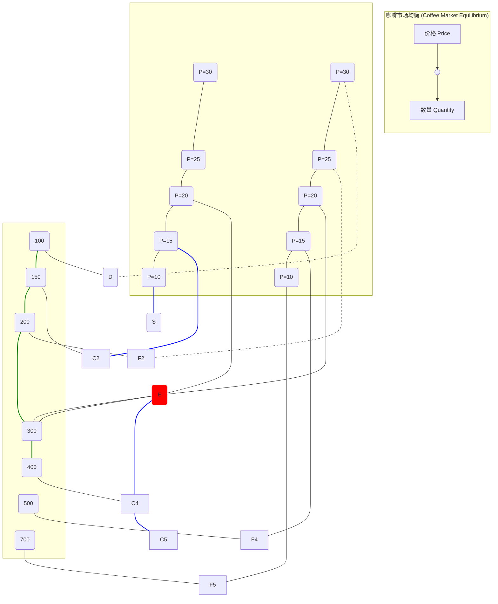

好的，作为一位资深的教育作者，我将紧接“2.3 供给”的内容，自然地续写下一小节，将供给与需求这两股力量汇合，揭示市场均衡的奥秘。

---

至此，我们已经分别了解了市场引擎的两股核心力量：代表消费者意愿、向右下方倾斜的需求曲线；以及代表生产者意愿、向右上方倾斜的供给曲线。它们就像两股方向相反的潮水。那么，当这两股潮水在市场的汪洋中相遇时，会发生什么呢？这正是我们本节要揭晓的，市场运转最核心的瞬间——**均衡**的形成。

### 2.4 引擎的运转：市场均衡 (Equilibrium)

在物理学中，均衡是指一个系统中的各种力量相互抵消，达到一种静止或稳定状态。市场均衡的概念与此类似。它是指在某一价格水平上，买方愿意且能够购买的数量，恰好等于卖方愿意且能够出售的数量。这个点，就是供给与需求力量达成“握手”的完美瞬间。

*   **均衡价格 (Equilibrium Price, P\*)**：也称为市场出清价格 (Market-Clearing Price)，是供给量与需求量相等时的价格。在这个价格下，市场上既没有卖不出去的商品，也没有买不到商品的需求。
*   **均衡数量 (Equilibrium Quantity, Q\*)**：在均衡价格下，买卖双方成交的数量。

#### 2.4.1 均衡的视觉呈现：供给与需求的交点

要找到市场的均衡点，最直观的方法就是将我们之前分别绘制的需求曲线和供给曲线放在同一个坐标系中。它们的交点 E (Equilibrium)，就是市场的均衡状态。

让我们继续使用咖啡市场的例子。综合之前的需求表和供给表：

| 咖啡价格 (Price per cup) | 需求量 (Qd) | 供给量 (Qs) | 市场状态 (Market State)     | 价格趋势 (Pressure on Price) |
| :----------------------- | :---------- | :---------- | :-------------------------- | :--------------------------- |
| ¥30                      | 100 杯      | 500 杯      | 供给量 > 需求量 (过剩 400杯) | ↓ 下降 (Downward)          |
| ¥25                      | 200 杯      | 400 杯      | 供给量 > 需求量 (过剩 200杯) | ↓ 下降 (Downward)          |
| **¥20**                  | **300 杯**  | **300 杯**  | **供给量 = 需求量 (均衡)**  | **→ 稳定 (Stable)**        |
| ¥15                      | 500 杯      | 150 杯      | 需求量 > 供给量 (短缺 350杯) | ↑ 上升 (Upward)            |
| ¥10                      | 700 杯      | 50 杯       | 需求量 > 供给量 (短缺 650杯) | ↑ 上升 (Upward)            |

将这个表格图形化，我们可以清晰地看到均衡点：

在这个市场上，均衡价格是 **¥20**，均衡数量是 **300 杯**。

#### 2.4.2 市场的自我修正机制：“看不见的手”在工作

均衡状态是市场的理想归宿，但市场价格并非总能恰好处于均衡点。更重要的是，当价格偏离均衡时，市场会产生一股强大的力量，自动将价格推向均衡水平。这正是亚当·斯密所说的“看不见的手”最生动的体现。

##### 情况一：价格过高导致的**过剩 (Surplus)**

假设由于某种原因，咖啡的市价被定在了 **¥25**，高于均衡价格 ¥20。

*   **市场表现**：
    *   根据供给曲线，在 ¥25 的高价激励下，生产者愿意供给 400 杯咖啡。
    *   根据需求曲线，在 ¥25 的价格下，消费者只愿意购买 200 杯咖啡。
    *   结果：市场上出现了 `400 - 200 = 200` 杯的**过剩**（或称超额供给）。咖啡馆的架子上堆满了卖不出去的咖啡。

*   **修正过程**：
    *   **卖方反应**：为了清理库存、避免浪费和损失，咖啡馆老板有强烈的动机去降价促销。
    *   **价格下降的影响**：随着价格从 ¥25 向 ¥20 回落，两件事情同时发生：
        1.  **供给量减少**：一些利润较低的生产者会减少产量（沿着供给曲线向左下方移动）。
        2.  **需求量增加**：更低的价格吸引了更多消费者前来购买（沿着需求曲线向右下方移动）。
    *   **最终结果**：这种降价的压力会一直持续，直到过剩被完全消除，即价格回到均衡价格 ¥20，此时供给量和需求量再次相等。

##### 情况二：价格过低导致的**短缺 (Shortage)**

现在，假设市场价格被人为地压低到了 **¥15**，低于均衡价格 ¥20。

*   **市场表现**：
    *   根据需求曲线，在 ¥15 的低价诱惑下，消费者蜂拥而至，想要购买 500 杯咖啡。
    *   根据供给曲线，在 ¥15 的价格下，生产者的利润微薄，只愿意供给 150 杯咖啡。
    *   结果：市场上出现了 `500 - 150 = 350` 杯的**短缺**（或称超额需求）。顾客排起长队，却发现咖啡早已售罄。

*   **修正过程**：
    *   **买方与卖方反应**：面对供不应求的局面，一些急切的顾客可能愿意出更高的价格（“我加价，卖给我吧！”）。同时，生产者看到有机可乘，也会意识到他们可以提高价格而依然能卖出所有产品，从而获得更多利润。
    *   **价格上涨的影响**：随着价格从 ¥15 向 ¥20 回升，同样有两件事发生：
        1.  **供给量增加**：更高的价格激励生产者增加产量（沿着供给曲线向右上方移动）。
        2.  **需求量减少**：一些价格敏感的消费者会放弃购买（沿着需求曲线向左上方移动）。
    *   **最终结果**：这种涨价的动力会一直存在，直到短缺被完全弥补，价格最终稳定在均衡价格 ¥20。

> **【案例透视 Case Study】“无形拍卖师”的智慧**
>
> 你可以把市场想象成一个由“无形拍卖师”主持的巨大拍卖会。
> *   如果拍卖师报出的价格太高（**过剩**），会场里举牌的人（需求）寥寥无几，而愿意出售的人（供给）却很多。拍卖师为了成交，唯一的选择就是**降低报价**。
> *   如果拍卖师报出的价格太低（**短缺**），所有人都疯狂举牌竞价（需求），而愿意出售的人却惜售。拍卖师自然会**提高报价**，让出价最高的人得。
>
> 这个过程不断重复，直到拍卖师找到一个价格，使得愿意买的人数恰好等于愿意卖的人数。这个价格，就是均衡价格。在真实市场中，没有这样一个拍卖师，但无数买家和卖家的独立决策，共同扮演了这个角色，自发地将价格推向均衡。

#### 本节小结 (Key Takeaways)

*   **市场均衡**是供给力量与需求力量相平衡的状态，此时供给量等于需求量。
*   **均衡点**由供给曲线和需求曲线的**交点**决定，它确定了市场的均衡价格和均衡数量。
*   **市场具有自我修正能力**：
    *   当价格**高于**均衡价格时，会产生**过剩 (Surplus)**，市场力量会**压低**价格。
    *   当价格**低于**均衡价格时，会产生**短缺 (Shortage)**，市场力量会**推高**价格。
*   这种自发调节机制是**“看不见的手”**发挥作用的核心方式，它无需中央计划，便能有效地协调生产和消费，配置社会资源。

我们现在已经理解了静态的供给和需求如何形成均衡。但在现实世界中，供给和需求曲线并非一成不变。下一节，我们将探讨当这些曲线发生移动时，市场的均衡点又会如何随之而动。