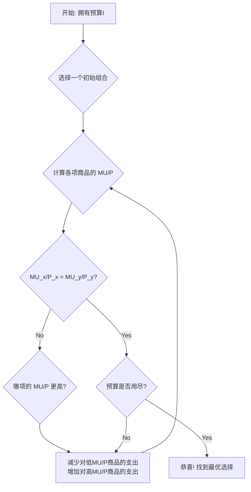

### 3.3 决策：如何做出最优选择 (The Decision: Making the Optimal Choice)

至此，我们已经拼好了消费者决策拼图的两块关键部分：
1.  **目标 (The Goal)**：在内心深处，消费者希望最大化自己的总效用（由边际效用递减规律支配）。
2.  **约束 (The Constraint)**：在现实世界中，消费者的选择范围被其收入和商品价格所限定（由预算线描绘）。

现在，是时候将这两者结合起来，回答那个最核心的问题：**在预算允许的范围内，消费者究竟应该如何选择不同商品的组合，才能实现“最幸福”的状态？**

我们不能凭感觉猜测，而是需要一个理性的决策法则。这个法则的核心思想，正是我们在前面章节反复强调的**边际分析 (Marginal Analysis)**。

#### 1. 一个朴素的思路：比较总效用

让我们回到小明的例子。他有$50预算，卷饼$5一份，咖啡$2.5一杯。他的预算线告诉我们所有他**买得起**的组合。为了做出选择，我们还需要知道他对这两种商品的**偏好**，也就是它们分别能带来多少效用。

为了让我们的分析更完整，我们假设可以量化小明的效用，并根据边际效用递减规律，将效用表扩展到足够大的数量：

| 数量 (Q) | 卷饼的总效用 (TU_taco) | 卷饼的边际效用 (MU_taco) | 咖啡的总效用 (TU_coffee) | 咖啡的边际效用 (MU_coffee) |
| :---: | :---: | :---: | :---: | :---: |
| 1 | 40 | 40 | 20 | 20 |
| 2 | 75 | 35 | 38 | 18 |
| 3 | 105 | 30 | 53 | 15 |
| 4 | 125 | 20 | 65 | 12 |
| 5 | 140 | 15 | 75 | 10 |
| 6 | **150** | **10** | 83 | 8 |
| 7 | 158 | 8 | 90 | 7 |
| 8 | 164 | 6 | **95** | **5** |
| 9 | 168 | 4 | 99 | 4 |
| 10 | 170 | 2 | 102 | 3 |
| 11 | 171 | 1 | 104 | 2 |
| 12 | 171.5 | 0.5 | **105** | **1** |

现在，我们可以从他的预算线上挑选几个点，计算并比较它们带来的总效用：

*   **方案A：只买卷饼**
    *   组合：10份卷饼，0杯咖啡
    *   总花费：10 * $5 + 0 * $2.5 = $50
    *   总效用：TU(10个卷饼) + TU(0杯咖啡) = 170 + 0 = 170 utils

*   **方案B：只买咖啡**
    *   组合：0份卷饼，20杯咖啡
    *   总花费：0 * $5 + 20 * $2.5 = $50
    *   总效用：TU(0个卷饼) + TU(20杯咖啡) ≈ 106 utils (根据表中趋势，12杯后边际效用趋近于0)

*   **方案C：一个中间组合**
    *   组合：4份卷饼，12杯咖啡
    *   总花费：4 * $5 + 12 * $2.5 = $20 + $30 = $50
    *   总效用：TU(4个卷饼) + TU(12杯咖啡) = 125 + 105 = 230 utils

通过比较，方案C (230 utils) 明显优于方案A (170 utils) 和方案B (约106 utils)。但是，我们是否找到了最优解？逐一尝试预算线上的每一个组合显然是不现实的。我们需要一个更聪明的、基于边际思想的决策法则。

#### 2. 更优的法则：思考“下一美元”花在哪里

一个理性的消费者在花钱时，会下意识地思考一个问题：“我的下一美元，花在哪种商品上能给我带来最大的满足感增量？” 这就是“**花在刀刃上**”的经济学解释。

直接比较卷饼的边际效用 (MU_taco) 和咖啡的边际效用 (MU_coffee) 是没有意义的，因为它们的价格不同。一个$5的卷饼带来的满足感，理应要比一杯$2.5的咖啡更高才算“划算”。

为了进行公平比较，我们必须计算**每一美元花在不同商品上所带来的边际效用**。这个指标常被称为“**单位货币的边际效用**”(Marginal Utility per Dollar)。

$$ \text{单位货币的边际效用} = \frac{\text{商品的边际效用 (MU)}}{\text{商品的价格 (P)}} $$

这个比率（MU/P）告诉我们，你花在某种商品上的**最后一美元**，为你换来了多少效用。它就像是衡量消费“性价比”的黄金指标。

让我们为小明计算这个指标：

| Q | MU_taco | **MU_taco / P_taco** ($5) | Q | MU_coffee | **MU_coffee / P_coffee** ($2.5) |
| :-: | :---: | :---: | :-: | :---: | :---: |
| 1 | 40 | 8.0 | 1 | 20 | 8.0 |
| 2 | 35 | 7.0 | 2 | 18 | 7.2 |
| 3 | 30 | 6.0 | 3 | 15 | 6.0 |
| 4 | 20 | 4.0 | 4 | 12 | 4.8 |
| 5 | 15 | 3.0 | 5 | 10 | 4.0 |
| 6 | **10** | **2.0** | 6 | 8 | 3.2 |
| 7 | 8 | 1.6 | 7 | 7 | 2.8 |
| 8 | 6 | 1.2 | 8 | **5** | **2.0** |

#### 3. 消费者均衡：最优选择的条件

理性的消费者会不断调整他的支出，直到他**花在每一种商品上的最后一美元所带来的边际效用都相等**。当这个条件达成时，他就无法通过改变消费组合来进一步提高总效用，此时他的状态被称为**消费者均衡 (Consumer Equilibrium)**。

**最优选择法则 (The Rule for Optimal Choice):**
消费者应选择预算线上的一点，在该点上，两种商品的单位货币边际效用相等。

$$ \frac{MU_x}{P_x} = \frac{MU_y}{P_y} $$

让我们用这个法则来找到小明的最优选择：

1.  **寻找 MU/P 相等的组合**：
    观察上表，我们发现多处 MU/P 相等的情况。例如：
    *   (1个卷饼, 1杯咖啡) 的 MU/P 都是 8.0
    *   (3个卷饼, 3杯咖啡) 的 MU/P 都是 6.0
    *   (6个卷饼, 8杯咖啡) 的 MU/P 都是 2.0

2.  **检验该组合是否在预算线内**：
    我们必须选择那个**刚好花完所有预算**的组合。
    *   组合 (1卷饼, 1咖啡) 的花费: 1 * $5 + 1 * $2.5 = $7.5。钱没花完，不是最优解。
    *   组合 (3卷饼, 3咖啡) 的花费: 3 * $5 + 3 * $2.5 = $15 + $7.5 = $22.5。钱没花完，不是最优解。
    *   组合 (6卷饼, 8咖啡) 的花费: 6 * $5 + 8 * $2.5 = $30 + $20 = $50。**正好花完预算！**

**结论**：小明的最优选择是购买 **6份卷饼** 和 **8杯咖啡**。在这个组合下，他花在卷饼上的最后一美元和花在咖啡上的最后一美元，都为他带来了 2 utils 的满足感。他的钱被用到了极致，总效用也达到了最大化。
(总效用 = TU_taco(6) + TU_coffee(8) = 150 + 95 = 245 utils，这比我们之前测算的任何方案都高)。

#### 4. 决策流程的可视化

这个决策过程可以用一个简单的流程图来概括：

这个简单的法则解释了为何我们的购物车里总是装着琳琅满目的商品，而不是塞满了同一种打折最狠的商品。我们总是在不同商品之间权衡，试图让我们花的每一块钱都物有所值，而这个“值”就是它带给我们的边际效用。

---

##### **本节要点回顾**

*   **最优选择的目标**：在预算线上找到效用最大化的点。
*   **核心决策指标**：单位货币的边际效用 (MU/P)，即“每块钱的性价比”。
*   **最优选择法则（消费者均衡）**：当消费者将预算分配在不同商品上，使得**花在每种商品上的最后一美元带来的边际效用相等**时，其总效用达到最大。
    $$ \frac{MU_x}{P_x} = \frac{MU_y}{P_y} = \dots = \frac{MU_n}{P_n} $$
*   **决策过程**：这是一个持续调整的过程，消费者会不断将支出从“低性价比”(MU/P较低)的商品转移到“高性价比”(MU/P较高)的商品上，直至达到均衡。