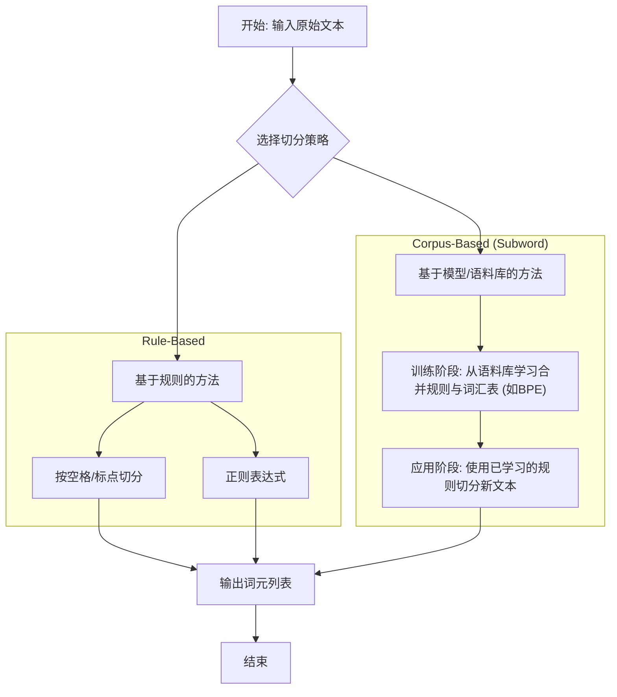

好的，同学！欢迎来到我的算法小课堂。

今天我们要一起攻克自然语言处理（NLP）中一个最基础、也最重要的概念——**文本切分 (Tokenization)**。别看它基础，几乎所有复杂的NLP任务都构建在这块基石之上。我的目标是让你不仅知道它是什么，更能理解为什么有不同的切分方法，以及如何在代码中优雅地实现它。

准备好了吗？让我们开始吧！

---

### 1. 问题引入

想象一下，你正在开发一个简单的“词频统计”程序。任务是计算这段文本中，“learning”这个词出现了多少次：

> "I am learning NLP. It's a fun learning journey!"

对于我们人类来说，答案显而易见：2次。但对于计算机，它看到的是一长串无差别的字符：`'I', ' ', 'a', 'm', ' ', 'l', ...`。

它如何“看”到一个完整的词？如果它只是简单地按空格拆分，会得到 `["I", "am", "learning", "NLP.", "It's", "a", "fun", "learning", "journey!"]`。

这里马上就出现了两个问题：
1.  `"NLP."` 和 `"journey!"` 因为包含了标点符号，它们和 `"NLP"`、`"journey"` 会被当成不同的词。
2.  `"It's"` 这样的缩写应该被看作一个词（"It's"）还是两个词（"It", "is"）？

你看，在计算机能进行任何有意义的文本分析（如情感分析、机器翻译、搜索引擎）之前，它必须先学会如何正确地将连续的文本“切”成一个个有意义的基础单元。这个“切”的过程，就是我们今天的主角——**Tokenization**，切出来的单元，我们称之为**词元 (Token)**。

### 2. 核心思想与生活化类比

**核心思想**: Tokenization 的核心思想是**“分而治之”**。它通过一套预定义的规则或从大量文本中学到的模式，将复杂的、连续的字符流分解成离散的、标准化的基本单元（词元），为后续的数学建模和分析铺平道路。

**生活化类比**: 
想象一下你在**阅读一篇英文文章**。你的眼睛扫过一行行字母，但你的大脑并不会逐个处理 `l-e-a-r-n-i-n-g`。相反，你的大脑会自动根据**空格**和**标点**，将这些字母组合成一个个有意义的“词块”，比如 "learning", "NLP", "journey"。你甚至能自动处理 "It's" 这种缩写。

Tokenization 就是在教计算机做同样的事情：学会像人一样“断句识词”，把一整句话（一根完整的胡萝卜）切成一片片可以烹饪的词元（胡萝卜片）。不同的菜式（NLP任务）可能需要不同的切法（Tokenization策略）。

### 3. 最小可运行示例

让我们从最直接的方式入手：使用正则表达式来切分英文文本。正则表达式是定义搜索模式的强大工具，非常适合用于基于规则的切分。

下面这段 Python 代码展示了一个简单的 Tokenizer，它能处理基本的单词和数字，同时丢弃大部分标点符号。

```python
import re

def simple_tokenizer(text):
    """
    一个简单的基于正则表达式的英文分词器。
    它会匹配所有连续的字母和数字组合（即单词）。
    """
    # \w+ 是一个正则表达式，它匹配一个或多个“单词字符”
    # 单词字符包括：小写字母a-z, 大写字母A-Z, 数字0-9, 以及下划线_
    tokens = re.findall(r'\w+', text)
    return tokens

# --- 输入 ---
text_en = "I am learning NLP. It's a fun learning journey in 2024!"

# --- 运行与输出 ---
print(f"原始文本: {text_en}")
# 规范化：将文本转换为小写，这是一个常见的预处理步骤，可以避免 'Learning' 和 'learning' 被视为不同词元
tokens_en = simple_tokenizer(text_en.lower()) 
print(f"切分后的词元: {tokens_en}")

# --- 预期输出 ---
# 原始文本: I am learning NLP. It's a fun learning journey in 2024!
# 切分后的词元: ['i', 'am', 'learning', 'nlp', 'it', 's', 'a', 'fun', 'learning', 'journey', 'in', '2024']
```

**代码解读**:
*   `import re`: 导入 Python 的正则表达式模块。
*   `re.findall(r'\w+', text)`: 这是核心。`findall` 会在 `text` 中查找所有与模式 `r'\w+'` 匹配的、不重叠的子字符串，并以列表形式返回。
    *   `r''`: 表示这是一个“原始字符串”，可以防止反斜杠 `\` 被错误转义。
    *   `\w`: 匹配任何单词字符（字母、数字、下划线）。
    *   `+`: 匹配前面的元素一次或多次。
    *   所以 `\w+` 的意思就是“一个或多个连续的单词字符”。
*   `text.lower()`: 我们在调用分词器前先将文本转为小写，这是一种规范化操作，能有效减少词汇表的大小。注意看输出中 "I" 变成了 "i"。
*   **观察输出**: 你会发现 `NLP.` 中的 `.` 和 `journey!` 中的 `!` 都被成功去除了。但 `It's` 被切成了 `['it', 's']`，这在某些场景下是合理的，但在另一些场景下可能不是我们想要的。这恰恰说明了 Tokenization 的多样性和挑战性。

### 4. 原理剖析

Tokenization 远不止按空格或正则表达式切分这么简单。根据语言和任务的复杂性，主要可以分为几大类。



**分步讲解**:

1.  **基于规则 (Rule-Based) 的方法**
    *   **策略**: 使用一套人工定义的、明确的规则集来切分文本。
    *   **例子**: 
        *   **空格分词**: `text.split(' ')`。最快最简单，但无法处理标点和复合词。
        *   **正则表达式**: 如我们示例中的 `re.findall(r'\w+', text)`。更灵活，可以自定义保留或去除哪些字符（例如，可以设计一个保留 `-` 的表达式来处理 `state-of-the-art` 这样的词）。
    *   **适用场景**: 语法结构清晰、标点用法规范的语言（如大多数欧洲语言）。
    *   **复杂度**: 通常是线性的，即 **O(N)**，其中 N 是文本的长度。因为算法只需从头到尾扫描一遍文本。

2.  **基于模型/语料库 (Corpus-Based) 的方法**
    *   **背景**: 对于像中文这样没有明显空格分隔的语言，或者为了处理未知词（Out-of-Vocabulary, OOV）问题和稀有词，人们开发了更高级的方法。这些方法的核心思想是从大规模文本（语料库）中自动学习切分模式。
    *   **核心代表：子词切分 (Subword Tokenization)**
        *   **动机**: 像 "tokenization" 和 "tokenize" 这两个词，词根相同，但会被看作完全不同的词元。如果能把它们切分成 `["token", "ization"]` 和 `["token", "ize"]`，模型就能更好地理解它们的语义关系。同时，对于一个没见过的词，比如 "hyperparameterization"，也可以被切分成已知的子词 `["hyper", "parameter", "ization"]`，而不是直接标记为 `[UNK]` (unknown)。
        *   **常见算法**: 
            *   **Byte Pair Encoding (BPE)**: 这是目前最主流的算法之一（GPT系列就在用）。它的过程是：
                1.  初始时，词汇表就是所有单个字符。
                2.  不断地在语料库中寻找最高频出现的相邻词元对（比如 'e' 和 's' 经常一起出现），并将它们合并成一个新的、更长的词元（'es'）。
                3.  重复这个过程，直到达到预设的词汇表大小。
            *   **WordPiece** (BERT使用) 和 **SentencePiece** (Google开源的库，集成了多种算法) 也是类似的思路。
    *   **复杂度**: 训练过程比较耗时，但一旦训练完成，对新文本的切分（推理）过程也是非常高效的，接近 **O(N)**。

### 5. 常见误区与优化点

1.  **误区一：一套规则走天下**
    *   **问题**: 试图用处理英文的空格+标点分词法去处理中文、日文或泰文，结果会一败涂地，因为这些语言的词与词之间没有空格。
    *   **修正**: **分词策略高度依赖语言！** 中文需要使用专门的中文分词工具，如 `jieba`。

2.  **误区二：标点符号都是噪音**
    *   **问题**: 简单粗暴地丢弃所有标点。在情感分析中，`"!"` 和 `"?."` 可能蕴含着强烈的情感信号。在代码分析中，`.` 和 `()` 是语法结构的核心。
    *   **修正**: 根据下游任务决定如何处理标点。有时需要将标点视为独立的词元。

3.  **误区三：忽略大小写**
    *   **问题**: 不加思考地将所有文本转为小写。这可能会导致信息丢失，例如，`"Apple"` (公司) 和 `"apple"` (水果) 会被混淆。
    *   **修正**: 同样，根据任务判断。如果实体识别是关键，则应保留原始大小写。

4.  **优化点：使用成熟的库**
    *   **建议**: 不要从零开始造轮子！对于绝大多数应用，直接使用经过工业级验证的库是最佳选择。
        *   **通用NLP**: `NLTK`, `spaCy` 提供了强大的、多语言的、可配置的 Tokenizer。
        *   **大语言模型**: `Hugging Face Tokenizers` 库是当今的黄金标准，它提供了 BPE, WordPiece 等多种快速且可定制的子词分词器，与 `Transformers` 模型无缝对接。

### 6. 拓展应用

Tokenization 是所有NLP管道的入口，它的应用无处不在：
*   **搜索引擎**: 对你的查询（"best python tutorials"）和网页内容进行分词，然后进行索引和匹配。
*   **机器翻译**: 将源语言句子切分成词元，输入到模型中，生成目标语言的词元序列。
*   **情感分析**: 切分评论文本，分析每个词元（如 "happy", "bad"）的情感极性。
*   **大型语言模型 (LLMs)**:像 GPT-4 和 LLaMA 这样的模型，其输入和输出都是一串整数ID，而每个ID就对应一个通过子词切分得到的词元。
*   **语法检查与自动纠错**: 对文本分词后，检查词元序列是否符合语法规则或拼写是否正确。

### 7. 总结要点

让我们快速回顾一下今天的核心知识：

*   **核心目的**: 将连续的文本字符串分解为离散的、有意义的基本单元（词元），这是计算机理解文本的第一步。
*   **两大流派**:
    1.  **基于规则**: 简单、快速、可解释（如按空格、正则表达式切分），适用于语法规范的语言。
    2.  **基于语料库**: 从数据中学习切分模式（如BPE子词切分），能有效处理未知词和复杂构词法，是现代LLMs的标配。
*   **关键原则**: **没有银弹！** 最佳的 Tokenization 策略取决于你的**语言**、**数据**和**最终任务**。
*   **最佳实践**: 在实际项目中，优先选择并学习使用 `spaCy`, `NLTK`, 或 `Hugging Face Tokenizers` 等专业库。

### 8. 思考与自测

现在，轮到你来动手了！我们之前的 `simple_tokenizer` 无法很好地处理社交媒体文本。请你思考一下，如何修改它来应对新的情况？

**挑战任务**:

修改我们的 `simple_tokenizer` 函数，让它能正确处理包含**话题标签 (hashtags)** 和**用户提及 (mentions)** 的文本。

**原始文本**:
`"Just finished an amazing #NLP tutorial by @AlgorithmTeacher! Highly recommend. #python #learning"`

**当前输出 (使用 `\w+`)**:
`['just', 'finished', 'an', 'amazing', 'nlp', 'tutorial', 'by', 'algorithmteacher', 'highly', 'recommend', 'python', 'learning']`
*(问题: `#` 和 `@` 丢失了，我们失去了它们是标签和提及的重要信息)*

**你的目标输出**:
`['just', 'finished', 'an', 'amazing', '#nlp', 'tutorial', 'by', '@algorithmteacher', 'highly', 'recommend', '#python', '#learning']`

**提示**:
你需要修改正则表达式。思考一下，除了 `\w+`，你还需要匹配哪些模式？也许你可以使用 `|` (或) 操作符来组合多个模式。例如 `r'模式1|模式2'`。一个话题标签的模式可以看作是 `#` 后面跟着一串单词字符。

动手试试吧！修改代码并观察输出。这个小练习将让你对正则表达式在 Tokenization 中的强大威力有更深的体会。

---
### 参考文献

1.  Manning, C. D., Raghavan, P., & Schütze, H. (2008). *Introduction to Information Retrieval*. Cambridge University Press. (涵盖了分词的基础概念)
2.  Sennrich, R., Haddow, B., & Birch, A. (2016). Neural Machine Translation of Rare Words with Subword Units. *Proceedings of the 54th Annual Meeting of the Association for Computational Linguistics*. (BPE 算法的经典论文)
3.  Hugging Face Tokenizers Documentation: [https://huggingface.co/docs/tokenizers/index](https://huggingface.co/docs/tokenizers/index) (了解现代分词器实现的首选资源)