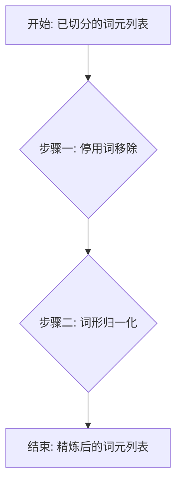

### 操作手册：停用词移除与词形归一化

在上一节中，我们学习了如何对文本进行基础清洗和切分。本节将深入探讨文本预处理的另外两个关键步骤：移除停用词（Stop Words）和进行词形归一化（Normalization），以进一步精炼我们的文本数据。本手册将指导你如何进行“精加工”，让这些词元变得更干净、更标准。

---

#### 1. 问题引入

> “我已经成功地将文本切分成了词元（Tokens），但我发现列表里充满了像 ‘a’, ‘the’, ‘is’, ‘在’, ‘的’ 这类常见词，它们似乎对理解文本核心意义帮助不大。同时，我还看到了 'running', 'ran', 'runs' 这样的词，它们意思相近但形式不同。我该如何高效地清理这些‘噪音’，让数据更规整，从而帮助后续的分析任务？正确的流程是怎样的？”

---

#### 2. 核心目标与类比

本流程的核心目标是**精炼词元列表**，通过两个关键动作，让文本数据的核心语义更加凸显：
1.  **移除停用词 (Stop Words Removal)**: 剔除那些普遍存在但信息含量低的词语。
2.  **词形归一化 (Normalization)**: 将单词的不同变体统一为其基础形式。

你可以把这个过程想象成**“整理一座花园”**：
*   **停用词移除**就像是**“除草”**。花园里的杂草（如“的”、“is”、“a”）随处可见，但它们不是我们关注的焦点（花朵），留着它们会分散注意力，消耗养分。
*   **词形归一化**就像是**“修剪枝丫”**。同一棵植物（同一个核心概念）可能伸出不同形态的枝丫（如 'study', 'studies', 'studying'）。我们把它们都修剪回主干（'study'），这样更容易识别这棵植物的本质。

最终，我们将得到一个整洁、重点突出的花园，便于我们欣赏和分析。

---

#### 3. 最小示例 (核心流程演练)

在深入细节之前，让我们先快速体验一下完整的核心流程。假设我们已经完成了文本切分，得到了一个词元列表。

**原始词元列表 (已小写化和去标点):**
`['the', 'researchers', 'are', 'studying', 'various', 'data', 'models']`

**第一步：移除停用词**
*   **操作**: 识别并移除停用词（如 'the', 'are'）。
*   **结果**: `['researchers', 'studying', 'various', 'data', 'models']`

**第二步：词形归一化 (以词形还原为例)**
*   **操作**: 将每个词元转换为它的基本形态（Lemma）。例如，'researchers' -> 'researcher'，'studying' -> 'study'，'models' -> 'model'。
*   **最终结果**: `['researcher', 'study', 'various', 'data', 'model']`

看，经过这两步，我们的词元列表变得更加简洁和标准化了。

---

#### 4. 原理剖析 (各步骤详解)

现在，我们来详细拆解每一步的操作指令和验收标准。

##### 流程图概览


##### **步骤一: 停用词移除 (Stop Words Removal)**

*   **操作指令**:
    1.  **加载停用词表**: 从一个可靠的NLP库（如NLTK, spaCy）中加载预定义的、针对特定语言（如英语）的停用词列表。
    2.  **创建新列表**: 初始化一个新的空列表，用于存放过滤后的结果。
    3.  **遍历与过滤**: 遍历你的原始词元列表，检查每个词元是否**不**在停用词表中。
    4.  **添加非停用词**: 如果一个词元不是停用词，就将它添加到新的列表中。

*   **验收标准**:
    *   输出的词元列表中不应再包含预定义停用词表中的任何词汇（例如 'the', 'is', 'in', 'a' 等）。
    *   原始词元列表的顺序应在新列表中得到保留。
    *   原始列表中的有效词（非停用词）没有被错误地移除。

*   **代码示例 (Python with spaCy)**:
    ```python
    import spacy

    # 加载spaCy的英语模型
    # 首次使用可能需要下载模型: python -m spacy download en_core_web_sm
    nlp = spacy.load("en_core_web_sm")

    # 获取spaCy的默认停用词列表
    stop_words = nlp.Defaults.stop_words

    # 假设这是我们输入的词元列表
    tokens = ['the', 'researchers', 'are', 'studying', 'various', 'data', 'models']

    # 使用列表推导式进行过滤
    filtered_tokens = [token for token in tokens if token not in stop_words]

    print(f"原始词元: {tokens}")
    print(f"停用词表 (部分): {list(stop_words)[:10]}...")
    print(f"移除停用词后: {filtered_tokens}")
    ```

##### **步骤二: 词形归一化 (Normalization)**

*   **操作指令**:
    1.  **选择归一化方法**: 确定使用**词形还原 (Lemmatization)** 还是 **词干提取 (Stemming)**。（对于大多数应用，推荐使用词形还原，因为它更准确。）
    2.  **处理文本对象**: 使用NLP库（如 spaCy）处理过滤后的词元组成的句子，以获取每个词元的语言学属性（如词元原型）。
    3.  **提取词元原型**: 遍历处理后的文本对象，提取每个词元的 `.lemma_` 属性。
    4.  **构建最终列表**: 将所有词元原型收集到一个新的列表中。

*   **验收标准**:
    *   输出的列表中，大多数名词应恢复为单数形式（如 'models' -> 'model'）。
    *   动词应恢复为其不定式（如 'studying' -> 'study'）。
    *   归一化后的词汇都是存在于字典中的有效单词（这主要适用于词形还原）。

*   **代码示例 (Python with spaCy)**:
    ```python
    # 我们继续使用上一步的 filtered_tokens
    # 为了让spaCy正确识别词性以进行词形还原，最好将它们连接成字符串
    text_to_process = " ".join(filtered_tokens)

    # 使用spaCy处理这个'句子'
    doc = nlp(text_to_process)

    # 提取每个token的lemma (词元原型)
    lemmatized_tokens = [token.lemma_ for token in doc]

    print(f"待处理的词元: {filtered_tokens}")
    print(f"词形还原后: {lemmatized_tokens}")

    # 预期输出: ['researcher', 'study', 'various', 'data', 'model']
    # 注意: spaCy可能会将 'various' 视为其自身的词元，这是正常的。
    ```

---

#### 5. 常见误区 (风险与回退)

1.  **误区一：盲目使用默认停用词表**
    *   **风险**: 在某些特定领域，默认停用词可能包含重要信息。例如，在**情感分析**中，`'not'` 是一个极其重要的词，但它通常在默认停用词表中。移除它会完全改变句子含义（"not good" -> "good"）。
    *   **回退方案**: 在应用停用词移除前，务必审查停用词表。根据你的具体任务，**自定义停用词表**，可以从中移除某些词（如 `'not'`），或添加特定领域的无用词（如在软件开发文档中，'code', 'file' 可能也算停用词）。

2.  **误区二：不考虑语言和上下文**
    *   **风险**: 词形归一化高度依赖于词性（Part-of-Speech, POS）。一个词在不同上下文中有不同词性，其词元也不同。例如，`'saw'` 可以是动词 'see' 的过去式，也可以是名词“锯子”。一个简单的归一化工具可能无法区分。
    *   **回退方案**: 使用更先进的、能够进行**词性标注**的库（如 spaCy），它会在进行词形还原前先判断词性，从而提高准确率。

3.  **误区三：过度归一化导致信息丢失**
    *   **风险**: 特别是使用词干提取（Stemming）时，可能会产生一些无意义的词干（如 'university' -> 'univers'），这会损失可读性和部分语义。
    *   **回退方案**: 优先选择**词形还原（Lemmatization）**，因为它能保证输出的词是有效的单词。仅在对性能要求极高且能容忍一定精度损失的场景下（如大规模信息检索的索引构建）才考虑使用词干提取。

---

#### 6. 拓展应用 (分支与变体)

##### **变体一：词干提取 (Stemming) vs. 词形还原 (Lemmatization)**

这是词形归一化最常见的两种方法，它们有不同的适用场景。

| 特性 | 词干提取 (Stemming) | 词形还原 (Lemmatization) |
| :--- | :--- | :--- |
| **核心原理** | 基于规则，粗暴地去除单词的后缀（如 -ing, -s, -ed） | 基于词典和词法分析，找到单词的有效原型（Lemma） |
| **示例** | `studies` -> `studi` | `studies` -> `study` |
| **速度** | 非常快，计算成本低 | 较慢，需要词典和词性分析 |
| **准确性** | 较低，可能产生不存在的词（如 `univers`） | 很高，输出结果是有效的单词 |
| **适用场景** | 信息检索、搜索引擎索引、大规模文本分类等对速度要求高的任务 | 聊天机器人、问答系统、文本摘要等对语义精度要求高的任务 |

##### **变体二：自定义停用词表**

在实际项目中，你几乎总是需要调整停用词表。

*   **添加停用词**: 如果你的语料库中充满了特定领域的无意义词汇（例如，公司内部报告中的“季度”、“报告”），你可以将它们添加到停用词表中。
*   **移除停用词**: 如前所述，为避免丢失关键信息（如情感分析中的 'not'），你需要从默认列表中移除它们。

```python
# 假设 nlp 对象已在前面步骤中加载 (nlp = spacy.load("en_core_web_sm"))
# 获取与当前 nlp 实例关联的停用词表
current_nlp_stop_words = nlp.Defaults.stop_words # 使用一个更明确的变量名

print(f"'not' in current_nlp_stop_words? {'not' in current_nlp_stop_words}") # True

# 移除一个停用词
if "not" in current_nlp_stop_words:
    current_nlp_stop_words.remove("not")
print(f"After removal, 'not' in current_nlp_stop_words? {'not' in current_nlp_stop_words}") # False

# 添加一个自定义停用词
current_nlp_stop_words.add("report")
print(f"'report' in current_nlp_stop_words? {'report' in current_nlp_stop_words}") # True

# (可选) 恢复默认设置，避免影响后续操作
# 在实际项目中，你可能需要根据具体需求来决定是否需要恢复
if "not" not in current_nlp_stop_words: # 如果之前移除了'not'，则加回
    current_nlp_stop_words.add("not")
if "report" in current_nlp_stop_words: # 如果之前添加了'report'，则移除
    current_nlp_stop_words.remove("report")
```

---

#### 7. 总结要点 (Checklist)

在你开始处理自己的文本数据时，可以使用这个清单来确保流程的完整性和正确性。

*   [ ] **明确任务目标**: 我的下游任务是什么？（例如，情感分析、主题建模）
*   [ ] **评估停用词表**: 默认的停用词表是否适用于我的任务？是否需要移除或添加某些词？
*   [ ] **选择归一化方法**: 我更看重速度（选 Stemming）还是精度（选 Lemmatization）？（通常推荐 Lemmatization）
*   [ ] **加载工具和数据**: 准备好你的NLP库（如 spaCy）和已经切分好的词元列表。
*   [ ] **执行停用词移除**: 编写代码过滤掉停用词。
*   [ ] **执行词形归一化**: 编写代码将过滤后的词元进行归一化。
*   [ ] **审查输出结果**: 抽样检查一小部分处理后的数据，确认结果是否符合预期，有没有明显的错误（如重要信息被删除、归一化错误）。

---

#### 8. 思考与自测

为了检验你是否真正掌握了这个流程，请思考以下问题：

> **问题**: 如果你的任务从**“文档主题分类”**（关注文档讨论了什么）变为**“用户评论情感分析”**（关注用户的情绪是积极还是消极），这个流程的**步骤一（停用词移除）**需要做什么关键调整？为什么这个调整至关重要？

**提示**: 想想哪些词在表达情感时起到了决定性的作用，而它们是否可能被当作“停用词”。

通过这个流程的学习，你现在已经掌握了文本预处理中至关重要的两个环节。这将为你的后续分析（如特征提取、模型训练）打下坚实的基础。祝你实践顺利！
