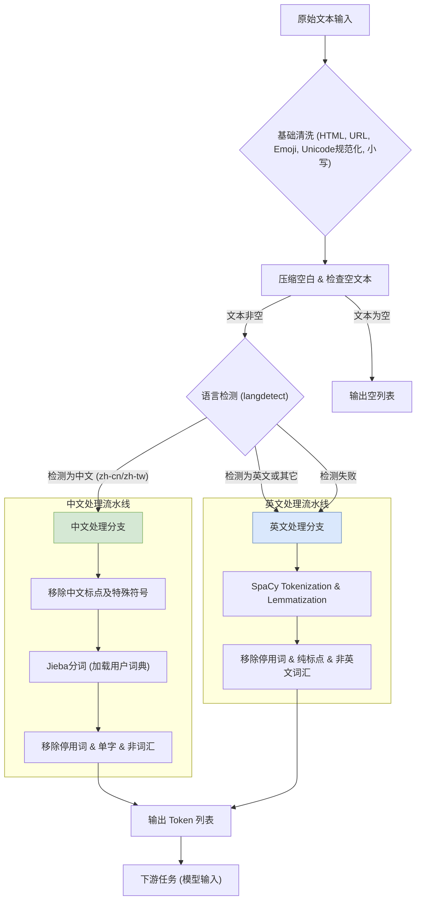

好的，请坐。让我们泡上一壶茶，我来给你讲一个我们团队亲身经历的故事。这不仅仅是一个技术案例，更是一场在数据丛林中的探险，关于我们如何为一款面向全球市场的产品，从零开始，构建一个能同时驯服中英文这两种“野兽”的文本预处理流水线。

---

### **案例分析：构建一个完整的中英文本预处理流水线**

#### 1. **问题引入 (故事背景)**

那是在几年前，我们接手了一个雄心勃勃的项目：为一个全球电商平台构建一个智能评论分析系统。目标是能实时分析来自世界各地的用户评论，提取情感倾向、关键话题和潜在的产品缺陷。

数据的来源庞大且混乱——用户的原始评论。挑战很快就显现出来：

*   **语言混合**: 大量评论是中英混合的，比如“这个 airdopes pro 的音质 a bit disappointing，续航还行”。
*   **非结构化**: 评论里充满了 HTML 标签（`<br>`, `<b>`），Emojis (👍, 😡)，拼写错误，以及网络俚语。
*   **形态各异**: 英文有大小写、单复数、不同时态的变化；中文则有繁简体、全角半角字符的混用。

我们最初的尝试，用一些简单的正则表达式和字符串替换，很快就宣告失败。模型拿到的数据就像是未经处理的矿石，杂质太多，根本无法提炼出有价值的“黄金”。我们需要的是一个工业级的“矿石精炼厂”——一个健壮、高效、且能智能区分处理中英文的预处理流水线。这就是我们故事的起点。

#### 2. **核心方案与类比**

我们设计的核心方案是一个 **“模块化、语言感知的多阶段处理流水线”**。

这听起来可能有点抽象，让我们用一个类比来理解它：**一家处理全球食材的中央厨房**。

*   **原始评论** 就像是刚从世界各地采购来的食材，有的带着泥土（HTML标签），有的形态不一（大小写），有的需要特殊处理（中文分词 vs. 英文词形还原）。
*   我们的 **预处理流水线** 就是这家中央厨房的 **Mise en place（法餐术语，指备料）工作流**。
*   **第一步：验收入库（基础清洗）**。无论是什么食材，我们首先要去掉包装、清洗泥土。这对应着去除HTML标签、URLs和一些无意义的字符。
*   **第二步：分拣归类（语言检测）**。这是关键一步。我们会识别出哪些是“牛肉”（英文），哪些是“豆腐”（中文），然后将它们送到不同的处理台。
*   **第三步：专属处理（语言特定预处理）**。
    *   “牛肉”处理台（英文）负责：切块（Tokenization）、剔骨去筋（移除停用词）、嫩化（Lemmatization，词形还原）。
    *   “豆腐”处理台（中文）负责：切块（分词）、滤水（移除停用词）、统一形态（繁转简、全角转半角）。
*   **第四步：标准化封装（统一输出）**。所有处理好的食材，最终都以标准化的形态（比如，小写的词元列表）输出，送给“厨师”（下游的机器学习模型）进行烹饪。

这个“中央厨房”的比喻，完美地诠释了我们方案的核心思想：**统一入口，智能分发，专业处理，标准输出**。

#### 3. **最小示例 (关键代码/配置)**

为了让你感受一下这个“中央厨房”的核心引擎，下面是一段高度简化的 Python 代码，展示了主调度逻辑和中英文处理分支。

```python
#
# --- 核心代码片段：统一预处理器 ---
#
import re
import jieba
import spacy
import unicodedata # 引入 unicodedata 模块
from langdetect import detect
from zhon.hanzi import punctuation as zhon_punctuation

class UnifiedTextPreprocessor:
    def __init__(self, user_dict_path=None):
        """
        初始化加载所需模型和资源
        """
        # 加载 SpaCy 英文模型 (需要提前 python -m spacy download en_core_web_sm)
        self.nlp_en = spacy.load("en_core_web_sm", disable=["parser", "ner"]) # 禁用不必要组件，提高效率
        print("SpaCy English model loaded.")
        
        # 配置 Jieba 中文分词
        if user_dict_path:
            jieba.load_userdict(user_dict_path)
        print("Jieba initialized.")

        # 准备停用词列表 (实际项目中会从文件加载)
        self.stop_words_en = set(self.nlp_en.Defaults.stop_words)
        self.stop_words_zh = {"的", "了", "在", "是", "我", "你", "他", "她", "它", "们", "一个", "什么"}
        
        # 编译常用正则表达式
        self.html_re = re.compile(r'<[^>]+>')
        self.url_re = re.compile(r'https?://\S+|www\.\S+')
        # 精确匹配常见表情符号，避免误删英文中的标点符号或连字符
        self.emoji_re = re.compile(
            "["
            "\U0001F600-\U0001F64F"  # emoticons
            "\U0001F300-\U0001F5FF"  # symbols & pictographs
            "\U0001F680-\U0001F6FF"  # transport & map symbols
            "\U0001F1E0-\U0001F1FF"  # flags (iOS)
            "\U00002702-\U000027B0"  # Dingbats
            "\U000024C2-\U0001F251"  # Enclosed characters
            "]+", flags=re.UNICODE)

    def _preprocess_english(self, text: str) -> list[str]:
        """英文文本处理流水线"""
        doc = self.nlp_en(text) # text 已经在 process() 中转换为小写
        tokens = []
        for token in doc:
            # 过滤掉停用词、纯标点、纯空格
            if not token.is_stop and not token.is_punct and not token.is_space:
                # 保留词形还原后的结果，并进一步过滤掉非英文词汇或无意义的字符
                lemma = token.lemma_.strip() # 获取词元并去除首尾空白
                if lemma: # 确保词元非空
                    # 检查词元是否包含至少一个字母数字字符
                    # 并且其组成成分主要为字母数字、连字符或撇号，以过滤非英文或非词汇的字符（如中文、特殊符号等）
                    if any(c.isalnum() for c in lemma) and \
                       all(c.isalnum() or c in "'-_" for c in lemma): # 允许连字符和撇号
                        tokens.append(lemma)
        return tokens

    def _preprocess_chinese(self, text: str) -> list[str]:
        """中文文本处理流水线"""
        # 1. 繁转简、全角转半角 (此处省略具体实现, 可用 opencc-python-reimplemented, str.translate)
        # 2. 移除中文标点
        text = re.sub(f"[{zhon_punctuation}]", "", text)
        # 3. 分词
        words = jieba.lcut(text)
        # 4. 移除停用词、单字词，并过滤非词汇字符 (text已在process中转换为小写)
        tokens = [word for word in words 
                  if word.strip() 
                  and word not in self.stop_words_zh 
                  and len(word) > 1 
                  and any(c.isalnum() or c == '_' for c in word)] # 确保词元包含字母数字或下划线
        return tokens

    def process(self, text: str) -> list[str]:
        """
        主处理函数：调度中心
        """
        # --- Stage 1: 基础清洗 (语言无关) ---
        text = self.html_re.sub('', text)
        text = self.url_re.sub('', text)
        text = self.emoji_re.sub('', text) # 移除表情符号
        text = unicodedata.normalize('NFC', text) # Unicode 规范化：确保字符编码一致性
        text = text.lower() # 统一转换为小写，方便后续处理和停用词匹配
        text = ' '.join(text.split()) # 压缩多余空格
        
        if not text: # 清洗后为空则直接返回空列表
            return []

        # --- Stage 2: 语言检测与分发 ---
        try:
            lang = detect(text[:100]) # 取前100个字符检测，提高效率
        except:
            lang = 'en' # 检测失败时默认使用英文处理

        # --- Stage 3: 语言特定处理 ---
        if lang == 'zh-cn' or lang == 'zh-tw':
            return self._preprocess_chinese(text)
        else: # 默认处理英文及其他语言
            return self._preprocess_english(text)

# --- 案例演示 ---
# include_case_snippets: true
preprocessor = UnifiedTextPreprocessor()

raw_text_en = "This is a <b>GREAT</b> product with amazing features! Loved it 👍 Check it out: https://example.com"
processed_en = preprocessor.process(raw_text_en)
print(f"Original EN: {raw_text_en}")
print(f"Processed EN: {processed_en}\n")

raw_text_zh = "这款【耳机】的音质确实不错，强烈推荐！大家可以看看。但是包装有点儿简陋。。。"
processed_zh = preprocessor.process(raw_text_zh)
print(f"Original ZH: {raw_text_zh}")
print(f"Processed ZH: {processed_zh}\n")

raw_text_mixed = "The new UI is quite confusing，设计得不太直观。希望 a future update can fix it."
processed_mixed = preprocessor.process(raw_text_mixed)
print(f"Original Mixed: {raw_text_mixed}")
print(f"Processed Mixed (detected as 'en'): {processed_mixed}\n")
```

#### 4. **原理剖析 (方案执行与决策过程)**

我们的构建过程并非一帆风顺，其中充满了权衡与决策。

**决策点一：如何处理语言混合？**
最初，我们天真地想用一个统一的流程处理所有文本。很快发现，对`"This is great"`进行Jieba分词会得到 `['This', ' ', 'is', ' ', 'great']`，而对`"苹果手机很好用"`进行SpaCy的lemmatization则完全是灾难。

**我们的决策**: 引入语言检测作为流水线的“交通枢纽”。我们选择了 `langdetect` 库，因为它轻量且快速。但我们很快遇到了它的局限性：对于短文本和中英高度混合的文本，它很容易出错。**应对策略**：我们设定了一个置信度阈值，并在生产中发现，对于我们的评论数据，检测失败时默认走英文处理流程的整体效果更好，因为夹杂中文的英文评论比夹杂英文的中文评论更多。

**决策点二：Tokenization的粒度怎么定？**
对于英文，SpaCy 的 Tokenizer 已经非常出色。但对于中文，Jieba分词遇到了新挑战。比如“华为P50手机”，默认分词可能会分成 `['华为', 'P50', '手机']`。但在我们的场景下，我们希望它是一个整体的实体。

**我们的决策**: 建立并维护一个动态的用户词典。我们将所有产品型号、品牌名、以及常见的行业术语（如“无线充电”、“快充”）都加入了Jieba的用户词典。这极大地提升了分词的准确性，保证了关键业务实体的完整性。这是一个持续迭代的过程。

**决策点三：如何平衡性能与效果？**
SpaCy 的模型功能强大，但加载和处理都相对较重。在一个需要处理数百万条评论的系统中，性能至关重要。

**我们的决策**: 
1.  **批处理**: 我们没有逐条处理文本，而是使用了 SpaCy 的 `nlp.pipe()` 方法，它能利用内部优化，显著提高处理大批量文本的速度。
2.  **禁用非必需组件**: 在预处理阶段，我们只需要 `tokenizer` 和 `lemmatizer`。因此，在加载模型时，我们明确禁用了 `parser`, `ner` 等不必要的组件，`spacy.load("en_core_web_sm", disable=["parser", "ner"])`，这减少了大量内存占用和计算开销。
3.  **并行化**: 对于离线数据处理任务，我们使用了 `joblib` 或 `multiprocessing` 库将数据分块，在多个CPU核心上并行执行我们的 `preprocessor.process` 函数。

下面是这个流水线的深度流程图，清晰地展示了我们的决策逻辑。



#### 5. **常见误区 (复盘与反思)**

回顾这个项目，我们确实踩了不少“坑”：

1.  **误区一：追求“一刀切”的停用词表**。我们最初使用了一个通用的、非常庞大的停用词表。结果发现，在某些特定品类下，一些词语非常关键。例如，在手机评论中，“但是”后面的内容往往是负面情绪的开始，我们却把它移除了。**反思**: 停用词表应是动态的、与具体任务和领域相关的。不应盲目移除，有时甚至需要根据词性（POS tagging）来决定是否移除。

2.  **误区二：预处理步骤的顺序混乱**。有一次，一位新同事把大小写转换放在了 Tokenization 之后。这导致 `Apple` 和 `apple` 被视为不同的 token，即便后续转为小写，也可能因为模型上下文的细微差异而影响词形还原的结果。**反思**: 预处理流水线的每一步都不是孤立的，顺序至关重要。我们后来为此制定了严格的代码审查清单，确保流程的确定性（Determinism）。

3.  **误区三：忽视了 Unicode 规范化**。我们曾被一个奇怪的 bug 困扰：两个看起来一模一样的词 `résumé` 和 `résumé`，在系统中被认为是不同的。后来发现，一个是组合字符，一个是预组合字符。**反思**: 在基础清洗阶段，加入 Unicode 规范化步骤（如 `unicodedata.normalize('NFC', text)`）是保证数据一致性的“隐形英雄”，尤其在处理多语言文本时。

#### 6. **拓展应用 (经验迁移)**

这个项目沉淀下来的经验远不止于评论分析。

*   **经验一：配置驱动的流水线**。我们将所有配置，如停用词表路径、用户词典路径、正则表达式规则等，全部移到了一个 YAML 配置文件中。这使得我们的流水线可以被快速复用到其他项目中，比如智能客服的意图识别、文章内容的自动标签等，只需修改配置文件，无需改动代码。

*   **经验二：预处理即服务（Preprocessing-as-a-Service）**。当多个下游模型都需要这套预处理逻辑时，我们将其封装成了一个独立的微服务。任何需要文本预处理的团队，只需调用一个 API 接口，传入原始文本，就能获得标准化的词元。这大大提升了整个公司的算法开发效率，避免了重复造轮子。

*   **经验三：版本化与可回溯性**。我们对预处理流水线的每一次重要变更（比如更新Jieba词典、更换SpaCy模型版本）都进行版本控制。当发现某个新版本的模型效果下降时，我们可以快速回溯到是哪个预处理步骤的变更导致的，这对于模型迭代和问题排查至关重要。

#### 7. **总结要点**

这个项目的成功，关键在于我们摒弃了“脚本小子”式的思维，而是用**软件工程和系统设计的思想**来构建预处理流水线。

*   **语言感知是核心**: 在多语言环境下，任何“一视同仁”的预处理策略都注定失败。
*   **模块化是生命线**: 将不同功能（清洗、分词、归一化）解耦，使得系统易于维护、测试和扩展。
*   **没有银弹，全是权衡**: 每一步决策都是在效果、性能、维护成本之间做的权衡。
*   **迭代思维**: 预处理流水线不是一次性建成的，它需要随着业务的发展、新词的出现、下游任务的变化而持续迭代优化。

我们构建的这套流水线，正是那座坚实的“数据精炼厂”，它确保了无论送来多么粗糙的“矿石”，我们的AI模型总能吃到最干净、最标准、最有营养的“数据餐”。

---

#### 8. **思考与自测**

现在，把问题抛给你。

故事中我们提到，在语言检测失败时，我们选择**默认走英文处理流程**。这是一个基于当时业务数据分布的经验决策。

**如果现在你是我当时的项目负责人，并且你发现新涌入的数据中，纯中文或中英混合（但主体是中文）的短文本评论越来越多，导致大量中文内容被错误地用英文流程处理。你会如何改进当前的语言检测和分发策略？请至少提出两种不同的方案，并分析各自的优劣。**