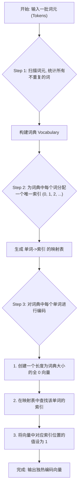

好的，同学！我们开始上课。

今天我们要学习的是 **独热编码（One-Hot Encoding）**。别被名字吓到，它其实是自然语言处理（NLP）中最简单、最直观的一种词表示方法。我们之前已经了解了为什么要把文本转换成向量，也接触了词袋模型和TF-IDF这些从“文档”层面进行表示的方法。现在，我们要把视角缩小，聚焦到如何表示一个“单词”上。

准备好了吗？让我们一步步来拆解它。

---

### 1. 问题引入

想象一下，你正在教一个机器人认识水果。你手上有三种水果：苹果（apple）、香蕉（banana）和樱桃（cherry）。

机器人只懂数字，不懂文字。你该如何用数字来告诉它，你现在指的是“苹果”，而不是“香蕉”或“樱桃”呢？

你不能简单地用 `1` 代表苹果，`2` 代表香蕉，`3` 代表樱桃。因为这样做会给机器人带来误解：它可能会认为 `1 + 2 = 3`，也就是“苹果”+“香蕉”=“樱桃”，这显然是荒谬的。这些数字之间的大小和运算关系，在类别上是毫无意义的。

我们需要一种方法，能够明确地表示“是这个，而不是那个”，并且所有类别之间都是平等的、相互独立的。这就是独热编码要解决的核心问题。

### 2. 核心思想与生活化类比

**核心思想**：用一个很长的向量（一串数字）来代表一个词。这个向量的长度等于我们词典中所有不同单词的总数。向量中只有一个位置是 `1`，代表当前词，其他所有位置都是 `0`。

**生活化类比**：
想象一个房间里有一排电灯开关，每个开关都贴着一个我们词典里单词的标签。比如我们有三个词：“猫”、“狗”、“鱼”。那么就有三个开关。

*   要表示 **“猫”**，我们就只打开标有“猫”的那个开关（设置为 `1`），其他所有开关都保持关闭（设置为 `0`）。状态就是：`[开, 关, 关]` -> `[1, 0, 0]`。
*   要表示 **“狗”**，我们就只打开“狗”的开关。状态就是：`[关, 开, 关]` -> `[0, 1, 0]`。
*   要表示 **“鱼”**，同理。状态就是：`[关, 关, 开]` -> `[0, 0, 1]`。

看到了吗？任何时候，都只有一个开关是“热”（Hot）的，也就是“On”的状态。这就是 **One-Hot** 这个名字的由来。这种表示方法简单明了，任何两个词的向量表示都是完全独立的，不会产生像 `1+2=3` 那样的歧义。

### 3. 最小可运行示例

让我们用 Python 来实现上面那个“猫狗鱼”的例子。这段代码会带你走过从构建词典到生成独热编码的全过程。

```python
#
# 文件名: simple_one_hot_encoder.py
#
def one_hot_encode(tokens):
    """
    一个简单的独热编码器实现
    :param tokens: 一个包含单词的列表，代表我们用于构建词典的词元流
    :return: 一个字典，将每个单词映射到其独热编码向量
    """
    # 步骤1: 找出所有不重复的词，构建词典 (Vocabulary)
    # 使用 set() 可以自动去重
    vocabulary = sorted(list(set(tokens)))
    print(f"词典 (Vocabulary): {vocabulary}")

    # 步骤2: 创建一个从单词到索引的映射
    # 这样我们才知道每个词对应向量的哪个位置
    word_to_idx = {word: i for i, word in enumerate(vocabulary)}
    print(f"单词到索引的映射 (Word to Index): {word_to_idx}\n")

    # 步骤3: 生成独热编码
    one_hot_vectors = {}
    vocab_size = len(vocabulary)

    # 直接遍历词典中的每个唯一单词进行编码
    for word in vocabulary: 
        # 创建一个长度为词典大小的全零向量
        vector = [0] * vocab_size
        
        # 找到当前单词的索引
        word_index = word_to_idx[word]
        
        # 将对应位置设置为 1
        vector[word_index] = 1
        
        # 存入结果字典
        one_hot_vectors[word] = vector
        
    return one_hot_vectors

# --- 输入 ---
# 假设我们的输入词元流是下面这个列表
tokens = ["cat", "dog", "fish", "dog"]
print(f"输入词元流 (Tokens): {tokens}\n")

# --- 运行 ---
encoded_words = one_hot_encode(tokens)

# --- 预期输出 ---
print("--- 独热编码结果 ---")
for word, vector in encoded_words.items():
    print(f"单词: '{word}' -> 独热编码: {vector}")
```

### 4. 原理剖析

独热编码的实现过程非常清晰，我们可以把它拆解为以下几个步骤：

1.  **收集词元流与构建词典**：首先，我们需要确定编码的范围。我们会遍历所有词元，抽取出所有出现过的、不重复的单词，形成一个“词典”（Vocabulary）。词典的大小 `V` 决定了我们独热向量的维度。
2.  **创建单词到索引的映射**：接着，我们为词典中的每个单词分配一个唯一的整数索引，从 `0` 到 `V-1`。例如 `{'cat': 0, 'dog': 1, 'fish': 2}`。这个映射表是后续编码的关键。
3.  **创建零向量并赋值**：对于词典中的每一个单词，我们先创建一个长度为 `V` 的全零向量。然后，根据上一步的映射表查到该单词的索引，并将向量中该索引对应的位置从 `0` 修改为 `1`。

下面是这个过程的流程图，可以让你看得更清楚：



**复杂度分析**:
*   **空间复杂度**: 单个独热向量的维度为 O(V)，其中 V 是词典大小。如果需要将词典中所有不重复词的独热向量都存储起来（如本示例代码），则总空间复杂度为 O(V^2)。
*   **时间复杂度**: 构建词典和索引映射需要遍历整个词元流，时间复杂度与词元流大小有关。但一旦构建完成，对单个词进行编码的速度非常快，基本上是 O(V)（创建向量）或 O(1)（查找和赋值）级别的操作。

### 5. 常见误区与优化点

虽然简单，但独热编码在实际使用中也有几个“坑”需要注意：

1.  **误区一：词典爆炸（Vocabulary Explosion）**
    *   **问题**：当处理大型语料库时，词典会变得异常庞大（几十万甚至上百万）。这会导致每个词的向量维度极高，占用大量内存，给后续计算带来巨大压力。
    *   **提醒**：在实际应用中，通常会做一些预处理，比如移除低频词、停用词，或者只保留最常见的 N 个词来控制词典大小。

2.  **误区二：未登录词（Out-of-Vocabulary, OOV）**
    *   **问题**：如果模型在训练后，遇到了一个在原始词典中从未出现过的新词，编码器将无法处理，因为它在“单词->索引”映射表中找不到这个词，程序可能会报错。
    *   **优化点**：一个常见的做法是在构建词典时，预留一个专门的 `"<UNK>"`（Unknown）标记。当遇到新词时，统一将它映射到 `"<UNK>"` 对应的独热编码向量。

3.  **误区三：语义鸿沟（Semantic Gap）**
    *   **问题**：独热编码最大的理论缺陷是它无法表达词与词之间的相似度。在向量空间中，“猫”`[1,0,0]` 和“狗”`[0,1,0]` 的距离，与“猫”和“鱼”`[0,0,1]`的距离是完全一样的。但我们知道，从语义上讲，“猫”和“狗”的关系应该比“猫”和“鱼”更近。
    *   **提醒**：独热编码是一种离散表示，它假设所有词之间都是相互独立的。这个问题也催生了后来更强大的词表示方法，如 Word2Vec、GloVe 等（我们后续课程会讲到）。

### 6. 拓展应用

独热编码的思想不仅用在NLP中，它在整个机器学习领域都非常普及，主要用于处理**类别型特征（Categorical Features）**。

*   **机器学习分类任务**：假设你有一个特征是“城市”，可能的值有“北京”、“上海”、“深圳”。你可以用独热编码将其转换为 `[1,0,0]`, `[0,1,0]`, `[0,0,1]`，这样模型就能处理这些非数值信息了。
*   **深度学习输入层**：在一些简单的神经网络模型中，独热编码是把词语喂给网络的第一步。它是后续更复杂表示（如嵌入层）的基础。
*   **多分类任务的标签**：在一个需要从10个类别中选一个的分类任务里（比如手写数字识别），真实的标签也常常用独热编码表示。例如，标签“7”可以表示为 `[0,0,0,0,0,0,0,1,0,0]`。

### 7. 总结要点

让我们快速回顾一下今天学习的内容：

*   **核心目的**：将离散的、无序的类别（如单词）转换为机器可以处理的、相互独立的数值向量。
*   **实现步骤**：`构建词典` -> `创建索引` -> `生成独热向量`。
*   **优点**：
    *   **简单直观**：实现和理解都非常容易。
    *   **独立性**：完美地表达了类别之间的相互独立，避免了错误的数值关系。
*   **缺点**：
    *   **高维稀疏**：词典大时，向量维度高且稀疏，浪费空间。
    *   **语义缺失**：无法表达词与词之间的语义相似性。

### 8. 思考与自测

现在，轮到你来动手了！请思考一下我们上面提到的 **“未登录词（OOV）”** 问题。

**任务**：
请尝试修改 `最小可运行示例` 中的 `one_hot_encode` 函数。当它遇到一个词典里没有的新词时（比如 "bird"），它不应该报错，而是应该能够优雅地处理。

你可以选择一种处理方式：
1.  忽略这个新词。
2.  为所有未登录词返回一个固定的向量，比如全零向量 `[0, 0, 0]`。

试着修改代码并测试一下吧！这会让你对独热编码的实际应用有更深的理解。如果你遇到困难，随时可以提问。
