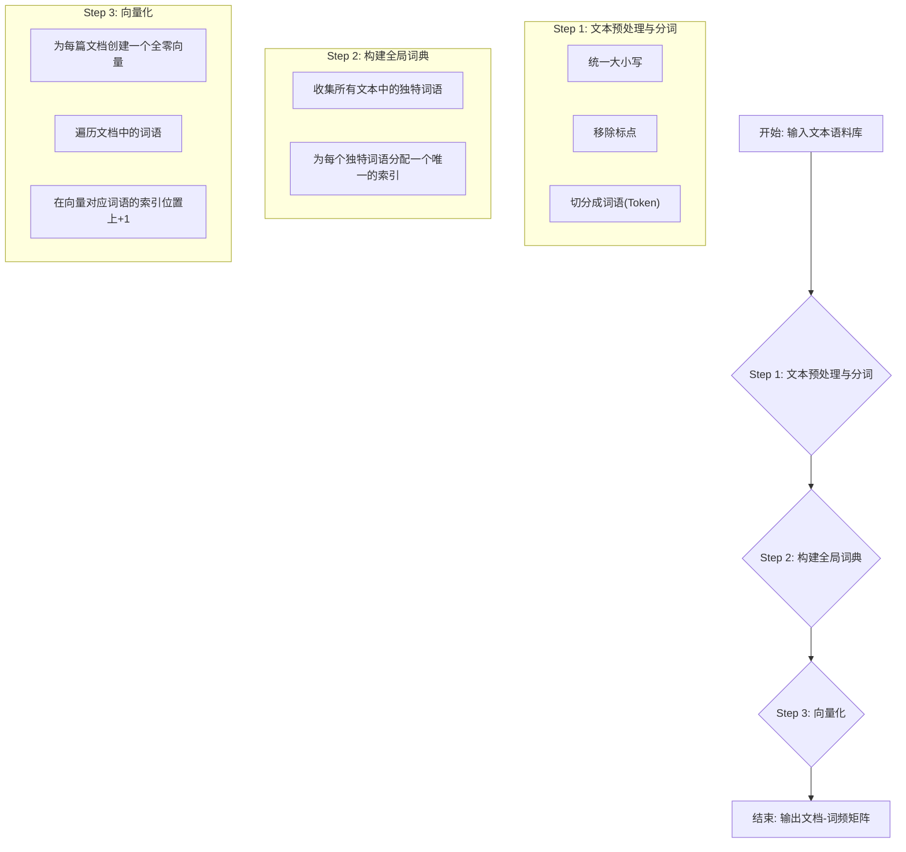

好的，同学你好！作为你的算法老师，今天我将带你一步步、由浅入深地彻底掌握**词袋模型（Bag-of-Words, BoW）**。这个模型是自然语言处理（NLP）领域的基石，理解它，你就能打开将文本世界量化的大门。

让我们开始吧！

---

### 1. 问题引入

想象一下，你正在为一个电影评论网站开发一个新功能：**自动情感分析**。网站上有成千上万条用户评论，比如：

-   “这部电影的特效和剧情都**太棒了**，**强烈推荐**！”
-   “简直是**浪费**时间，剧情**枯燥乏味**。”

我们的目标是让计算机自动将第一条标记为“正面”，第二条标记为“负面”。但计算机只懂数字，不懂文字。那么，**我们如何将这些千差万别的文本评论，转换成机器学习模型能够处理的、标准化的数字格式呢？**

这就是文本表示（Text Representation）要解决的核心问题，而词袋模型，正是实现这一目标最经典、最直观的方法之一。

### 2. 核心思想与生活化类比

**核心思想**：词袋模型的核心思想非常“简单粗暴”——它**忽略一句话的语法和词语顺序，仅仅将其看作一个装满词语的“袋子”**，然后统计袋子里每个词语出现的次数。

**生活化类比**：
想象一下你在逛超市，准备做一道“番茄炒蛋”。你拿到了一张购物清单：

> “鸡蛋 3 个，番茄 2 个，葱 1 根”

为了确保买对，你可能会在脑子里形成一个这样的列表：`{鸡蛋: 3, 番茄: 2, 葱: 1}`。

在词袋模型眼中，一篇文档（比如一句评论）就像你的这趟购物之旅，而这份清单就是它的“向量表示”。模型完全**不关心**你是先买鸡蛋还是先买番茄（忽略语序），它只关心**“什么东西（词语）”**以及**“买了多少（出现次数）”**。

通过这种方式，任何一篇文章都可以被转换成一个数字列表（向量），我们就可以对这些向量进行数学运算和模型训练了。

### 3. 最小可运行示例

Talk is cheap, show me the code. 让我们用 Python 和强大的 `scikit-learn` 库来实现一个最简单的词袋模型。

```python
# 引入 scikit-learn 中用于实现词袋模型的工具 CountVectorizer
from sklearn.feature_extraction.text import CountVectorizer

# 1. 准备我们的“语料库”（corpus），这里是几句简单的英文影评
corpus = [
    'This movie is great and fun',
    'This movie is just boring',
    'I love this amazing movie',
]

# 2. 创建一个 CountVectorizer 实例
# 这就像创建了一个“点词器”机器人
vectorizer = CountVectorizer()

# 3. “学习”词典并转换文本
# .fit_transform() 会做两件事：
# a. fit: 遍历所有文本，学习出一个包含所有不重复词语的“词典”
# b. transform: 根据词典，将每句话转换成一个词频向量
X = vectorizer.fit_transform(corpus)

# 4. 查看结果
# (1) 查看学习到的词典（按字母顺序排序）
# 这告诉我们向量的每一位分别代表哪个词
print("词典 (Vocabulary):")
print(vectorizer.get_feature_names_out())
# 预期输出:
# ['amazing', 'and', 'boring', 'fun', 'great', 'is', 'just', 'love', 'movie', 'this']

print("\n--- 分割线 ---\n")

# (2) 查看转换后的向量矩阵
# .toarray() 将稀疏矩阵转换为我们熟悉的 NumPy 数组，方便查看
print("向量矩阵 (Vectorized Matrix):")
print(X.toarray())
# 预期输出:
# [[0 1 0 1 1 1 0 0 1 1]  <- 'This movie is great and fun'
#  [0 0 1 0 0 1 1 0 1 1]  <- 'This movie is just boring'
#  [1 0 0 0 0 0 0 1 1 1]] <- 'I love this amazing movie'
```

**代码解读**：
看到输出的向量矩阵了吗？我们来解读第一行 `[0 1 0 1 1 1 0 0 1 1]`，它对应第一句话 `'This movie is great and fun'`。
再对照词典 `['amazing', 'and', 'boring', 'fun', 'great', 'is', 'just', 'love', 'movie', 'this']`：
- `amazing`: 出现了 0 次
- `and`: 出现了 1 次
- `boring`: 出现了 0 次
- `fun`: 出现了 1 次
- ...以此类推。
看，我们成功地将一句话转换成了一个代表词频的数字向量！在这个特定的句子中，由于每个词最多只出现一次，所以向量由0和1组成。

### 4. 原理剖析

词袋模型的实现过程可以清晰地分为三个步骤。



<details>
<summary>点击展开查看步骤清单 ✅</summary>

-   [x] **Step 1: 文本预处理与分词 (Tokenization)**
    -   **目标**: 将原始的、杂乱的文本字符串，清理并切分成一个个独立的词语（token）。
    -   **操作**:
        1.  **转为小写**: "Movie" 和 "movie" 应被视为同一个词。
        2.  **移除标点**: "fun." 和 "fun" 应被视为同一个词。
        3.  **分词**: 将 "This movie is fun" 切分为 `['this', 'movie', 'is', 'fun']`。
    -   `CountVectorizer` 默认会帮我们完成这些基础操作。

-   [x] **Step 2: 构建词典 (Build Vocabulary)**
    -   **目标**: 确定我们的向量应该有多长，以及每一位对应哪个词。
    -   **操作**: 收集语料库中**所有不重复**的词语，并为每个词语分配一个唯一的整数索引。
    -   例如，对于我们的示例语料库，词典就是 `{'amazing': 0, 'and': 1, 'boring': 2, ...}`。词典的大小决定了最终向量的维度。

-   [x] **Step 3: 向量化 (Vectorization)**
    -   **目标**: 将每一篇文档转换为一个数字向量。
    -   **操作**:
        1.  创建一个长度等于词典大小的全零向量。例如，我们的词典大小为 10，所以创建一个 `[0, 0, 0, 0, 0, 0, 0, 0, 0, 0]`。
        2.  遍历当前文档中的每一个词。
        3.  在词典中查找该词的索引。
        4.  在该索引对应的向量位置上，将计数值加 1。
        5.  对语料库中的每一篇文档重复此过程。

</details>

**复杂度分析**:
-   **时间复杂度**: `O(N*L)`，其中 N 是文档数量，L 是文档的平均长度。基本上与语料库的总词数成正比，效率很高。
-   **空间复杂度**: 若以**稠密矩阵**存储，为 `O(V*N)`，其中 V 是词典大小，N 是文档数。这在 V 很大时会消耗巨量内存。因此，实际应用中通常使用**稀疏矩阵**存储，其空间复杂度约等于 `O(K)`，其中 K 是语料库中非零元素的总数（大致与总词数成正比），远小于 `V*N`。

### 5. 常见误区与优化点

1.  **误区：忽略预处理的重要性**
    -   **问题**: 如果不进行大小写转换、去除标点等预处理，"Apple" 和 "apple" 会被当成两个不同的词，导致词典不必要地膨胀。向量也无法将词语的真实语义频率聚合起来，因为它会把同一个词的不同形式（如'Apple'和'apple'）视为完全独立的实体。
    -   **优化**: 在使用 `CountVectorizer` 时，可以通过参数进行精细控制，例如 `lowercase=True` (默认开启)，或者自定义 `tokenizer` 和 `preprocessor`。

2.  **误区：停用词 (Stop Words) 的干扰**
    -   **问题**: 像 "is", "a", "the", "in" 这样的词几乎在每篇文章中都大量出现，但它们通常不携带太多有效信息。如果不处理，它们会在向量中占据很高的计数值，干扰模型对关键信息的判断。
    -   **优化**: 在创建 `CountVectorizer` 时，可以设置 `stop_words='english'` 来自动移除英文停用词。
        ```python
        # 优化版
        vectorizer = CountVectorizer(stop_words='english')
        ```

3.  **优化点：处理高维稀疏向量**
    -   **问题**: 当词典非常大时，每篇文档只包含其中一小部分词。这意味着转换后的向量绝大多数元素都是 0。这种向量被称为“稀疏向量”。用普通数组存储它们会浪费大量内存。
    -   **解决方案**: 使用**稀疏矩阵（Sparse Matrix）**。这是一种只存储非零元素的值和位置的数据结构。`scikit-learn` 的 `CountVectorizer` 默认返回的就是稀疏矩阵，我们在示例中用 `.toarray()` 只是为了方便观察。在实际工程中，请**直接使用稀疏矩阵**进行计算，能极大地节省内存和提升运算速度。

### 6. 拓展应用

词袋模型虽然简单，但它是许多更复杂NLP任务的起点和重要组成部分：

1.  **文档分类**: 最经典的应用。如我们开头提到的情感分析、新闻主题分类（体育、科技、财经）、垃圾邮件过滤等。
2.  **信息检索 (Information Retrieval)**: 搜索引擎的早期模型就利用了词袋思想。当用户输入一个查询时，系统将其也转换为一个词袋向量，然后去匹配文档库中与之最相似的文档向量。
3.  **主题模型 (Topic Modeling)**: 像 LDA (Latent Dirichlet Allocation) 这样的算法，就是在词袋模型的基础上，试图发现文档集中隐藏的主题结构。

### 7. 总结要点

| 特性 | 描述 |
| :--- | :--- |
| **核心思想** | 将文档视为一个无序的词语集合，用词频来表示文档。 |
| **关键步骤** | 1. 分词与预处理 → 2. 构建词典 → 3. 统计词频进行向量化。 |
| **优点** | - **简单直观**：易于理解和实现。<br>- **高效**：计算速度快。<br>- **效果不错**：作为基线模型，在很多任务上表现不俗。 |
| **缺点** | - **忽略语序**：丢失了词语之间的顺序信息，`"我打你"` 和 `"你打我"` 在模型看来可能完全一样。<br>- **无法捕捉语义**：不理解 `"苹果"` 和 `"香蕉"` 都属于水果。<br>- **维度灾难与稀疏性**：词典过大导致向量维度高且稀疏。 |
| **适用场景** | 适用于那些**词语本身比其顺序更重要**的任务，如文章主题分类。 |

### 8. 思考与自测

现在你已经掌握了词袋模型的基础，来挑战一个实际问题吧！

在我们上面的代码示例中，`'This movie is great and fun'` 和 `'This movie is just boring'` 这两句话都包含了 `'This'`, `'movie'`, `'is'`。这些词非常常见，可能对情感判断的贡献不大。

**你的任务是**：
修改第三节中的代码，在创建 `CountVectorizer` 时，增加一个参数来**移除所有英文停用词**。

-   **思考一下**：移除停用词后，新生成的词典和向量矩阵会是什么样子？
-   **动手尝试**：修改代码并运行，看看你的预测和实际输出是否一致。

这个小练习能帮助你更好地理解预处理和模型参数的重要性。祝你编码愉快！