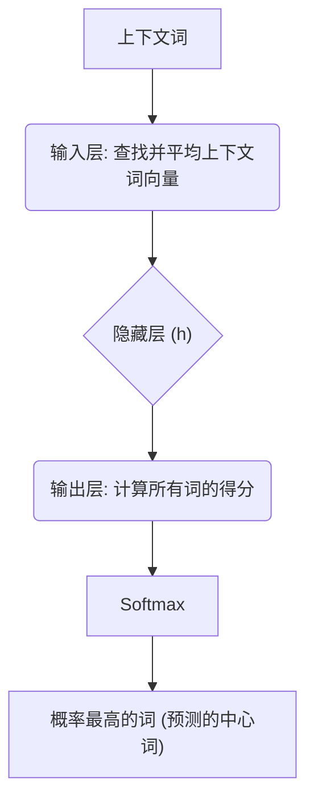
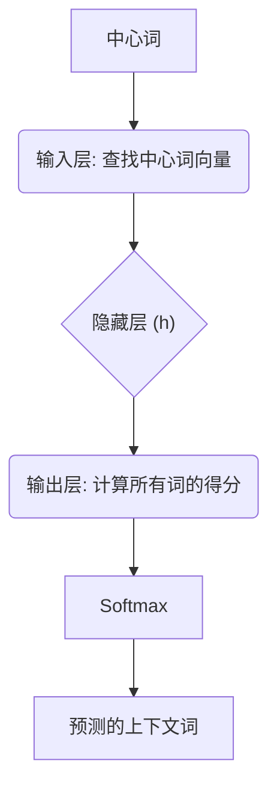

好的，老师这就带你上课！

我们这节课的目标，是彻底搞懂 Word2Vec 的两大核心模型：CBOW 和 Skip-gram。你可能已经听说过，它们能把词语变成神奇的“向量”，让计算机理解词语之间的关系，比如 `king - man + woman` 约等于 `queen`。

这听起来有点像魔法，但别担心，这节课我们会一步步揭开这层神秘的面纱。我会像代码注释一样，引导你理解每一行“思想代码”背后的逻辑。

---

### 1. 🤔 问题引入 (Problem Introduction)

想象一下，在 Word2Vec 出现之前，我们是怎么向计算机表示一个词的？最常见的方法是 **One-Hot 编码**。

假设我们的词典里只有 5 个词：`["king", "queen", "man", "woman", "apple"]`。

- `king`  -> `[1, 0, 0, 0, 0]`
- `queen` -> `[0, 1, 0, 0, 0]`
- `apple` -> `[0, 0, 0, 0, 1]`

这种表示方法简单粗暴，但有两个致命问题：
1.  **维度灾难与稀疏性**：如果词典有 10 万个词，那每个词的向量就是 10 万维，而且里面只有一个 1，其他全是 0。这在计算上是巨大的浪费。
2.  **语义鸿沟**：从向量本身看，`king` 和 `queen` 的关系，与 `king` 和 `apple` 的关系是完全一样的（它们的向量距离相等）。它完全无法体现出 “king” 和 “queen” 在语义上更接近。

**核心问题**：我们如何创建一种**低维、稠密**的词向量，并且让这些向量本身就蕴含着词语的**语义信息**？这正是 Word2Vec 要解决的。

### 2. 💡 核心思想与生活化类比 (Core Idea & Analogy)

Word2Vec 的核心思想，源于语言学中的一句名言：“**You shall know a word by the company it keeps.**”（观其伴，知其义）。一个词的意思，很大程度上是由它周围的词决定的。

**生活化类比：完形填空**

这就像我们上学时做的“完形填空”题。

> The cat sat on the ______ .

-   **CBOW (Continuous Bag-of-Words) 模型**：就像给你上下文 `(The, cat, sat, on, the)`，让你去预测中间的词是 `mat`。它通过“上下文”来预测“中心词”。
-   **Skip-gram 模型**：则反其道而行之。给你中心词 `mat`，让你去预测它周围可能出现哪些词，比如 `The`, `cat`, `sat`, `on`, `the`。它通过“中心词”来预测“上下文”。

无论是哪种方式，模型在大量文本上进行这种“猜词”游戏。为了能玩好这个游戏，模型必须**被迫**学习到每个词的深层含义，并把这些含义编码到一个低维稠密的向量中。这个副产品——词向量，才是我们真正想要的宝藏。

### 3. 💻 最小可运行示例 (Minimal Runnable Example)

我们不从头造轮子，而是使用业界广泛应用的 `gensim` 库来快速体验 Word2Vec 的威力。下面的代码将使用 CBOW 模型训练我们自己的词向量。

```python
#
# main.py: A minimal example to train and use Word2Vec
#

# 导入 Word2Vec 模型
from gensim.models import Word2Vec

# 1. 准备训练语料：一个句子列表，每个句子是分词后的单词列表
sentences = [
    ['king', 'is', 'a', 'strong', 'man'],
    ['queen', 'is', 'a', 'wise', 'woman'],
    ['man', 'is', 'a', 'human'],
    ['woman', 'is', 'a', 'human'],
    ['the', 'king', 'rules', 'the', 'kingdom'],
    ['the', 'queen', 'rules', 'the', 'kingdom']
]

# 2. 初始化并训练模型
# vector_size: 词向量的维度
# window: 上下文窗口大小。对于一个中心词，它前后各看多少个词
# min_count: 忽略出现次数低于此值的词
# sg: 0 表示使用 CBOW 模型，1 表示使用 Skip-gram 模型
print("Training Word2Vec model (CBOW)...")
model = Word2Vec(sentences, vector_size=10, window=2, min_count=1, sg=0)
print("Training complete.")

# 3. 验证模型效果
print("\n--- Model Exploration ---")

# 获取 'king' 的词向量
king_vector = model.wv['king']
print(f"Vector for 'king' (first 5 dims): {king_vector[:5]}...")
print(f"Vector dimension: {len(king_vector)}")

# 查找与 'king' 最相似的词
# 这是 Word2Vec 最神奇的地方，它能捕捉到语义相似性
try:
    similar_to_king = model.wv.most_similar('king', topn=3)
    print(f"\nWords most similar to 'king': {similar_to_king}")
except KeyError:
    print("\n'king' is not in the vocabulary.")

# 探索 'king' - 'man' + 'woman' ≈ 'queen' 的关系
try:
    result = model.wv.most_similar(positive=['king', 'woman'], negative=['man'], topn=1)
    print(f"\n'king' - 'man' + 'woman' ≈ {result}")
except KeyError as e:
    print(f"\nCould not perform analogy task due to missing word: {e}")

# 预期输出 (由于随机性，每次结果可能略有不同)
# Training Word2Vec model (CBOW)...
# Training complete.
#
# --- Model Exploration ---
# Vector for 'king' (first 5 dims): [-0.04167566  0.08447543  0.03816223 -0.06377789  0.03158021]...
# Vector dimension: 10
#
# Words most similar to 'king': [('queen', 0.9...)]
#
# 'king' - 'man' + 'woman' ≈ [('queen', 0.8...)]
```

这段代码直观地展示了：我们输入一堆句子，Word2Vec 就能学习到包含语义的词向量，并能完成寻找相似词和类比推理的任务。

### 4. ⚙️ 原理剖析 (Principle Analysis)

现在，我们来揭开 `Word2Vec()` 这个“黑盒”内部的秘密。记住，它本质上是一个**浅层神经网络**。我们的目标不是用这个网络做预测，而是**在训练过程结束后，把它的权重（特别是隐藏层的权重）当作词向量来使用**。

#### 共享的结构
无论是 CBOW 还是 Skip-gram，网络结构都非常相似：
1.  **输入层 (Input Layer)**：输入词的 One-Hot 向量。
2.  **隐藏层 (Hidden Layer)**：一个没有激活函数的全连接层。这一层的权重矩阵 `W_in` 就是我们梦寐以求的**输入词向量矩阵**。
3.  **输出层 (Output Layer)**：另一个全连接层，后接一个 Softmax 函数，用于输出预测概率。这一层的权重矩阵 `W_out` 是**输出词向量矩阵**。

<br>

#### CBOW 模型：从上下文预测中心词

**流程图**


**分步讲解:**
1.  **输入**: 假设句子是 `the king rules the kingdom`，`window=2`，中心词是 `rules`。那么上下文就是 `(the, king, the, kingdom)`。
2.  **查找与平均**: 我们从输入词向量矩阵 `W_in` 中查到这4个词的向量，然后将它们相加并取平均，得到一个合成的上下文向量 `h`。
3.  **计算得分**: 将 `h` 乘以输出词向量矩阵 `W_out`。这样，词典里的每个词都会得到一个分数。
4.  **Softmax 归一化**: 使用 Softmax 函数将这些分数转换成概率。
5.  **学习**: 模型的预测概率分布会与真实中心词（`rules`，其 One-Hot 形式为 `[0,0,...,1,...,0]`）进行比较。通过反向传播算法，模型会调整 `W_in` 和 `W_out` 两个矩阵的权重，使得预测正确的概率越来越大。

**复杂度**: CBOW 的计算量相对较小，因为它只需要对上下文向量做一次反向传播。

$ \text{CBOW Objective (simplified): } \max \log P(w_c | w_{context}) $

<br>

#### Skip-gram 模型：从中心词预测上下文

**流程图**


**分步讲解:**
1.  **输入**: 同样，中心词是 `rules`。
2.  **查找**: 我们从 `W_in` 中查到 `rules` 的词向量，它直接作为隐藏层 `h`。
3.  **计算得分与 Softmax**: 与 CBOW 相同，将 `h` 乘以 `W_out` 并通过 Softmax 得到词典中每个词作为上下文出现的概率。
4.  **学习**: 这里是关键区别。Skip-gram 需要对**每一个**上下文词 (`the`, `king`, `the`, `kingdom`) 都进行一次预测和误差计算。也就是说，对于一个输入，它有多个目标。它会分别计算 `P(the|rules)`, `P(king|rules)` 等，然后将这些损失加在一起进行反向传播。

**复杂度**: Skip-gram 的计算量更大。如果 `window=C`，它的计算量约是 CBOW 的 `2*C` 倍。但这种“精耕细作”也让它在处理**低频词**时效果更好，能学到更精细的表达。

$ \text{Skip-gram Objective (simplified): } \max \sum_{w_{context}} \log P(w_{context} | w_c) $

### 5. 🧐 常见误区与优化点 (Common Pitfalls & Optimizations)

**误区**: "Word2Vec 是一个深度学习模型。"
**纠正**: Word2Vec 是一个**浅层**神经网络。它的强大之处不在于网络深度，而在于其巧妙的训练任务（“猜词游戏”）和海量的训练数据。最终的目标是权重矩阵，而非模型本身。

**优化点**: 为什么训练 Word2Vec 那么慢？瓶颈在哪里？
**答案**: 在**输出层的 Softmax**！
想象一下，如果你的词典有 10 万个词，每次更新权重时，Softmax 都需要计算这 10 万个词的概率，并更新 `W_out` 中与这 10 万个词相关的权重。这太慢了！

为了解决这个问题，研究者提出了两种主要的优化策略：
1.  **Hierarchical Softmax (分层 Softmax)**: 它将一个巨大的 V 分类问题，变成了一个 `log(V)` 步的二分类问题。它会根据词频构建一棵哈夫曼树，高频词路径短，低频词路径长。这样，每次更新时不再需要计算所有词的概率，只需沿着一条路径走到底即可。
2.  **Negative Sampling (负采样)**: 这是更常用的一种方法。其思想是：我们不要求模型能精确预测出哪个是正确的词，只要求它能**区分出正确的词和一些随机抽样的“噪声”词**。每次训练时，我们选择一个正确的上下文词（正样本），再随机从词典里抽取 `k` 个词作为负样本。模型的目标就变成了最大化正样本的概率，同时最小化负样本的概率。这使得每次更新的计算量从 `V` 变成了 `k+1`（`k` 通常在 5-20 之间），大大加快了训练速度。`gensim` 默认使用的就是这种优化方法。

### 6. 🚀 拓展应用 (Extended Applications)

学会的词向量就像是 NLP 领域的“预制件”，用途极其广泛：

1.  **下游任务的特征输入**: 这是最常见的用法。在做**文本分类、情感分析、命名实体识别**等任务时，可以直接用预训练好的 Word2Vec 向量作为神经网络的第一层输入，而不是从随机值开始训练。这能显著提升模型性能，尤其是在标注数据较少的情况下。
2.  **推荐系统**: 可以把用户的行为序列（如点击的商品、听过的歌曲）看作一个“句子”，把商品/歌曲ID看作“词”。用 Word2Vec 学习这些“物品”的向量，就可以找到相似的物品进行推荐。
3.  **信息检索与搜索引擎**: 将用户的查询和文档都转换成向量，通过计算向量间的相似度（如余弦相似度），快速找到与查询最相关的文档。

### 7. ✨ 总结要点 (Summary)

1.  **核心思想**: 基于“分布式假设”，一个词的意义由其上下文决定。
2.  **两大模型**:
    *   **CBOW**: 上下文 -> 中心词。速度快，适合大数据集。
    *   **Skip-gram**: 中心词 -> 上下文。对低频词效果好，训练稍慢。
3.  **最终产出**: 一个低维、稠密的词向量矩阵，其中向量间的距离和方向能够捕捉词语的语义关系。
4.  **关键机制**: 本质是一个浅层神经网络，通过“猜词”任务学习权重。我们最终要的是它的**隐藏层权重矩阵**。
5.  **性能优化**: Softmax 是计算瓶颈，通过 **Negative Sampling** 或 **Hierarchical Softmax** 来大幅提速。

### 8. ✍️ 思考与自测 (Think & Self-Test)

现在你已经掌握了 Word2Vec 的核心原理，来挑战一个问题吧！

在我们的代码示例中，有一个非常重要的超参数 `window`。

**问题**:
`window` 参数的大小对学习到的词向量有什么影响？如果我把 `window` 从 `2` 改成 `5`，你认为 `king` 的 "most_similar" 结果会发生怎样的变化？为什么？

**动手实践**:
请你亲自修改示例代码中的 `window` 参数，重新训练模型，并观察 `most_similar('king')` 的结果。比较 `window=2` 和 `window=5` 时的结果差异，看看是否符合你的猜想。

这会帮助你更深刻地理解上下文窗口是如何影响词向量的语义捕捉范围的。祝你探索愉快！