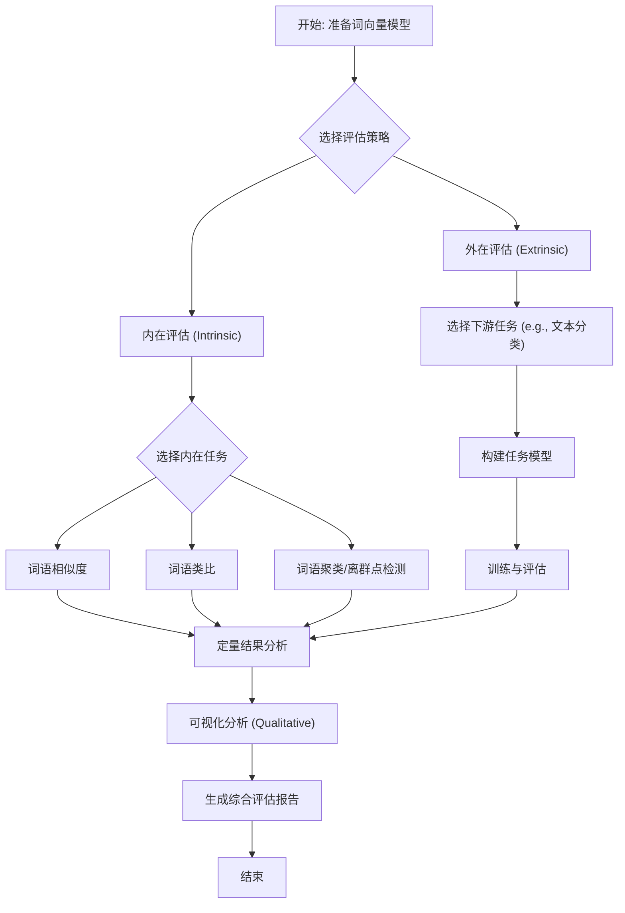

### **操作手册：词向量的评估方法与可视化**

#### **1. 问题引入 (Problem Introduction)**

“我刚刚基于特定语料库训练了一组 Word2Vec/GloVe 词向量，或者下载了一份通用的预训练向量。现在，我需要一套系统性的流程来回答以下问题：**这组词向量的质量如何？它们捕捉到了我所关心的语义关系吗？我该如何向团队直观地展示它们的有效性？**”

#### **2. 核心目标与类比 (Core Goal & Analogy)**

本流程的核心目标是：**建立一套对词向量进行“定量评估”与“定性分析”的标准作业程序 (SOP)**。

我们可以将其想象成 **“精密仪器的校准与质检报告”**。
*   **定量评估 (Intrinsic & Extrinsic Evaluation)**：就像用激光干涉仪测量仪器的精度，我们使用标准数据集和下游任务来获得具体的性能分数（如准确率、F1值）。这是“硬指标”。
*   **定性分析 (Visualization)**：就像用显微镜观察仪器的内部结构和工艺，我们通过降维可视化来直观感受向量空间是否“结构合理”，语义关系是否被正确表达。这是“直观感受”。

二者结合，才能给出一份全面的“词向量质检报告”。

#### **3. 最小示例 (Core Flow Walkthrough)**

在深入探讨复杂理论之前，让我们先用一个最精简的流程，快速完成一次从评估到可视化的核心体验。这个示例假设你已有一个加载好的 `gensim` 词向量模型（例如，从 `gensim.models.KeyedVectors.load_word2vec_format` 加载）。

```python
#
# 准备环境：确保你已安装 gensim, scikit-learn, matplotlib, numpy
# pip install gensim scikit-learn matplotlib numpy
#
import gensim.downloader as api
from sklearn.manifold import TSNE # 修正了导入方式
import matplotlib.pyplot as plt
import numpy as np

# --- 核心步骤 1: 加载预训练词向量 ---
# 为了快速演示，我们直接从 gensim-data 下载一个轻量级模型
# 在实际应用中，这里替换为你自己的模型
print("正在加载 GloVe 模型 (glove-wiki-gigaword-50)...")
model = api.load("glove-wiki-gigaword-50")
print("模型加载完毕。")

# --- 核心步骤 2: 执行简单的内在评估 (词语类比) ---
# 这是最经典的内在评估任务: a is to b as c is to ?
# king - man + woman = queen
print("\n执行词语类比任务 'king' - 'man' + 'woman':")
analogy_result = model.most_similar(positive=['king', 'woman'], negative=['man'], topn=3)
print(f"最相似的词: {analogy_result}")

# 验收: 期望 'queen' 出现在结果中且排名靠前

# --- 核心步骤 3: 执行简单的定性可视化 ---
# 选取一组相关的词进行可视化，观察它们的空间关系
def plot_vectors(vectors, labels, title):
    plt.figure(figsize=(10, 10))
    for i, label in enumerate(labels):
        x, y = vectors[i, :]
        plt.scatter(x, y)
        plt.annotate(label, (x, y), textcoords="offset points", xytext=(5,2), ha='right')
    plt.title(title)
    plt.grid(True)
    plt.show()

print("\n准备可视化...")
words_to_visualize = ['king', 'queen', 'man', 'woman', 'prince', 'princess', 'doctor', 'nurse', 'teacher']
vectors = np.array([model[word] for word in words_to_visualize])

# 使用 t-SNE 进行降维
tsne = TSNE(n_components=2, random_state=42, perplexity=len(words_to_visualize)-1) # 修正了 TSNE 的使用方式
vectors_2d = tsne.fit_transform(vectors)

# 绘图
plot_vectors(vectors_2d, words_to_visualize, "词向量空间关系 (t-SNE 降维)")

# 验收: 期望看到 'king'/'queen'/'prince'/'princess' 聚类，'man'/'woman' 聚类，
# 且 'king'-'man' 的向量方向与 'queen'-'woman' 的方向相似。
```

这个最小示例让你在几分钟内体验了评估（类比任务）和可视化（t-SNE降维图）两个核心环节。

#### **4. 原理剖析 (Step-by-Step Breakdown)**

现在，我们来详细拆解整个流程，并明确每一步的操作指令和验收标准。



##### **步骤 1: 模型与数据准备**

*   **操作指令 (Action):**
    1.  加载你的词向量模型（Word2Vec, GloVe, FastText等）到一个标准接口，如 `gensim.models.KeyedVectors`。
    2.  如果进行内在评估，准备标准的评估数据集，例如 Google 的 `questions-words.txt` 用于类比任务，或者 `WordSim-353` 用于相似度任务。
    3.  如果进行外在评估，准备一个带有标签的下游任务数据集（如文本分类、命名实体识别）。
    4.  **强烈建议**：对词向量进行 L2 归一化 (`model.fill_norms()`)，这对于基于余弦相似度的计算至关重要。
*   **验收标准 (Acceptance Criteria):**
    *   模型对象已成功加载到内存，可以查询任意词的向量。
    *   评估所需的数据集已准备就绪，格式符合预期。
    *   向量已完成归一化，`model.norms` 属性不为空。

##### **步骤 2: 内在评估 (Intrinsic Evaluation)**

内在评估不依赖于外部任务，直接衡量向量空间本身的质量。它速度快，适合模型调参阶段的快速迭代。

*   **操作指令 (Action):**
    1.  **词语相似度 (Word Similarity):**
        *   从 `WordSim-353` 或 `SimLex-999` 等数据集中读取词对和人工评分。
        *   计算模型给出的词对余弦相似度。
        *   计算模型相似度得分与人工评分的斯皮尔曼等级相关系数 (Spearman's rank correlation coefficient)。
    2.  **词语类比 (Word Analogy):**
        *   使用 `gensim` 的 `model.evaluate_word_analogies('questions-words.txt')` 方法。
        *   该方法会自动计算在整个类比任务数据集上的准确率。
*   **验收标准 (Acceptance Criteria):**
    *   词语相似度任务产出一个 0 到 1 之间的相关系数。这个值越高，说明向量的相似度度量与人类直觉越一致。
    *   词语类比任务产出一个准确率报告，按类别（如 `capital-common-countries`, `currency`）细分。你可以将此准确率与公开的基线模型进行比较。

##### **步骤 3: 外在评估 (Extrinsic Evaluation)**

外在评估通过一个真实的下游任务来衡量词向量的有效性。这是评估词向量**实用价值**的黄金标准。

*   **操作指令 (Action):**
    1.  选择一个与你最终应用场景相关的下游任务（如情感分析、意图识别）。
    2.  将词向量作为特征输入到下游模型中。通常做法是：将句子中的词向量取平均，得到一个句子向量，然后输入到一个简单的分类器（如逻辑回归、SVM）中。
    3.  在相同的任务、数据集和模型架构下，替换不同的词向量（例如，你的模型 vs. Google News 预训练模型），或者与不使用预训练词向量（随机初始化）的情况进行对比。
*   **验收标准 (Acceptance Criteria):**
    *   产出下游任务的性能指标，如 **Accuracy, Precision, Recall, F1-Score**。
    *   你的词向量在该任务上的表现优于随机初始化，并与（或优于）通用的预训练词向量具有可比性，这证明了其在该任务上的有效性。

##### **步骤 4: 可视化定性分析**

可视化帮助我们直观理解向量空间的结构。

*   **操作指令 (Action):**
    1.  **选择降维算法:**
        *   **PCA (Principal Component Analysis):** 线性降维，速度快，保留全局结构。适合初步观察。
        *   **t-SNE (t-Distributed Stochastic Neighbor Embedding):** 非线性降维，擅长保留局部结构，能形成清晰的“簇”。是词向量可视化的首选。
    2.  **选取词汇子集:** 选择一个你感兴趣的、包含多种语义关系的词汇子集（50-100个词为佳）。
    3.  **执行降维与绘图:**
        *   从模型中提取所选词汇的向量。
        *   使用 `sklearn.manifold.TSNE` 或 `sklearn.decomposition.PCA` 将高维向量降至2维或3维。
        *   使用 `matplotlib` 或 `plotly` 绘制散点图，并为每个点标注对应的词语。
*   **验收标准 (Acceptance Criteria):**
    *   在2D图上，语义相近的词（如"cat", "dog", "pet"）在空间上聚集在一起。
    *   可以看到平移不变的语义关系，例如从 "man" 到 "woman" 的向量，约等于从 "king" 到 "queen" 的向量。
    *   不同类别的词（如国家 vs. 动物）形成明显分离的簇。

#### **5. 常见误区 (Risks & Rollbacks)**

*   **误区1：过度解读t-SNE图中的距离。**
    *   **风险:** t-SNE 中簇间的距离不具有实际意义。它只保证簇内的点是近邻，但一个簇离另一个簇“远”并不代表语义上就更疏远。
    *   **回退方案:** 不要根据簇间距离下结论。关注点应放在“哪些词聚集在了一起”以及“相对位置关系是否合理”。可以结合 PCA 图进行补充分析。

*   **误区2：仅依赖内在评估。**
    *   **风险:** 在类比任务上得分高的向量，在特定的下游任务中可能表现平平。内在评估与外在任务性能并非总是强相关。
    *   **回退方案:** 始终将外在评估作为最终的“试金石”。内在评估更多用于快速的模型选择和调试。

*   **误区3：忽略OOV（Out-of-Vocabulary）词汇。**
    *   **风险:** 在评估时，如果测试集中的词汇在你的向量模型中不存在，会导致评估结果不准确或程序出错。
    *   **回退方案:** 在评估前，检查评估数据集中词汇的覆盖率。对于 OOV 词汇，可以采用忽略、随机初始化或使用 FastText（能为 OOV 生成向量）等策略。

*   **误区4：评估数据集与应用领域不匹配。**
    *   **风险:** 在通用新闻语料上训练的词向量，在专业的医疗或金融领域的下游任务中可能表现不佳。
    *   **回退方案:** 优先选择或构建与你应用领域相匹配的评估数据集。如果条件允许，创建一份小型的、领域相关的词语相似度或类比任务集。

#### **6. 拓展应用 (Branches & Variations)**

*   **模型对比:** 将上述整个流程封装成一个函数，输入为词向量模型，输出为评估报告。这样你可以轻松地横向比较 Word2Vec, GloVe, FastText, BERT embedding 等不同模型的表现。

*   **领域词向量评估:** 当你在特定领域（如法律、生物）训练词向量时，需要构建该领域的专属评估集。例如，创建“基因-蛋白质”的类比对，或“疾病-症状”的相似度对。

*   **偏差检测与分析 (Bias Analysis):** 可视化可以用来检测词向量中的社会偏见。例如，检查 "man" - "doctor" + "woman" 是否导向 "nurse"，这反映了模型学到的性别偏见。

*   **交互式可视化:** 使用 `TensorBoard Embedding Projector` 或 `Plotly` 创建交互式的3D可视化图，用户可以自由缩放、旋转、搜索词汇，获得更深入的洞察。

#### **7. 总结要点 (Checklist)**

在你完成一次词向量评估后，请对照以下清单进行检查：

- [ ] **准备工作**:
    - [ ] 词向量模型已加载并L2归一化？
    - [ ] 内在/外在评估所需的数据集已准备好？
- [ ] **定量评估**:
    - [ ] 已执行词语相似度任务，并计算了Spearman相关系数？
    - [ ] 已执行词语类比任务，并获得了准确率？
    - [ ] 已在至少一个相关的下游任务中进行了外在评估，并记录了F1/Accuracy等指标？
    - [ ] 已将评估结果与一个公认的基线模型进行了比较？
- [ ] **定性分析**:
    - [ ] 已使用t-SNE（或PCA）对有代表性的词汇子集进行了降维可视化？
    - [ ] 可视化结果是否显示出合理的语义聚类和关系结构？
- [ ] **风险规避**:
    - [ ] 是否意识到t-SNE的局限性，没有过度解读簇间距离？
    - [ ] 是否处理了OOV词汇问题？
    - [ ] 评估结果是否综合了内在和外在评估，而没有偏信其一？

#### **8. 思考与自测 (Think & Self-Test)**

**问题:** 如果你的最终下游任务是**情感分析**，词向量需要很好地捕捉词语的“褒义”与“贬义”这一语义维度。在不改变外在评估流程（即仍然使用情感分类任务）的前提下，你会如何调整**内在评估**和**可视化**的第4步，来更针对性地验证词向量是否学到了这种“情感极性”？

**答案提示:**
*   **内在评估调整:** 你可以构建一个情感相关的类比任务，例如 `happy - good + bad = sad`。或者创建一个情感相似度列表，比如 `(joyful, happy)` 的相似度应该远高于 `(joyful, angry)`。
*   **可视化调整:** 在选择词汇子集时，刻意包含大量褒义词（如 "excellent", "wonderful", "success"）和贬义词（如 "terrible", "failure", "awful"）。在 t-SNE 图上，你期望看到这两个群体自然地分离到图的两端，形成一个“情感轴”。你甚至可以计算出这个“情感轴”的向量（例如，`positive_words_mean_vec - negative_words_mean_vec`），然后将其他词投影到这个轴上，来量化它们的“情感分数”。

---
**参考文献与工具 (References & Tools):**
1.  **Gensim Documentation:** [Word Vector Evaluation with KeyedVectors](https://radimrehurek.com/gensim/models/keyedvectors.html#gensim.models.keyedvectors.KeyedVectors.evaluate_word_analogies)
2.  **Paper:** "Efficient Estimation of Word Representations in Vector Space" by Mikolov et al. (Introduced the analogy task)
3.  **Paper:** "GloVe: Global Vectors for Word Representation" by Pennington et al.
4.  **Dataset:** [WordSim-353](http://www.cs.technion.ac.il/~gabr/resources/data/wordsim353/), [questions-words.txt](https://github.com/tmikolov/word2vec/blob/master/questions-words.txt)
5.  **Tool:** [TensorBoard Embedding Projector](https://projector.tensorflow.org/) for interactive visualization。
