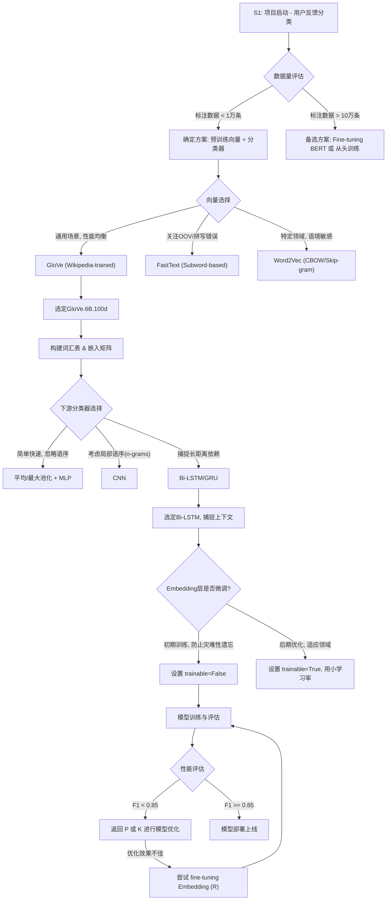

好的，我们开始。作为一名在NLP战场上摸爬滚打多年的实践者，我将带你穿越一个真实的项目场景，体验如何借助“巨人的肩膀”——预训练词向量，快速、高效地解决一个棘手的文本分类问题。这不仅是一个技术教程，更是一段关于决策、权衡与反思的旅程。

---

### **案例：使用预训练词向量完成文本分类任务**

#### 1. **问题引入 (故事背景)**

想象一下，你我正置身于一家快速发展的电商公司“星尘购物”（Stardust Commerce）的数据科学团队。用户反馈如潮水般涌入我们的系统，每天都有数万条关于商品、物流、客服的评价。业务团队急需一个自动化系统，能将这些原始文本精准地分类为“物流投诉”、“产品质量问题”、“售后服务咨询”、“正面评价”等几个核心类别，以便快速响应，改善用户体验。

**挑战:**
*   **数据“冷启动”**：我们有海量的原始文本，但高质量的、人工标注过的数据却非常稀少，初期只有几千条。从头开始训练一个深度学习模型，很容易陷入过拟合的泥沼。
*   **语义的微妙性**：用户的语言充满了多义词、俚语和隐喻。比如，“这快递是*爬*过来的吗？” 和 “物流速度*感人*”，都暗指物流缓慢。传统的TF-IDF或词袋模型很难捕捉到这种深层语义。
*   **快速迭代**：业务部门等不了三个月。我们需要一个能快速验证（MVP, Minimum Viable Product）并上线部署的方案。

**目标:**
构建一个文本分类模型，它必须能够理解词语的深层语义，即使在标注数据有限的情况下，也能达到可接受的准确率（例如，F1分数 > 0.85），并能快速部署。

#### 2. **核心方案与类比**

面对这个挑战，我们没有选择从零开始“造轮子”，而是决定站在巨人的肩膀上。我们的核心方案是：**使用预训练的词向量（Pre-trained Word Embeddings）作为模型的“知识底座”，嫁接到一个轻量级的深度学习分类器上。**

**类比：聘请一位“语言学专家顾问”**

把这个过程想象成组建一个专案组。
*   **从零训练模型**：就像招聘一群刚毕业的大学生。他们充满潜力，但你需要花费大量的时间和数据（教科书、案例）去培训他们，他们才能理解你所在行业的专业术语和“黑话”。
*   **使用预训练词向量**：则像是直接聘请了一位在社会上历练多年的“语言学专家”。这位专家（例如GloVe或Word2Vec模型）已经通过阅读海量的书籍、新闻和网页（如维基百科、通用爬取语料库），对人类语言的语法、语义、词语间的关联有了深刻的理解。他知道“国王”与“女王”的关系，类似于“男人”与“女人”的关系。

我们的任务，不是教他什么是语言，而是告诉他：“专家，在我们公司，‘龟速’、‘次日达’这些词都和‘物流’这个主题高度相关。” 我们只需要用少量标注数据，让他快速熟悉我们的业务场景，将他脑中浩瀚的通用语言知识，应用到我们这个特定的分类任务上。

#### 3. **最小示例 (关键代码/配置)**

这是我们方案中最核心的环节：如何将这位“专家”的知识（预训练词向量）注入到我们的模型中。我们当时选择了Keras框架和GloVe词向量。

```python
# include_code: true
# code_lang: python

import numpy as np
from tensorflow.keras.models import Sequential
from tensorflow.keras.layers import Embedding, Bidirectional, LSTM, Dense
from gensim.models import KeyedVectors
import gensim.downloader as api # 引入 gensim.downloader
from tensorflow.keras.preprocessing.text import Tokenizer
from tensorflow.keras.preprocessing.sequence import pad_sequences # 尽管这里没有直接使用，但在预处理中常用

# --- 0. 模拟数据准备 (为了使代码片段可运行和理解，实际项目中这些会来自数据加载和预处理) ---
# 假设我们有示例文本数据和标签，用于构建词汇表
sample_texts = [
    "这快递是爬过来的吗？太慢了！",
    "物流速度感人，下次还会回购。",
    "手机屏幕有划痕，质量堪忧。",
    "客服态度很好，耐心解答了我的问题。",
    "非常满意，物超所值！",
    "商品和描述不符，要求退货。",
    "包裹丢了，没人管。",
    "好评，还会再来。"
]
# 假设的类别标签，实际中需要进行独热编码
sample_labels = [0, 0, 1, 2, 3, 1, 0, 3] 

# 模拟 Tokenizer 的创建和 fit，用于生成词汇表 (word_index)
tokenizer = Tokenizer(num_words=10000, oov_token="<unk>") # num_words 限制词汇表大小
tokenizer.fit_on_texts(sample_texts)
word_index = tokenizer.word_index # 获取词汇表

vocab_size = len(word_index) + 1 # 词汇表大小，+1 是为了处理 OOV token 或索引从1开始的情况
max_sequence_length = 20 # 假设最大序列长度，根据实际数据统计确定
class_labels = ['物流投诉', '产品质量问题', '售后服务咨询', '正面评价'] # 示例类别标签

# --- 1. 加载“专家顾问”的知识库 (GloVe) ---
# 建议使用 gensim.downloader 自动下载和加载预训练模型，提升可复现性
# 注意：首次加载会下载模型文件 (~130MB)，可能需要一些时间
try:
    print("尝试使用 gensim.downloader 加载 GloVe 模型...")
    word_vectors = api.load('glove-wiki-gigaword-100') # 使用 100 维的 GloVe 向量
    embedding_dim = 100 # 与下载的模型维度匹配
    print("GloVe model loaded successfully using gensim.downloader.")
except Exception as e:
    print(f"Failed to load GloVe model using gensim.downloader: {e}")
    print("作为备用方案，尝试从本地文件加载。请确保 'glove.6B.100d.txt' 已存在于当前目录。")
    # 备用方案：如果下载失败，尝试从本地加载（假设用户已手动下载）
    glove_file = 'glove.6B.100d.txt'
    # 注意：GloVe 6B 文件通常没有 header
    word_vectors = KeyedVectors.load_word2vec_format(glove_file, binary=False, no_header=True)
    embedding_dim = 100 # 同样与本地文件维度匹配

# --- 2. 为我们的任务定制词汇表和嵌入矩阵 ---
# 创建一个权重矩阵，用于 Keras 的 Embedding 层
embedding_matrix = np.zeros((vocab_size, embedding_dim))
for word, i in word_index.items():
    if i < vocab_size: # 确保索引在有效范围内
        if word in word_vectors: # 如果词汇表中的词在GloVe中存在
            # 就用GloVe的向量来填充嵌入矩阵
            embedding_matrix[i] = word_vectors[word]
        # 不在GloVe中的词（或OOV词），其向量将保持为0（或在初始化时随机赋值）

# --- 3. 构建模型，并“聘请”专家 ---
model = Sequential()
# 将预训练的权重加载到 Embedding 层
# trainable=False 意味着在初期我们冻结专家的知识，不让他被我们的小数据带偏
embedding_layer = Embedding(input_dim=vocab_size, # 词汇表大小
                            output_dim=embedding_dim, # 嵌入向量维度
                            weights=[embedding_matrix],
                            input_length=max_sequence_length,
                            trainable=False) # <--- 关键！

model.add(embedding_layer)
model.add(Bidirectional(LSTM(64))) # 使用双向LSTM捕捉上下文信息
model.add(Dense(len(class_labels), activation='softmax')) # 输出层，类别数量取决于任务

model.compile(optimizer='adam',
              loss='categorical_crossentropy',
              metrics=['accuracy'])

model.summary()
```
这段代码的核心思想是：创建一个`Embedding`层，但它的权重不是随机初始化的，而是用GloVe中对应我们词汇表的向量来“预填充”（Pre-populate）。`trainable=False`是初期成功的关键，它防止了模型在少量数据上训练时，破坏掉预训练向量中宝贵的泛化语义信息。

#### 4. **原理剖析 (方案执行与决策过程)**

我们的项目执行过程并非一帆风顺，充满了关键的决策点。

**决策流程图:**



**[✅] 关键步骤清单 (Steps Checklist)**

1.  [x] **数据预处理**: 清洗文本（去HTML标签、标点符号、转小写）、分词。
2.  [x] **选择预训练向量**: 我们比较了GloVe和FastText。由于用户评论中拼写错误和俚语较多，FastText基于子词（subword）的特性理论上更优。但为了快速启动，我们先用了社区最成熟、资源最丰富的GloVe。
3.  [x] **构建词汇表**: 基于我们自己的训练语料库，构建一个从单词到索引的映射。
4.  [x] **创建嵌入矩阵**: 遍历我们的词汇表，用GloVe中的向量填充一个Numpy矩阵。这是一个“对号入座”的过程。
5.  [x] **搭建下游分类器**: 我们没有选择简单的向量平均，因为它会丢失语序信息。一个单层的`Bidirectional LSTM`足以捕捉句子中的上下文依赖，同时模型足够轻量。
6.  [x] **冻结与解冻**: 
    *   **第一阶段**: `trainable=False`。用我们少量的标注数据，只训练Bi-LSTM和Dense层的权重。这好比让“专家顾问”保持自己的知识体系，只学习如何将他的知识应用到我们的分类任务上。
    *   **第二阶段 (可选优化)**: 当模型收敛后，我们尝试“解冻”Embedding层（`trainable=True`），并用一个非常小的学习率（如`1e-5`）进行几轮微调。这相当于允许专家微调他对某些词的理解，使其更贴近我们的业务语境。

**[📊] 评估指标 (Evaluation Metrics)**

由于“物流投诉”类别的数据远少于“正面评价”，这是一个典型的数据不均衡问题。因此，我们没有单纯依赖准确率（Accuracy）。
*   **核心指标**: **Macro F1-Score**。它计算每个类别的F1分数然后取平均，能平等地看待每个类别，无论其样本多少。
*   **辅助指标**: **混淆矩阵 (Confusion Matrix)**。用于直观地观察模型在哪些类别之间最容易混淆，为后续的特征工程或模型优化指明方向。例如，我们发现模型初期容易将“产品质量问题”误判为“售后服务咨询”。

#### 5. **常见误区 (复盘与反思)**

1.  **误区一：忽视OOV（Out-of-Vocabulary）问题**
    *   **现象**: 我们初版的词汇表只包含了训练集中出现频率前10000的词。但线上用户的评论充满了各种闻所未闻的品牌名、产品型号、网络新词，导致大量的`<UNK>`（未知词）。
    *   **反思**: 模型的泛化能力受到严重影响。一个全是`<UNK>`的句子，其信息量几乎为零。
    *   **改进**: 后来我们切换到了**FastText**。它能为OOV词生成向量（通过组合其内部的字符n-gram向量），极大地缓解了这个问题。如果坚持使用GloVe，也应该设计更优雅的`<UNK>`处理策略，例如，用一个特殊的、可训练的`<UNK>`向量。

2.  **误区二：盲目相信通用向量的“万能性”**
    *   **现象**: GloVe在通用语料上表现优异，但对我们电商领域的“黑话”理解有限。例如，“拔草”、“神价”、“SKU”这些词，在通用语料中要么不存在，要么意义完全不同。
    *   **反思**: 预训练向量的“知识”是其训练语料的反映。领域不匹配（Domain Mismatch）是迁移学习中的核心挑战。
    *   **改进**: 在项目后期，我们收集了公司内部百万级的无标注用户评论，使用`gensim`的`Word2Vec`工具，训练了一套**领域专属的词向量**。然后将它与GloVe向量结合或直接替换，模型性能获得了显著提升。

3.  **误区三：过早微调（Premature Fine-tuning）**
    *   **现象**: 一位新同事在项目初期就将`trainable=True`打开，希望能一步到位。结果模型性能不升反降，训练过程也不稳定。
    *   **反思**: 在标注数据很少的情况下，强行微调整个嵌入层，相当于让只有几本“内部小册子”的新员工去挑战“专家顾问”的整个知识体系。巨大的参数量和稀疏的梯度信号，很容易导致灾难性遗忘（Catastrophic Forgetting），破坏了预训练向量的良好结构。这种做法违反了我们在**关键步骤清单的第6点**中详细讨论的“**先冻结，后微调**”的稳健策略，是实践中应该避免的。

#### 6. **拓展应用 (经验迁移)**

这次项目的成功经验，如同一把钥匙，为我们打开了更多应用的大门：

*   **语义搜索**: 将所有用户评论转换为文档向量（例如，通过对词向量进行加权平均或使用Bi-LSTM的最终状态），我们可以构建一个基于向量相似度的语义搜索引擎。当运营人员输入“快递破损”时，系统能找到所有语义上相关的评论，而不仅仅是包含这几个关键词的。
*   **情感分析**: 同样的模型架构，只需更换标签（如“积极”、“消极”、“中性”），就可以快速复用，构建一个更懂用户隐晦表达的情感分析引擎。
*   **意图识别**: 对于客服机器人，我们可以用同样的方法来识别用户的意图。将用户的提问分类到“查询订单”、“申请退款”、“咨询活动”等意图类别。

这个“**预训练嵌入 + 轻量级下游任务模型**”的范式，是资源有限情况下解决各种NLP任务的“瑞士军刀”。

#### 7. **总结要点**

项目最终成功上线，自动化分类准确率达到了业务要求，大大提升了运营效率。回顾整个过程，成功的关键在于：

1.  **思维的转变**: 从“一切从零开始”转变为“善用已有知识”，将问题从“模型训练”解耦为“知识迁移”和“任务适配”。
2.  **技术的基石**: **预训练词向量**是整个方案的基石。它提供了强大的语义表征能力，让我们得以在小数据集上构建出高性能模型，完美解决了“冷启动”难题。
3.  **策略的智慧**: 采用“**冻结-训练-微调**”的策略，是一种在利用先验知识和适应特定任务之间的精妙平衡，是实践中行之有效的工程智慧。
4.  **持续的迭代**: 认识到通用向量的局限性，并根据业务发展，通过训练领域专属向量、尝试FastText等方式持续优化，是模型生命力的保障。

#### 8. **思考与自测**

现在，把聚光灯打向你。

**问题**：在项目复盘时，我们讨论了“领域不匹配”的问题。当时我们选择的解决方案是“后期补充训练领域专属词向量”。

如果你是当时的项目负责人，面临着“通用GloVe向量对领域词汇（如‘SKU’、‘拔草’）理解不佳”的挑战，并且团队资源紧张，只有两周时间必须拿出优化方案。你会选择以下哪条路径，并陈述你的决策依据？

*   **A. 快速与肮脏（Quick & Dirty）**: 手动为最重要的Top 50个领域词汇创建或修改向量，然后硬编码进嵌入矩阵，快速迭代。
*   **B. 专注模型侧**: 不改变词向量，而是尝试更复杂的下游模型（如Attention机制、Transformer Encoder层），期望模型能通过上下文“自行领悟”这些特殊词的含义。
*   **C. 数据驱动**: 立即启动一个无监督任务，用现有的全部无标注数据（即使很杂乱）快速训练一个“迷你版”的领域Word2Vec模型，并与GloVe结合使用。

这个决策没有标准答案，它考验的是你在资源、时间、效果和长期价值之间的权衡能力。你的思考，将真正内化这次“旅程”的经验。

---
**[📚] 参考文献 (References)**

1.  Pennington, J., Socher, R., & Manning, C. D. (2014). [GloVe: Global vectors for word representation](https://nlp.stanford.edu/projects/glove/).
2.  Mikolov, T., Sutskever, I., Chen, K., Corrado, G. S., & Dean, J. (2013). [Distributed representations of words and phrases and their compositionality](https://arxiv.org/abs/1310.4546).
3.  Bojanowski, P., Grave, E., Joulin, A., & Mikolov, T. (2017). [Enriching word vectors with subword information](https://arxiv.org/abs/1607.04606). (FastText)
4.  [Gensim: A popular open-source library for topic modelling and vector space modelling](https://radimrehurek.com/gensim/).
5.  [Keras Documentation: Using pre-trained word embeddings](https://keras.io/examples/nlp/pretrained_word_embeddings/).