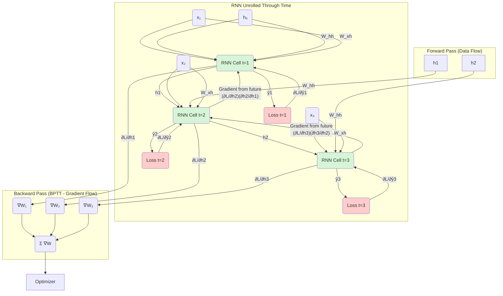

好的，各位同学，我们已经了解了RNN是什么，以及它为什么在处理序列数据时如此强大。我们知道它有一个“记忆”单元，可以在处理序列时不断传递信息。

但是，机器是如何学习的呢？就像我们学习一样，它需要犯错，然后从错误中吸取教训。今天，我们就来揭开这个“吸取教训”过程的神秘面纱，深入探讨RNN的“大脑”是如何通过前向传播（Forward Propagation）进行思考，又是如何通过时间反向传播（Backpropagation Through Time, BPTT）进行反思和调整的。

---

### 1. 问题引入

想象一下你正在设计一个智能打字助手。当用户输入“今天天气很好，我们去公园...”时，你希望它能预测出下一个最可能的词，比如“散步”。

助手做出了预测（比如“野餐”），但用户的实际选择是“散步”。预测和现实之间存在一个“误差”（Loss）。这个误差就像一个信号，告诉我们的模型：“嘿，你的预测不够准，需要调整一下内部的参数（权重）。”

问题来了：这个误差信号发生在序列的末尾，但模型的决策是基于整个序列一步步积累的信息。我们应该如何合理地将这个最终的误差“分摊”给序列中每一个时间步的决策过程，从而精确地调整那些共享的参数（权重矩阵 `W`）呢？这就是BPTT要解决的核心问题：**如何在时间维度上，追溯并分配误差的责任。**

### 2. 核心思想与直观类比

**核心思想**:
*   **前向传播**: 就像阅读一本书，你从第一个字读到最后一个字。在每个时间点，你根据当前看到的字（输入 `x_t`）和你脑海中已有的上下文记忆（上一时刻的隐藏状态 `h_{t-1}`）来更新你的理解（当前时刻的隐藏状态 `h_t`），并做出一个预测（`ŷ_t`）。这个过程是信息在时间轴上的顺序积累。
*   **时间反向传播 (BPTT)**: 这好比是做阅读理解题答错了，然后进行复盘。你从错误答案（最终的Loss）开始，反向回顾整个句子。你不仅要思考最后一个词的理解是否出错，还要思考倒数第二个词是如何影响了你对最后一个词的理解，再往前追溯，直到句子的开头。BPTT就是这样一个**“逐级追责”**的过程，它将最终的误差，沿着时间的逆流，一步步传导回去，计算出每个时间步的参数对总误差的“贡献度”（即梯度），从而进行修正。

**直观类比：多米诺骨牌**

*   **前向传播**：想象一排多米诺骨牌。你推倒第一张（输入第一个词），它会撞倒第二张，第二张撞倒第三张...直到最后一张倒下（做出最终预测）。每一张骨牌倒下的状态（`h_t`），都取决于前一张骨牌传递过来的力量（`h_{t-1}`）和它自身受到的直接推动（`x_t`）。
*   **BPTT**：假设最后一张骨牌没有倒在预期的位置上。为了修正，你需要从最后一张骨牌开始分析。它的倒向偏差是多大？（计算`Loss`对`ŷ_T`的梯度）。这个偏差有多大程度上是由前一张骨牌传递的力量造成的？（将梯度反向传播到`h_T`）。然后你继续往前追溯，前一张骨牌的倒向又是如何影响了后一张？（将梯度从`h_T`传播到`h_{T-1}`）。你沿着倒下的骨牌链条一路反推，直到第一张，计算出你最初那一“推”的力度和方向（模型权重`W`）应该如何调整，才能让最后一张骨牌精确地倒在目标位置。

### 3. 最小示例

我们用一个极简的RNN来演示这个过程，序列长度为2。

**设定**:
*   输入序列 `x = [x_1, x_2]`，其中 `x_1 = 1`, `x_2 = 2`。
*   初始隐藏状态 `h_0 = 0`。
*   权重（我们简化，只看一个核心权重）：`W_xh = 0.5`, `W_hh = 1.5`, `W_hy = 1.0`。
*   激活函数：我们使用线性激活函数 `f(z) = z` 以简化计算。
*   目标输出 `y = [y_1, y_2]`，其中 `y_1 = 2`, `y_2 = 5`。

**A. 前向传播 (Forward Pass)**

1.  **时间步 t=1**:
    *   计算隐藏状态 `h_1`:
        `h_1 = f(W_xh * x_1 + W_hh * h_0) = 0.5 * 1 + 1.5 * 0 = 0.5`
    *   计算预测输出 `ŷ_1`:
        `ŷ_1 = W_hy * h_1 = 1.0 * 0.5 = 0.5`
    *   计算该步的误差（平方误差）：
        `Loss_1 = (ŷ_1 - y_1)² = (0.5 - 2)² = (-1.5)² = 2.25`

2.  **时间步 t=2**:
    *   计算隐藏状态 `h_2`:
        `h_2 = f(W_xh * x_2 + W_hh * h_1) = 0.5 * 2 + 1.5 * 0.5 = 1 + 0.75 = 1.75`
    *   计算预测输出 `ŷ_2`:
        `ŷ_2 = W_hy * h_2 = 1.0 * 1.75 = 1.75`
    *   计算该步的误差：
        `Loss_2 = (ŷ_2 - y_2)² = (1.75 - 5)² = (-3.25)² = 10.5625`

3.  **总误差**:
    *   `L = Loss_1 + Loss_2 = 2.25 + 10.5625 = 12.8125`

前向传播完成，我们得到了一个12.8125的总误差。现在，我们需要反向传播来弄清楚如何调整权重以减小这个误差。

**B. 反向传播 (Backward Pass) - BPTT**

我们的目标是计算总损失 `L` 对 `W_hy` 和 `W_hh` 的梯度，即 `∂L/∂W_hy` 和 `∂L/∂W_hh`。

**1. 计算 `∂L/∂W_hy`**

`∂L/∂W_hy = ∂Loss_1/∂W_hy + ∂Loss_2/∂W_hy`

*   **时间步 t=2**:
    *   `∂Loss_2/∂ŷ_2 = 2 * (ŷ_2 - y_2) = 2 * (1.75 - 5) = -6.5`
    *   `∂ŷ_2/∂W_hy = h_2 = 1.75`
    *   `∂Loss_2/∂W_hy = (∂Loss_2/∂ŷ_2) * (∂ŷ_2/∂W_hy) = -6.5 * 1.75 = -11.375`

*   **时间步 t=1**:
    *   `∂Loss_1/∂ŷ_1 = 2 * (ŷ_1 - y_1) = 2 * (0.5 - 2) = -3.0`
    *   `∂ŷ_1/∂W_hy = h_1 = 0.5`
    *   `∂Loss_1/∂W_hy = (∂Loss_1/∂ŷ_1) * (∂ŷ_1/∂W_hy) = -3.0 * 0.5 = -1.5`

*   **总梯度 `∂L/∂W_hy = -11.375 + (-1.5) = -12.875`**

**2. 计算 `∂L/∂W_hh`**

计算 `W_hh` 的梯度需要先计算每个时间步的隐藏状态 `h_t` 对总损失 `L` 的梯度 (`∂L/∂h_t`)，这遵循反向递推规则。

*   **从时间步 t=2 开始反向传播**:
    *   **计算 `∂L/∂h_2`**:
        `∂L/∂h_2 = ∂Loss_2/∂h_2` (因为没有 `h_3`)
        `∂Loss_2/∂h_2 = (∂Loss_2/∂ŷ_2) * (∂ŷ_2/∂h_2)`
        `∂ŷ_2/∂h_2 = W_hy = 1.0`
        `∂L/∂h_2 = -6.5 * 1.0 = -6.5`

    *   **计算 `∂L_2/∂W_hh` (对当前 `t=2` 步 `W_hh` 的贡献)**:
        `∂h_2/∂W_hh = h_1 = 0.5` (因为 `h_2 = W_xh*x_2 + W_hh*h_1` 且激活函数为线性)
        `∂L_t=2/∂W_hh = (∂L/∂h_2) * (∂h_2/∂W_hh) = -6.5 * 0.5 = -3.25`

*   **接着反向传播到时间步 t=1**:
    *   **计算 `∂L/∂h_1`**:
        `∂L/∂h_1 = ∂Loss_1/∂h_1 + (∂L/∂h_2) * (∂h_2/∂h_1)`
        （这里 `∂L/∂h_2` 是从未来 `t=2` 传回的梯度，而 `∂Loss_1/∂h_1` 是当前 `t=1` 步对 `h_1` 的直接影响）

        *   `∂Loss_1/∂h_1 = (∂Loss_1/∂ŷ_1) * (∂ŷ_1/∂h_1) = -3.0 * W_hy = -3.0 * 1.0 = -3.0`
        *   `∂h_2/∂h_1 = W_hh = 1.5`

        `∂L/∂h_1 = -3.0 + (-6.5 * 1.5) = -3.0 - 9.75 = -12.75`

    *   **计算 `∂L_t=1/∂W_hh` (对当前 `t=1` 步 `W_hh` 的贡献)**:
        `∂h_1/∂W_hh = h_0 = 0` (因为 `h_1 = W_xh*x_1 + W_hh*h_0` 且 `h_0=0`)
        `∂L_t=1/∂W_hh = (∂L/∂h_1) * (∂h_1/∂W_hh) = -12.75 * 0 = 0`

*   **总梯度 `∂L/∂W_hh = ∂L_t=1/∂W_hh + ∂L_t=2/∂W_hh = 0 + (-3.25) = -3.25`**

通过这个过程，我们计算出了各个权重的总梯度。优化器会利用这些梯度来更新 `W_hy` 和 `W_hh`，从而减少总误差。

### 4. 原理剖析

在上面的最小示例中，我们为了简化计算流程，使用了线性激活函数和平方误差损失。现在，我们将从数学上更普遍地剖析BPTT在实际RNN模型中的运作，此时通常会使用 `tanh` 等非线性激活函数以及如交叉熵等损失函数。

为了清晰地理解BPTT，我们必须先定义RNN的核心数学公式。

**前向传播公式**:
*   隐藏状态更新: $h_t = \tanh(W_{xh}x_t + W_{hh}h_{t-1} + b_h)$
*   输出预测: $\hat{y}_t = \text{softmax}(W_{hy}h_t + b_y)$
*   总损失函数 (以交叉熵为例): $L = \sum_{t=1}^{T} L_t = -\sum_{t=1}^{T} y_t \log(\hat{y}_t)$

**符号解释**:
*   $x_t$: 时刻 $t$ 的输入向量。
*   $h_t$: 时刻 $t$ 的隐藏状态向量（RNN的“记忆”）。
*   $\hat{y}_t$: 时刻 $t$ 的预测输出向量。
*   $y_t$: 时刻 $t$ 的真实标签向量。
*   $W_{xh}, W_{hh}, W_{hy}$: **共享**的权重矩阵。这是RNN的核心，这些参数在所有时间步都是一样的。
*   $b_h, b_y$: 偏置向量。
*   $L$: 整个序列的总损失。

**Mermaid 流程图**:
这个图展示了数据（前向）和梯度（反向）的流动。

**反向传播 (BPTT) 的数学剖析 (`math_depth`: deep)**

我们的目标是计算总损失 $L$ 对三个共享权重 $W_{xh}, W_{hh}, W_{hy}$ 的梯度。根据链式法则，总梯度是每个时间步梯度的总和。
$\frac{\partial L}{\partial W} = \sum_{t=1}^{T} \frac{\partial L_t}{\partial W}$

1.  **对 $W_{hy}$ 的梯度**:
    这是最简单的。$W_{hy}$ 只在当前时间步 $t$ 通过 $h_t$ 影响 $\hat{y}_t$ 和 $L_t$。
    $\frac{\partial L}{\partial W_{hy}} = \sum_{t=1}^{T} \frac{\partial L_t}{\partial W_{hy}} = \sum_{t=1}^{T} \frac{\partial L_t}{\partial \hat{y}_t} \frac{\partial \hat{y}_t}{\partial W_{hy}}$
    **直观意义**: 累加在每个时间步上，输出权重 $W_{hy}$ 对该步预测错误的“直接责任”。

2.  **对 $W_{hh}$ 和 $W_{xh}$ 的梯度**:
    这里是BPTT的精髓。以 $W_{hh}$ 为例。在时刻 $t$， $W_{hh}$ 不仅影响了 $h_t$（进而影响 $L_t$），还通过 $h_t$ 影响了未来的所有隐藏状态 $h_{t+1}, h_{t+2}, \dots, h_T$ 以及所有未来的损失 $L_{t+1}, L_{t+2}, \dots, L_T$。

    因此，总损失 $L$ 对任意时刻 $k$ 的隐藏状态 $h_k$ 的梯度 $\frac{\partial L}{\partial h_k}$ 需要从未来反向计算。由于 $h_k$ 会影响所有未来时刻 $t \ge k$ 的损失 $L_t$，因此 $\frac{\partial L}{\partial h_k} = \sum_{t=k}^{T} \frac{\partial L_t}{\partial h_k}$。为了高效计算这个总和，我们利用链式法则得到一个关键的递推关系：
    $\frac{\partial L}{\partial h_k} = \underbrace{\frac{\partial L_k}{\partial \hat{y}_k} \frac{\partial \hat{y}_k}{\partial h_k}}_{\text{当前步的直接影响}} + \underbrace{\frac{\partial L}{\partial h_{k+1}} \frac{\partial h_{k+1}}{\partial h_k}}_{\text{来自未来的间接影响}}$

    *   **剖析递推**: 这个公式完美诠释了“复盘”。$h_k$ 所应承担的总责任 = 它对当前输出 $L_k$ 造成的直接责任 + 它通过影响 $h_{k+1}$ 而承担的、从未来传递回来的间接责任。
    *   **梯度消失/爆炸的根源**: 注意 $\frac{\partial h_{k+1}}{\partial h_k}$ 这一项。根据 $h_{k+1} = \tanh(W_{xh}x_{k+1} + W_{hh}h_k + b_h)$，其导数包含 $W_{hh}$ 和 $\tanh$ 的导数。
        $\frac{\partial h_{k+1}}{\partial h_k} = \tanh'(\dots) \cdot W_{hh}$
    在反向传播过程中，这个导数项会被连乘 $T-k$ 次。如果 $W_{hh}$ 的范数（可以理解为大小）大于1，梯度会指数级增大（梯度爆炸）；如果小于1，梯度会指数级减小（梯度消失），导致模型无法学习长期依赖。

    最后，我们计算 $W_{hh}$ 的总梯度：
    $\frac{\partial L}{\partial W_{hh}} = \sum_{t=1}^{T} \frac{\partial L}{\partial h_t} \frac{\partial h_t}{\partial W_{hh}}$
    对 $W_{xh}$ 的梯度计算同理。

### 5. 常见误区

1.  **误区：“BPTT是一种全新的算法，不同于BP。”**
    **纠正**：BPTT**就是**标准反向传播（BP）算法。它只是应用于一个特殊的计算图——一个按时间步“展开”（Unrolled）的RNN网络。名字中的“Through Time”强调了其应用场景，而非算法本身的根本不同。

2.  **误区：“RNN在每个时间步都有不同的权重矩阵。”**
    **纠正**：这是对RNN最根本的误解。RNN的核心就是**参数共享**。权重矩阵 $W_{xh}, W_{hh}, W_{hy}$ 在所有时间步都是**同一套**。正因为如此，我们在BPTT中计算的梯度 $\frac{\partial L_t}{\partial W}$ 才需要对所有时间步 $t$ 进行求和，然后用这个**总梯度**去更新那**唯一一套**权重。

3.  **误区：“训练时必须对整个无限长的序列进行反向传播。”**
    **纠正**：理论上是，但实践中不可行，计算成本太高且梯度问题严重。实际应用中采用**截断时间反向传播 (Truncated BPTT)**，即每次只反向传播固定的步数（例如，20步），既能有效学习，又控制了计算开销。

### 6. 拓展应用

BPTT的核心思想——在展开的时序计算图上应用反向传播——不仅限于RNN。

*   **强化学习**: 在某些策略梯度算法中，一个智能体的决策序列（action sequence）可以被看作是一个时序过程。环境的状态转移类似于RNN的隐藏状态更新。为了优化策略，需要将未来的奖励（reward）信号反向传播，以评估早期决策的好坏，这在思想上与BPTT非常相似。
*   **可微物理模拟**: 想象一个物理引擎（如模拟天气或机器人运动），每一步的状态都由前一步的状态和物理定律（类似于RNN的权重）决定。如果我们想优化初始条件或物理参数以达到某个最终状态，我们可以将整个模拟过程看作一个巨大的、展开的计算图，并使用类似BPTT的方法来计算梯度。

### 7. 总结要点

1.  **前向传播**: 像顺序阅读一样，信息沿时间轴流动。核心是状态更新公式 $h_t = f(h_{t-1}, x_t; W)$，其中权重 $W$ 在所有时间步共享。
2.  **时间反向传播 (BPTT)**: 像侦探破案一样，误差从序列末尾沿时间轴逆向追溯。
3.  **核心数学**: BPTT的本质是链式法则在时间维度上的应用。关键在于梯度递推公式 $\frac{\partial L}{\partial h_k} = (\text{直接影响}) + (\text{未来影响}) \cdot \frac{\partial h_{k+1}}{\partial h_k}$。
4.  **梯度问题根源**: BPTT的数学形式揭示了梯度消失/爆炸的根本原因——$\frac{\partial h_{t}}{\partial h_{t-1}}$ 项的长期连乘效应。

### 8. 思考与自测

**问题**:
在我们的BPTT原理剖析中，我们看到了梯度会沿着时间链条反向传播，其中反复乘以 $\frac{\partial h_{k+1}}{\partial h_k} = \tanh'(\dots) \cdot W_{hh}$ 这一项。

请思考：
1.  我们知道 $\tanh'(z)$ 的值域是 `(0, 1]`。如果权重矩阵 $W_{hh}$ 的主要特征值（可以粗略理解为其“缩放”能力）远小于1，经过多步反向传播后，从遥远未来（例如 $t=20$）传回来的梯度信号会发生什么变化？
2.  这种情况对模型学习“长期依赖”（例如，根据一篇文章的第一个词来判断最后一个词的情感）有何影响？