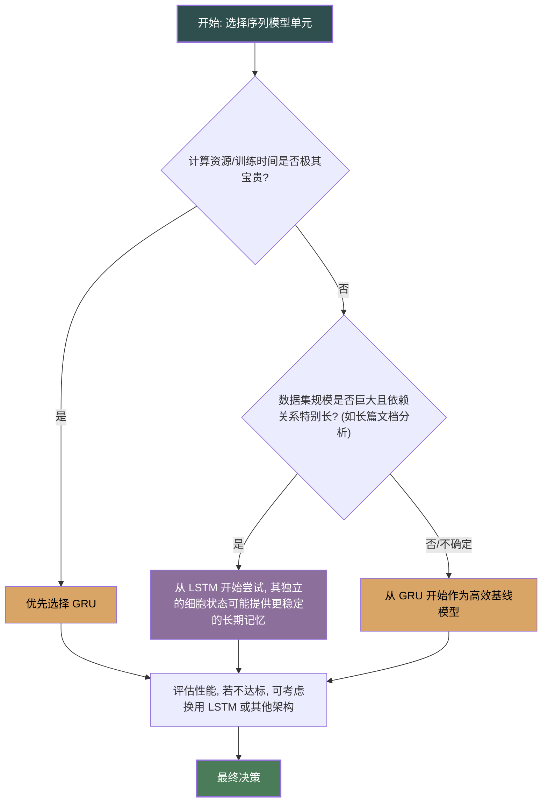

作为一位资深的技术编辑与作者，我将为你构建一个清晰的比较框架，深入探讨门控循环单元（GRU），并指导你如何在它与长短期记忆网络（LSTM）之间做出明智的技术选型。

---

### **门控循环单元（GRU）：LSTM的简化变体**

#### 1. **问题引入**

在掌握了能够捕捉长期依赖的 LSTM 模型后，我们自然会思考：LSTM 的三门（输入、遗忘、输出）一状态（细胞状态）架构是解决梯度消失问题的唯一解法吗？它的复杂性是必要的吗？这时，我们遇到了 GRU（Gated Recurrent Unit），一个结构更简洁、性能却不相上下的强大备选方案。

那么问题来了：“我已经理解了 LSTM，它工作得很好。在什么情况下我应该选择更简单的 GRU？它仅仅是 LSTM 的‘廉价版’，还是在某些场景下更优的选择？”

#### 2. **核心定义与类比**

为了做出明智的选择，我们首先需要清晰地定义这两个核心对象。

*   **长短期记忆网络 (LSTM)**: 一种特殊的循环神经网络（RNN），通过引入**三个独立的门（遗忘门、输入门、输出门）**和一个独立的**细胞状态 (Cell State)**，实现了对信息流的精细控制。细胞状态像一条传送带，信息可以很顺畅地在上面流动，不易失真。
*   **门控循环单元 (GRU)**: 由 Cho 等人在 2014 年提出，是 LSTM 的一个流行变体。它将 LSTM 的遗忘门和输入门巧妙地合并为一个**更新门 (Update Gate)**，并进一步融合了细胞状态与隐藏状态。因此，它仅包含**两个门（更新门、重置门）**。

**核心类比：专业单反相机 (DSLR) vs. 高端无反相机 (Mirrorless)**

*   **LSTM 就像一台专业单反相机**：它拥有更多的独立控制部件（反光镜、独立对焦模块等），理论上为专业摄影师提供了最精细、最极致的操控空间。但它也更重、更复杂、更耗电。
*   **GRU 就像一台高端无反相机**：它通过更智能的集成设计（传感器直接对焦），减少了内部组件，变得更轻便、更省电、操作更简洁。在绝大多数场景下，它能拍出与单反同样出色的照片，甚至在某些方面（如连拍速度）更具优势。

选择哪一个，取决于你的具体需求——是追求极致的精细控制，还是更看重效率与简洁的平衡。

#### 3. **最小示例 (快速感受)**

由于我们不深入代码，让我们通过一个概念性的例子来感受二者的运作差异。

**任务**: 分析句子情感：“这部电影不好看，简直是浪费时间。”

*   **LSTM 的信息处理流程 (概念上)**:
    1.  读到 "不好看" 时，**遗忘门** 可能不会完全遗忘之前的负面基调，**输入门** 会决定将 "不好看" 的负面信息更新到**细胞状态**（长期记忆）中。
    2.  读到 "浪费时间" 时，**遗忘门** 保持长期记忆，**输入门** 将更强烈的负面信号加入细胞状态。
    3.  最后，**输出门** 会根据细胞状态的内容，决定输出一个代表“强烈负面”的**隐藏状态**。整个过程中，细胞状态 C_t 像一个受严格保护的“黑匣子”，专门负责记忆。

*   **GRU 的信息处理流程 (概念上)**:
    1.  读到 "不好看" 时，**重置门** 可能会决定“忽略”掉之前中性的初始状态，以便完全基于“不好看”来生成新的候选状态。**更新门** 会决定将这个新的负面状态在多大程度上“写入”最终的隐藏状态。
    2.  读到 "浪费时间" 时，**更新门** 会面临一个权衡：是更多地保留来自“不好看”的旧隐藏状态，还是更多地采纳由“浪费时间”产生的新候选状态。在这个例子中，它会倾向于采纳新信息。
    3.  GRU 没有独立的细胞状态，它的隐藏状态 h_t 直接承担了传递长期信息的责任。更新门 z_t 直接控制着旧记忆 (h_{t-1}) 被保留的比例。

直观感受：LSTM 的控制是“分步”的——先决定忘掉什么，再决定加入什么。而 GRU 的控制更像是“权衡”——直接决定旧记忆和新信息各自占多大比重。

#### 4. **原理剖析 (深入对比)**

为了进行系统性分析，我们从设计哲学、内部机制、性能等多个维度，用表格进行详细对比。

| 维度 (Dimension)         | 长短期记忆网络 (LSTM)                                                                                                                                                                                            | 门控循环单元 (GRU)                                                                                                                                                                                             | 分析与洞察                                                                                                                                                                                            |
| :----------------------- | :--------------------------------------------------------------------------------------------------------------------------------------------------------------------------------------------------------------- | :------------------------------------------------------------------------------------------------------------------------------------------------------------------------------------------------------------- | :------------------------------------------------------------------------------------------------------------------------------------------------------------------------------------------------------ |
| **设计哲学**             | **显式分离**: 拥有独立的细胞状态 $C_t$ (长期记忆) 和隐藏状态 $h_t$ (当前时间步的输出)，分工明确。                                                                                                                    | **状态融合**: 将细胞状态和隐藏状态合并，隐藏状态 $h_t$ 同时承担长期记忆和当前输出的双重角色。                                                                                                               | GRU 的设计更精简，符合奥卡姆剃刀原理。LSTM 的设计在理论上为信息的长期保存提供了更强的保护。                                                                                                                 |
| **门控机制**             | **三门结构**: <ul><li>**遗忘门 ($f_t$)**: 决定从细胞状态中丢弃多少信息。</li><li>**输入门 ($i_t$)**: 决定让多少新信息进入细胞状态。</li><li>**输出门 ($o_t$)**: 决定从细胞状态中输出多少信息到隐藏状态。</li></ul> | **两门结构**: <ul><li>**更新门 ($z_t$)**: 类似于 LSTM 的遗忘门和输入门的结合体。它同时决定要忘记多少旧信息，以及要加入多少新信息。</li><li>**重置门 ($r_t$)**: 决定在计算当前候选状态时，多大程度上忽略掉前一个隐藏状态。</li></ul> | GRU 将“遗忘”与“输入”操作巧妙地耦合为一体。其核心公式 $h_t = (1 - z_t) \odot h_{t-1} + z_t \odot \tilde{h}_t$ 清晰地揭示了新旧信息此消彼长的更新机制。                                                         |
| **核心数学公式 (轻量级)**  | $C_t = f_t \odot C_{t-1} + i_t \odot \tilde{C_t}$   $h_t = o_t \odot \tanh(C_t)$                                                                                                                               | $h_t = (1 - z_t) \odot h_{t-1} + z_t \odot \tilde{h}_t$                                                                                                                                                         | LSTM 的 $C_t$ 更新是加法式的，而 $h_t$ 是通过输出门筛选后得到的。GRU 的 $h_t$ 更新则是一个直接的线性插值，非常优雅。                                                                                         |
| **计算效率与参数量**     | 参数量更大，计算更密集。每个门都需要独立的权重矩阵。                                                                                                                                                             | 参数量更少（大约是 LSTM 的 2/3），因此训练速度更快，占用内存更少。                                                                                                                                                 | 在资源受限的环境（如移动端）或需要快速迭代模型的场景下，GRU 的效率优势非常明显。                                                                                                                          |
| **性能表现**             | 在许多任务上与 GRU 表现相当。在拥有海量数据和非常长序列依赖的任务上，可能略有优势。                                                                                                                                 | 在许多任务上与 LSTM 表现相当。在数据量较小的任务上，由于参数更少，更不容易过拟合，有时表现会更好。                                                                                                               | **没有绝对的赢家**。经验法则是，两者性能通常在 5% 的差异范围内。在大多数情况下，性能差异可以通过调参来弥补。                                                                                            |
| **相关评估指标**         | BLEU/ROUGE (机器翻译/摘要), Perplexity (语言模型), F1/Accuracy (分类任务)。                                                                                                                                         | 与 LSTM 相同，使用相同的任务评估指标。                                                                                                                                                                         | 模型的选择会**影响**这些指标的最终得分，但**不会改变**指标本身的选择。例如，无论用 GRU 还是 LSTM 做情感分析，我们都关心 F1-Score。GRU 可能因为训练更快，让你有更多时间调参，从而获得更高的 F1-Score。 |

#### 5. **常见误区**

1.  **误区：“LSTM 更复杂，所以一定更强大”**
    *   **分析**: 复杂性不等于有效性。GRU 的简洁设计本身就是一种创新，它通过耦合更新机制，可能在某些数据分布上实现了更有效的学习模式。在中小规模数据集上，LSTM 的额外参数可能反而导致过拟合。

2.  **误区：“GRU 只是一个计算成本更低的‘阉割版’LSTM”**
    *   **分析**: 这是一种贬低。GRU 是一个经过深思熟虑的、独立的模型架构。它的更新门和重置门设计，为控制信息流动提供了一套同样强大且高效的机制，并非简单的“功能删减”。

3.  **误区：“选择哪个模型是项目开始时最关键的决定”**
    *   **分析**: 对于许多序列建模任务，数据质量、特征工程、模型超参数（如层数、隐藏单元数）以及是否使用双向 RNN 或注意力机制，对最终性能的影响往往远大于 LSTM 和 GRU 之间的选择。

#### 6. **拓展应用 (选型决策树)**

为了将上述分析转化为实际的决策流程，我们可以使用下面的决策树来指导选型。

#### 7. **总结要点**

*   **选择 GRU 的场景**:
    *   **效率优先**: 当你需要快速训练模型、计算资源有限（例如在移动设备上部署）时，GRU 是首选。
    *   **中小数据集**: 当数据集不够大时，GRU 更少的参数有助于防止过拟合。
    *   **优秀的基线**: 在任何新项目中，将 GRU 作为第一个尝试的基线模型，通常是一个明智、高效的策略。

*   **选择 LSTM 的场景**:
    *   **性能压榨**: 在拥有海量数据和计算资源充足的情况下，如果你想压榨出最后一点性能，特别是在处理具有非常长依赖关系的任务时，LSTM 值得一试。
    *   **历史悠久与研究充分**: LSTM 的研究历史更长，有大量的文献和实践经验可供参考，社区支持更广泛。

**最终建议**: 在实践中，请遵循 **“先简后繁”** 的原则。**从 GRU 开始**，如果它的表现已经满足了你的业务需求，那么就没必要引入 LSTM 的额外复杂性。

#### 8. **思考与自测**

现在，请思考这个问题：

> 如果你的项目是一个需要部署在移动设备上的实时语音助手，其核心任务是理解用户的短指令（通常不超过15个词），数据集规模中等。你会优先选择 GRU 还是 LSTM？为什么？

**答案解析**:
我会毫不犹豫地**优先选择 GRU**。理由如下：
1.  **计算效率**: “移动设备”和“实时”这两个关键词都指向了对计算资源和推理速度的严格要求。GRU 更少的参数和更快的计算速度完美契合这一需求。
2.  **依赖长度**: “短指令（不超过15个词）”意味着任务的长期依赖关系并不极端。GRU 完全有能力处理这种长度的序列，LSTM 的独立细胞状态带来的理论优势在此场景下并不突出。
3.  **数据集规模**: “中等规模”的数据集使用参数更少的 GRU，可以有效降低过拟合的风险，使模型泛化能力更强。
