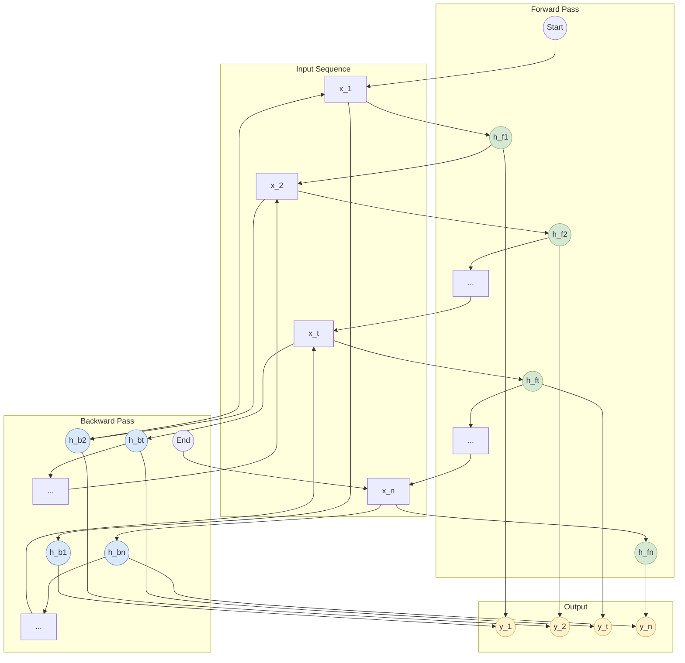

好的，我们开始。我将遵循“引导式教学模型”的八个步骤，为你清晰地讲解双向RNN（Bi-RNN）的核心思想。

---

### **双向RNN（Bi-RNN）：融合上下文信息**

#### 1. 问题引入

让我们从一个常见的语言理解难题开始。请看下面这个句子：

> “他说，‘我最喜欢的动物是**泰迪**熊’，然后拥抱了他的朋友，**泰迪**·罗斯福。”

对于人类来说，我们能轻易地区分第一个“泰迪”指的是玩具熊，而第二个“泰迪”是人名的一部分。但想象一个标准的、从左到右处理信息的RNN模型。

当它读到第一个“泰迪”时，它只看到了“我最喜欢的动物是…”这个**过去**的语境，它可能会倾向于认为“泰迪”就是一种动物或玩具。当它读到第二个“泰迪”时，它同样只看到了前面的信息。

然而，决定第二个“泰迪”真实含义的关键信息——“罗斯福”，却出现在它的**后面**。一个只能“向后看”的标准RNN，在处理“泰迪”这个词的瞬间，是无法利用“罗斯福”这个“未来”信息的。这个问题该如何解决呢？

#### 2. 核心定义与生活化类比

**核心定义**
双向循环神经网络（Bidirectional Recurrent Neural Network, Bi-RNN）是一种特殊的RNN架构。它包含两个独立的RNN层，一个按正常顺序（从前到后）处理输入序列，另一个按相反顺序（从后到前）处理。在每个时间步，Bi-RNN的最终输出会结合这两个方向的RNN所提供的信息，从而让模型在处理任何一个词时，都能同时“看到”它的过去（前文）和未来（后文）的上下文。

**生活化类比：当一名侦探**
想象你是一名侦探，正在阅读一封充满线索的信件来破解案件。

*   **标准RNN** 就像一个非常循规蹈矩的侦探，他必须从信的第一个字开始，一个字一个字地读到最后。他只能根据已经读过的内容来做推断。如果信件的关键线索在结尾，那么他在读到中间部分时可能会做出错误的判断。

*   **双向RNN（Bi-RNN）** 则像一个更聪明的侦探。他会做两件事：
    1.  **正向阅读**：从头到尾读一遍信，建立一个初步的时间线和理解。
    2.  **反向阅读**：再从信的末尾读到开头，看看结尾的结论是如何影响开头的动机的。

最后，在对信中任何一句话做判断时，这位侦探会结合**正向阅读的笔记**和**反向阅读的笔记**，形成一个完整、无懈可击的全局理解。Bi-RNN正是通过这种“双向阅读”的机制，来获得对序列中每个元素的全面上下文感知。

#### 3. 最小示例

我们不用代码，用一个简单的**命名实体识别（NER）**场景来走查一遍。任务是识别句子中 “Apple” 是指公司还是水果。

**句子**: "The **Apple** event was held in California."

1.  **输入序列**: `["The", "Apple", "event", "was", "held", "in", "California"]`

2.  **前向RNN处理**:
    *   当处理到 "Apple" 时，它看到了前面的 "The"。
    *   此时的上下文是 `["The"]`。模型可能会想：“一个苹果？”（An apple?），倾向于认为是**水果**。
    *   它生成一个基于前文的隐藏状态 $\overrightarrow{h}_{\text{Apple}}$。

3.  **反向计算**:
    *   模型从句末开始，反向处理序列：`["California", "in", "held", "was", "event", "Apple", "The"]`
    *   当处理到 "Apple" 时，它已经看到了后面的 "event was held in California"。这个语境强烈地暗示了发布会、科技公司等信息。模型会倾向于认为是**公司**。
    *   它生成一个基于后文的隐藏状态 $\overleftarrow{h}_{\text{Apple}}$。

4.  **信息融合**:
    *   在 "Apple" 这个时间步，模型将前向RNN的隐藏状态 $\overrightarrow{h}_{\text{Apple}}$ 和后向RNN的隐藏状态 $\overleftarrow{h}_{\text{Apple}}$ **拼接**起来。
    *   这个融合后的新状态，既包含了“它是一个名词”的前文信息，又包含了“它举办了一场活动”的后文信息。
    *   基于这个全面的上下文，模型最终可以自信地将 "Apple" 标注为**组织/公司（ORG）**。

#### 4. 原理剖析

双向RNN的核心在于其结构设计。它并不是一个全新的单元（像LSTM或GRU），而是一种**组织RNN单元（可以是普通RNN、LSTM或GRU）的方式**。

**结构图**

下面是一个Bi-RNN在处理序列时的信息流图。

**工作流程解析**:
1.  **前向传播**: 一个标准的RNN（例如LSTM或GRU）从序列的开始（$t=1$）到结束（$t=n$）进行计算，生成一系列前向隐藏状态 $\overrightarrow{h_1}, \overrightarrow{h_2}, ..., \overrightarrow{h_n}$。每个 $\overrightarrow{h_t}$ 都编码了从 $x_1$到 $x_t$ 的历史信息。
    $$ \overrightarrow{h_t} = \text{RNN}_{\text{fw}}(x_t, \overrightarrow{h_{t-1}}) $$

2.  **反向计算**: 另一个独立的RNN从序列的末尾（$t=n$）到开始（$t=1$）进行计算，生成一系列后向隐藏状态 $\overleftarrow{h_1}, \overleftarrow{h_2}, ..., \overleftarrow{h_n}$。每个 $\overleftarrow{h_t}$ 都编码了从 $x_n$到 $x_t$ 的未来信息。
    $$ \overleftarrow{h_t} = \text{RNN}_{\text{bw}}(x_t, \overleftarrow{h_{t+1}}) $$

3.  **输出合并**: 对于序列中的任意时间步 $t$，最终的输出 $y_t$ 是基于两个方向隐藏状态的组合。最常见的组合方式是**拼接（Concatenation）**。
    $$ y_t = \text{Combine}([\overrightarrow{h_t}; \overleftarrow{h_t}]) $$
    其中 $[\overrightarrow{h_t}; \overleftarrow{h_t}]$ 表示将两个向量拼接在一起。这样，输出层在做决策时，就同时拥有了过去和未来的上下文视野。

#### 5. 常见误区

1.  **误区：“双向RNN可以预测未来”**
    *   **澄清**：这是一个非常关键的误解。Bi-RNN 并不是在实时预测中“看到”了还未发生的事件。它能够利用“未来”信息，是因为它在处理整个序列**之前**，就已经获取了**完整**的输入序列。因此，Bi-RNN非常适用于那些可以一次性获得所有输入的任务（例如，分析一整篇文章、翻译一整个句子），但不适用于需要根据当前信息立即做出预测的实时任务（例如，根据实时语音流进行同声传译、预测股票的下一个价格点）。

2.  **误区：“前向和后向RNN在计算时会相互通信”**
    *   **澄清**：在前向传播和反向计算（即生成隐藏状态）的过程中，这两个RNN是**完全独立**的。前向RNN只关心从左到右的信息流，后向RNN只关心从右到左的信息流。它们之间没有任何信息交换。唯一的交汇点是在最后一步，当它们各自对应时间步的隐藏状态被**合并**以生成最终输出时。

#### 6. 拓展应用

Bi-RNN（特别是Bi-LSTM和Bi-GRU）是许多NLP任务中构建强大基线模型的首选。

*   **命名实体识别 (NER)**: 正如我们的示例所示，一个词的实体类型（人名、地名、公司）常常由其前后文共同决定。
*   **情感分析**: 句子的情感色彩可能因为结尾的一个词而完全反转。例如，“这部电影的特效、演员、配乐都堪称完美，只可惜剧本**太烂了**。” 只有看到了结尾的“太烂了”，才能对整句话的情感做出准确判断。
*   **词性标注 (Part-of-Speech Tagging)**: 一个词是名词还是动词（例如 "book"），通常需要看它在句子中的完整结构。
*   **机器翻译 (作为Seq2Seq的编码器)**: 在将源语言句子编码成一个向量表示时，使用Bi-RNN可以确保编码向量包含源句子中每个词的完整上下文信息，从而为解码器生成更准确的译文提供坚实基础。

#### 7. 总结要点

1.  **核心优势**：Bi-RNN通过结合一个前向RNN和一个后向RNN，使得模型在任意时间步都能同时获取过去和未来的上下文信息。
2.  **结构组成**：它由两个独立的RNN（可以是普通RNN、LSTM或GRU）组成，一个正向处理序列，一个反向处理序列。
3.  **信息融合点**：两个RNN的隐藏状态在每个时间步被合并（通常是拼接），然后送入输出层进行最终预测。
4.  **适用场景**：它非常适合处理需要全局上下文的**离线任务**（Offline Tasks），即在处理开始前就能获得完整输入序列的任务。

#### 8. 思考与自测

1.  我们已经知道 Seq2Seq 模型通常在编码器（Encoder）中使用 RNN。请思考，为什么在许多现代的 Seq2Seq 任务（如机器翻译）中，编码器部分通常会使用**双向**RNN（或双向 LSTM/GRU）？这样做有什么好处？
2.  双向 RNN 能够有效捕捉上下文信息，但它是否适用于所有序列预测任务？请设想一个**不适合**使用双向 RNN 的场景，并说明原因。
