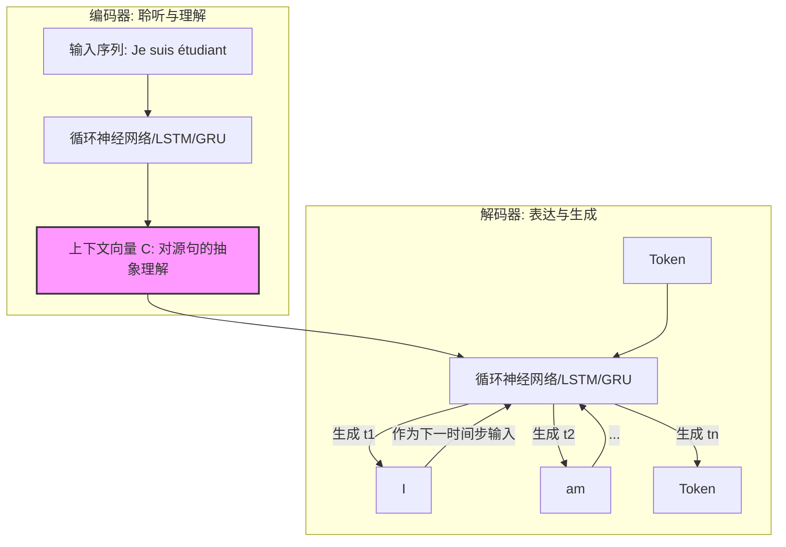
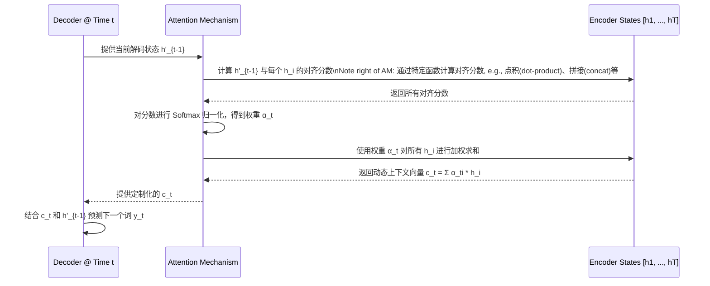

好的，我们开始。作为一名架构师，我不会只告诉你一个模型是如何工作的，而是引导你思考**为什么**它要这样设计，其中的权衡是什么，以及它如何演进。我们今天探讨的序列到序列（Seq2Seq）模型，其编解码器（Encoder-Decoder）架构是现代自然语言处理领域的一块重要基石。

---

### 1. 问题引入：设计的初衷与业务痛点

想象一下，你正在构建一个智能系统。最初的需求很简单：给一个句子，判断它的情感是积极还是消极。你可以用一个LSTM来读取整个句子，并用最后一个时间步的隐藏状态来做分类。这很直接，输入是一个序列，输出是一个固定的标签。

现在，业务方提出了新的、更复杂的挑战：
*   **机器翻译**：输入一个中文序列（“你好世界”），输出一个英文序列（“Hello World”）。
*   **文本摘要**：输入一篇长文章（序列），输出一个简短的摘要（另一个序列）。
*   **对话系统**：输入一个用户问题（序列），输出一个系统回答（另一个序列）。

这些任务的共同痛点是什么？

关键在于，**输入序列和输出序列的长度不固定，且通常不相等**。标准的RNN、LSTM或GRU架构，其设计范式是“一个输入，一个输出”的同步模式（例如，为每个词标注词性），无法直接处理这种“N输入，M输出”的异步问题。强行对齐会导致信息丢失或冗余。

因此，我们需要一种新的架构范式，能够解耦（decouple）输入序列的处理和输出序列的生成。这就是Seq2Seq架构设计的核心驱动力。

### 2. 核心目标与类比：构建“通用翻译官”

**核心设计目标**：构建一个通用的、灵活的框架，能够将一个任意长度的源序列“压缩”成一种意义的表示，然后再将这种表示“解压”成一个任意长度的目标序列。

**架构类比：一位专业的同声传译员**

我们可以把整个Seq2Seq架构想象成一位专业的同声传译员：

*   **编码器（Encoder）- 聆听与理解阶段**：传译员首先会完整地听完源语言的一句话或一个意群（输入序列）。在这个过程中，他不会急于翻译，而是将所有信息在大脑中进行处理、消化，最终形成一个对这句话核心意义的、与具体语言无关的抽象理解（`Context Vector`）。
*   **解码器（Decoder）- 表达与生成阶段**：基于这个抽象的理解，传译员开始用目标语言进行表述（输出序列）。他会一个词一个词地组织句子，并且每说出一个词，都会参照脑海中的整体意义以及刚刚说过的词，来决定下一个最合适的词。

这个类比揭示了该架构的两个核心原则：
1.  **关注点分离**：编码和解码是两个独立的阶段，有各自专用的组件。
2.  **信息瓶颈**：两个阶段通过一个中间状态（“抽象理解”）进行通信。这个中间状态的设计，是整个架构成败的关键。

### 3. 最小示例 (核心组件图)

让我们用一张最简化的蓝图来描绘这个“翻译官”的核心结构。

这张图清晰地展示了：
*   **Encoder** 将整个输入序列（"Je suis étudiant"）处理完毕，最终产出一个固定大小的上下文向量 `C`。
*   **Decoder** 将 `C` 作为其初始状态的依据，从一个特殊的起始符 `<SOS>` 开始，逐步生成输出序列。每个时间步生成的词，会作为下一个时间步的输入（在实际实现中，是将生成的词通过嵌入层转换为向量后作为输入），这个过程被称为**自回归（Auto-Regressive）**。

### 4. 原理剖析 (详细设计与权衡)

既然你是专家，我们来深入探讨每个组件的设计选择和背后的权衡。

#### **组件一：编码器（Encoder）**

*   **职责**：将输入序列 $X = (x_1, x_2, ..., x_T)$ 编码成一个上下文向量 $c$。
*   **接口**：
    *   输入：词嵌入序列 `[batch_size, seq_len, embedding_dim]`
    *   输出：上下文向量 `[batch_size, hidden_dim]` (以及所有时间步的隐藏状态，为后续架构演进做准备)
*   **关键设计权衡**：
    1.  **循环单元的选择（RNN vs. GRU vs. LSTM）**: 
        *   **选择**: 对于需要捕捉长距离依赖的复杂任务（如翻译长句），几乎总是选择LSTM或GRU，以规避梯度消失/爆炸问题。GRU是LSTM的简化版，参数更少，训练更快，在某些数据集上表现相当，是值得尝试的默认选项。
        *   **权衡**: 性能与计算成本的平衡。LSTM门控更多，理论上表达能力更强，但计算也更密集。

    2.  **方向性（Unidirectional vs. Bidirectional）**: 
        *   **选择**: 对于绝大多数离线处理任务（如文档翻译、文章摘要），**双向RNN（Bi-RNN）**是压倒性的更优选择。Encoder在编码 $x_t$ 时，不仅能看到过去的信息（$x_1, ..., x_{t-1}$），还能看到未来的信息（$x_{t+1}, ..., x_T$）。这使得生成的上下文表示更加全面和精确。
        *   **权衡**: 
            *   **性能 vs. 延迟**: Bi-RNN需要处理完整个序列才能得到最终的表示，因此不适用于实时流式处理（例如，实时语音翻译）。
            *   **数学表达**: 单向RNN的最终隐藏状态 $h_T$ 作为上下文向量 $c$：$c = h_T = \text{EncoderRNN}(X)$。而对于Bi-RNN，上下文向量通常是前向RNN在序列末尾的最终隐藏状态与后向RNN在序列开头的最终隐藏状态的拼接：$c = [\overrightarrow{h_T} ; \overleftarrow{h_1}]$。

#### **组件二：上下文向量（Context Vector）- 信息瓶颈**

*   **职责**：作为Encoder和Decoder之间的唯一信息桥梁。
*   **设计缺陷（这是一个关键洞察）**: 
    *   这是一个**固定大小**的向量。无论输入序列是5个词还是50个词，它都必须被压缩到同一个维度。
    *   这构成了一个**信息瓶颈（Information Bottleneck）**。对于长序列，模型很难将所有重要细节都塞进这个向量里，早期输入的信息可能会被后续输入“冲刷”掉。这是朴素Seq2Seq架构最核心的弱点，也是驱动后续Attention机制诞生的直接原因。

#### **组件三：解码器（Decoder）**

*   **职责**：给定上下文向量 $c$ 和已生成的序列 $Y_{<t}$，生成下一个词 $y_t$ 的概率分布。
*   **接口**：
    *   输入：上下文向量 $c$（通常用作RNN的初始隐藏状态）、前一时间步的输出词嵌入 $y_{t-1}$。
    *   输出：对整个词汇表的Logits `[batch_size, vocab_size]`。
*   **核心流程（自回归）**: 
    1.  用Encoder的输出 $c$ 初始化Decoder的隐藏状态 $h'_0 = c$。
    2.  输入起始符 `<SOS>`，计算第一个词的概率分布：$P(y_1 | c) = \text{softmax}(g(\text{DecoderRNN}(h'_0, \text{<SOS>})))$。
    3.  在第 $t$ 步，将前一步的输出 $y_{t-1}$ 作为当前输入，更新隐藏状态并预测 $y_t$：$P(y_t | Y_{<t}, c) = \text{softmax}(g(\text{DecoderRNN}(h'_{t-1}, y_{t-1})))$。
    4.  重复此过程，直到生成终止符 `<EOS>`。
*   **设计权衡（训练与推理）**: 
    *   **Teacher Forcing**: 在训练时，为了加速收敛和稳定训练，我们通常不使用模型上一轮的预测输出作为当前输入（因为一旦预测错，错误会累积），而是直接使用**真实标签** $y_{t-1}$ 作为输入。这被称为“教师强制”。
    *   **权衡**: Teacher Forcing虽然高效，但引入了训练与推理之间的差异（**Exposure Bias**）。模型在训练时从未见过自己产生的错误，导致在推理时一旦走错一步，后续表现可能会雪崩。这是一个需要通过Scheduled Sampling等技术来缓解的经典问题。

### 5. 常见误区 (反模式)

作为架构师，识别并规避“反模式”至关重要。

1.  **对信息瓶颈的忽视 (The Bottleneck Blind Spot)**
    *   **现象**: 在处理非常长的序列（如篇章级摘要）时，仍旧使用朴素的Seq2Seq架构，并试图通过简单地增加`hidden_dim`来解决问题。
    *   **后果**: 性能很快达到瓶颈，模型会“遗忘”输入序列的开头部分。增加维度会急剧增加计算成本，但收益递减。
    *   **正确范式**: 认识到这是架构层面的缺陷，并引入更先进的机制（如Attention）来绕过这个瓶颈。

2.  **编码器与解码器能力失配 (Mismatched Capacity)**
    *   **现象**: 设计一个极深、极复杂的双向Encoder，却搭配一个非常浅、简单的单向Decoder。
    *   **后果**: Encoder辛辛苦苦提取的丰富语义信息，Decoder却无法有效利用，导致系统整体性能受限于解码能力。架构的表达能力取决于其最薄弱的环节。
    *   **正确范式**: 保持编码器和解码器在模型复杂度和容量上的大致匹配，确保信息能够顺畅地转换和生成。

3.  **忽略训练-推理差异 (Train-Inference Skew)**
    *   **现象**: 训练时100%使用Teacher Forcing，在验证集上看到很好的损失下降，但在实际推理（Free-Running）时效果很差。
    *   **后果**: 模型对自身的错误极其脆弱，鲁棒性差。
    *   **正确范式**: 在训练后期引入课程学习（Curriculum Learning）或计划采样（Scheduled Sampling），逐步减少Teacher Forcing的比例，让模型学会“纠正”自己的小错误。

### 6. 拓展应用 (演进路线)

一个好的架构应该具备演进的能力。Seq2Seq的v1.0（我们刚才讨论的）很快就暴露了信息瓶颈问题。v2.0的演进目标就是**打破这个瓶颈**。

**从 v1.0 (固定上下文) 到 v2.0 (动态上下文 - 注意力机制)**

*   **v1.0 的限制**: Decoder在每一步生成时，都只能看到同一个、静态的上下文向量 $c$。这就像翻译官在翻译长句时，只被允许在开始前看一眼笔记，之后就得凭记忆复述。
*   **v2.0 的架构革新 (Attention Mechanism)**:
    1.  **不再压缩**: Encoder不再需要将所有信息硬塞进一个向量。相反，它将其**所有时间步的隐藏状态** $(h_1, h_2, ..., h_T)$ 全部保留并传递给Decoder。
    2.  **动态聚焦**: Decoder在生成**每一个**词的时候，都会执行一个“注意力”计算。它会拿着自己当前的隐藏状态（代表“我正准备翻译什么”），去和Encoder的所有隐藏状态进行一次“相关性”匹配。
    3.  **加权求和**: 根据相关性得分，对Encoder的隐藏状态们进行加权求和，生成一个为**当前时间步量身定制**的、动态的上下文向量 $c_t$。
    4.  **精准生成**: Decoder利用这个动态的 $c_t$ 来生成当前词。例如，在翻译 "I am a student" 中的 "student" 时，注意力机制会让模型高度关注源句中的 "étudiant"。

让我们用一个序列图来展示这个动态交互过程：

这个v2.0架构（Seq2Seq with Attention）极大地提升了模型性能，特别是对于长序列，它成为了后续Transformer等更强大架构的思想源头。

### 7. 总结要点

回顾我们的设计之旅，Seq2Seq的编解码器架构其精髓在于以下几个核心原则：

1.  **关注点分离 (Separation of Concerns)**: 将复杂的序列转换任务解耦为“理解”（编码）和“生成”（解码）两个更易于管理的子问题。这是解决输入输出序列不等长问题的根本性设计。
2.  **信息中介的设计 (The Information Bridge)**: Encoder和Decoder之间如何传递信息是架构的命脉。从v1.0的**静态、固定大小的瓶颈向量**，演进到v2.0的**动态、可变的注意力上下文**，是该架构最重要的跃迁。
3.  **自回归生成 (Auto-Regressive Generation)**: Decoder采用逐步生成、并将自身输出作为下一步输入的方式，使其能够生成结构连贯、长度可变的序列。

理解了这三点，你就掌握了Seq2Seq架构设计的灵魂。

### 8. 思考与自测

现在，作为架构师，请你思考一个真实世界的需求变更，并评估它对我们现有架构（v2.0, 带注意力机制）的影响。

**新需求**：在机器翻译任务中，需要对原文中的特定术语（如人名、地名、代码片段等专有名词）进行高保真度的“直译”或“复制”，而不是意译。例如，将 “`David Beckham`去了`Beijing`” 翻译成 “`David Beckham` went to `Beijing`”，模型必须精确复制 `David Beckham` 和 `Beijing`，而不是翻译成“大卫·贝克汉姆去了北京”。

**问题**：如果需求中增加了这个“高保真复制”的新要求，现有架构的哪个部分最需要修改？为什么？你会如何从架构层面着手解决？