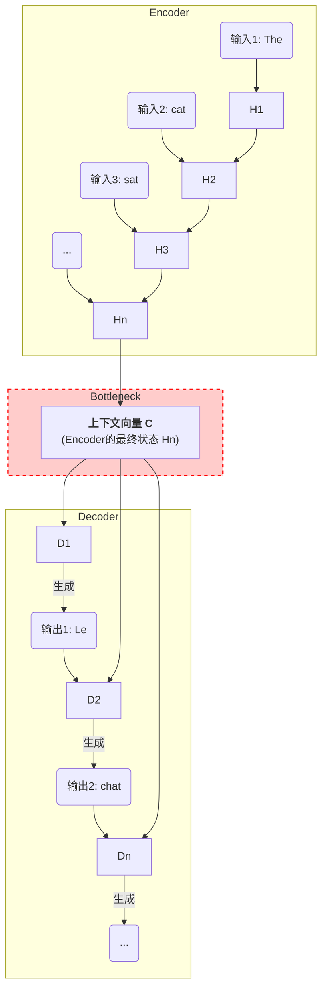

在深入探讨注意力机制的革命性之前，我们有必要回顾其前身——经典Seq2Seq（Sequence-to-Sequence）模型所面临的核心局限。理解这些挑战，将有助于我们更深刻地认识注意力机制为何能成为序列建模领域的关键突破。接下来，我们将详细审视Seq2Seq模型的困境。

***

### 回顾Seq2Seq模型的局限性

#### 1. 问题引入

想象一下，你是一位专业的同声传译员。现在有一位演讲者正在发表一段长篇大论：“女士们先生们，尽管我们初期面临着预算紧张、技术选型困难以及市场竞争激烈等多重挑战，但凭借团队不懈的努力和对产品核心价值的坚持，我们最终成功推出了这款颠覆性的产品，并获得了市场的广泛认可。”

作为传译员，你的任务是听完**整段话**后，再将其翻译成另一种语言。在演讲者说完最后一个字之前，你不能开始翻译。你会如何处理？你可能会发现，当你听到最后“市场的广泛认可”时，可能已经有些记不清开头提到的“预算紧张”和“技术选型困难”这些具体细节了。你的大脑需要承受巨大的记忆压力，很容易遗漏信息。

早期的Seq2Seq模型，在处理长句子时，就面临着与你类似的困境。

#### 2. 核心定义与生活化类比

**核心定义**:
Seq2Seq（序列到序列）模型是一种经典的深度学习架构，由一个编码器（Encoder）和一个解码器（Decoder）组成。它的核心局限在于，编码器必须将**整个输入序列的所有信息**压缩成一个**固定长度的中间向量**（通常称为“上下文向量”，亦有称“思想向量”），然后解码器仅凭这一个向量来生成完整的输出序列。这个单一的向量就成了模型的“信息瓶颈”。

**生活化类比：口耳相传的游戏**

这个过程非常像我们小时候玩的“口耳相传”（Telephone Game）游戏。
*   **输入序列**：第一个人（演讲者）拿到的一段很长的原始信息。
*   **编码器 (Encoder)**：第一个人看完后，不允许携带任何纸条，只能凭记忆将整段信息**总结成一句话**。
*   **上下文向量 (Context Vector)**：那句唯一的、高度浓缩的总结语。
*   **解码器 (Decoder)**：第二个人（翻译员）只听到这句总结，然后需要根据这句总结，**复述出原始的、完整的长篇故事**。

显而易见，无论第一个人的概括能力多强，这个“一句话总结”必然会丢失大量细节。如果原始信息很短，比如“猫在桌子下”，或许还能成功。但如果信息很长，就像我们引子里的演讲，最终复述出的故事很可能会面目全非。这个“一句话总结”就是Seq2Seq模型的致命弱点——**信息瓶颈**。

#### 3. 最小示例

我们用一个简单的翻译任务来走查这个过程：

*   **输入句子**: "The energetic cat, which was sleeping soundly on the warm sofa, suddenly woke up."

1.  **编码器工作**: 模型逐个词地阅读这个句子： "The" -> "energetic" -> "cat" -> ... -> "up."。每读一个词，它就更新自己的“记忆”（隐藏状态）。
2.  **形成信息瓶颈**: 当读完最后一个词 "up." 后，编码器将它此刻最终的“记忆”打包成一个固定的向量，我们称之为 `context_vector`。这个向量试图包含“猫是精力充沛的”、“它在沙发上睡得很香”、“沙发是温暖的”和“它突然醒了”等所有信息。
3.  **解码器工作**: 解码器拿到这个唯一的 `context_vector`，开始生成法文翻译。
    *   它首先生成 "Le" (The)。
    *   然后，它看着 "Le" 和那个 `context_vector`，生成下一个词 "chat" (cat)。
    *   接着，它看着 "Le chat" 和那个 `context_vector`，生成 "énergique" (energetic)。
    *   ...
    *   问题来了，当解码器需要翻译 "on the warm sofa" (在温暖的沙发上) 时，它依然只能依赖那个**已经被多次使用**的 `context_vector`。关于“温暖的沙发”这个相对次要但又很重要的细节，可能在最初的压缩过程中就已经变得模糊不清了。模型很可能只记住了“猫在睡觉”，而忘记了具体的地点和状态，导致翻译质量下降。

#### 4. 原理剖析

经典的Seq2Seq模型通常由两个循环神经网络（RNN，如LSTM或GRU）组成。

*   **编码器（Encoder）**: 它的职责是“阅读理解”。它接收输入序列的每个元素，并逐步更新其内部的隐藏状态（hidden state）。当处理完最后一个元素后，这个最终的隐藏状态就被视为整个输入序列的语义概要，即上下文向量 `C`。
*   **解码器（Decoder）**: 它的职责是“生成表达”。它接收编码器传来的上下文向量 `C` 作为其初始隐藏状态，然后一个接一个地生成输出序列的元素。

这个架构的核心问题可以被可视化为：

上图清晰地展示了，无论输入序列有多长（X1, X2, ... Xn），所有的信息都必须通过中间那个唯一的、狭窄的通道——**上下文向量 `C`**——才能传递给解码器。解码器在生成每一个输出词（Y1, Y2, ... Yn）时，都只能依赖这个一成不变的 `C`。

这导致了两个主要问题：
1.  **信息瓶颈 (Information Bottleneck)**: 固定大小的向量 `C` 难以存储长序列的所有信息，序列越长，信息丢失越严重。
2.  **长距离依赖问题 (Long-Range Dependency)**: 在编码过程中，由于RNN的逐步更新机制，模型对句子开头的词汇记忆会随着处理进程而逐渐淡化。

#### 5. 常见误区

*   **误区一：“Seq2Seq模型完全无法处理长句子。”**
    *   **纠正**：这种说法过于绝对。得益于LSTM和GRU等门控RNN结构，Seq2Seq模型在一定程度上缓解了梯度消失问题，能够处理比传统RNN更长的序列。但是，它的**性能**会随着句子长度的增加而**显著下降**。它不是“不能处理”，而是“处理不好”。
*   **误区二：“信息瓶颈是Seq2Seq的唯一缺点。”**
    *   **纠正**：信息瓶颈是其最核心的**架构性**缺陷，也是注意力机制主要解决的问题。但基于RNN的Seq2Seq模型还有另一个显著缺点：**计算效率低**。由于RNN的计算是串行的，必须处理完前一个时间步才能处理后一个，这导致它难以进行并行计算，在处理大规模数据时训练速度较慢。

#### 6. 拓展应用
*(此部分根据您的指令开关保持关闭)*

#### 7. 总结要点

让我们来总结一下Seq2Seq模型的核心局限性：

*   **信息瓶颈**：模型结构强制将源序列的所有信息压缩到一个固定长度的向量中，这是其最根本的设计缺陷。
*   **信息遗忘**：对于长序列，模型很难记住开头的细节信息，导致长距离依赖关系捕捉失败。
*   **无差别对待**：在生成某个特定输出词时，解码器无法“聚焦”于输入序列中与之最相关的部分，而是被迫对整个（已被压缩的）句子信息一视同仁。

正是这最后一点——“无差别对待”，直接催生了我们接下来要深入探讨的解决方案：注意力机制（Attention Mechanism）。

#### 8. 思考与自测

1.  除了机器翻译，请思考一下，还有哪些任务（如长篇文章摘要、多轮对话机器人）会同样受到Seq2Seq模型信息瓶颈的严重影响？为什么？
2.  回顾一下我们之前学习的注意力机制QKV模型，你认为它是如何从根本上打破这个“单一上下文向量”的限制，从而解决信息瓶颈问题的？